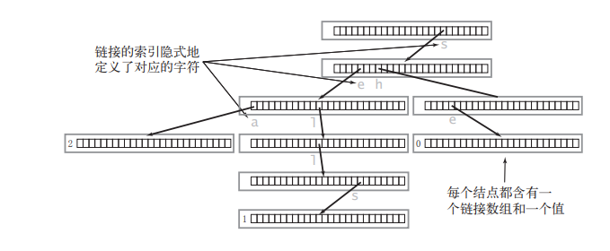
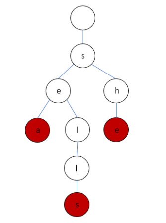

# DataStructure

## ListNode

```java
public class ListNode {
    int val;
    ListNode next;
    ListNode() {}
    ListNode(int val) { this.val = val; }
    ListNode(int val, ListNode next) { this.val = val; this.next = next; }
}
```


## TreeNode

```java
public class TreeNode {
    int val;
    TreeNode left;
    TreeNode right;
    TreeNode() {}
    TreeNode(int val) { this.val = val; }
    TreeNode(int val, TreeNode left, TreeNode right) {
        this.val = val;
        this.left = left;
        this.right = right;
    }
}
```


## TreeLinkNode

```java
public class TreeLinkNode {
    int val;
    TreeLinkNode left = null;
    TreeLinkNode right = null;
    TreeLinkNode parent = null;
    TreeLinkNode(int val) { this.val = val; }
}
```


## Trie（前缀树/字典树）

```java
public class Trie {
    private Trie[] children;
    private boolean isEnd;
    
    public Trie() {
        children = new Trie[26];
        isEnd = false;
    }
    
    public void insert(String word) {
        Trie node = this;
        for (int i = 0; i < word.length(); i++) {
            char ch = word.charAt(i);
            int index = ch - 'a';
            if (node.children[index] == null) { node.children[index] = new Trie(); }
            node = node.children[index];
        }
        node.isEnd = true;
    }
    
    public boolean search(String word) {
        Trie node = searchPrefix(word);
        return node != null && node.isEnd;
    }
    
    public boolean startWith(String prefix) {
        return searchPrefix(prefix) != null;
    }
    
    private Trie searchPrefix(String prefix) {
        Trie node = this;
        for (int i = 0; i < prefix.length(); i++) {
            char ch = prefix.charAt(i);
            int index = ch - 'a';
            if (node.children[index] == null) { return null; }
            node = node.children[index];
        }
        return node;
    }
}
```

Trie节点中并没有直接保存字符值的数据成员，而是通过`Trie[] children = new Trie[26];`，其中保存了对当前节点而言下一个可能出现的所有字符链接，因此我们可以通过一个父节点来预知它所有子节点的值。

```java
for (int i = 0; i < 26; i++) {
    char ch = 'a' + i;
    if (node.children[i] == null) {
        // 说明父节点的后一个字母不可为ch
    } else {
        // 说明父节点的后一个字母可以是ch
    }
}
```

包含三个单词 "sea","sells","she" 的 Trie :



Trie 中一般都含有大量的空链接，因此在绘制一棵单词查找树时一般会忽略空链接，同时为了方便理解可以画成这样：




