# 分布式系统简介

分布式系统定义：分布式系统是一个硬件或软件组件**分布在不同的网络计算机上**，彼此之间仅仅**通过消息传递进行通信和协调**的系统。

简单来说就是一群独立计算机集合共同对外提供服务，但是对于系统的用户来说分布式架构是透明的，就像是一台计算机在提供服务一样。分布式意味着可以采用更多的普通计算机（相对于昂贵的大型机）组成分布式集群对外提供服务。计算机越多，CPU、内存、存储资源等也就越多，能够处理的并发访问量也就越大。

在分布式系统中，各个主机之间通信和协调主要通过**网络**进行，所以，分布式系统中的计算机在空间上几乎没有任何限制，这些计算机可能被放在不同的机柜上，也可能被部署在不同的机房中，还可能在不同的城市中，对于大型的网站甚至可能分布在不同的国家和地区。但是，无论空间上如何分布，一个标准的分布式系统应该具有以下几个主要特征：

*   分布性：分布式系统中的多台计算机之间在空间位置上可以随意分布，系统中的多台计算机之间没有主、从之分，即没有控制整个系统的主机，也没有受控的从机。
*   透明性：分布式系统机器上的所有资源（CPU资源、硬盘资源等）都是可以受用户调度使用的，但对用户来说这一过程是透明的，用户并不知道是有多台机器统一提供服务，而是觉得像一台计算机一样在运作
*   同一性：系统中的若干台计算机可以互相协作来完成一个共同的任务，或者说一个程序可以分布在几台计算机上并行地运行。
*   通信性：系统中任意两台计算机都可以通过通信来交换信息。

和集中式系统相比，分布式系统的性价比更高、处理能力更强、可靠性更高、也有很好的扩展性。但是，分布式在解决了网站的高并发问题的同时也带来了一些其他问题。首先，**分布式的必要条件就是网络**，这可能对性能甚至服务能力造成一定的影响。其次，一个集群中的服务器数量越多，**服务器宕机**的概率也就越大。另外，由于服务在集群中分布式部署，用户的请求只会落到其中一台机器上，所以，一旦处理不好就很容易产生**数据一致性问题**。

## 分布式与集群

**分布式（distributed）**是指在**多台不同的服务器**中部署**不同的服务模块**，通过远程调用协同工作，对外提供服务。

**集群（cluster）**是指在**多台不同的服务器**中部署**相同应用或服务模块**，构成一个集群，通过负载均衡设备对外提供服务。

# 分布式系统数据一致性

## 数据一致性

数据一致性其实是数据库系统中的概念。我们可以简单的把一致性理解为**正确性**或者**完整性**，那么数据一致性通常指关联数据之间的逻辑关系是否正确和完整。我们知道，在数据库系统中通常用**事务（访问并可能更新数据库中各种数据项的一个程序执行单元）**来保证数据的一致性和完整性。而在分布式系统中，数据一致性往往指的是由于数据的复制，不同数据节点中的数据内容是否完整并且相同。

比如在集中式系统中，有一些关键的配置信息，可以直接保存在服务器的内存中，但是在分布式系统中，如何保存这些配置信息，又如何保证所有机器上的配置信息都保持一致，又如何保证修改一个配置能够把这次修改同步到所有机器中呢？

再比如，在集中式系统中，进行一个同步操作要写同一个数据的时候，可以直接使用事务+锁来管理保证数据的ACID。但是，在分布式系统中如何保证多台机器不会同时写同一条数据呢？

除了上面提到的同一个数据的一致性，还有一种情况也可以叫做数据的一致性：比如我们在电商网站下单，需要经历扣减库存、扣减红包、扣减折扣券等一系列操作。如果库存库存扣减成功，但是红包和折扣券扣减失败的话，也可以说是数据没有保证一致性。

分布式系统为了提升可用性和性能，会通过复制技术来进行数据同步。复制机制的目的是为了保证数据的一致性。但是数据复制面临的主要难题也是如何保证多个副本之间的数据一致性。在分布式系统引入复制机制后，不同的数据节点之间由于网络延时等原因很容易产生数据不一致的情况。

## 一致性模型

1.   **强一致性**：当更新操作完成之后，任何多个后续进程或者线程的访问都会返回最新的更新过的值。这种是对用户最友好的，就是用户上一次写什么，下一次就保证能读到什么。

     但是这种实现对性能影响较大，因为这意味着，只要上次的操作没有处理完，就不能让用户读取数据。

2.   **弱一致性**：系统并不保证进程或者线程的访问都会返回最新的更新过的值。系统在数据写入成功之后，不承诺立即可以读到最新写入的值，也不会具体的承诺多久之后可以读到。但会尽可能保证在某个时间级别（比如秒级别）之后，可以让数据达到一致性状态。

3.   **最终一致性**：弱一致性的特定形式。系统保证在没有后续更新的前提下，系统最终返回上一次更新操作的值。在没有故障发生的前提下，不一致窗口的时间主要受通信延迟，系统负载和复制副本的个数影响。

## 数据多副本实现容错的情况

在分布式存储系统中经常使用多副本的方式实现容错，每一份数据都保存多个副本，这样部分副本的失效不会导致数据的丢失。**每次更新操作都需要更新数据的所有副本，使多个副本的数据保持一致**。那么问题来了，如何在一个可能出现各种故障的异步分布式系统中保证同一数据的多个副本的一致性 (Consistency) 呢？

以最简单的两副本为例，首先来看看传统的**主从同步**方式。

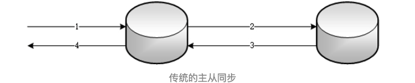

写请求首先发送给主副本，主副本同步更新到其它副本后返回。这种方式可以保证副本之间**数据的强一致性**，写成功返回之后从任意副本读到的数据都是一致的。但是**可用性很差**，只要任意一个副本写失败，写请求将执行失败。

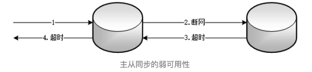

如果采用**异步复制**的方式，主副本写成功后立即返回，然后在后台异步的更新其它副本。

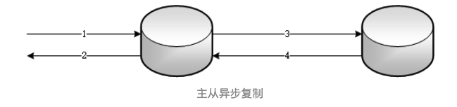

写请求首先发送给主副本，**主副本写成功后立即返回，然后异步的更新其它副本**。这种方式可用性较好，只要主副本写成功，写请求就执行成功。但是不能保证副本之间数据的强一致性，写成功返回之后从各个副本读取到的数据不保证一致，只有主副本上是最新的数据，其它副本上的数据落后，只提供**最终一致性**。

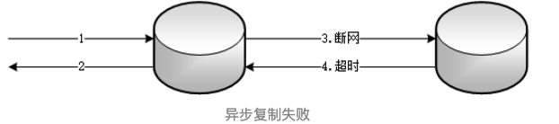

如果出现断网导致后台异步复制失败，则主副本和其它副本将长时间不一致，其它副本上的数据一直无法更新，直到网络重新连通。

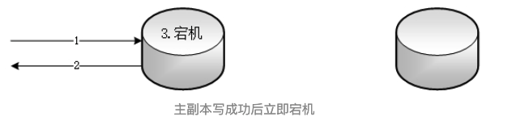

如果主副本在写请求成功返回之后和更新其它副本之前宕机失效，则会造成成功写入的数据丢失，一致性被破坏。

同步复制为最高保护模式 (Maximum Protection)，异步复制为最高性能模式 (Maximum Performance)，还有一种最高可用性模式 (Maximum Availability) 介于两者之间，在正常情况下，它和最高保护模式一样，但一旦同步出现故障，立即切换成最高性能模式。

**传统的主从同步无法同时保证数据的一致性和可用性**，此问题是典型的分布式系统中一致性和可用性不可兼得的例子，分布式系统中著名的CAP理论从理论上证明了这个问题。

## CAP理论

**一个分布式系统最多只能同时满足一致性（Consistency）、可用性（Availability）和分区容错性（Partition tolerance）这三项中的两项**。

（注：CAP中的CA和数据库事务中ACID的CA并不是同一回事儿。两者之中的A都是C都是一致性(Consistency)。CAP中的A指的是可用性（Availability），而ACID中的A指的是原子性（Atomicity)，切勿混为一谈。）

1.   Consistency 一致性

     即更新操作成功并返回客户端完成后，所有节点在同一时间的数据完全一致，所以，一致性，说的就是数据一致性。

2.   Availability 可用性

     服务一直可用，而且是正常响应时间。

     对于一个可用性的分布式系统，每一个非故障的节点必须对每一个请求作出响应。所以，一般我们在衡量一个系统的可用性的时候，都是通过停机时间来计算的。

     |          可用性分类          | 可用水平（%） | 年可容忍停机时间 |
     | :--------------------------: | :-----------: | :--------------: |
     |          容错可用性          |    99.9999    |      <1 min      |
     |          极高可用性          |    99.999     |      <5 min      |
     | 具有故障自动恢复能力的可用性 |     99.99     |     <53 min      |
     |           高可用性           |     99.9      |      <8.8h       |
     |          商品可用性          |      99       |    <43.8 min     |

     通常我们描述一个系统的可用性可以达到5个9，意思就是说他的可用水平是99.999%，即全年停机时间不超过 `(1-0.99999)*365*24*60 = 5.256 min`，这是一个极高的要求。

3.   Partition Tolerance 分区容错性

     分布式系统在遇到某节点或网络分区故障的时候，仍然能够对外提供满足一致性和可用性的服务。

理解CAP理论最简单的方式是想象两个副本处于分区两侧，即两个副本之间的网络断开，不能通信。

-   如果允许其中一个副本更新，则会导致数据不一致，即丧失了C性质。
-   如果为了保证一致性，将分区某一侧的副本设置为不可用，那么又丧失了A性质。
-   除非两个副本可以互相通信，才能既保证C又保证A，这又会导致丧失P性质。

一般来说使用网络通信的分布式系统，无法舍弃P性质，在分布式环境下，网络分区是一个自然的事实。因为分区是必然的，所以如果舍弃P，意味着要舍弃分布式系统。那也就没有必要再讨论CAP理论了。我们以系统满足P为前提论述了无法同时满足C和A，那么就只能在一致性和可用性上做一个艰难的选择。

当然，CAP理论的“三选二”的公式一直存在着误导性，它会过分简单化各性质之间的相互关系：

-   首先，由于分区很少发生，那么在系统不存在分区的情况下没什么理由牺牲C或A。
-   其次，C与A之间的取舍可以在同一系统内以非常细小的粒度反复发生，而每一次的决策可能因为具体的操作，乃至因为牵涉到特定的数据或用户而有所不同。
-   最后，**这三种性质都可以在程度上衡量，并不是非黑即白的有或无**。可用性显然是在0%到100%之间连续变化的，一致性分很多级别，连分区也可以细分为不同含义，如系统内的不同部分对于是否存在分区可以有不一样的认知。

所以一致性和可用性并不是水火不容，非此即彼的。Paxos、Raft等分布式一致性算法就是在一致性和可用性之间做到了很好的平衡的见证。

## BASE理论

BASE理论是对CAP理论的延伸，核心思想是即使无法做到强一致性（Strong Consistency，CAP的一致性就是强一致性），但应用可以**采用适合的方式达到最终一致性**（Eventual Consitency）。

BASE是指基本可用（Basically Available）、软状态（ Soft State）、最终一致性（ Eventual Consistency）。

1.   Basically Available 基本可用

     基本可用是指分布式系统在出现故障的时候，允许损失部分可用性，即保证核心可用。

     （电商大促时，为了应对访问量激增，部分用户可能会被引导到降级页面，服务层也可能只提供降级服务。这就是损失部分可用性的体现。）

2.   Soft State 软状态

     软状态是指允许系统存在**中间状态**，而该中间状态不会影响系统整体可用性。分布式存储中一般一份数据至少会有三个副本，**允许不同节点间副本同步的延时就是软状态的体现**。mysql replication的异步复制也是一种体现。

3.   Eventual Consistency 最终一致性

     最终一致性是指**系统中的所有数据副本经过一定时间后，最终能够达到一致的状态**。弱一致性和强一致性相反，最终一致性是弱一致性的一种特殊情况。

## 分布式事务

分布式事务是指会涉及到**操作多个数据库的事务**。其实就是将对同一库事务的概念扩大到了对多个库的事务。目的是**为了保证分布式系统中的数据一致性**。分布式事务处理的关键是必须有一种方法可以知道事务在任何地方所做的所有动作，提交或回滚事务的决定必须产生统一的结果（全部提交或全部回滚）。

在分布式系统中，各个节点之间在物理上相互独立，通过网络进行沟通和协调。**由于存在事务机制，可以保证每个独立节点上的数据操作可以满足ACID**。但是，相互独立的节点之间无法准确的知道其他节点中的事务执行情况。所以从理论上讲，**两台机器理论上无法达到一致的状态**。如果想让分布式部署的多台机器中的数据保持一致性，那么就要保证在所有节点的数据写操作，**要么全部都执行，要么全部的都不执行**。但是，一台机器在执行本地事务的时候无法知道其他机器中的本地事务的执行结果。所以它也就不知道本次事务到底应该commit还是 roolback。所以，常规的解决办法就是引入一个“**协调者**”的组件来**统一调度所有分布式节点的执行**。

### XA规范

~~X/Open 组织（即现在的 Open Group ）定义了分布式事务处理模型。 X/Open DTP 模型（ 1994 ）包括应用程序（ AP ）、事务管理器（ TM ）、资源管理器（ RM ）、通信资源管理器（ CRM ）四部分。一般，常见的事务管理器（ TM ）是交易中间件，常见的资源管理器（ RM ）是数据库，常见的通信资源管理器（ CRM ）是消息中间件。~~

通常把一个数据库内部的事务处理，如对多个表的操作，作为**本地事务**看待。数据库的事务处理对象是本地事务，而分布式事务处理的对象是**全局事务**。  所谓**全局事务，是指分布式事务处理环境中，多个数据库可能需要共同完成一个工作，这个工作即是一个全局事务**，例如，一个事务中可能更新几个不同的数据库。对数据库的操作发生在系统的各处但必须**全部被提交或回滚**。此时一个数据库对自己内部所做操作的提交不仅依赖本身操作是否成功，还要依赖于全局事务相关的其它数据库的操作是否成功。如果任一数据库的任一操作失败，则参与此事务的所有数据库所做的所有操作都必须回滚。   一般情况下，*某一数据库无法知道其它数据库在做什么*，因此，在一个 DTP（分布式事务模型） 环境中，事务管理器（交易中间件）是必需的，由它**通知和协调**相关数据库的提交或回滚。而一个数据库只将其自己所做的操作（可恢复）影射到全局事务中。 

>   XA 就是 X/Open DTP 定义的交易中间件与数据库之间的接口规范（即接口函数），交易中间件用它来通知数据库事务的开始、结束以及提交、回滚等。 XA 接口函数由数据库厂商提供。 

## 二阶段提交协议（2PC）

可以说二阶段提交其实就是实现XA分布式事务的关键（确切地说：二阶段提交主要保证了分布式事务的**原子性**：即所有结点要么全做要么全不做）。

二阶段提交（Two-phase Commit）是指，在计算机网络以及数据库领域内，**为了使基于分布式系统架构下的所有节点在进行事务提交时保持一致性而设计的一种算法(Algorithm)**。通常，二阶段提交也被称为是一种协议(Protocol))。在分布式系统中，每个节点虽然可以知晓自己的操作时成功或者失败，却无法知道其他节点的操作的成功或失败。当一个事务跨越多个节点时，为了保持事务的ACID特性，需要引入一个作为**协调者**的组件来统一掌控所有节点(称作**参与者**)的操作结果并最终指示这些节点是否要把操作结果进行真正的提交(比如将更新后的数据写入磁盘等等)。因此，二阶段提交的算法思路可以概括为：**参与者将操作成败通知协调者，再由协调者根据所有参与者的反馈情报决定各参与者是否要提交操作还是中止操作**。

所谓的两个阶段是指：第一阶段：**准备阶段(投票阶段)**和第二阶段：**提交阶段（执行阶段）**。

*   **准备阶段（投票阶段）**

    协调者给每个参与者发送**Prepare消息**，每个参与者要么直接返回失败(如权限验证失败)，要么在本地执行事务，写本地的**redo和undo日志**，但不提交，到达一种“万事俱备，只欠东风”的状态。

    可以进一步将准备阶段分为以下三个步骤：

    >   1）协调者节点向所有参与者节点询问是否可以执行提交操作(vote)，并开始等待各参与者节点的响应。
    >
    >   2）参与者节点检查事务权限，执行询问发起为止的所有事务操作，并将Undo信息和Redo信息写入日志。（注意：若成功这里其实每个参与者已经执行了事务操作）。
    >
    >   3）各参与者节点响应协调者节点发起的询问。如果**参与者节点的事务操作实际执行成功**，则它返回一个”同意”消息；如果参与者节点的事务操作实际执行失败，则它返回一个”中止”消息。

*   **提交阶段（执行阶段）**

    如果协调者收到了参与者的失败消息或者超时，直接给每个参与者发送**回滚(Rollback)消息**；否则，发送**提交(Commit)消息**；参与者根据协调者的指令执行提交或者回滚操作，释放所有事务处理过程中使用的锁资源。(注意：**必须在最后阶段释放锁资源**)。

接下来分两种情况分别讨论提交阶段的过程。

**情况1**：当协调者节点从所有参与者节点获得的相应消息都为”同意”时：

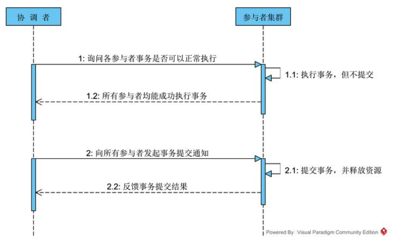

1）协调者节点向所有参与者节点发出”正式提交(commit)”的请求。
2）参与者节点正式完成操作，并释放在整个事务期间内占用的资源。
3）参与者节点向协调者节点发送”完成”消息。
4）协调者节点受到所有参与者节点反馈的”完成”消息后，完成事务。

**情况2**：如果任一参与者节点在第一阶段返回的响应消息为”中止”，或者协调者节点在第一阶段的询问超时之前无法获取所有参与者节点的响应消息时：

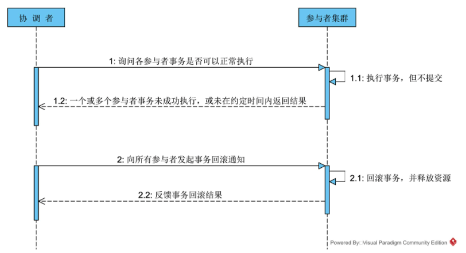

1）协调者节点向所有参与者节点发出”回滚操作(rollback)”的请求。
2）参与者节点利用之前写入的Undo信息执行回滚，并释放在整个事务期间内占用的资源。
3）参与者节点向协调者节点发送”回滚完成”消息。
4）协调者节点受到所有参与者节点反馈的”回滚完成”消息后，取消事务。

不管最后结果如何，第二阶段都会结束当前事务。

### 二阶段提交的缺点

二阶段提交看起来确实能够提供原子性的操作，但是不幸的事，二阶段提交还是有几个缺点的：

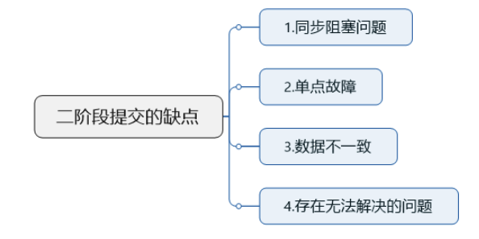

1、**同步阻塞问题**。执行过程中，所有参与节点都是事务阻塞型的。当参与者占有公共资源时，其他第三方节点访问公共资源不得不处于阻塞状态。

2、**单点故障**。由于协调者的重要性，一旦协调者发生故障。参与者会一直阻塞下去。尤其在第二阶段，协调者发生故障，那么所有的参与者还都处于锁定事务资源的状态中，而无法继续完成事务操作。（如果是协调者挂掉，可以重新选举一个协调者，但是无法解决因为协调者宕机导致的参与者处于阻塞状态的问题）

3、**数据不一致**。在二阶段提交的阶段二中，当协调者向参与者发送commit请求之后，发生了局部网络异常或者在发送commit请求过程中协调者发生了故障，这会导致只有一部分参与者接受到了commit请求。而在这部分参与者接到commit请求之后就会执行commit操作。但是其他部分未接到commit请求的机器则无法执行事务提交。于是整个分布式系统便出现了数据不一致性的现象。

4、二阶段无法解决的问题--**极限情况下,对某一事务的不确定性**：协调者在发出commit消息之后宕机，而唯一接收到这条消息的参与者同时也宕机了。那么即使协调者通过选举协议产生了新的协调者，这条事务的状态也是不确定的，没人知道事务是否已经被提交。

由于二阶段提交存在着诸如**同步阻塞、单点问题、脑裂**等缺陷，所以，研究者们在二阶段提交的基础上做了改进，提出了三阶段提交。

## 三阶段提交协议（3PC）

三阶段提交（Three-phase commit），也叫三阶段提交协议（Three-phase commit protocol），是二阶段提交（2PC）的改进版本。

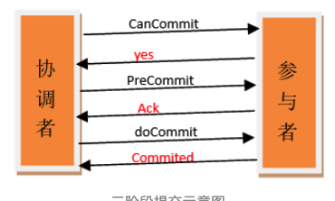

与两阶段提交不同的是，三阶段提交有两个改动点。

1.   引入**超时机制**。同时在协调者和参与者中都引入超时机制。
2.   在第一阶段和第二阶段之前引入**准备阶段，**保证了在最后提交阶段之前各参与节点状态的一致。

也就是说，除了引入超时机制之外，3PC**把2PC的准备阶段再次一分为二**，这样三阶段提交就有`CanCommit`、`PreCommit`、`DoCommit`三个阶段。

>   **为什么要把投票阶段一分为二？**
>
>   **假设有1个协调者，9个参与者。其中有一个参与者不具备执行该事务的能力。**
>   协调者发出Prepare消息之后，其余参与者都将资源锁住，执行事务，写入undo和redo日志。
>   协调者收到相应之后，发现有一个参与者不能参与。所以，又出一个rollback消息。其余8个参与者，又对消息进行回滚。这样子，是不是做了很多无用功？
>   所以**，**引入Can-Commit阶段，**主要是为了在预执行之前，保证所有参与者都具备可执行条件，从而减少资源浪费。**

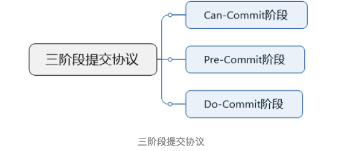

*   **CanCommit阶段**

    3PC的CanCommit阶段其实和2PC的准备阶段很像。协调者向参与者发送commit请求，参与者如果可以提交就返回Yes响应，否则返回No响应。

    >   **1.事务询问** 协调者向参与者发送CanCommit请求。询问是否可以执行事务提交操作。然后开始等待参与者的响应。
    >
    >   **2.响应反馈** 参与者接到CanCommit请求之后，正常情况下，如果其自身认为可以顺利执行事务，则返回Yes响应，并进入预备状态。否则反馈No

*   **PreCommit阶段**

    本阶段协调者会根据第一阶段的询盘结果采取相应操作，询盘结果主要有两种：

    **情况1-**假如协调者从所有的参与者获得的反馈都是Yes响应，那么就会执行事务的预执行：

    >   **1.发送预提交请求** 协调者向参与者发送PreCommit请求，并进入Prepared阶段。
    >
    >   **2.事务预提交** 参与者接收到PreCommit请求后，会执行事务操作，并将undo和redo信息记录到事务日志中。
    >
    >   **3.响应反馈** 如果参与者成功的执行了事务操作，则返回ACK响应，同时开始等待最终指令。

    **情况2-**假如有任何一个参与者向协调者发送了No响应，或者等待超时之后，协调者都没有接到参与者的响应，那么就执行事务的中断。具体步骤如下：

    >   **1.发送中断请求** 协调者向所有参与者发送abort请求。
    >
    >   **2.中断事务** 参与者收到来自协调者的abort请求之后（或超时之后，仍未收到协调者的请求），执行事务的中断。

    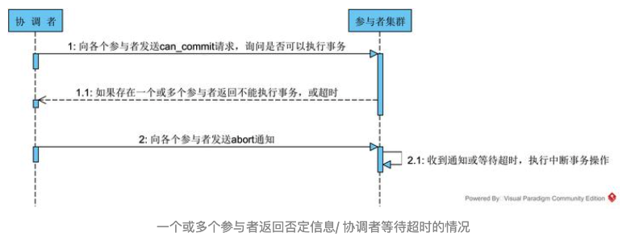

*   **DoCommit阶段**

    该阶段进行真正的事务提交，也可以分为以下两种情况。

    **情况1-执行提交**

    针对第一种情况，协调者向各个参与者发起事务提交请求，具体步骤如下：

    >   1.   **发送提交请求** 协调接收到参与者发送的ACK响应，那么它将从预提交状态进入到提交状态。并向所有参与者发送doCommit请求。
    >   2.   **事务提交** 参与者接收到doCommit请求之后，执行正式的事务提交。并在完成事务提交之后释放所有事务资源。
    >   3.   **响应反馈** 事务提交完之后，向协调者发送Ack响应。
    >   4.   **完成事务** 协调者接收到所有参与者的ack响应之后，完成事务。

    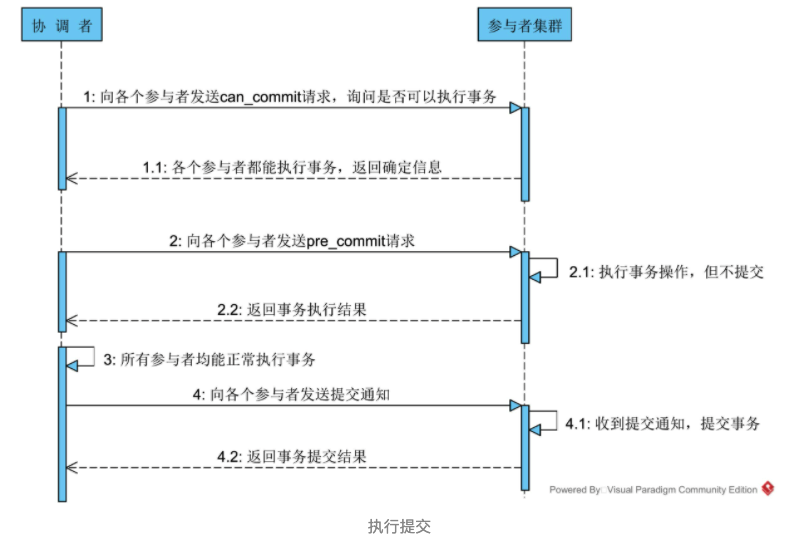

    **情况2-中断事务**

    协调者没有接收到参与者发送的ACK响应（可能是接受者发送的不是ACK响应，也可能响应超时），那么就会执行中断事务。具体步骤如下：

    >   1.   **发送中断请求** 协调者向所有参与者发送事务abort通知。
    >   2.    **事务回滚** 参与者接收到abort请求之后，利用其在阶段二记录的undo信息来执行事务的回滚操作，并在完成回滚之后释放所有的事务资源。
    >   3.    **反馈结果** 参与者完成事务回滚之后，向协调者发送ACK消息
    >   4.    **中断事务** 协调者接收到参与者反馈的ACK消息之后，执行事务的中断。

    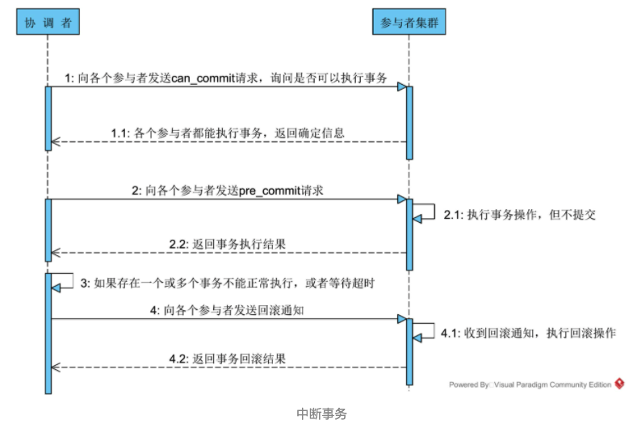

注：在doCommit阶段，如果参与者无法及时接收到来自协调者的doCommit或者rebort请求时，**会在等待超时之后，继续进行事务的提交**。（当进入第三阶段时，说明参与者在第二阶段已经收到了PreCommit请求，也即协调者产生PreCommit请求的前提条件是它在第二阶段开始之前，收到所有参与者的CanCommit响应都是Yes。（一旦参与者收到了PreCommit，意味它知道大家其实都同意修改了）所以，一句话概括就是，**当进入第三阶段时，由于网络超时等原因，虽然参与者没有收到commit或者abort响应，但是它有理由相信：成功提交的几率很大**。）

### 2PC与3PC的区别

相对于2PC，**3PC主要解决的单点故障问题，并减少阻塞**，因为一旦参与者无法及时收到来自协调者的信息之后，他会默认执行commit。而不会一直持有事务资源并处于阻塞状态。

但是这种机制**也会导致数据一致性问题**。由于网络原因，协调者发送的abort响应没有及时被参与者接收到，那么参与者在等待超时之后执行了commit操作。这样就和其他接到abort命令并执行回滚的参与者之间存在数据不一致的情况。

了解了2PC和3PC之后，我们可以发现，无论是二阶段提交还是三阶段提交都无法彻底解决分布式的一致性问题。

**世上只有一种一致性算法，那就是Paxos**，所有其他一致性算法都是Paxos算法的不完整版。

## 多副本状态机（replicated state machine）

将多副本管理的模型抽象出来，可得到一个通用的模型：多副本状态机 (Replicated State Machine) 。

多副本状态机是指多台机器具有完全相同的状态，并且运行完全相同的确定性状态机。

通过使用这样的状态机，可以解决很多分布式系统中的**容错问题**。因为多副本状态机通常可以容忍半数节点故障，且所有正常运行的副本节点状态都完全一致，所以可以**使用多副本状态机来实现需要避免单点故障的组件**。

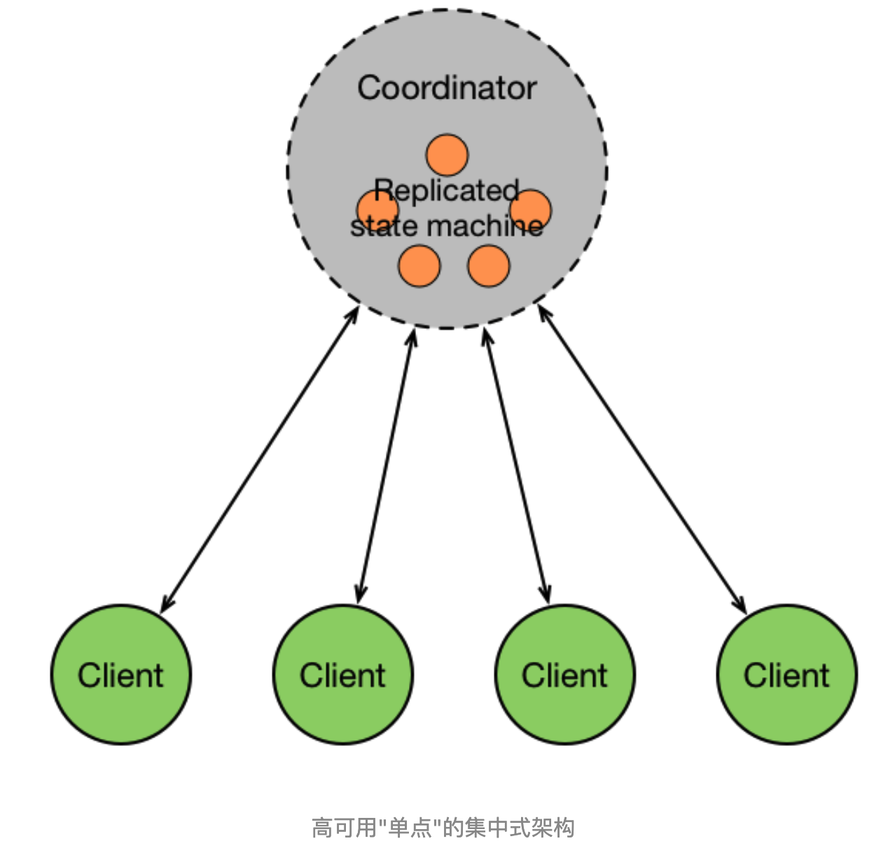

多副本状态机在分布式系统中被用于解决各种容错问题。如**集中式的选主**或是**互斥算法中的协调者 (Coordinator)**。集中式的选主或互斥算法逻辑简单，但最大的问题是协调者的单点故障问题，通过采用多副本状态机来实现协调者实现了高可用的“单点”，回避了单点故障。

多副本状态机的**每个副本上都保存有完全相同的操作日志**，**保证所有状态机副本按照相同的顺序执行相同的操作**，这样由于**状态机是确定性的**，则**会得到相同的状态**。

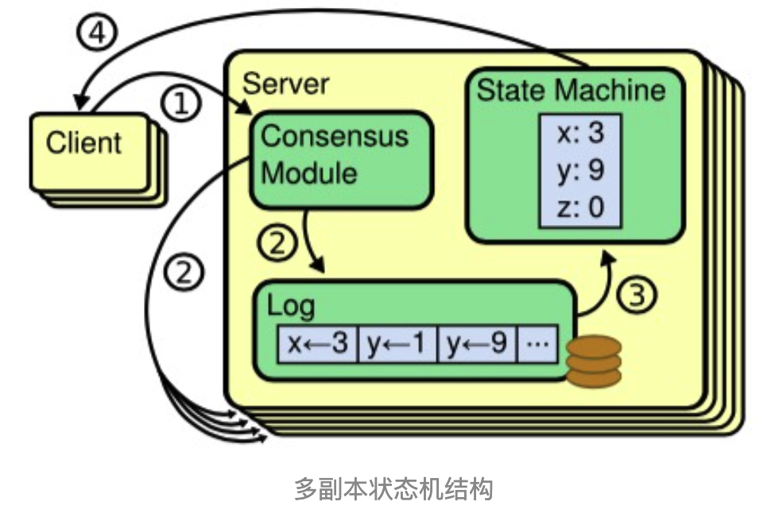

每个服务器在日志中保存一系列命令，所有的状态机副本按照同样的顺序执行，分布式一致性算法管理着来自客户端的包含状态机命令的日志复制，每条日志以同样的顺序保存同样的命令，因此每个状态机执行同样的命令序列。因为状态机是确定的，每个都计算出同样的状态与同样的输出。

**保证复制到各个服务器上的日志的一致性正是分布式一致性算法的工作**。一致性算法保证所有状态机副本上的操作日志具有完全相同的顺序，如果状态机的任何一个副本在本地状态机上执行了一个操作，则绝对不会有别的副本在操作序列相同位置执行一个不同的操作。

服务器上的一致性模块，接收来自客户端的命令，并且添加到他们的日志中。它与其它服务器的一致性模块通讯，以确保每个日志最终以同样的顺序保存同样的请求，即使有些服务器失败。一旦命令被适当地复制，每台服务器的状态机以日志的顺序执行，将输出返回给客户端。结果多台服务器就像来自单个高度一致的高可用状态机。

## Paxos算法（共识算法）

>所谓共识，就是多个节点对某个事情达成一致的看法，即使是在部分节点故障、网络延时、网络分割的情况下。
>
>在分布式系统中，共识算法更多用于提高系统的容错性，如分布式存储中的复制集（replication）。

### Basic Paxos

Paxos是基于**消息传递**且具有**高度容错特性**的分布式一致性算法。Paxos算法运行在允许宕机故障的异步系统中，不要求可靠的消息传递，可容忍消息丢失、延迟、乱序以及重复。它利用**大多数 (Majority) 机制**保证了**2F+1的容错能力**，即2F+1个节点的系统最多允许F个节点同时出现故障。

在Paxos算法中，有三种角色：**Proposer、Acceptor、Learner**。在具体的实现中，一个进程可能**同时充当多种角色**。比如一个进程可能既是Proposer又是Acceptor又是Learner。

还有一个概念叫**提案（Proposal）**。最终要达成一致的**value**就在提案里。一个或多个提议进程 (Proposer) 可以发起提案，Paxos算法使所有提案中的某一个提案，在所有进程中达成一致。系统中的**多数派同时认可该提案，即达成了一致**。最多只针对一个确定的提案达成一致。

>   Proposer：提出提案 (Proposal)。Proposal信息包括提案编号 (Proposal ID) 和提议的值 (Value)。
>
>   Acceptor：参与决策，回应Proposers的提案。收到Proposal后可以接受提案，若Proposal获得多数Acceptors的接受，则称该Proposal被批准。
>
>   Learner：不参与决策，从Proposers/Acceptors学习最新达成一致的提案（Value）。

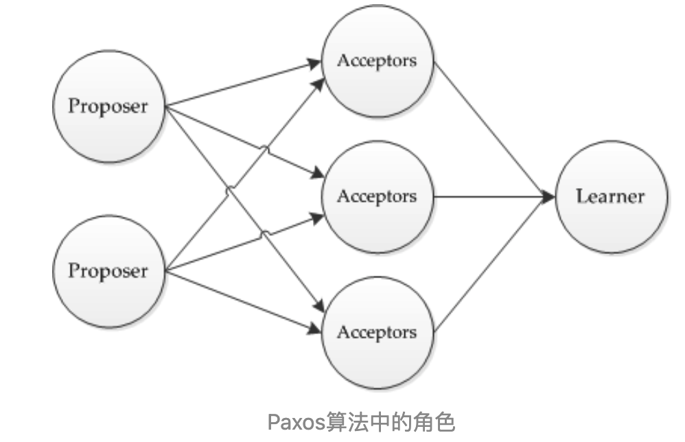

Paxos的目标：保证最终有一个value会被选定，当value被选定后，进程最终也能获取到被选定的value。

Paxos算法分**两个阶段**：

*   阶段一（Prepare请求）：

    (a) Proposer选择一个**提案编号N**，然后向**半数以上**的Acceptor发送编号为N的**Prepare请求**。

    (b) 如果一个Acceptor收到一个编号为N的Prepare请求，且N**大于**该Acceptor已经**响应过的**所有**Prepare请求**的编号，那么它就会将它已经**接受过的编号最大的提案（如果有的话）**作为响应反馈给Proposer，同时该Acceptor承诺**不再接受**任何**编号小于N的提案**。

*   阶段二（Accept请求）：

    (a) 如果Proposer收到**半数以上**Acceptor对其发出的编号为N的Prepare请求的**响应**，那么它就会发送一个针对**[N,V]提案**的**Accept请求**给**半数以上**的Acceptor。注意：V就是收到的**响应**中**编号最大的提案的value**，如果响应中**不包含任何提案**，那么V就由Proposer**自己决定**。

    (b) 如果Acceptor收到一个针对编号为N的提案的Accept请求，只要该Acceptor**没有**对编号**大于N**的**Prepare请求**做出过**响应**，它就**接受该提案**。

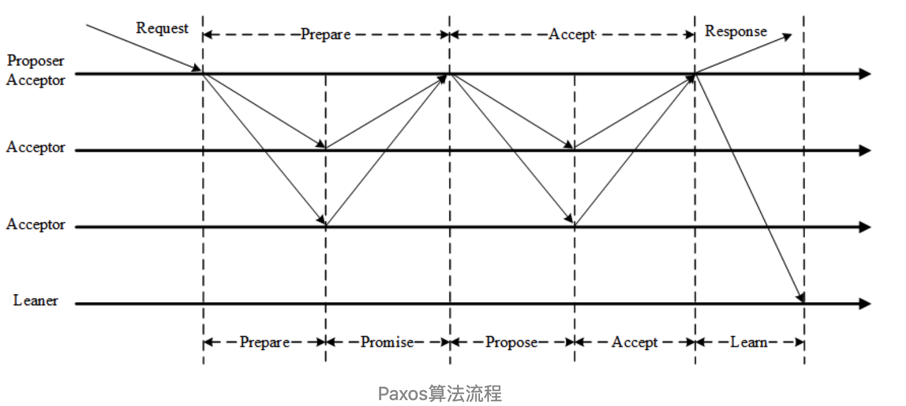

上图中每条消息描述如下：

-   **Prepare消息**: Proposer生成全局唯一且递增的Proposal ID (可使用时间戳加Server ID)，向所有Acceptors发送Prepare请求，这里无需携带提案内容，只携带Proposal ID即可。

-   **Promise消息**: Acceptors收到Prepare请求后，做出“两个承诺，一个应答”。

    -   两个承诺：

        1.   不再接受Proposal ID小于等于（注意：这里是<= ）当前请求的Prepare请求。

        2.   不再接受Proposal ID小于（注意：这里是< ）当前请求的Accept请求。

    -   一个应答：

        不违背以前作出的承诺下，回复已经Accept过的提案中Proposal ID最大的那个提案的Value和Proposal ID，没有则返回空值。

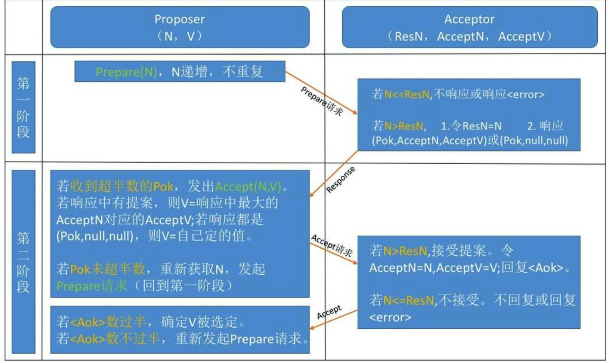

-   **Propose**: Proposer 收到多数Acceptors的Promise应答后，从应答中选择Proposal ID最大的提案的Value，作为本次要发起的提案。如果所有应答的提案Value均为空值，则可以自己随意决定提案Value。然后携带当前Proposal ID，向所有Acceptors发送Accept请求。
-   **Accept**: Acceptor收到Accept请求后，在不违背自己之前作出的承诺下，接受并持久化当前Proposal ID和提案Value。
-   **Learn**: Proposer收到多数Acceptors的Accept后，决议形成，将形成的决议发送给所有Learners。

Paxos伪代码描述如下：

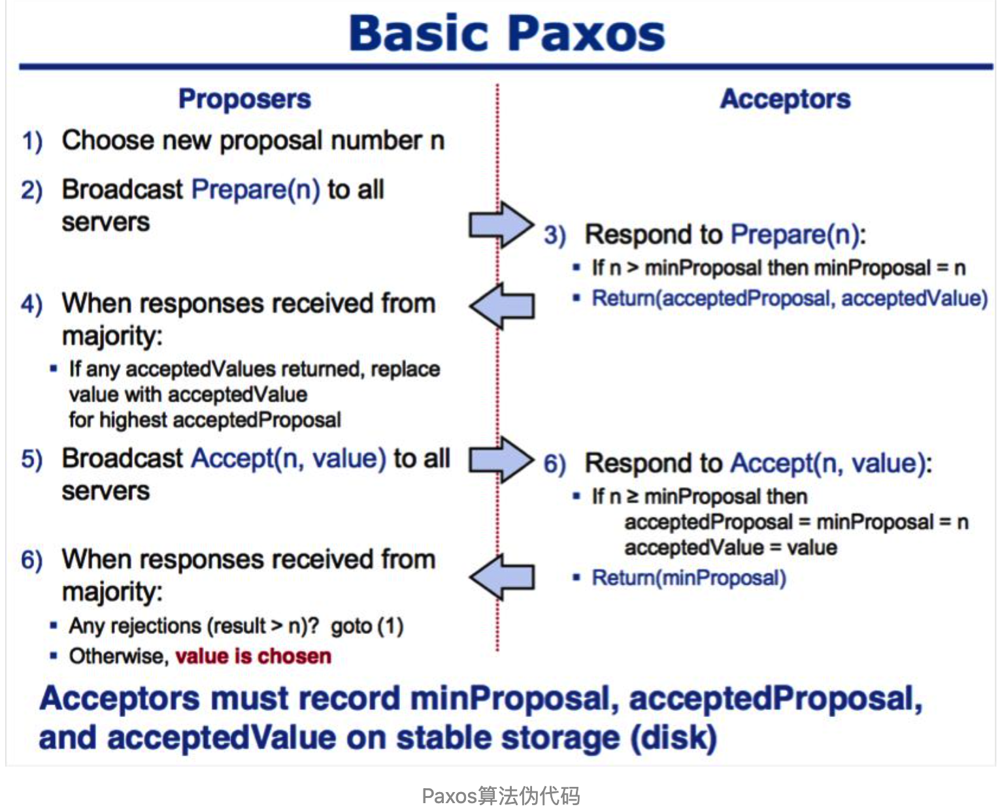

1.  获取一个Proposal ID n，为了保证Proposal ID唯一，可采用时间戳+Server ID生成；
2.  Proposer向所有Acceptors广播Prepare(n)请求；
3.  Acceptor比较n和minProposal，如果n>minProposal，minProposal=n，并且将 acceptedProposal 和 acceptedValue 返回；
4.  Proposer接收到过半数回复后，如果发现有acceptedValue返回，将所有回复中acceptedProposal最大的acceptedValue作为本次提案的value，否则可以任意决定本次提案的value；
5.  到这里可以进入第二阶段，广播Accept (n,value) 到所有节点；
6.  Acceptor比较n和minProposal，如果n>=minProposal，则acceptedProposal=minProposal=n，acceptedValue=value，本地持久化后，返回；否则，返回minProposal。
7.  提议者接收到过半数请求后，如果发现有返回值result >n，表示有更新的提议，跳转到1；否则value达成一致。

### 活锁问题

两个Proposers依次提出编号递增的提案，交替prepare成功，但accept失败，最终会陷入死循环，没有value被选定

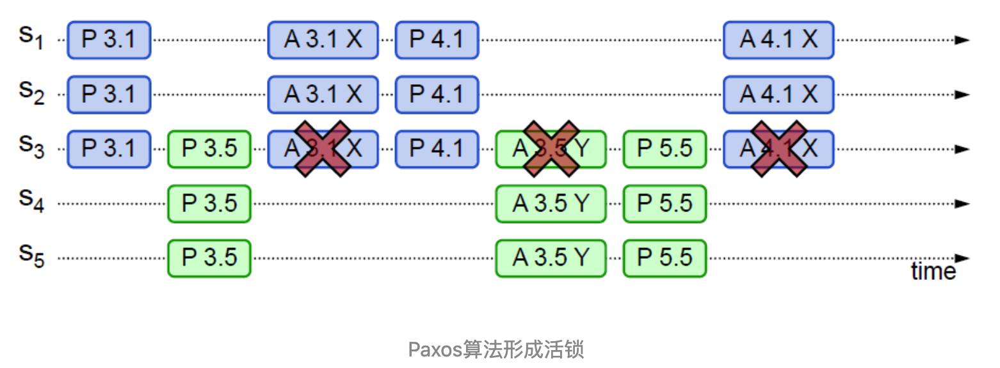

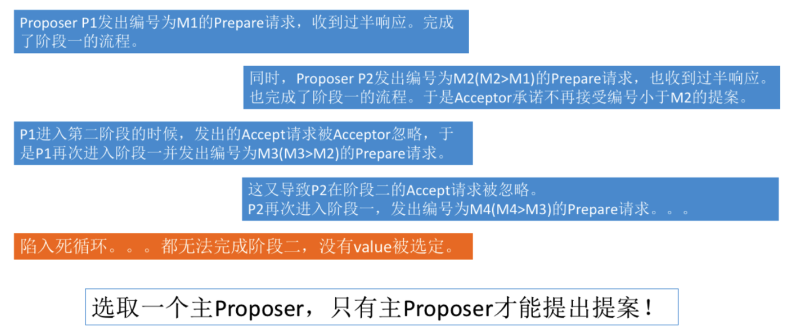

解决方案：选主，即选择一个主Proposer

### Multi Paxos

原始的Paxos算法（Basic Paxos）只能对一个值形成决议，决议的形成**至少需要两次网络来回**，在高并发情况下可能需要更多的网络来回，**极端情况下甚至可能形成活锁**。如果想连续确定多个值，Basic Paxos搞不定了。因此Basic Paxos几乎只是用来做理论研究，并不直接应用在实际工程中。

实际应用中几乎都需要连续确定多个值，而且希望能有更高的效率。Multi-Paxos正是为解决此问题而提出。Multi-Paxos基于Basic Paxos做了两点改进：

1.  针对每一个要确定的值，运行一次Paxos算法实例（Instance），形成决议。每一个Paxos实例使用唯一的Instance ID标识。
2.  在所有Proposers中选举一个Leader，由Leader唯一地提交Proposal给Acceptors进行表决。这样没有Proposer竞争，解决了活锁问题。在系统中仅有一个Leader进行Value提交的情况下，Prepare阶段就可以跳过，从而将两阶段变为一阶段，提高效率。

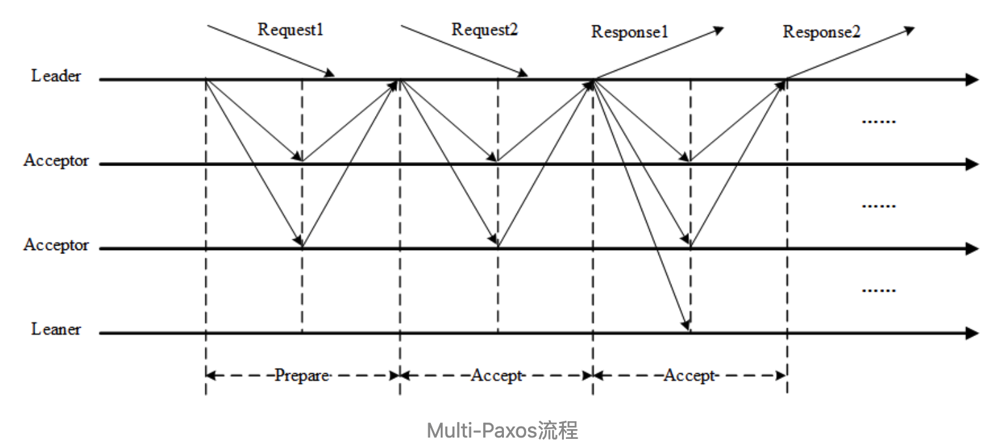

Multi-Paxos首先需要选举Leader，Leader的确定也是一次决议的形成，所以可执行一次Basic Paxos实例来选举出一个Leader。选出Leader之后**只能由Leader提交Proposal**，在Leader宕机之后服务临时不可用，需要重新选举Leader继续服务。**在系统中仅有一个Leader进行Proposal提交的情况下，Prepare阶段可以跳过**。

Multi-Paxos通过改变Prepare阶段的作用范围至后面Leader提交的所有实例，从而使得**Leader的连续提交只需要执行一次Prepare阶段，后续只需要执行Accept阶段，将两阶段变为一阶段，提高了效率**。为了区分连续提交的多个实例，每个实例使用一个Instance ID标识，Instance ID由Leader本地递增生成即可。

Multi-Paxos允许有多个自认为是Leader的节点并发提交Proposal而不影响其安全性，这样的场景即退化为Basic Paxos。

### Paxos算法推导过程

Paxos算法的设计过程就是从正确性开始的，对于分布式一致性问题，**很多进程提出（Propose）不同的值，共识算法保证最终只有其中一个值被选定**，**安全性Safety**表述如下：

-   只有被提出（Propose）的值才可能被最终选定（Chosen）。
-   只有**一**个值会被选定（Chosen）。
-   进程只会获知到已经确认被选定（Chosen）的值。

Paxos以这几条约束作为出发点进行设计，只要算法最终满足这几点，正确性就不需要证明了。Paxos算法中共分为三种参与者：Proposer、Acceptor以及Learner，通常实现中每个进程都同时扮演这三个角色。

Proposers向Acceptors提出Proposal，为了保证最多只有**一**个值被选定（Chosen），Proposal必须被超过一半的Acceptors所接受（Accept），且每个Acceptor只能接受一个值。

为了保证正常运行（必须有值被接受），所以Paxos算法中：

**P1：Acceptor必须接受（Accept）它所收到的第一个Proposal。**

先来先服务，合情合理。但这样产生一个问题，如果多个Proposers同时提出Proposal，很可能会导致无法达成一致，因为没有Propopal被超过一半Acceptors的接受，因此，Acceptor必须能够接受多个Proposal，不同的Proposal由不同的编号进行区分，当某个Proposal被超过一半的Acceptors接受后，这个Proposal就被选定了。

既然允许Acceptors接受多个Proposal就有可能出现多个不同值都被最终选定的情况，这违背了Safety要求，为了保证Safety要求，Paxos进一步提出：

**P2：如果值为v的Proposal被选定（Chosen），则任何被选定（Chosen）的具有更高编号的Proposal值也一定为v。**

只要算法同时满足**P1**和**P2**，就保证了Safety。**P2**是一个比较宽泛的约定，完全没有算法细节，我们对其进一步延伸：

**P2a：如果值为v的Proposal被选定（Chosen），则对所有的Acceptors，它们接受（Accept）的任何具有更高编号的Proposal值也一定为v。**

如果满足**P2a**则一定满足**P2**，显然，因为只有首先被接受才有可能被最终选定。但是**P2a**依然难以实现，因为acceptor很有可能并不知道之前被选定的Proposal（恰好不在接受它的多数派中），因此进一步延伸：

**P2b：如果值为v的Proposal被选定（Chosen），则对所有的Proposer，它们提出的的任何具有更高编号的Proposal值也一定为v。**

更进一步的：

**P2c：为了提出值为v且编号为n的Proposal，必须存在一个包含超过一半Acceptors的集合S，满足：**

**(1) S中的每个Acceptor都没有接受过编号小于n的提案**

**(2) S中Acceptor接受过的最大编号的提案的value为v**

Proposer生成提案：

满足**P2c**即满足**P2b**即满足**P2a**即满足**P2**。至此Paxos提出提案生成算法，以满足**P2c**：

1.  Proposer选择一个**新的提案编号N**，然后向**某个Acceptor集合**（半数以上）发送请求，要求该集合中的每个Acceptor做出如下响应（response）。
    (a) 向Proposer承诺保证**不再接受**任何编号**小于N的提案**。
    (b) 如果Acceptor已经接受过提案，那么就向Proposer响应**已经接受过**的编号小于N的**最大编号的提案**。

    我们将该请求称为**编号为N**的**Prepare请求**。

2.  如果Proposer收到了**半数以上**的Acceptor的**响应**，那么它就可以生成编号为N，Value为V的**提案[N,V]**。这里的V是所有的响应中**编号最大的提案的Value**。如果所有的响应中**都没有提案**，那 么此时V就可以由Proposer**自己选择**。
    生成提案后，Proposer将该**提案**发送给**半数以上**的Acceptor集合，并期望这些Acceptor能接受该提案。我们称该请求为**Accept请求**。（注意：此时接受Accept请求的Acceptor集合**不一定**是之前响应Prepare请求的Acceptor集合

仔细品味Proposer的执行流程，其完全吻合**P2c**中的要求，但你可能也发现了，当多个Proposer同时运行时，有可能出现没有任何Proposal可以成功被接受的情况（编号递增的交替完成第一步），这就是Paxos算法的Liveness问题，或者叫“活锁”，论文中建议通过对Proposers引入选主算法选出Distinguished Proposer来全权负责提出Proposal来解决这个问题，但是即使在出现多个Proposers同时提出Proposal的情况时，Paxos算法也可以保证Safety。

Acceptor接受提案：

Acceptor**可以忽略任何请求**（包括Prepare请求和Accept请求）而不用担心破坏算法的**安全性**。因此，我们这里要讨论的是什么时候Acceptor可以响应一个请求。

我们对Acceptor接受提案给出如下约束：

**P1a：一个Acceptor只要尚未响应过任何编号大于N的Prepare请求，那么他就可以接受这个编号为N的提案。**

如果Acceptor收到一个编号为N的Prepare请求，在此之前它已经响应过编号大于N的Prepare请求。根据P1a，该Acceptor不可能接受编号为N的提案。因此，该Acceptor可以忽略编号为N的Prepare请求。当然，也可以回复一个error，让Proposer尽早知道自己的提案不会被接受。

因此，一个Acceptor**只需记住**：1. 已接受的编号最大的提案 2. 已响应的请求的最大编号。

## Raft算法（共识算法）

不同于Paxos算法直接从分布式一致性问题出发推导出来，Raft算法则是**从多副本状态机的角度**提出，用于管理多副本状态机的日志复制。Raft实现了和Paxos相同的功能，它将一致性分解为多个子问题：**Leader选举（Leader election）、日志同步（Log replication）、安全性（Safety）、日志压缩（Log compaction）、成员变更（Membership change）**等。同时，Raft算法使用了更强的假设来减少了需要考虑的状态，使之变的易于理解和实现。

Raft将系统中的角色分为**领导者（Leader）、跟从者（Follower）和候选人（Candidate）**：

- **Leader**：接受客户端请求，并向Follower同步请求日志，当日志同步到`大多数节点`上后告诉Follower提交日志。
- **Follower**：接受并持久化Leader同步的日志，在Leader告之日志可以提交之后，提交日志。
- **Candidate**：Leader选举过程中的临时角色。

Raft要求系统在任意时刻最多只有一个Leader，正常工作期间只有Leader和Followers。

Raft算法角色状态转换如下：

Follower只响应其他服务器的请求。如果Follower超时没有收到Leader的消息，它会成为一个Candidate并且开始一次Leader选举。收到大多数服务器投票的Candidate会成为新的Leader。Leader在宕机之前会一直保持Leader的状态。

Raft算法将时间分为一个个的任期（term），每一个term的开始都是Leader选举。在成功选举Leader之后，Leader会在整个term内管理整个集群。如果Leader选举失败，该term就会因为没有Leader而结束。

### Leader选举

Raft 使用心跳（heartbeat）触发Leader选举。当服务器启动时，初始化为Follower。Leader向所有Followers周期性发送heartbeat。如果Follower在选举超时时间内没有收到Leader的heartbeat，就会等待一段随机的时间后发起一次Leader选举。

Follower将其当前term加一然后转换为Candidate。它首先给自己投票并且给集群中的其他服务器发送 RequestVote RPC。结果有以下三种情况：

- 赢得了多数的选票，成功选举为Leader；
- 收到了Leader的消息，表示有其它服务器已经抢先当选了Leader；
- 没有服务器赢得多数的选票，Leader选举失败，等待选举时间超时后发起下一次选举。

选举出Leader后，Leader通过定期向所有Followers发送心跳信息维持其统治。若Follower一段时间未收到Leader的心跳则认为Leader可能已经挂了，再次发起Leader选举过程。

Raft保证选举出的Leader上一定具有最新的已提交的日志，这一点将在安全性中说明。

### 日志同步

Leader选出后，就开始接收客户端的请求。Leader把请求作为日志条目（Log entries）加入到它的日志中，然后并行的向其他服务器发起 AppendEntries RPC 复制日志条目。当这条日志被复制到**大多数服务器**上，Leader将这条日志应用到它的状态机并向客户端返回执行结果。

某些Followers可能没有成功的复制日志，Leader会**无限的重试** AppendEntries RPC直到所有的Followers最终存储了所有的日志条目。

日志由**有序编号（log index）**的日志条目组成。每个日志条目包含它被创建时的任期号（term），和用于状态机执行的命令。**如果一个日志条目被复制到大多数服务器上，就被认为可以提交（commit）了**。

Raft日志同步保证如下两点：

- 如果不同日志中的两个条目有着相同的索引和任期号，则它们所存储的命令是相同的。
- 如果不同日志中的两个条目有着相同的索引和任期号，则它们之前的所有条目都是完全一样的。

第一条特性源于Leader在一个term内在给定的一个log index最多创建一条日志条目，同时该条目在日志中的位置也从来不会改变。

第二条特性源于 AppendEntries 的一个简单的一致性检查。当发送一个 AppendEntries RPC 时，`Leader会把新日志条目紧接着之前的条目的log index和term都包含在里面`。如果Follower没有在它的日志中找到log index和term都相同的日志，它就会拒绝新的日志条目。

一般情况下，Leader和Followers的日志保持一致，因此 AppendEntries 一致性检查通常不会失败。然而，Leader崩溃可能会导致日志不一致：旧的Leader可能没有完全复制完日志中的所有条目。

上图阐述了一些Followers可能和新的Leader日志不同的情况。一个Follower可能会丢失掉Leader上的一些条目，也有可能包含一些Leader没有的条目，也有可能两者都会发生。丢失的或者多出来的条目可能会持续多个任期。

**Leader通过强制Followers复制它的日志来处理日志的不一致，Followers上的不一致的日志会被Leader的日志覆盖。**

Leader为了使Followers的日志同自己的一致，Leader需要找到Followers同它的日志一致的地方，然后覆盖Followers在该位置之后的条目。

Leader会**从后往前试**，每次AppendEntries失败后尝试前一个日志条目，直到成功找到每个Follower的日志一致位点，然后向后逐条覆盖Followers在该位置之后的条目。

### 安全性

Raft增加了如下两条限制以保证安全性：

- 拥有最新的已提交的log entry的Follower才有资格成为Leader。

这个保证是在RequestVote RPC中做的，Candidate在发送RequestVote RPC时，要带上自己的最后一条日志的term和log index，其他节点收到消息时，如果发现自己的日志比请求中携带的更新，则拒绝投票。**日志比较的原则是，如果本地的最后一条log entry的term更大，则term大的更新，如果term一样大，则log index更大的更新**。

* Leader只能推进commit index来提交当前term的已经复制到大多数服务器上的日志，旧term日志的提交要等到提交当前term的日志来间接提交（log index 小于 commit index的日志被间接提交）。

之所以要这样，是因为可能会出现已提交的日志又被覆盖的情况：

在阶段a，term为2，S1是Leader，且S1写入日志（term, index）为(2, 2)，并且日志被同步写入了S2；

在阶段b，S1离线，触发一次新的选主，此时S5被选为新的Leader，此时系统term为3，且写入了日志（term, index）为（3， 2）;

S5尚未将日志推送到Followers就离线了，进而触发了一次新的选主，而之前离线的S1经过重新上线后被选中变成Leader，此时系统term为4，此时S1会将自己的日志同步到Followers，按照上图就是将日志（2， 2）同步到了S3，而此时由于该日志已经被同步到了多数节点（S1, S2, S3），因此，此时日志（2，2）可以被提交了；

在阶段d，S1又下线了，触发一次选主，而S5有可能被选为新的Leader（这是因为S5可以满足作为主的一切条件：1. term = 5 > 4，2. 最新的日志为（3，2），比大多数节点（如S2/S3/S4的日志都新），然后S5会将自己的日志更新到Followers，于是S2、S3中已经被提交的日志（2，2）被截断了。

增加上述限制后，即使日志（2，2）已经被大多数节点（S1、S2、S3）确认了，但是它不能被提交，因为它是来自之前term（2）的日志，直到S1在当前term（4）产生的日志（4， 4）被大多数Followers确认，S1方可提交日志（4，4）这条日志，当然，根据Raft定义，（4，4）之前的所有日志也会被提交。此时即使S1再下线，重新选主时S5不可能成为Leader，因为它没有包含大多数节点已经拥有的日志（4，4）。

### 日志压缩

在实际的系统中，不能让日志无限增长，否则系统重启时需要花很长的时间进行回放，从而影响可用性。Raft采用对整个系统进行snapshot来解决，snapshot之前的日志都可以丢弃。

每个副本独立的对自己的系统状态进行snapshot，并且只能对已经提交的日志记录进行snapshot。

Snapshot中包含以下内容：

- 日志元数据。最后一条已提交的 log entry的 log index和term。这两个值在snapshot之后的第一条log entry的AppendEntries RPC的完整性检查的时候会被用上。
- 系统当前状态。

当Leader要发给某个日志落后太多的Follower的log entry被丢弃，Leader会将snapshot发给Follower。或者当新加进一台机器时，也会发送snapshot给它。发送snapshot使用InstalledSnapshot RPC。

做snapshot既不要做的太频繁，否则消耗磁盘带宽， 也不要做的太不频繁，否则一旦节点重启需要回放大量日志，影响可用性。推荐当日志达到某个固定的大小做一次snapshot。

做一次snapshot可能耗时过长，会影响正常日志同步。可以通过使用copy-on-write技术避免snapshot过程影响正常日志同步。

### 成员变更

成员变更是在集群运行过程中副本发生变化，如增加/减少副本数、节点替换等。

成员变更也是一个分布式一致性问题，既所有服务器对新成员达成一致。但是成员变更又有其特殊性，因为在成员变更的一致性达成的过程中，参与投票的进程会发生变化。

如果将成员变更当成一般的一致性问题，直接向Leader发送成员变更请求，Leader复制成员变更日志，达成多数派之后提交，各服务器提交成员变更日志后从旧成员配置（Cold）切换到新成员配置（Cnew）。

因为各个服务器提交成员变更日志的时刻可能不同，造成各个服务器从旧成员配置（Cold）切换到新成员配置（Cnew）的时刻不同。

成员变更不能影响服务的可用性，但是成员变更过程的某一时刻，可能出现在Cold和Cnew中同时存在两个不相交的多数派，进而可能选出两个Leader，形成不同的决议，破坏安全性。

由于成员变更的这一特殊性，成员变更不能当成一般的一致性问题去解决。

为了解决这一问题，Raft提出了两阶段的成员变更方法。集群先从旧成员配置Cold切换到一个过渡成员配置，称为共同一致（joint consensus），共同一致是旧成员配置Cold和新成员配置Cnew的组合Cold U Cnew，一旦共同一致Cold U Cnew被提交，系统再切换到新成员配置Cnew。

Raft两阶段成员变更过程如下：

1. Leader收到成员变更请求从Cold切成Cnew；
2. Leader在本地生成一个新的log entry，其内容是Cold∪Cnew，代表当前时刻新旧成员配置共存，写入本地日志，同时将该log entry复制至Cold∪Cnew中的所有副本。在此之后新的日志同步需要保证得到Cold和Cnew两个多数派的确认；
3. Follower收到Cold∪Cnew的log entry后更新本地日志，并且此时就以该配置作为自己的成员配置；
4. 如果Cold和Cnew中的两个多数派确认了Cold U Cnew这条日志，Leader就提交这条log entry；
5. 接下来Leader生成一条新的log entry，其内容是新成员配置Cnew，同样将该log entry写入本地日志，同时复制到Follower上；
6. Follower收到新成员配置Cnew后，将其写入日志，并且从此刻起，就以该配置作为自己的成员配置，并且如果发现自己不在Cnew这个成员配置中会自动退出；
7. Leader收到Cnew的多数派确认后，表示成员变更成功，后续的日志只要得到Cnew多数派确认即可。Leader给客户端回复成员变更执行成功。

异常分析：

- 如果Leader的Cold U Cnew尚未推送到Follower，Leader就挂了，此后选出的新Leader并不包含这条日志，此时新Leader依然使用Cold作为自己的成员配置。
- 如果Leader的Cold U Cnew推送到大部分的Follower后就挂了，此后选出的新Leader可能是Cold也可能是Cnew中的某个Follower。
- 如果Leader在推送Cnew配置的过程中挂了，那么同样，新选出来的Leader可能是Cold也可能是Cnew中的某一个，此后客户端继续执行一次改变配置的命令即可。
- 如果大多数的Follower确认了Cnew这个消息后，那么接下来即使Leader挂了，新选出来的Leader肯定位于Cnew中。

两阶段成员变更比较通用且容易理解，但是实现比较复杂，同时两阶段的变更协议也会在一定程度上影响变更过程中的服务可用性，因此我们期望**增强成员变更的限制**，以简化操作流程。

两阶段成员变更，之所以分为两个阶段，是因为对Cold与Cnew的关系没有做任何假设，为了避免Cold和Cnew各自形成不相交的多数派选出两个Leader，才引入了两阶段方案。

如果增强成员变更的限制，**假设Cold与Cnew任意的多数派交集不为空，这两个成员配置就无法各自形成多数派，那么成员变更方案就可能简化为一阶段**。

那么如何限制Cold与Cnew，使之任意的多数派交集不为空呢？方法就是**每次成员变更只允许增加或删除一个成员**。

可从数学上严格证明，只要每次只允许增加或删除一个成员，Cold与Cnew不可能形成两个不相交的多数派。

一阶段成员变更：

- 成员变更限制每次只能增加或删除一个成员（如果要变更多个成员，连续变更多次）。
- 成员变更由Leader发起，Cnew得到多数派确认后，返回客户端成员变更成功。
- 一次成员变更成功前不允许开始下一次成员变更，因此新任Leader在开始提供服务前要将自己本地保存的最新成员配置重新投票形成多数派确认。
- Leader只要开始同步新成员配置，即可开始使用新的成员配置进行日志同步。

### Raft和Multi-Paxos的异同

Raft与Multi-Paxos都是基于领导者的一致性算法，乍一看有很多地方相同，下面总结一下Raft与Multi-Paxos的异同。

Raft与Multi-Paxos中相似的概念：

Raft与Multi-Paxos的不同：

### Raft算法总结

Raft算法各节点维护的状态：

Leader选举：

日志同步：

Raft状态机：

安装snapshot：

# 数据分片

分布式系统（尤其是分布式存储系统）需要解决的两个最主要的问题，即数据分片和数据冗余，下面这个图片形象生动的解释了其概念和区别：

其中，数据集A、B属于数据分片，原始数据被拆分成两个正交子集分布在两个节点上。而数据集C属于数据冗余，同一份完整的数据在两个节点都有存储。当然，在实际的分布式系统中，数据分片和数据冗余一般都是共存的。

数据分片的三个问题：

（1）如何做数据分片，即如何将数据映射到节点

（2）数据分片的特征值，即按照数据中的哪一个属性（字段）来分片

（3）数据分片的元数据的管理，如何保证元数据服务器的高性能、高可用，如果是一组服务器，如何保证强一致性

所谓分布式系统，就是利用多个独立的计算机来解决单个节点（计算机）无法处理的存储、计算问题，这是非常典型的分而治之的思想。每个节点只负责原问题（即整个系统需要完成的任务）的一个子集，那么原问题如何拆分到多个节点？在分布式存储系统中，任务的拆分即数据分片。

何为数据分片（segment，fragment， shard， partition），就是按照一定的规则，将数据集划分成相互独立、正交的数据子集，然后将数据子集分布到不同的节点上。注意，这里提到，数据分片需要按照一定的规则，不同的分布式应用有不同的规则，但都遵循同样的原则：**按照最主要、最频繁使用的访问方式来分片**。

## 三种数据分片方式

首先介绍三种分片方式：**hash方式，一致性hash（consistent hash），按照数据范围（range based）**。对于任何方式，都需要思考以下几个问题：

1. 具体如何划分原始数据集？
2. 当原问题的规模变大的时候，能否通过增加节点来动态适应？
3. 当某个节点故障的时候，能否将该节点上的任务均衡的分摊到其他节点？
4. 对于可修改的数据（比如数据库数据），如果某节点数据量变大，能否以及如何将部分数据迁移到其他负载较小的节点，及达到动态均衡的效果？
5. 元数据的管理（即数据与物理节点的对应关系）规模？元数据更新的频率以及复杂度？

为了后面分析不同的数据分片方式，假设有三个物理节点，编号为N0， N1， N2；有以下几条记录：

> R0: {id: 95, name: 'aa', tag:'older'}
> R1: {id: 302, name: 'bb',}
> R2: {id: 759, name: 'aa',}
> R3: {id: 607, name: 'dd', age: 18}
> R4: {id: 904, name: 'ff',}
> R5: {id: 246, name: 'gg',}
> R6: {id: 148, name: 'ff',}
> R7: {id: 533, name: 'kk',}

## hash方式

哈希表（散列表）是最为常见的数据结构，根据记录（或者对象）的关键值将记录映射到表中的一个槽（slot），便于快速访问。在哈希表中，最为简单的散列函数是 mod N（N为表的大小）。即首先将关键值计算出hash值（这里是一个整型），通过对N取余，余数即在表中的位置。

数据分片的hash方式也是这个思想，即按照数据的某一特征（key）来计算哈希值，并将哈希值与系统中的节点建立映射关系,从而将哈希值不同的数据分布到不同的节点上。

我们选择id作为数据分片的key，那么各个节点负责的数据如下：

由此可以看到，按照hash方式做数据分片，映射关系非常简单；需要管理的元数据也非常之少，只需要记录节点的数目以及hash方式就行了。

但hash方式的缺点也非常明显：当加入或者删除一个节点的时候，大量的数据需要移动。比如在这里增加一个节点N3，因此hash方式变为了mod 4，数据的迁移如下：

在这种方式下，是**不满足单调性（Monotonicity）**的：如果已经有一些内容通过哈希分派到了相应的缓冲中，又有新的缓冲加入到系统中，哈希的结果应能够保证原有已分配的内容可以被映射到原有的或者新的缓冲中去，而不会被映射到旧的缓冲集合中的其他缓冲区。 

在工程中，为了减少迁移的数据量，节点的数目可以成倍增长，这样概率上来讲至多有50%的数据迁移。

hash方式还有一个缺点，即**很难解决数据不均衡的问题**。有两种情况：原始数据的特征值分布不均匀，导致大量的数据集中到一个物理节点上；第二，对于可修改的记录数据，单条记录的数据变大。在这两种情况下，都会导致节点之间的负载不均衡，而且在hash方式下很难解决。

## 一致性hash

一致性hash是将数据按照特征值映射到一个**首尾相接的hash环**上，同时也将节点（按照IP地址或者机器名hash）映射到这个环上。对于数据，从数据在环上的位置开始，**顺时针找到的第一个节点即为数据的存储节点**。这里仍然以上述的数据为例，假设id的范围为［0， 1000］，N0， N1， N2在环上的位置分别是100， 400， 800，那么hash环示意图与数据的分布如下：

一致性hash在增加或者删除节点的时候，受到影响的数据是比较有限的，比如这里增加一个节点N3，其在环上的位置为600，因此，原来N2负责的范围段（400， 800］现在由N3（400， 600] N2(600, 800]负责，因此只需要将记录R7(id:533) 从N2,迁移到N3:

不难发现**一致性hash方式在增删的时候只会影响到hash环上相邻的节点，不会发生大规模的数据迁移**。

但是，一致性hash方式在增加节点的时候，只能分摊一个已存在节点的压力；同样，在其中一个节点挂掉的时候，该节点的压力也会被全部转移到下一个节点。我们希望的是“一方有难，八方支援”，因此需要在增删节点的时候，已存在的所有节点都能参与响应，达到新的均衡状态。

因此，在实际工程中，一般会引入**虚拟节点**（virtual node）的概念。即**不是将物理节点映射在hash换上，而是将虚拟节点映射到hash环上**。**虚拟节点的数目远大于物理节点**，因此一个物理节点需要负责多个虚拟节点的真实存储。操作数据的时候，**先通过hash环找到对应的虚拟节点，再通过虚拟节点与物理节点的映射关系找到对应的物理节点**。

引入虚拟节点后的一致性hash需要维护的元数据也会增加：第一，虚拟节点在hash环上的问题，且虚拟节点的数目又比较多；第二，虚拟节点与物理节点的映射关系。但带来的好处是明显的，**当一个物理节点失效是，hash环上多个虚拟节点失效，对应的压力也就会发散到多个其余的虚拟节点，事实上也就是多个其余的物理节点**。在增加物理节点的时候同样如此。除此之外，**可以根据物理节点的性能来调整每一个物理节点对于虚拟节点的数量，充分、合理利用资源**。

## range based

简单来说，就是**按照关键值划分成不同的区间，每个物理节点负责一个或者多个区间**。其实这种方式跟一致性hash有点像，可以理解为物理节点在hash环上的位置是动态变化的。

还是以上面的数据举例，三个节点的数据区间分别是N0(0, 200]， N1(200, 500]， N2(500, 1000]。那么数据分布如下：

注意，区间的大小不是固定的，每个数据区间的数据量与区间的大小也是没有关系的。比如说，一部分数据非常集中，那么区间大小应该是比较小的，即以数据量的大小为片段标准。在实际工程中，一个节点往往负责多个区间，每个区间成为一个块（chunk、block），每个块有一个阈值，当达到这个阈值之后就会分裂成两个块。这样做的目的在于当有节点加入的时候，可以快速达到均衡的目的。

不知道读者有没有发现，如果一个节点负责的数据只有一个区间，range based与没有虚拟节点概念的一致性hash很类似；如果一个节点负责多个区间，range based与有虚拟节点概念的一致性hash很类似。

range based的元数据管理相对复杂一些，需要记录每个节点的数据区间范围，特别单个节点对于多个区间的情况。而且，在数据可修改的情况下，如果块进行分裂，那么元数据中的区间信息也需要同步修改。

