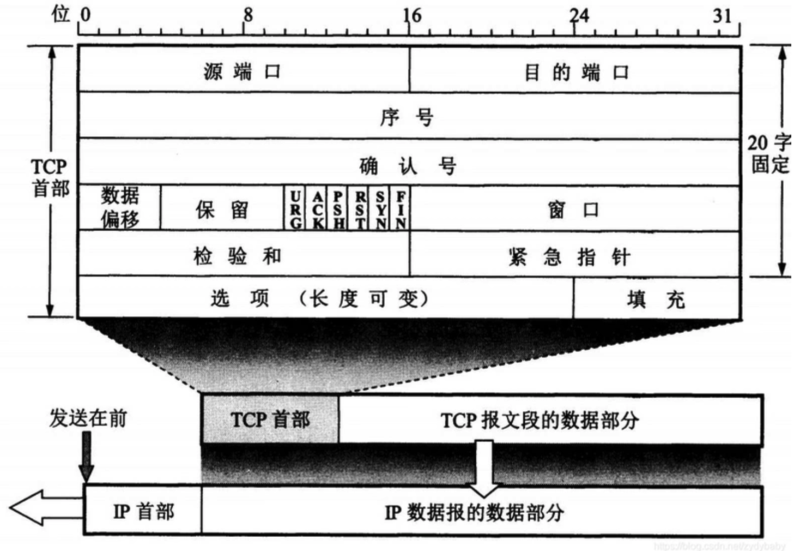
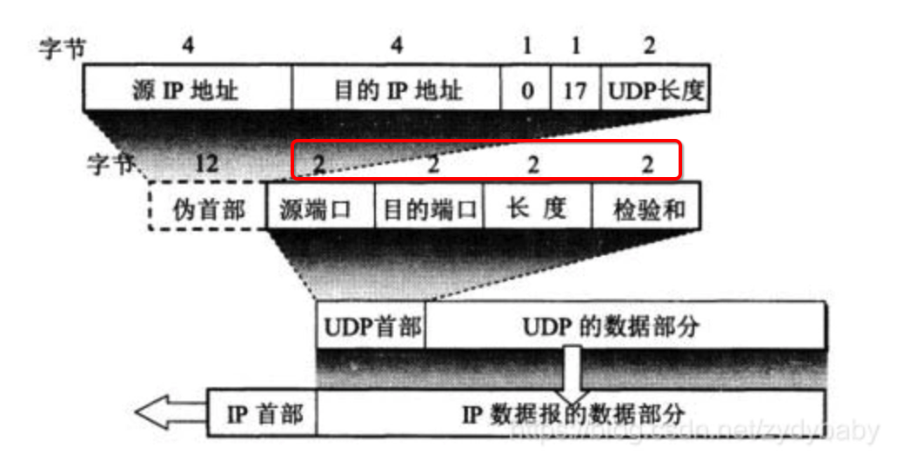
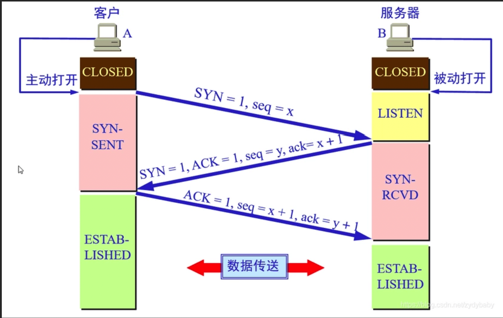
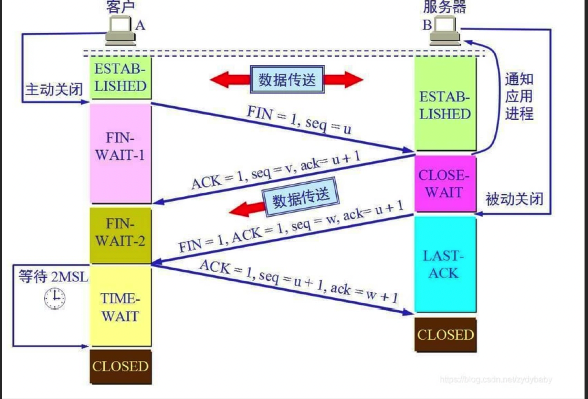

# 计算机网络

## 1、分层协议

每层的作用：

**物理层：**物理层的主要作用是实现相邻计算机结点之间比特流的透明传输，并尽量屏蔽掉具体传输介质和物理设备的差异。**（比特Bit）**

**数据链路层**：数据链路层的作用是在物理层提供比特流服务的基础上，建立相邻结点之间的数据链路，通过差错控制提供数据帧在信道上无差错的传输。 常见的协议有SDLC、HDLC、PPP等。**（帧Frame）**

**网络层**：网络层的主要作用是选择合适的网间路由和交换结点，确保数据及时送达。常见的协议有IP协议，因此分组也叫 IP 数据报 ，简称数据报。~~这里要注意：不要把运输层的“用户数据报 UDP ”和网络层的“ IP 数据报”弄混。另外，无论是哪一层的数据单元，都可笼统地用“分组”来表示。~~**（包PackeT）**

**传输层**：传输层的主要作用是负责向两台主机进程之间的通信提供数据传输服务。传输层的协议主要有传输控制协议TCP和用户数据报协议UDP。**（段Segment）**

~~**会话层**：会话层的主要作用是建立通信链接，保持会话过程通信链接的畅通，同步两个节点之间的对话，决定通信是否被中断以及通信中断时决定从何处重新发送。**（会话协议数据单元SPDU）**~~

~~**表示层**：表示层的主要作用是数据的表示、安全、压缩。可确保一个系统的应用层所发送的信息可以被另一个系统的应用层读取。**（表示协议数据单元PPDU）**~~

**应用层**：应用层的任务是通过应用进程之间的交互来完成特定的网络作用，常见的应用层协议有域名系统DNS，HTTP协议，支持电子邮件的 SMTP 协议等。**（应用协议数据单元APDU--报文）**

网络协议是计算机在**通信过程**中要遵循的一些约定好的规则。**网络分层的原因：易于实现和维护，因为各层之间是独立的，层与层之间不会受到影响。有利于标准化的制定**

### 补充：TCP/IP四层协议模型及各层有哪些协议？

数据链路层：点对点（PPP）
网络层：IP
传输层：TCP、UDP
应用层：HTTP、DNS、SMTP、FTP

### ~~补充：七层网络协议和四层网络协议的区别？~~

1.  ~~四层网络协议的应用层处理七层网络协议中会话层、表示层、应用层的功能~~
2.  ~~四层网络协议传输层不能总是保证在传输层可靠地传输数据包，因为其还提供一个名为UDP的选择，UDP不能保证可靠的数据包传输，而七层模型可以做到。~~

## 2、TCP和UDP

TCP和UDP是**传输层**的两种协议。传输控制协议TCP（Transmisson Control Protocol）**提供面向连接的，可靠的数据传输服务**。而用户数据协议UDP（User Datagram Protocol）**提供无连接的，尽最大努力的数据传输服务，不保证数据传输的可靠性**。

TCP的主要特点是：

1.  TCP是面向连接的，在传输数据之前要先建立连接，结束之后还要释放连接。
2.  每一条TCP连接只能有两个端点，是点对点的（一对一）。
3.  TCP提供可靠交付的服务。通过TCP连接传送的数据，无差错、不丢失、不重复，并且按序到达。
4.  TCP提供全双工通信。TCP允许通信双方的应用进程在任何时候都能发送数据。TCP连接的两端都设有发送缓存和接收缓存，用来临时存放双方通信的数据。
5.  面向字节流。TCP中的“流”（Stream）指的是流入进程或从进程流出的字节序列。“面向字节流”的含义是：虽然应用程序和TCP的交互是一次一个数据块（大小不等），但TCP把应用程序交下来的数据仅仅看成是一连串的无结构的字节流。

UDP的主要特点是：

1.  UDP是无连接的，即在发送数据前，不需要先建立连接，远地主机在收到报文后也不需要给出任何确认；
2.  UDP使用尽最大努力交付，即不保证可靠交付，因此主机不需要维持复杂的连接状态（这里面有许多参数）；
3.  UDP是面相报文的。也没有拥塞控制，因此网络出现拥塞不会使源主机的发送速率降低（对实时应用很有用，如直播，实时视频会议等）；
4.  UDP支持一对一、一对多、多对一和多对多的交互通信；
5.  UDP的首部开销小，只有8个字节，比TCP的20-60个字节的首部要短。

主要区别：

UDP在传送数据之前不需要先建立连接，远地主机在收到UDP报文后，不需要给出任何确认。虽然UDP不提供可靠交付，但在某些情况下UDP却是一种最有效的工作方式（一般用于即时通信），比如：网络语音、直播等。

TCP提供面向连接的服务。在传送数据之前必须先建立连接，数据传送结束后要释放连接。TCP不提供广播或多播服务。由于TCP提供可靠的，面向连接的运输服务~~（TCP的可靠性体现在TCP在传输数据之前，会有三次握手来建立连接，而且在数据传递时，有确认、窗口、重传、拥塞控制机制，在数据传完之后，还会断开连接用来节约系统资源）~~，这会难以避免的增加许多开销，如确认、流量控制，计时器以及连接管理等。这不仅使协议数据单元的首部增大很多，还要占用许多处理器资源。TCP一般用于文件传输、发送和接收邮件、远程登录等场景。

### 补充：如何改进TCP？

采用一块确认的机制。（累积确认）

### 补充：UDP怎么实现可靠传输

1. UDP它不属于连接型协议，因而具有资源消耗小，处理速度快的优点，所以通常音频、视频和普通数据在传送时使用UDP较多，因为它们即使偶尔丢失一两个数据包，也不会对接收结果产生太大影响。传输层无法保证数据的可靠传输，只能通过**应用层**来实现了。实现的方式可以参照TCP可靠性传输的方式，只是实现不在传输层，实现转移到了应用层。

2. 最简单的方式是在应用层模仿传输层TCP的可靠性传输。不考虑拥塞处理，可靠UDP的简单设计为：

   *   添加seq/ack机制，确保数据发送到对端
   *   添加发送和接收缓冲区，主要是用户超时重传
   *   添加超时重传机制

   发送端发送数据时，生成一个随机seq=x，然后每一片按照数据大小分配seq。数据到达接收端后接收端放入缓存，并发送一个ack=x+1的包，表示对方已经收到了数据。发送端收到了ack包后，删除缓冲区对应的数据。时间到后，定时任务检查是否需要重传数据。

3. 目前有如下开源程序利用udp实现了可靠的数据传输。分别为**RUDP、RTP、UDT**。

   *   RUDP（Reliable User Datagram Protocol）。**RUDP 提供一组数据服务质量增强机制，如拥塞控制的改进、重发机制及淡化服务器算法等**，~~从而在包丢失和网络拥塞的情况下， RTP 客户机（实时位置）面前呈现的就是一个高质量的 RTP 流。在不干扰协议的实时特性的同时，可靠 UDP 的拥塞控制机制允许 TCP 方式下的流控制行为。~~
   *   RTP（Real Time Protocol）。**RTP为数据提供了具有实时特征的端对端传送服务**，如在组播或单播网络服务下的交互式视频音频或模拟数据。应用程序通常在 UDP 上运行 RTP 以便使用其多路结点和校验服务；这两种协议都提供了传输层协议的功能。但是 RTP 可以与其它适合的底层网络或传输协议一起使用。~~如果底层网络提供组播方式，那么 RTP 可以使用该组播表传输数据到多个目的地。RTP 本身并没有提供按时发送机制或其它服务质量（QoS）保证，它依赖于底层服务去实现这一过程。 RTP 并不保证传送或防止无序传送，也不确定底层网络的可靠性。 RTP 实行有序传送， RTP 中的序列号允许接收方重组发送方的包序列，同时序列号也能用于决定适当的包位置，例如：在视频解码中，就不需要顺序解码。~~
   *   UDT（UDP-based Data Transfer Protocol）。**UDT的主要目的是支持高速广域网上的海量数据传输**，而互联网上的标准数据传输协议TCP在高带宽长距离网络上性能很差。~~顾名思义，UDT建于UDP之上，并引入新的拥塞控制和数据可靠性控制机制。UDT是面向连接的双向的应用层协议。它同时支持可靠的数据流传输和部分可靠的数据报传输。由于UDT完全在UDP上实现，它也可以应用在除了高速数据传输之外的其它应用领域，例如点到点技术（P2P），防火墙穿透，多媒体数据传输等等。~~

### 补充：TCP的首部

前20个字节是固定的，后面有4n个字节是根据需要而增加的选项，所以TCP首部最小长度为20字节。

### 补充：UDP首部

UDP的首部只有8个字节，源端口号、目的端口号、长度和校验和各两个字节。

## 3、TCP拥塞控制

在某段时间，若对网络中某一资源的需求超过了该资源所能提供的可用部分，网络的性能就要变坏。这种情况就叫**拥塞**。**拥塞控制就是为了防止过多的数据注入到网络中，这样就可以使网络中的路由器或链路不致过载**。拥塞控制所要做的都有一个前提，就是网络能够承受现有的网络负荷。**拥塞控制是一个全局性的过程，涉及到所有的主机，所有的路由器，以及与降低网络传输性能有关的所有因素**。

为了进行拥塞控制，TCP**发送方**要维持一个 **拥塞窗口(cwnd)** 的状态变量。拥塞控制窗口的大小取决于网络的拥塞程度，并且动态变化。发送方让自己的**发送窗口取为拥塞窗口和接收方的接受窗口中较小的一个**。

TCP的拥塞控制采用了四种算法，即 **慢开始** 、 **拥塞避免** 、**快重传** 和 **快恢复**。在网络层也可以使路由器采用适当的分组丢弃策略（如主动队列管理 AQM），以减少网络拥塞的发生。

*   慢开始：慢开始算法的思路是当主机开始发送数据时，如果立即把大量数据字节注入到网络，那么可能会引起网络阻塞，因为现在还不知道网络的负荷情况。经验表明，较好的方法是先探测一下，即由小到大逐渐增大发送窗口，也就是由小到大逐渐增大拥塞窗口数值。cwnd初始值为1，每经过一个传播轮次，cwnd加倍

*   拥塞避免： 因为cwnd的数量在慢开始是指数增长的，为了防止cwnd数量过大而导致网络阻塞，会设置一个**慢开始的门限值ssthresh**，当cwnd>=ssthresh时，进入到拥塞避免阶段，cwnd每个传输轮次加1。当**网络出现超时，会将门限值ssthresh变为出现超时cwnd数值的一半，cwnd重新设置为1**。
*   快重传：当发送方连续收到三个重复确认时，就立即重传对方尚未收到的报文段，并执行快恢复算法。

从上图可知，接收方正确地接收到M1和M2，而M3丢失，由于没有接收到M3，在接收方收到M4、M5和M6时，并不会进行确认，也就是不会发送ACK。这时根据前面说的保证TCP可靠性传输中的序列号的作用，接收方这时不会接收M4，M5，M6，接收方可以什么都不回，因为发送方长时间未收到M3的确认报文，会对M3进行重传。除了这样，接收方也可以重复发送M2的确认报文，这样发送端长时间未收到M3的确认报文也会继续发送M3报文。

**比如接收方正确的接收到了M1和M2，而M3丢失，由于没有接收到M3，在接收方收到M4、M5和M6时，并不会进行确认，也就是不会发送ACK。但是根据快重传算法，要求在这种情况下，接收方需要快速向发送端发送M2的确认报文，在发送方收到三个M2的确认报文后，无需等待重传计时器所设置的时间，可直接进行M3的重传，这就是快重传**。*(面试时说这一句就够了，前面是帮助理解)*

*   快恢复：将ssthresh（慢开始门限）设置为发生快重传时拥塞窗口大小的一半，拥塞窗口也不是设置为1，而是设置为慢开始门限值ssthresh，并开始拥塞避免阶段。

## 4、拥塞控制和流量控制

在某段时间，若对网络中某一资源的需求超过了该资源所能提供的可用部分，网络的性能就要变坏。这种情况就叫拥塞。**拥塞控制就是为了 防止过多的数据注入到网络中，这样就可以使网络中的路由器或链路不致过载**。拥塞控制所要做的都有一个前提，就是网络能够承受现有的网络负荷。**拥塞控制是一个全局性的过程，涉及到所有的主机，所有的路由器，以及与降低网络传输性能有关的所有因素**。

拥塞控制的一些方法：

*   慢开始：为了避免一开始发送大量的数据而产生网络阻塞，会先初始化cwnd为1，当收到ACK后到下一个传输轮次，cwnd为2，以此类推成指数形式增长。
*   拥塞避免：当拥塞窗口达到一个阈值（慢开始门限ssthresh）时，窗口大小不再呈指数上升，而是以线性上升（窗口大小+1），避免增长过快导致网络拥塞。无论是慢开始还是拥塞避免阶段，只要发送方判断网络出现拥塞（没有收到确认ACK，既超时），就将拥塞窗口设置为1，慢开始门限（ssthresh）更新为拥塞时发送窗口的一半，再执行慢开始算法。
*   快重传：当发送方连续收到三个重复确认时，就立即重传对方尚未收到的报文段，并执行快恢复算法。
*   快恢复：将ssthresh（慢开始门限）设置为发生快重传时拥塞窗口大小的一半，拥塞窗口也不是设置为1，而是设置为慢开始门限值ssthresh，并开始拥塞避免阶段。

相反，流量控制往往是**点对点通信量的控制，是个端到端的问题**。流量控制所要做到的就是**抑制发送端发送数据的速率，以便使接收端来得及接收**。

## 5、TCP滑动窗口

TCP通过滑动窗口的概念来进行**流量控制**，抑制发送端发送数据的速率，以便接收端来得及接收。

窗口：对应一段发送者可以发送的字节序列。这个序列的长度是可以改变的，接收端发给发送端自己的接受能力，然后发送端根据已确认接收的序列号和接收能力设置滑动窗口，一下子全部发送，等待接收端确认。

滑动窗口协议是**传输层**进行**流量控制**的一种措施。

## 6、TCP如何实现可靠传输

主要有**校验和**、**序列号**、**超时重传**、**流量控制**及**拥塞控制**等几种方法。

*   校验和：在发送端和接收端分别**计算数据的校验和**，如果发现两者不一致，则说明数据在传输过程中出现了差错，TCP将丢弃和不确认此报文段。
*   序列号：TCP会对每一个发送的字节进行**编号**，接收方接到数据后，会对发送方发送确认应答（ACK报文），并且这个ACK报文中带有相应的确认编号，告诉发送方，下一次发送的数据从编号多少开始发。如果发送方发送相同的数据，接收端也可以通过序列号判断出，直接将数据丢弃。
*   超时重传：如果**发送方在发送数据后一段时间内（可以设置重传计时器规定这段时间）没有收到确认序号ACK**，那么发送方就会重新发送数据。这里发送方没有收到ACK可以分为两种情况，如果是发送方发送的数据包丢失了，接收方收到发送方重新发送的数据包后会马上给发送方发送ACK；如果是接收方之前接收到了发送方发送的数据包，而返回给发送方的ACK丢失了，这种情况，发送方重传后，接收方会直接丢弃发送方重传的数据包，然后再次发送ACK响应报文。如果数据被重发之后还是没有收到接收方的确认应答，则进行再次发送。此时，**等待确认应答的时间将会以2倍、4倍的指数函数延长，直到最后关闭连接**。
*   流量控制：如果发送端发送的数据太快，接收端来不及接收就会出现丢包问题。为了解决这个问题，TCP协议**利用了滑动窗口进行了流量控制**。在TCP首部有一个16位字节大小的窗口，**窗口的大小就是接收端接收数据缓冲区的剩余大小**。接收端会在收到数据包后发送ACK报文时，将自己的窗口填入ACK中，发送方会根据ACK报文中的窗口大小进而控制发送速度。如果窗口大小为零，发送方会停止发送数据。
*   拥塞控制：如果网络出现拥塞，则会产生丢包等问题，这时发送方会将丢失的数据包继续重传，网络拥塞会更加严重，所以在网络出现拥塞时应该注意控制发送方的发送数据，降低整个网络的拥塞程度。拥塞控制主要有四部分组成：慢开始、拥塞避免、快重传和快恢复。
    *   
    *   这里的发送方会维护一个拥塞窗口的状态变量，它和流量控制的滑动窗口是不一样的，**滑动窗口是根据接收方数据缓冲区大小确定的，而拥塞窗口是根据网络的拥塞情况动态确定的**，一般来说发送方真实的发送窗口为滑动窗口和拥塞窗口中的最小值。
    *   1.慢开始：为了避免一开始发送大量的数据而产生网络阻塞，会先初始化cwnd为1，当收到ACK后到下一个传输轮次，cwnd为2，以此类推成指数形式增长。
    *   2.拥塞避免：因为cwnd的数量在慢开始是指数增长的，为了防止cwnd数量过大而导致网络阻塞，会设置一个慢开始的门限值ssthresh，当cwnd>=ssthresh时，进入到拥塞避免阶段，cwnd每个传输轮次加1。但网络出现超时，会将门限值ssthresh变为出现超时cwnd数值的一半，cwnd重新设置为1，如上图，在第12轮出现超时后，cwnd变为1，ssthresh变为12。
    *   3.快重传：在网络中如果出现超时或者阻塞，则按慢开始和拥塞避免算法进行调整。但如果只是丢失某一个报文段，如下图(图片来源于网络)，则使用快重传算法。
    *   
    *   **比如接收方正确的接收到了M1和M2，而M3丢失，由于没有接收到M3，在接收方收到M5、M6和M7时，并不会进行确认，也就是不会发送ACK。但是根据快重传算法，要求在这种情况下，需要快速向发送端发送M2的确认报文，在发送方收到三个M2的确认报文后，无需等待重传计时器所设置的时间，可直接进行M3的重传，这就是快重传**。
    *   4.快恢复：将ssthresh（慢开始门限）设置为发生快重传时拥塞窗口大小的一半，拥塞窗口也不是设置为1，而是设置为慢开始门限值ssthresh，并开始拥塞避免阶段。
*   ~~（停止等待协议ARQ也是为了TCP协议传输稳定可靠，它的基本原理是每发完一个分组就停止发送，等待对方确认。在收到确认后再发下一个分组。）~~

## 7、TCP三次握手和四次挥手

在介绍三次握手和四次挥手之前，先介绍一下TCP头部的一些常用字段。

-   序号：seq，占32位，用来**标识从发送端到接收端发送的字节流**。
-   确认号：ack，占32位，**只有ACK标志为1时，确认号字段才有效，ack=seq+1**。
-   标志位：
    -   SYN：发起一个新连接
    -   FIN：释放一个连接
    -   ACK：确认序号有效

**三次握手：**

三次握手的本质就是**确定发送端和接收端具备收发信息的能力**

*   第一次握手： 客户端向服务端发起建立连接请求，客户端会随机生成一个起始序列号x，客户端向服务端发送的字段中包含标志位SYN=1，序列号seq=x。第一次握手前客户端的状态为CLOSE，第一次握手后客户端的状态为SYN-SENT。此时服务端的状态为LISTEN
*   第二次握手：服务端在收到客户端发来的报文后，会随机生成一个服务端的起始序列号y，然后给客户端回复一段报文，其中包括标志位SYN=1，ACK=1，序列号seq=y，确认号ack=x+1。第二次握手前服务端的状态为LISTEN，第二次握手后服务端的状态为SYN-RCVD，此时客户端的状态为SYN-SENT。（其中SYN=1表示要和客户端建立一个连接，ACK=1表示确认序号有效）
*   第三次握手：客户端收到服务端发来的报文后，会再向服务端发送报文，其中包含标志位ACK=1，序列号seq=x+1，确认号ack=y+1。第三次握手前客户端的状态为SYN-SENT，第三次握手后客户端和服务端的状态都为ESTABLISHED。

需要注意的一点是，第一次握手，客户端向服务端发起建立连接报文，会占一个序列号。但是第三次握手，同样是客户端向服务端发送报文，这次却不占序列号，所以建立连接后，客户端向服务端发送的第一个数据的序列号为x+1。

**四次挥手：**

和三次握手一样，客户端在四次挥手过程中有ESTABLISHED、FIN-WAIT-1、FIN-WAIT-2、TIME-WAIT、CLOSED等五个状态，服务端有ESTABLISHED、CLOSE-WAIT、LAST-ACK、CLOSED等四种状态。

假设客户端首先发起的断开连接请求

*   第一次挥手：客户端向服务端发送的数据完成后，向服务端发起释放连接报文，报文包含标志位FIN=1，序列号seq=u。此时客户端只能接收数据，不能向服务端发送数据。
*   第二次挥手：服务端收到客户端的释放连接报文后，向客户端发送确认报文，包含标志位ACK=1，序列号seq=v，确认号ack=u+1。此时客户端到服务端的连接已经释放掉，客户端不能向服务端发送数据。**但服务端到客户端的单向连接还能正常传输数据**。
*   第三次挥手：服务端发送完数据后向客户端发出连接释放报文，报文包含标志位FIN=1，标志位ACK=1，序列号seq=w，确认号ack=u+1。
*   第四次挥手：客户端收到服务端发送的释放连接请求，向服务端发送确认报文，包含标志位ACK=1，序列号seq=u+1，确认号ack=w+1。

### 补充：为什么TCP连接的时候是3次？两次是否可以？

不可以是两次，主要从以下两个方面考虑（假设客户端是首先发起连接请求）：

1.  假设建立TCP连接仅需要两次握手，那么**如果第二次握手时，服务端返回给客户端的确认报文丢失了**，客户端这边认为服务端没有和它建立连接，而服务端却以为已经和客户端建立了连接，并且可能服务端已经开始向客户端发送数据，但客户端并不会接收这些数据，浪费了资源。如果是三次握手，不会出现双方连接还未完全建立成功就开始发送数据的情况。
2.  如果**服务端接收到了一个早已失效的来自客户端的连接请求报文**，会向客户端发送确认报文同意建立TCP连接。但因为客户端并不需要向服务端发送数据，所以此次TCP连接没有意义并且浪费了资源。

### 补充：为什么TCP连接的时候是3次，关闭的时候却是4次？

因为**需要确保通信双方都能通知对方释放连接**，假设客户端发送完数据向服务端发送释放连接请求，而此时客户端并不知道服务端是否已经发送完数据，所以此次断开的是客户端到服务端到单向连接，服务端返回给客户端确认报文后，**服务端还能继续单向给客户端发送数据**。当服务端发送完数据后还需要向客户端发送释放连接请求，客户端返回确认报文，TCP连接才能彻底关闭。所以断开TCP连接需要客户端和服务端分别通知对方释放连接并分别收到确认报文，一共需要四次。

### 补充：TIME_WAIT和CLOSE_WAIT的区别在哪？

默认客户端首先发起断开连接请求

-   CLOSE_WAIT是**被动关闭**形成的，当客户端发送FIN报文，服务端返回ACK报文后进入CLOSE_WAIT。
-   TIME_WAIT是**主动关闭**形成的，当第四次挥手完成后，客户端进入TIME_WAIT状态。

### 补充：为什么客户端发出第四次挥手的确认报文后要等2MSL的时间才能释放TCP连接？

MSL的意思是报文的最长寿命，可以从两方面考虑：

1.  客户端发送第四次挥手的报文后，再经过2MSL，可使本次TCP连接中的所有报文全部消失，不会出现在下一个TCP连接中。
2.  考虑到丢包问题，如果第四次挥手发送的报文在传输过程中丢失了，那么服务端没收到确认ACK报文就会重发第三次挥手的报文。如果客户端发送完第四次挥手的确认报文后直接关闭，而这次报文又恰好丢失，则会造成服务端重发的第三次挥手报文一直收不到ACK确认报文，会导致服务端无法正常关闭。

### 补充：如果已经建立了连接，但是客户端突然出现故障了怎么办？

如果TCP连接已经建立，在通信过程中，客户端突然故障，那么**服务端不会一直等下去，过一段时间就关闭连接了**。具体原理是TCP有一个**保活机制，主要用在服务器端，用于检测已建立TCP连接的客户端的状态，防止因客户端崩溃或者客户端网络不可达**，而服务器端一直保持该TCP连接，占用服务器端的大量资源（因为Linux系统中可以创建的总TCP连接数是有限制的）。

**保活机制的原理**：设置TCP保活机制的保活时间keepIdle，即在TCP链接超过该时间没有任何数据交互时，发送保活探测报文；设置保活探测报文的发送时间间隔keepInterval和保活探测报文的总发送次数keepCount。如果在keepCount次的保活探测报文均没有收到客户端的回应，则服务器端关闭与客户端的TCP链接。

### 补充：客户端和服务端同时请求关闭连接

**实际中还会出现同时发起主动关闭的情况**

CLOSING ：这种状态在实际情况中应该很少见，属于一种比较罕见的例外状态。**正常情况下，当一方发送FIN报文后，按理来说是应该先收到（或同时收到）对方的ACK报文，再收到对方的FIN报文**。但是**CLOSING 状态表示一方发送FIN报文后，并没有先收到对方的ACK报文，反而却先收到了对方的FIN报文**。什么情况下会出现此种情况呢？那就是当双方几乎在同时close一个SOCKET的话，就出现了**双方同时发送FIN报文的情况，这时就会出现CLOSING 状态**，表示双方都正在关闭SOCKET连接。

同时断开时，如果主机在FIN_WAIT1状态下首先收到对端主机的FIN包的话，那么该主机在确认已经收到了对端主机全部的数据包后，就响应一个ACK给对端主机，然后自己进入**CLOSEING状态**，主机在CLOSEING状态下收到自己的FIN包的ACK包的话，那么就进入**TIME WAIT 状态**。于是TCP的主机两端同时发起FIN包进行断开连接，那么**两端主机可能出现完全一样的状态转移 FIN_WAIT1——>CLOSEING——->TIME_WAIT，也就会Client和Server最后同时进入TIME_WAIT状态**。

## 8、URI和URL的区别

*   URI(Uniform Resource Identifier)：**统一资源标识符**，主要作用是**唯一标识一个资源**。
*   URL(Uniform Resource Location)：**统一资源定位符**，主要作用是**提供资源的路径**。

URI像是身份证，可以唯一标识一个人，而URL更像一个住址，可以通过URL找到这个人。

## 9、DNS

DNS的定义：DNS的全称是domain name system，即域名系统。**DNS是因特网上作为域名和IP地址相互映射的一个分布式数据库，能够使用户更方便的去访问互联网而不用去记住能够被机器直接读取的IP地址**。比如大家访问百度，更多地肯定是访问www.baidu.com，而不是访问112.80.248.74，因为这几乎无规则的IP地址实在太难记了。DNS要做的就是将www.baidu.com解析成112.80.248.74。

### 补充：DNS是集群式的工作方式还是单点式的，为什么？

是集群式的。很容易想到的一个方案就是只用一个DNS服务器，包含了所有域名和IP地址的映射。尽管这种设计方式看起来很简单，但是缺点显而易见，**如果这个唯一的DNS服务器出了故障，那么就全完了，因特网就几乎崩了**。为了避免这种情况出现，DNS系统采用的是**分布式的层次数据库模式**，还有**缓存机制**也能解决这种问题。

### 补充：**DNS的工作流程**

**主机向本地域名服务器的查询一般是采用递归查询，而本地域名服务器向根域名的查询一般是采用迭代查询。**

*   递归查询：主机向本地域名发送查询请求报文，如果本地域名服务器不知道该域名对应的IP地址时，**本地域名会继续向根域名发送查询请求报文，不是通知主机自己向根域名发送查询请求报文**。
*   迭代查询：本地域名服务器向根域名发出查询请求报文后，**根域名不会继续向顶级域名服务器发送查询请求报文，而是通知本地域名服务器向顶级域名发送查询请求报文**。

1.  在浏览器中输入www.baidu.com域名，操作系统会先检查自己**本地的hosts文件**是否有这个域名的映射关系，如果有，就先调用这个IP地址映射，完成域名解析。
2.  如果hosts文件中没有，则查询**本地DNS解析器缓存**，如果有，则完成地址解析。
3.  如果本地DNS解析器缓存中没有，则去查找**本地DNS服务器**，如果查到，完成解析。
4.  如果没有，则**本地服务器会向根域名服务器**发起查询请求。**根域名服务器会告诉本地域名服务器去查询哪个顶级域名服务器**。
5.  本地域名服务器**向顶级域名服务器发起查询请求**，**顶级域名服务器会告诉本地域名服务器去查找哪个权限域名服务器**。
6.  本地域名服务器**向权限域名服务器发起查询请求**，权限域名服务器告诉本地域名服务器www.baidu.com所对应的IP地址。
7.  本地域名服务器告诉主机www.baidu.com所对应的IP地址。

## 10、ARP协议（Address Resolution Protocol）

ARP协议属于网络层的协议，主要作用是**实现从IP地址转换为MAC地址**。在每个主机或者路由器中都建有一个ARP缓存表，表中有IP地址及对应的MAC地址。

*   ~~IP地址：IP地址是指互联网协议地址，IP地址是IP协议提供的一种统一的地址格式，它为互联网上的每一个网络和每一台主机分配一个逻辑地址，以此来屏蔽物理地址的差异。~~
*   ~~MAC地址：MAC地址又称物理地址，由网络设备制造商生产时写在硬件内部，不可更改，并且每个以太网设备的MAC地址都是唯一的。~~

数据在传输过程中，会先从高层传到底层，然后在通信链路上传输。TCP报文在网络层会被封装成IP数据报，在数据链路层被封装成MAC帧，然后在通信链路中传输。**在网络层使用的是IP地址，在数据据链路层使用的是MAC地址**。MAC帧在传送时的源地址和目的地址使用的都是MAC地址，在通信链路上的主机或路由器也都是根据MAC帧首部的MAC地址接收MAC帧。并且**在数据链路层是看不到IP地址**的，只有当数据传到网络层时去掉MAC帧的首部和尾部时才能在IP数据报的首部中找到源IP地址和目的地址。

**网络层实现的是主机之间的通信**，而**链路层实现的是链路之间的通信**，**在数据传输过程中，IP数据报的源地址(IP1)和目的地址(IP2)是一直不变的，而MAC地址(硬件地址)却一直随着链路的改变而改变**。

### 补充：ARP的工作流程（面试说这个就行）

1.  在**局域网**内，主机A要向主机B发送IP数据报时，首先会在主机A的**ARP缓存表**中查找是否有IP地址及其对应的MAC地址，如果有，则将MAC地址写入到MAC帧的首部，并通过局域网将该MAC帧发送到MAC地址所在的主机B。
2.  如果主机A的ARP缓存表中没有主机B的IP地址及所对应的MAC地址，主机A会在局域网内**广播**发送一个ARP请求分组。局域网内的所有主机都会收到这个ARP请求分组。
3.  主机B在看到主机A发送的ARP请求分组中有自己的IP地址，会向主机A以**单播**的方式发送一个带有自己MAC地址的响应分组。
4.  主机A收到主机B的ARP响应分组后，会在ARP缓存表中写入主机B的IP地址及其对应的MAC地址。
5.  如果主机A和主机B**不在同一个局域网内，即使知道主机B的MAC地址也是不能直接通信的**，**必须通过路由器转发**到主机B的局域网才可以通过主机B的MAC地址找到主机B。并且**主机A和主机B已经可以通信的情况下，主机A的ARP缓存表中存的并不是主机B的IP地址及主机B的MAC地址，而是主机B的IP地址及该通信链路上的下一跳路由器的MAC地址**。这就是**源IP地址和目的IP地址一直不变，而MAC地址却随着链路的不同而改变**。
6.  如果主机A和主机B不在同一个局域网，参考上图中的主机H1和主机H2，这时主机H1需要先广播找到路由器R1的MAC地址，再由R1广播找到路由器R2的MAC地址，最后R2广播找到主机H2的MAC地址，建立起通信链路。

## 11、有了IP地址，为什么还要用MAC地址？

简单来说，标识网络中的一台计算机，比较常用的就是IP地址和MAC地址，但**计算机的IP地址可由用户自行更改，管理起来相对困难，而MAC地址不可更改**，所以一般会把IP地址和MAC地址组合起来使用。组合使用的方式就是采用ARP协议。

那只用MAC地址不用IP地址也是不行的，因为在最早就是MAC地址先出现的，并且当时并不用IP地址，只用MAC地址，后来随着网络中的设备越来越多，整个路由过程越来越复杂，便出现了**子网**的概念。对于目的地址在其他子网的数据包，路由只需要将数据包送到那个子网即可，~~这个过程就是上面说的ARP协议~~。

那为什么要用IP地址呢？是因为**IP地址是和地域相关**的，对于**同一个子网上的设备，IP地址的前缀都是一样的**，这样路由器通过IP地址的前缀就知道设备在在哪个子网上了，而只用MAC地址的话，路由器则需要记住每个MAC地址在哪个子网，这需要路由器有极大的存储空间，是无法实现的。

IP地址可以比作为地址，MAC地址为收件人，在一次通信过程中，两者是缺一不可的。

## 12、ping的过程

ping是**ICMP(网际控制报文协议)**中的一个重要应用，ICMP是**网络层**的协议。ping的作用是**测试两个主机的连通性**。ping的工作过程：

*   向目的主机**发送多个ICMP回送请求报文**
*   根据目的主机返回的回送报文的**时间**和**成功响应的次数**估算出数据包**往返时间**及**丢包率**。

## 13、路由器和交换机的区别？（不那么重要）

路由器属于**网络层**，识别IP地址并根据IP地址转发数据包，维护数据表并基于数据表进行最佳路径选择

交换机属于**数据链路层**，识别MAC地址并根据MAC地址转发数据帧

## 14、HTTP和HTTPS的区别

1.  端口：HTTP的默认端口是80，HTTPS的是443
2.  安全性：HTTP无加密，安全性较差，HTTPS有加密机制，安全性较高
3.  资源消耗：HTTP消耗资源较少，HTTPS由于加密处理，资源消耗更多
4.  是否需要证书：HTTP不需要证书，HTTPS需要证书
5.  协议：HTTP运行在TCP协议之上，HTTPS运行在SSL协议之上，SSL运行在TCP协议之上

**http + 加密 + 认证 + 完整性保护 = https**，即http加上加密处理和认证以及完整性保护后就是https。

**https并非是应用层的一种新协议，只是http通信接口部分用SSL（Secure Socket Layer）和TLS（Transport Layer Security）协议代替而已**。通常http直接和tcp通信。当使用SSL时，则演化为变成先和SSL通信，再由SSL和TCP通信了。简而言之，HTTPS其实就是身披SSL协议这层外衣的http。

~~SSL采用一种叫做公开密钥加密的加密处理方式。近代的加密方法中，加密算法是公开的，而秘钥却是保密的。通过这种方式得以保持加密方法的安全性。~~

~~HTTPS采用混合加密机制：采用共享秘钥加密和公开秘钥加密两者并用的混合加密机制。~~

### 15、什么是对称加密和非对称加密

* 对称加密：对称加密指**加密和解密使用同一密钥**，优点是**运算速度快**，**缺点是如何安全将密钥传输给另一方**。常见的对称加密算法有DES、AES等等。

* 非对称加密：非对称加密指的是**加密和解密使用不同的密钥**，一把公开的**公钥**，一把私有的**私钥**。公钥加密的信息只有私钥才能解密，私钥加密的信息只有公钥才能解密。优点**解决了对称加密中存在的问题**。缺点是**运算速度较慢**。常见的非对称加密算法有RSA、DSA、ECC等等。

  混合加密的工作流程：**A生成一对非对称密钥，将公钥向所有人公开，B拿到A的公钥后使用A的公钥对信息加密后发送给A，经过加密的信息只有A手中的私钥能解密。这样B可以通过这种方式将自己的公钥加密后发送给A，两方建立起通信，可以通过对方的公钥加密要发送的信息，接收方用自己的私钥解密信息**。

## 16、HTTPS的加密过程

对于对称加密和非对称加密的优缺点，HTTPS是将两者结合起来，使用对称加密和非对称加密的**混合加密算法**。具体做法就是**使用非对称加密来传输对称密钥来保证安全性，使用对称加密来保证通信的效率**。

工作流程：服务端生成一对非对称密钥，将公钥发给客户端。客户端生成对称密钥，用服务端发来的公钥进行加密，加密后发给服务端。服务端收到后用私钥进行解密，得到客户端发送的对称密钥。通信双方就可以通过对称密钥进行高效地通信了。

但是这其中存在一个很大地问题，就是客户端最开始**如何判断收到的这个公钥就是来自服务端而不是其他人冒充的**？

这就需要**证书**上场了，服务端会向一个权威机构申请一个证书来证明自己的身份，到时候将证书（证书中包含了公钥）发给客户端就可以了，客户端收到证书后既证明了服务端的身份又拿到了公钥就可以进行下一步操作了。

HTTPS的加密过程：

1.  客户端向服务端发起第一次握手请求，告诉服务端客户端所支持的SSL的指定版本、加密算法及密钥长度等信息。
2.  服务端将自己的公钥发给数字证书认证机构，数字证书认证机构利用自己的私钥对服务器的公钥进行数字签名，并给服务器颁发公钥证书。
3.  服务端将证书发给客服端。
4.  客服端利用数字认证机构的公钥，向数字证书认证机构验证公钥证书上的数字签名，确认服务器公开密钥的真实性。
5.  客服端使用服务端的公开密钥加密自己生成的对称密钥，发给服务端。
6.  服务端收到后利用私钥解密信息，获得客户端发来的对称密钥。
7.  通信双方可用对称密钥来加密解密信息。

上述流程存在的一个问题是客户端哪里来的数字认证机构的公钥，其实，在很多浏览器开发时，会内置常用数字证书认证机构的公钥。

## 17、HTTP常用状态码

常见的HTTP状态码

1XX

*   100 Continue：表示正常，客户端可以继续发送请求
*   101 Switching Protocols：切换协议，服务器根据客户端的请求切换协议。

2XX

*   200 OK：请求成功
*   201 Created：已创建，表示成功请求并创建了新的资源
*   202 Accepted：已接受，已接受请求，但未处理完成。
*   204 No Content：无内容，服务器成功处理，但未返回内容。
*   205 Reset Content：重置内容，服务器处理成功，客户端应重置文档视图。
*   206 Partial Content：表示客户端进行了范围请求，响应报文应包含Content-Range指定范围的实体内容

3XX

*   301 Moved Permanently：永久性重定向
*   302 Found：临时重定向
*   303 See Other：和301功能类似，但要求客户端采用get方法获取资源
*   304 Not Modified：所请求的资源未修改，服务器返回此状态码时，不会返回任何资源。
*   305 Use Proxy：所请求的资源必须通过代理访问
*   307 Temporary Redirect： 临时重定向，与302类似，要求使用get请求重定向。

4XX

*   400 Bad Request：客户端请求的语法错误，服务器无法理解。
*   401 Unauthorized：表示发送的请求需要有认证信息。
*   403 Forbidden：服务器理解用户的请求，但是拒绝执行该请求
*   404 Not Found：服务器无法根据客户端的请求找到资源。
*   405 Method Not Allowed：客户端请求中的方法被禁止
*   406 Not Acceptable：服务器无法根据客户端请求的内容特性完成请求
*   408 Request Time-out：服务器等待客户端发送的请求时间过长，超时

5XX

*   500 Internal Server Error：服务器内部错误，无法完成请求
*   501 Not Implemented：服务器不支持请求的功能，无法完成请求

## 18、HTTP常见的方法

为了方便记忆，可以将PUT、DELETE、POST、GET理解为客户端对服务端的增删改查。

-   PUT：上传文件，向服务器添加数据，可以看作增
-   DELETE：删除文件
-   POST：传输数据，向服务器提交数据，对服务器数据进行更新。
-   GET：获取资源，查询服务器资源

## 19、GET和POST区别

-   作用：GET用于获取资源，POST用于传输实体主体
-   参数位置：GET的参数放在URL中，POST的参数存储在实体主体中，并且GET方法提交的请求的URL中的数据做多是2048字节，POST请求没有大小限制。
-   安全性：GET方法因为参数放在URL中，安全性相对于POST较差一些
-   幂等性：GET方法是具有幂等性的，而POST方法不具有幂等性。这里幂等性指客户端连续发出多次请求，收到的结果都是一样的.

## 20、HTTP 1.0、HTTP 1.1及HTTP 2.0的主要区别是什么

HTTP 1.0和HTTP 1.1的区别

- 长连接

  HTTP 1.1支持**长连接**和**请求的流水线操作**。**长连接是指不在需要每次请求都重新建立一次连接**，HTTP 1.0默认使用短连接，每次请求都要重新建立一次TCP连接，资源消耗较大。**请求的流水线操作是指客户端在收到HTTP的响应报文之前可以先发送新的请求报文**，不支持请求的流水线操作需要等到收到HTTP的响应报文后才能继续发送新的请求报文。

- 缓存处理

  在HTTP 1.0中主要使用header中的If-Modified-Since,Expires作为缓存判断的标准，HTTP 1.1引入了Entity tag，If-Unmodified-Since, If-Match等更多可供选择的缓存头来控制缓存策略。

- 错误状态码

  在HTTP 1.1新增了24个错误状态响应码

- HOST域

  在HTTP 1.0 中认为每台服务器都会绑定唯一的IP地址，所以，请求中的URL并没有传递主机名。但后来一台服务器上可能存在多个虚拟机，它们共享一个IP地址，所以HTTP 1.1中请求消息和响应消息都应该支持Host域。

- 带宽优化及网络连接的使用

  在HTTP 1.0中会存在浪费带宽的现象，主要是因为不支持断点续传功能，客户端只是需要某个对象的一部分，服务端却将整个对象都传了过来。在HTTP 1.1中请求头引入了range头域，它支持只请求资源的某个部分，返回的状态码为206。

HTTP 2.0的新特性

-   新的二进制格式：HTTP 1.x的解析是**基于文本**，HTTP 2.0的解析采用**二进制**，实现方便，健壮性更好。
-   多路复用：每一个request对应一个id，一个连接上可以有多个request，每个连接的request可以随机混在一起，这样接收方可以根据request的id将request归属到各自不同的服务端请求里。
-   header压缩：在HTTP 1.x中，header携带大量信息，并且每次都需要重新发送，HTTP 2.0采用编码的方式减小了header的大小，同时通信双方各自缓存一份header fields表，避免了header的重复传输。
-   服务端推送：客户端在请求一个资源时，会把相关资源一起发给客户端，这样客户端就不需要再次发起请求。

## 21、Session、Cookie和Token的主要区别// TODO 修改

HTTP协议是**无状态**的，即服务器无法判断用户身份。Session和Cookie可以用来进行身份辨认。

- Cookie

  Cookie是保存在**客户端**一个小数据块，其中包含了用户信息。当客户端向服务端发起请求，服务端会像客户端浏览器发送一个Cookie，客户端会把Cookie存起来，当下次客户端再次请求服务端时，会携带上这个Cookie，服务端会通过这个Cookie来确定身份。

- Session

  Session是通过Cookie实现的，和Cookie不同的是，Session是存在**服务端**的。当客户端浏览器第一次访问服务器时，服务器会为浏览器创建一个sessionid，将sessionid放到Cookie中，存在客户端浏览器。比如浏览器访问的是购物网站，将一本《图解HTTP》放到了购物车，当浏览器再次访问服务器时，服务器会取出Cookie中的sessionid，并根据sessionid获取会话中的存储的信息，确认浏览器的身份是上次将《图解HTTP》放入到购物车那个用户。

- Token（// TODO 修改）

  客户端在浏览器第一次访问服务端时，服务端生成的一串字符串作为Token发给客户端浏览器，下次浏览器在访问服务端时携带token即可无需验证用户名和密码，省下来大量的资源开销。看到这里很多人感觉这不是和sessionid作用一样吗？

### 补充：如果客户端禁止 cookie 能实现 session 还能用吗？

可以，Session的作用是在服务端来保持状态，通过sessionid来进行确认身份，但sessionid一般是通过Cookie来进行传递的。如果Cooike被禁用了，可以通过在URL中传递sessionid。

## 22、在浏览器中输⼊url地址到显示主⻚的过程（重要）

1.  对输入到浏览器的url进行DNS解析，将域名转换为IP地址。
    *   浏览器搜索自身的DNS缓存
    *   搜索操作系统的DNS缓存
    *   读取本地的host文件
    *   发起一个DNS的系统调用：宽带运营服务查看本身的缓存，运营商服务器发起一个迭代DNS解析请求
2.  和目的服务器建立TCP连接
3.  向目的服务器发送HTTP请求
4.  服务器处理请求并返回HTTP报文
5.  浏览器解析并渲染页面，如果遇到引用的外部CSS，JS，图片等静态资源，它们同样也是一个个HTTP请求，都需要经过上述步骤。

## ~~21、Servlet是线程安全的吗~~

~~Servlet不是线程安全的，多线程的读写会导致数据不同步的问题。~~

# 操作系统

## 1、进程和线程

进程(process)与线程(thread)最大的区别是**进程拥有自己的地址空间**，某进程内的线程对于其他进程不可见，即进程A不能通过传地址的方式直接读写进程B的存储区域。进程之间的通信需要通过进程间通信(Inter-process communication，IPC)。与之相对的，同一进程的各线程间之间可以直接通过传递地址或全局变量的方式传递信息。

此外，**进程作为操作系统中拥有资源和独立调度的基本单位，可以拥有多个线程**。通常操作系统中运行的一个程序就对应一个进程。在同一进程中，线程的切换不会引起进程切换。在不同进程中进行线程切换，如从一个进程内的线程切换到另一个进程中的线程时，会引起进程切换。**相比进程切换，线程切换的开销要小很多**。线程与进程相互结合能够提高系统的运行效率。

线程可以分为两类：

一类是**用户级线程**(user level thread)。对于这类线程，有关线程管理的所有工作都由应用程序完成，内核意识不到线程的存在。在应用程序启动后，操作系统分配给该程序一个进程号，以及其对应的内存空间等资源。应用程序通常先在一个线程中运行，该线程被成为主线程。在其运行的某个时刻，可以通过调用线程库中的函数创建一个在相同进程中运行的新线程。 用户级线程的好处是非常高效，不需要进入内核空间，但并发效率不高。

另一类是**内核级线程**(kernel level thread)。对于这类线程，有关线程管理的所有工作由内核完成，应用程序没有进行线程管理的代码，只能调用内核线程的接口。内核维护进程及其内部的每个线程，调度也由内核基于线程架构完成。内核级线程的好处是，内核可以将不同线程更好地分配到不同的CPU，以实现真正的并行计算。

事实上，在现代操作系统中，往往使用组合方式实现多线程，即线程创建完全在用户空间中完成，并且一个应用程序中的多个用户级线程被映射到一些内核级线程上，相当于是一种折中方案。

## 2、上下文切换

对于单核单线程CPU而言，在某一时刻只能执行一条CPU指令。上下文切换(Context Switch)是一种**将CPU资源从一个进程分配给另一个进程的机制**。从用户角度看，计算机能够并行运行多个进程，这恰恰是操作系统通过快速上下文切换造成的结果。在切换的过程中，操作系统需要先存储当前进程的状态(包括内存空间的指针，当前执行完的指令等等)，再读入下一个进程的状态，然后执行此进程。

## 3、中断与系统调用

### 中断

所谓的中断就是**在计算机执行程序的过程中，由于出现了某些特殊事情，使得CPU暂停对程序的执行，转而去执行处理这一事件的程序**。等这些特殊事情处理完之后再回去执行之前的程序。中断一般分为三类：

1.  由计算机硬件异常或故障引起的中断，称为内部异常中断；
2.  由程序中执行了引起中断的指令而造成的中断，称为软中断（系统调用相关的中断）；
3.  由外部设备请求引起的中断，称为外部中断。简单来说，对中断的理解就是对一些特殊事情的处理。

与中断紧密相连的一个概念就是**中断处理程序**了。当中断发生的时候，系统需要去对中断进行处理，**对这些中断的处理是由操作系统内核中的特定函数进行的**，这些**处理中断的特定的函数就是我们所说的中断处理程序**了。 

另一个与中断紧密相连的概念就是**中断的优先级**。中断的优先级说明的是当一个中断正在被处理的时候，**处理器能接受的中断的级别**。中断的优先级也表明了**中断需要被处理的紧急程度**。每个中断都有一个对应的优先级，当处理器在处理某一中断的时候，只有比这个中断优先级高的中断可以被处理器接受并且被处理。优先级比这个当前正在被处理的中断优先级要低的中断将会被忽略。

~~典型的中断优先级如下所示：机器错误 > 时钟 > 磁盘 > 网络设备 >  终端 > 软件中断~~

~~当发生软件中断时，其他所有的中断都可能发生并被处理；但当发生磁盘中断时，就只有时钟中断和机器错误中断能被处理了。~~

### 系统调用

在讲系统调用之前，先说下进程的执行在系统上的两个级别：用户级和核心级，也称为**用户态**和**系统态（核心态）**(user mode and kernel mode)。

程序的执行一般是在用户态下执行的，**但当程序需要使用操作系统提供的服务时，比如说打开某一设备、创建文件、读写文件等，就需要向操作系统发出调用服务的请求，这就是系统调用**。

~~Linux系统有专门的函数库来提供这些请求操作系统服务的入口，这个函数库中包含了操作系统所提供的对外服务的接口。~~**当进程发出系统调用之后，它所处的运行状态就会由用户态变成核心态**。但这个时候，进程本身其实并没有做什么事情，这个时候是由内核在做相应的操作，去完成进程所提出的这些请求。

系统调用和中断的关系就在于，**当进程发出系统调用申请的时候，会产生一个软件中断。产生这个软件中断以后，系统会去对这个软中断进行处理，这个时候进程就处于核心态了**。

### 补充：那么用户态和核心态之间的区别是什么呢？

1.  处于用户态执行时，进程所能访问的内存空间和对象受到限制，只能存取它们自己的指令和数据，但不能存取内核指令和数据（或其他进程的指令和数据），其占有的处理机是可被抢占的 
2.  处于核心态执行中的进程，则能访问所有的内存空间和对象，能够存取内核和用户地址，且所占有的处理机是不允许被抢占的
3.  某些机器指令是特权指令，在用户态下执行特权指令会引起错误

