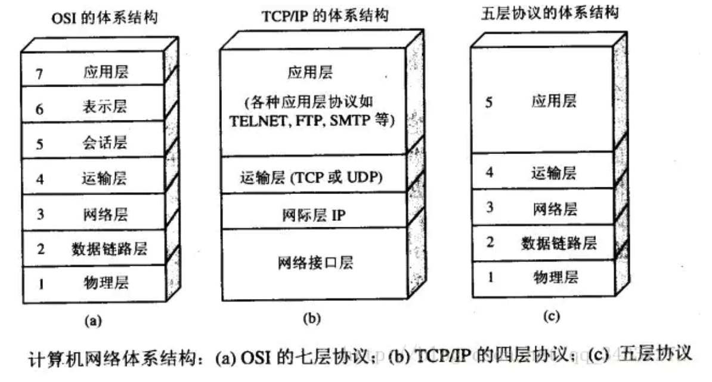
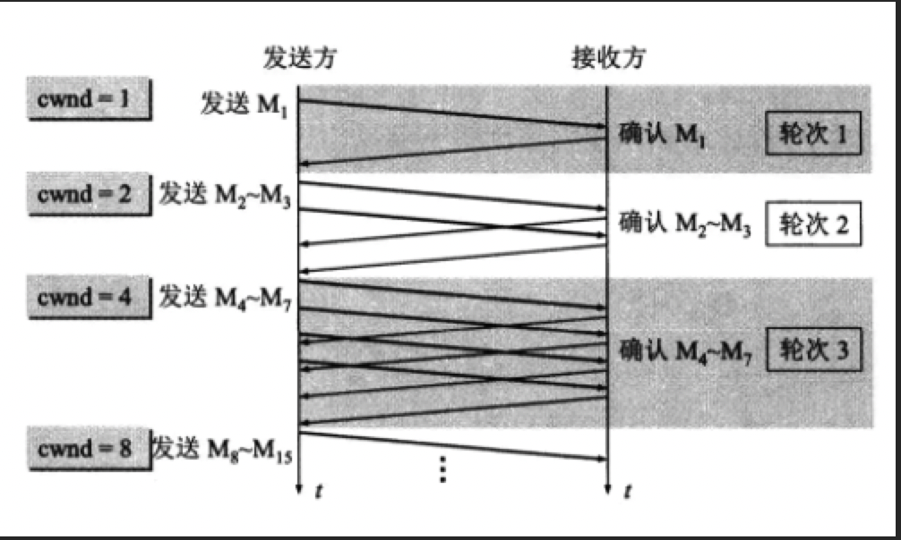
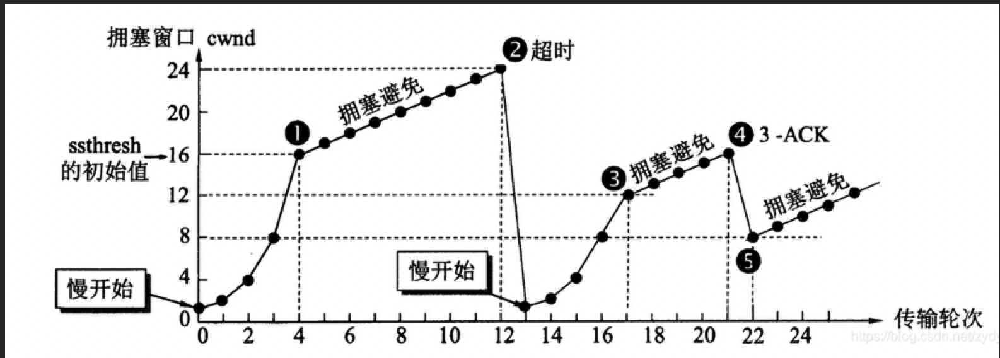
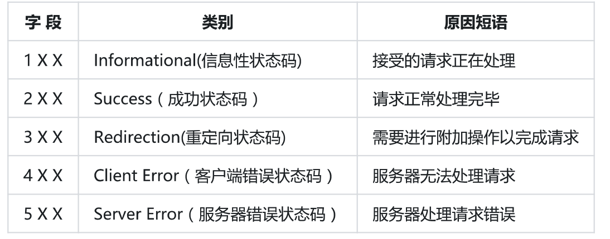

# 计算机网络

## 1、分层协议



每层的作用：

**物理层：**物理层的主要作用是实现相邻计算机结点之间比特流的透明传输，并尽量屏蔽掉具体传输介质和物理设备的差异。**（比特Bit）**

**数据链路层**：数据链路层的作用是在物理层提供比特流服务的基础上，建立相邻结点之间的数据链路，通过差错控制提供数据帧在信道上无差错的传输。 常见的协议有SDLC、HDLC、PPP等。**（帧Frame）**

**网络层**：网络层的主要作用是选择合适的网间路由和交换结点，确保数据及时送达。常见的协议有IP协议，因此分组也叫 IP 数据报 ，简称数据报。~~这里要注意：不要把运输层的“用户数据报 UDP ”和网络层的“ IP 数据报”弄混。另外，无论是哪一层的数据单元，都可笼统地用“分组”来表示。~~**（包PackeT）**

**传输层**：传输层的主要作用是负责向两台主机进程之间的通信提供数据传输服务。传输层的协议主要有传输控制协议TCP和用户数据报协议UDP。**（段Segment）**

~~**会话层**：会话层的主要作用是建立通信链接，保持会话过程通信链接的畅通，同步两个节点之间的对话，决定通信是否被中断以及通信中断时决定从何处重新发送。**（会话协议数据单元SPDU）**~~

~~**表示层**：表示层的主要作用是数据的表示、安全、压缩。可确保一个系统的应用层所发送的信息可以被另一个系统的应用层读取。**（表示协议数据单元PPDU）**~~

**应用层**：应用层的任务是通过应用进程之间的交互来完成特定的网络作用，常见的应用层协议有域名系统DNS，HTTP协议，支持电子邮件的 SMTP 协议等。**（应用协议数据单元APDU--报文）**


网络协议是计算机在**通信过程**中要遵循的一些约定好的规则。**网络分层的原因：易于实现和维护，因为各层之间是独立的，层与层之间不会受到影响。有利于标准化的制定**


### 补充：TCP/IP四层协议模型及各层有哪些协议？

数据链路层：点对点（PPP）
网络层：IP
传输层：TCP、UDP
应用层：HTTP、DNS、SMTP、FTP


### ~~补充：七层网络协议和四层网络协议的区别？~~

1.  ~~四层网络协议的应用层处理七层网络协议中会话层、表示层、应用层的功能~~
2.  ~~四层网络协议传输层不能总是保证在传输层可靠地传输数据包，因为其还提供一个名为UDP的选择，UDP不能保证可靠的数据包传输，而七层模型可以做到。~~


## 2、TCP和UDP

TCP和UDP是**传输层**的两种协议。传输控制协议TCP（Transmisson Control Protocol）**提供面向连接的，可靠的数据传输服务**。而用户数据协议UDP（User Datagram Protocol）**提供无连接的，尽最大努力的数据传输服务，不保证数据传输的可靠性**。

TCP的主要特点是：

1.  TCP是面向连接的，在传输数据之前要先建立连接，结束之后还要释放连接。
2.  每一条TCP连接只能有两个端点，是点对点的（一对一）。
3.  TCP提供可靠交付的服务。通过TCP连接传送的数据，无差错、不丢失、不重复，并且按序到达。
4.  TCP提供全双工通信。TCP允许通信双方的应用进程在任何时候都能发送数据。TCP连接的两端都设有发送缓存和接收缓存，用来临时存放双方通信的数据。
5.  面向字节流。TCP中的“流”（Stream）指的是流入进程或从进程流出的字节序列。“面向字节流”的含义是：虽然应用程序和TCP的交互是一次一个数据块（大小不等），但TCP把应用程序交下来的数据仅仅看成是一连串的无结构的字节流。

UDP的主要特点是：

1.  UDP是无连接的，即在发送数据前，不需要先建立连接，远地主机在收到报文后也不需要给出任何确认；
2.  UDP使用尽最大努力交付，即不保证可靠交付，因此主机不需要维持复杂的连接状态（这里面有许多参数）；
3.  UDP是面相报文的。也没有拥塞控制，因此网络出现拥塞不会使源主机的发送速率降低（对实时应用很有用，如直播，实时视频会议等）；
4.  UDP支持一对一、一对多、多对一和多对多的交互通信；
5.  UDP的首部开销小，只有8个字节，比TCP的20-60个字节的首部要短。

主要区别：

UDP在传送数据之前不需要先建立连接，远地主机在收到UDP报文后，不需要给出任何确认。虽然UDP不提供可靠交付，但在某些情况下UDP却是一种最有效的工作方式（一般用于即时通信），比如：网络语音、直播等。

TCP提供面向连接的服务。在传送数据之前必须先建立连接，数据传送结束后要释放连接。TCP不提供广播或多播服务。由于TCP提供可靠的，面向连接的运输服务~~（TCP的可靠性体现在TCP在传输数据之前，会有三次握手来建立连接，而且在数据传递时，有确认、窗口、重传、拥塞控制机制，在数据传完之后，还会断开连接用来节约系统资源）~~，这会难以避免的增加许多开销，如确认、流量控制，计时器以及连接管理等。这不仅使协议数据单元的首部增大很多，还要占用许多处理器资源。TCP一般用于文件传输、发送和接收邮件、远程登录等场景。


### 补充：如何改进TCP？

采用一块确认的机制。（累积确认）


### 补充：UDP怎么实现可靠传输

1. UDP它不属于连接型协议，因而具有资源消耗小，处理速度快的优点，所以通常音频、视频和普通数据在传送时使用UDP较多，因为它们即使偶尔丢失一两个数据包，也不会对接收结果产生太大影响。传输层无法保证数据的可靠传输，只能通过**应用层**来实现了。实现的方式可以参照TCP可靠性传输的方式，只是实现不在传输层，实现转移到了应用层。

2. 最简单的方式是在应用层模仿传输层TCP的可靠性传输。不考虑拥塞处理，可靠UDP的简单设计为：

   *   添加seq/ack机制，确保数据发送到对端
   *   添加发送和接收缓冲区，主要是用户超时重传
   *   添加超时重传机制

   发送端发送数据时，生成一个随机seq=x，然后每一片按照数据大小分配seq。数据到达接收端后接收端放入缓存，并发送一个ack=x+1的包，表示对方已经收到了数据。发送端收到了ack包后，删除缓冲区对应的数据。时间到后，定时任务检查是否需要重传数据。

3. 目前有如下开源程序利用udp实现了可靠的数据传输。分别为**RUDP、RTP、UDT**。

   *   RUDP（Reliable User Datagram Protocol）。**RUDP 提供一组数据服务质量增强机制，如拥塞控制的改进、重发机制及淡化服务器算法等**，~~从而在包丢失和网络拥塞的情况下， RTP 客户机（实时位置）面前呈现的就是一个高质量的 RTP 流。在不干扰协议的实时特性的同时，可靠 UDP 的拥塞控制机制允许 TCP 方式下的流控制行为。~~
   *   RTP（Real Time Protocol）。**RTP为数据提供了具有实时特征的端对端传送服务**，如在组播或单播网络服务下的交互式视频音频或模拟数据。应用程序通常在 UDP 上运行 RTP 以便使用其多路结点和校验服务；这两种协议都提供了传输层协议的功能。但是 RTP 可以与其它适合的底层网络或传输协议一起使用。~~如果底层网络提供组播方式，那么 RTP 可以使用该组播表传输数据到多个目的地。RTP 本身并没有提供按时发送机制或其它服务质量（QoS）保证，它依赖于底层服务去实现这一过程。 RTP 并不保证传送或防止无序传送，也不确定底层网络的可靠性。 RTP 实行有序传送， RTP 中的序列号允许接收方重组发送方的包序列，同时序列号也能用于决定适当的包位置，例如：在视频解码中，就不需要顺序解码。~~
   *   UDT（UDP-based Data Transfer Protocol）。**UDT的主要目的是支持高速广域网上的海量数据传输**，而互联网上的标准数据传输协议TCP在高带宽长距离网络上性能很差。~~顾名思义，UDT建于UDP之上，并引入新的拥塞控制和数据可靠性控制机制。UDT是面向连接的双向的应用层协议。它同时支持可靠的数据流传输和部分可靠的数据报传输。由于UDT完全在UDP上实现，它也可以应用在除了高速数据传输之外的其它应用领域，例如点到点技术（P2P），防火墙穿透，多媒体数据传输等等。~~


### 补充：TCP的首部

前20个字节是固定的，后面有4n个字节是根据需要而增加的选项，所以TCP首部最小长度为20字节。


### 补充：UDP首部

UDP的首部只有8个字节，源端口号、目的端口号、长度和校验和各两个字节。


## 3、TCP拥塞控制

在某段时间，若对网络中某一资源的需求超过了该资源所能提供的可用部分，网络的性能就要变坏。这种情况就叫**拥塞**。**拥塞控制就是为了防止过多的数据注入到网络中，这样就可以使网络中的路由器或链路不致过载**。拥塞控制所要做的都有一个前提，就是网络能够承受现有的网络负荷。**拥塞控制是一个全局性的过程，涉及到所有的主机，所有的路由器，以及与降低网络传输性能有关的所有因素**。

为了进行拥塞控制，TCP**发送方**要维持一个 **拥塞窗口(cwnd)** 的状态变量。拥塞控制窗口的大小取决于网络的拥塞程度，并且动态变化。发送方让自己的**发送窗口取为拥塞窗口和接收方的接受窗口中较小的一个**。

TCP的拥塞控制采用了四种算法，即 **慢开始** 、 **拥塞避免** 、**快重传** 和 **快恢复**。在网络层也可以使路由器采用适当的分组丢弃策略（如主动队列管理 AQM），以减少网络拥塞的发生。

*   慢开始：慢开始算法的思路是当主机开始发送数据时，如果立即把大量数据字节注入到网络，那么可能会引起网络阻塞，因为现在还不知道网络的负荷情况。经验表明，较好的方法是先探测一下，即由小到大逐渐增大发送窗口，也就是由小到大逐渐增大拥塞窗口数值。cwnd初始值为1，每经过一个传播轮次，cwnd加倍



*   拥塞避免： 因为cwnd的数量在慢开始是指数增长的，为了防止cwnd数量过大而导致网络阻塞，会设置一个**慢开始的门限值ssthresh**，当cwnd>=ssthresh时，进入到拥塞避免阶段，cwnd每个传输轮次加1。当**网络出现超时，会将门限值ssthresh变为出现超时cwnd数值的一半，cwnd重新设置为1**。
*   快重传：当发送方连续收到三个重复确认时，就立即重传对方尚未收到的报文段，并执行快恢复算法。


从上图可知，接收方正确地接收到M1和M2，而M3丢失，由于没有接收到M3，在接收方收到M4、M5和M6时，并不会进行确认，也就是不会发送ACK。这时根据前面说的保证TCP可靠性传输中的序列号的作用，接收方这时不会接收M4，M5，M6，接收方可以什么都不回，因为发送方长时间未收到M3的确认报文，会对M3进行重传。除了这样，接收方也可以重复发送M2的确认报文，这样发送端长时间未收到M3的确认报文也会继续发送M3报文。

**比如接收方正确的接收到了M1和M2，而M3丢失，由于没有接收到M3，在接收方收到M4、M5和M6时，并不会进行确认，也就是不会发送ACK。但是根据快重传算法，要求在这种情况下，接收方需要快速向发送端发送M2的确认报文，在发送方收到三个M2的确认报文后，无需等待重传计时器所设置的时间，可直接进行M3的重传，这就是快重传**。*(面试时说这一句就够了，前面是帮助理解)*

*   快恢复：将ssthresh（慢开始门限）设置为发生快重传时拥塞窗口大小的一半，拥塞窗口也不是设置为1，而是设置为慢开始门限值ssthresh，并开始拥塞避免阶段。


## 4、拥塞控制和流量控制

在某段时间，若对网络中某一资源的需求超过了该资源所能提供的可用部分，网络的性能就要变坏。这种情况就叫拥塞。**拥塞控制就是为了 防止过多的数据注入到网络中，这样就可以使网络中的路由器或链路不致过载**。拥塞控制所要做的都有一个前提，就是网络能够承受现有的网络负荷。**拥塞控制是一个全局性的过程，涉及到所有的主机，所有的路由器，以及与降低网络传输性能有关的所有因素**。

拥塞控制的一些方法：

*   慢开始：为了避免一开始发送大量的数据而产生网络阻塞，会先初始化cwnd为1，当收到ACK后到下一个传输轮次，cwnd为2，以此类推成指数形式增长。
*   拥塞避免：当拥塞窗口达到一个阈值（慢开始门限ssthresh）时，窗口大小不再呈指数上升，而是以线性上升（窗口大小+1），避免增长过快导致网络拥塞。无论是慢开始还是拥塞避免阶段，只要发送方判断网络出现拥塞（没有收到确认ACK，既超时），就将拥塞窗口设置为1，慢开始门限（ssthresh）更新为拥塞时发送窗口的一半，再执行慢开始算法。
*   快重传：当发送方连续收到三个重复确认时，就立即重传对方尚未收到的报文段，并执行快恢复算法。
*   快恢复：将ssthresh（慢开始门限）设置为发生快重传时拥塞窗口大小的一半，拥塞窗口也不是设置为1，而是设置为慢开始门限值ssthresh，并开始拥塞避免阶段。

相反，流量控制往往是**点对点通信量的控制，是个端到端的问题**。流量控制所要做到的就是**抑制发送端发送数据的速率，以便使接收端来得及接收**。


## 5、TCP滑动窗口

TCP通过滑动窗口的概念来进行**流量控制**，抑制发送端发送数据的速率，以便接收端来得及接收。

窗口：对应一段发送者可以发送的字节序列。这个序列的长度是可以改变的，接收端发给发送端自己的接受能力，然后发送端根据已确认接收的序列号和接收能力设置滑动窗口，一下子全部发送，等待接收端确认。

滑动窗口协议是**传输层**进行**流量控制**的一种措施。


## 6、TCP如何实现可靠传输

主要有**校验和**、**序列号**、**超时重传**、**流量控制**及**拥塞控制**等几种方法。

*   校验和：在发送端和接收端分别**计算数据的校验和**，如果发现两者不一致，则说明数据在传输过程中出现了差错，TCP将丢弃和不确认此报文段。
*   序列号：TCP会对每一个发送的字节进行**编号**，接收方接到数据后，会对发送方发送确认应答（ACK报文），并且这个ACK报文中带有相应的确认编号，告诉发送方，下一次发送的数据从编号多少开始发。如果发送方发送相同的数据，接收端也可以通过序列号判断出，直接将数据丢弃。
*   超时重传：如果**发送方在发送数据后一段时间内（可以设置重传计时器规定这段时间）没有收到确认序号ACK**，那么发送方就会重新发送数据。这里发送方没有收到ACK可以分为两种情况，如果是发送方发送的数据包丢失了，接收方收到发送方重新发送的数据包后会马上给发送方发送ACK；如果是接收方之前接收到了发送方发送的数据包，而返回给发送方的ACK丢失了，这种情况，发送方重传后，接收方会直接丢弃发送方重传的数据包，然后再次发送ACK响应报文。如果数据被重发之后还是没有收到接收方的确认应答，则进行再次发送。此时，**等待确认应答的时间将会以2倍、4倍的指数函数延长，直到最后关闭连接**。
*   流量控制：如果发送端发送的数据太快，接收端来不及接收就会出现丢包问题。为了解决这个问题，TCP协议**利用了滑动窗口进行了流量控制**。在TCP首部有一个16位字节大小的窗口，**窗口的大小就是接收端接收数据缓冲区的剩余大小**。接收端会在收到数据包后发送ACK报文时，将自己的窗口填入ACK中，发送方会根据ACK报文中的窗口大小进而控制发送速度。如果窗口大小为零，发送方会停止发送数据。
*   拥塞控制：如果网络出现拥塞，则会产生丢包等问题，这时发送方会将丢失的数据包继续重传，网络拥塞会更加严重，所以在网络出现拥塞时应该注意控制发送方的发送数据，降低整个网络的拥塞程度。拥塞控制主要有四部分组成：慢开始、拥塞避免、快重传和快恢复。
    *   
    *   这里的发送方会维护一个拥塞窗口的状态变量，它和流量控制的滑动窗口是不一样的，**滑动窗口是根据接收方数据缓冲区大小确定的，而拥塞窗口是根据网络的拥塞情况动态确定的**，一般来说发送方真实的发送窗口为滑动窗口和拥塞窗口中的最小值。
    *   1.慢开始：为了避免一开始发送大量的数据而产生网络阻塞，会先初始化cwnd为1，当收到ACK后到下一个传输轮次，cwnd为2，以此类推成指数形式增长。
    *   2.拥塞避免：因为cwnd的数量在慢开始是指数增长的，为了防止cwnd数量过大而导致网络阻塞，会设置一个慢开始的门限值ssthresh，当cwnd>=ssthresh时，进入到拥塞避免阶段，cwnd每个传输轮次加1。但网络出现超时，会将门限值ssthresh变为出现超时cwnd数值的一半，cwnd重新设置为1，如上图，在第12轮出现超时后，cwnd变为1，ssthresh变为12。
    *   3.快重传：在网络中如果出现超时或者阻塞，则按慢开始和拥塞避免算法进行调整。但如果只是丢失某一个报文段，如下图(图片来源于网络)，则使用快重传算法。
    *   
    *   **比如接收方正确的接收到了M1和M2，而M3丢失，由于没有接收到M3，在接收方收到M5、M6和M7时，并不会进行确认，也就是不会发送ACK。但是根据快重传算法，要求在这种情况下，需要快速向发送端发送M2的确认报文，在发送方收到三个M2的确认报文后，无需等待重传计时器所设置的时间，可直接进行M3的重传，这就是快重传**。
    *   4.快恢复：将ssthresh（慢开始门限）设置为发生快重传时拥塞窗口大小的一半，拥塞窗口也不是设置为1，而是设置为慢开始门限值ssthresh，并开始拥塞避免阶段。
*   ~~（停止等待协议ARQ也是为了TCP协议传输稳定可靠，它的基本原理是每发完一个分组就停止发送，等待对方确认。在收到确认后再发下一个分组。）~~


## 7、TCP三次握手和四次挥手

在介绍三次握手和四次挥手之前，先介绍一下TCP头部的一些常用字段。

-   序号：seq，占32位，用来**标识从发送端到接收端发送的字节流**。
-   确认号：ack，占32位，**只有ACK标志为1时，确认号字段才有效，ack=seq+1**。
-   标志位：
    -   SYN：发起一个新连接
    -   FIN：释放一个连接
    -   ACK：确认序号有效

**三次握手：**

三次握手的本质就是**确定发送端和接收端具备收发信息的能力**


*   第一次握手： 客户端向服务端发起建立连接请求，客户端会随机生成一个起始序列号x，客户端向服务端发送的字段中包含标志位SYN=1，序列号seq=x。第一次握手前客户端的状态为CLOSE，第一次握手后客户端的状态为SYN-SENT。此时服务端的状态为LISTEN
*   第二次握手：服务端在收到客户端发来的报文后，会随机生成一个服务端的起始序列号y，然后给客户端回复一段报文，其中包括标志位SYN=1，ACK=1，序列号seq=y，确认号ack=x+1。第二次握手前服务端的状态为LISTEN，第二次握手后服务端的状态为SYN-RCVD，此时客户端的状态为SYN-SENT。（其中SYN=1表示要和客户端建立一个连接，ACK=1表示确认序号有效）
*   第三次握手：客户端收到服务端发来的报文后，会再向服务端发送报文，其中包含标志位ACK=1，序列号seq=x+1，确认号ack=y+1。第三次握手前客户端的状态为SYN-SENT，第三次握手后客户端和服务端的状态都为ESTABLISHED。

需要注意的一点是，第一次握手，客户端向服务端发起建立连接报文，会占一个序列号。但是第三次握手，同样是客户端向服务端发送报文，这次却不占序列号，所以建立连接后，客户端向服务端发送的第一个数据的序列号为x+1。


**四次挥手：**

和三次握手一样，客户端在四次挥手过程中有ESTABLISHED、FIN-WAIT-1、FIN-WAIT-2、TIME-WAIT、CLOSED等五个状态，服务端有ESTABLISHED、CLOSE-WAIT、LAST-ACK、CLOSED等四种状态。

假设客户端首先发起的断开连接请求


*   第一次挥手：客户端向服务端发送的数据完成后，向服务端发起释放连接报文，报文包含标志位FIN=1，序列号seq=u。此时客户端只能接收数据，不能向服务端发送数据。
*   第二次挥手：服务端收到客户端的释放连接报文后，向客户端发送确认报文，包含标志位ACK=1，序列号seq=v，确认号ack=u+1。此时客户端到服务端的连接已经释放掉，客户端不能向服务端发送数据。**但服务端到客户端的单向连接还能正常传输数据**。
*   第三次挥手：服务端发送完数据后向客户端发出连接释放报文，报文包含标志位FIN=1，标志位ACK=1，序列号seq=w，确认号ack=u+1。
*   第四次挥手：客户端收到服务端发送的释放连接请求，向服务端发送确认报文，包含标志位ACK=1，序列号seq=u+1，确认号ack=w+1。


### 补充：为什么TCP连接的时候是3次？两次是否可以？

不可以是两次，主要从以下两个方面考虑（假设客户端是首先发起连接请求）：

1.  假设建立TCP连接仅需要两次握手，那么**如果第二次握手时，服务端返回给客户端的确认报文丢失了**，客户端这边认为服务端没有和它建立连接，而服务端却以为已经和客户端建立了连接，并且可能服务端已经开始向客户端发送数据，但客户端并不会接收这些数据，浪费了资源。如果是三次握手，不会出现双方连接还未完全建立成功就开始发送数据的情况。
2.  如果**服务端接收到了一个早已失效的来自客户端的连接请求报文**，会向客户端发送确认报文同意建立TCP连接。但因为客户端并不需要向服务端发送数据，所以此次TCP连接没有意义并且浪费了资源。


### 补充：为什么TCP连接的时候是3次，关闭的时候却是4次？

因为**需要确保通信双方都能通知对方释放连接**，假设客户端发送完数据向服务端发送释放连接请求，而此时客户端并不知道服务端是否已经发送完数据，所以此次断开的是客户端到服务端到单向连接，服务端返回给客户端确认报文后，**服务端还能继续单向给客户端发送数据**。当服务端发送完数据后还需要向客户端发送释放连接请求，客户端返回确认报文，TCP连接才能彻底关闭。所以断开TCP连接需要客户端和服务端分别通知对方释放连接并分别收到确认报文，一共需要四次。


### 补充：TIME_WAIT和CLOSE_WAIT的区别在哪？

默认客户端首先发起断开连接请求

-   CLOSE_WAIT是**被动关闭**形成的，当客户端发送FIN报文，服务端返回ACK报文后进入CLOSE_WAIT。
-   TIME_WAIT是**主动关闭**形成的，当第四次挥手完成后，客户端进入TIME_WAIT状态。


### 补充：为什么客户端发出第四次挥手的确认报文后要等2MSL的时间才能释放TCP连接？

MSL的意思是报文的最长寿命，可以从两方面考虑：

1.  客户端发送第四次挥手的报文后，再经过2MSL，可使本次TCP连接中的所有报文全部消失，不会出现在下一个TCP连接中。
2.  考虑到丢包问题，如果第四次挥手发送的报文在传输过程中丢失了，那么服务端没收到确认ACK报文就会重发第三次挥手的报文。如果客户端发送完第四次挥手的确认报文后直接关闭，而这次报文又恰好丢失，则会造成服务端重发的第三次挥手报文一直收不到ACK确认报文，会导致服务端无法正常关闭。


### 补充：如果已经建立了连接，但是客户端突然出现故障了怎么办？

如果TCP连接已经建立，在通信过程中，客户端突然故障，那么**服务端不会一直等下去，过一段时间就关闭连接了**。具体原理是TCP有一个**保活机制，主要用在服务器端，用于检测已建立TCP连接的客户端的状态，防止因客户端崩溃或者客户端网络不可达**，而服务器端一直保持该TCP连接，占用服务器端的大量资源（因为Linux系统中可以创建的总TCP连接数是有限制的）。

**保活机制的原理**：设置TCP保活机制的保活时间keepIdle，即在TCP链接超过该时间没有任何数据交互时，发送保活探测报文；设置保活探测报文的发送时间间隔keepInterval和保活探测报文的总发送次数keepCount。如果在keepCount次的保活探测报文均没有收到客户端的回应，则服务器端关闭与客户端的TCP链接。


### 补充：客户端和服务端同时请求关闭连接


**实际中还会出现同时发起主动关闭的情况**

CLOSING ：这种状态在实际情况中应该很少见，属于一种比较罕见的例外状态。**正常情况下，当一方发送FIN报文后，按理来说是应该先收到（或同时收到）对方的ACK报文，再收到对方的FIN报文**。但是**CLOSING 状态表示一方发送FIN报文后，并没有先收到对方的ACK报文，反而却先收到了对方的FIN报文**。什么情况下会出现此种情况呢？那就是当双方几乎在同时close一个SOCKET的话，就出现了**双方同时发送FIN报文的情况，这时就会出现CLOSING 状态**，表示双方都正在关闭SOCKET连接。

同时断开时，如果主机在FIN_WAIT1状态下首先收到对端主机的FIN包的话，那么该主机在确认已经收到了对端主机全部的数据包后，就响应一个ACK给对端主机，然后自己进入**CLOSEING状态**，主机在CLOSEING状态下收到自己的FIN包的ACK包的话，那么就进入**TIME WAIT 状态**。于是TCP的主机两端同时发起FIN包进行断开连接，那么**两端主机可能出现完全一样的状态转移 FIN_WAIT1——>CLOSEING——->TIME_WAIT，也就会Client和Server最后同时进入TIME_WAIT状态**。


## 8、URI和URL的区别

*   URI(Uniform Resource Identifier)：**统一资源标识符**，主要作用是**唯一标识一个资源**。
*   URL(Uniform Resource Location)：**统一资源定位符**，主要作用是**提供资源的路径**。

URI像是身份证，可以唯一标识一个人，而URL更像一个住址，可以通过URL找到这个人。


## 9、DNS

DNS的定义：DNS的全称是domain name system，即域名系统。**DNS是因特网上作为域名和IP地址相互映射的一个分布式数据库，能够使用户更方便的去访问互联网而不用去记住能够被机器直接读取的IP地址**。比如大家访问百度，更多地肯定是访问www.baidu.com，而不是访问112.80.248.74，因为这几乎无规则的IP地址实在太难记了。DNS要做的就是将www.baidu.com解析成112.80.248.74。


### 补充：DNS是集群式的工作方式还是单点式的，为什么？

是集群式的。很容易想到的一个方案就是只用一个DNS服务器，包含了所有域名和IP地址的映射。尽管这种设计方式看起来很简单，但是缺点显而易见，**如果这个唯一的DNS服务器出了故障，那么就全完了，因特网就几乎崩了**。为了避免这种情况出现，DNS系统采用的是**分布式的层次数据库模式**，还有**缓存机制**也能解决这种问题。


### 补充：**DNS的工作流程**

**主机向本地域名服务器的查询一般是采用递归查询，而本地域名服务器向根域名的查询一般是采用迭代查询。**

*   递归查询：主机向本地域名发送查询请求报文，如果本地域名服务器不知道该域名对应的IP地址时，**本地域名会继续向根域名发送查询请求报文，不是通知主机自己向根域名发送查询请求报文**。
*   迭代查询：本地域名服务器向根域名发出查询请求报文后，**根域名不会继续向顶级域名服务器发送查询请求报文，而是通知本地域名服务器向顶级域名发送查询请求报文**。

1.  在浏览器中输入www.baidu.com域名，操作系统会先检查自己**本地的hosts文件**是否有这个域名的映射关系，如果有，就先调用这个IP地址映射，完成域名解析。
2.  如果hosts文件中没有，则查询**本地DNS解析器缓存**，如果有，则完成地址解析。
3.  如果本地DNS解析器缓存中没有，则去查找**本地DNS服务器**，如果查到，完成解析。
4.  如果没有，则**本地服务器会向根域名服务器**发起查询请求。**根域名服务器会告诉本地域名服务器去查询哪个顶级域名服务器**。
5.  本地域名服务器**向顶级域名服务器发起查询请求**，**顶级域名服务器会告诉本地域名服务器去查找哪个权限域名服务器**。
6.  本地域名服务器**向权限域名服务器发起查询请求**，权限域名服务器告诉本地域名服务器www.baidu.com所对应的IP地址。
7.  本地域名服务器告诉主机www.baidu.com所对应的IP地址。


## 10、ARP协议（Address Resolution Protocol）

ARP协议属于网络层的协议，主要作用是**实现从IP地址转换为MAC地址**。在每个主机或者路由器中都建有一个ARP缓存表，表中有IP地址及对应的MAC地址。

*   ~~IP地址：IP地址是指互联网协议地址，IP地址是IP协议提供的一种统一的地址格式，它为互联网上的每一个网络和每一台主机分配一个逻辑地址，以此来屏蔽物理地址的差异。~~
*   ~~MAC地址：MAC地址又称物理地址，由网络设备制造商生产时写在硬件内部，不可更改，并且每个以太网设备的MAC地址都是唯一的。~~

数据在传输过程中，会先从高层传到底层，然后在通信链路上传输。TCP报文在网络层会被封装成IP数据报，在数据链路层被封装成MAC帧，然后在通信链路中传输。**在网络层使用的是IP地址，在数据据链路层使用的是MAC地址**。MAC帧在传送时的源地址和目的地址使用的都是MAC地址，在通信链路上的主机或路由器也都是根据MAC帧首部的MAC地址接收MAC帧。并且**在数据链路层是看不到IP地址**的，只有当数据传到网络层时去掉MAC帧的首部和尾部时才能在IP数据报的首部中找到源IP地址和目的地址。


**网络层实现的是主机之间的通信**，而**链路层实现的是链路之间的通信**，**在数据传输过程中，IP数据报的源地址(IP1)和目的地址(IP2)是一直不变的，而MAC地址(硬件地址)却一直随着链路的改变而改变**。


### 补充：ARP的工作流程（面试说这个就行）

1.  在**局域网**内，主机A要向主机B发送IP数据报时，首先会在主机A的**ARP缓存表**中查找是否有IP地址及其对应的MAC地址，如果有，则将MAC地址写入到MAC帧的首部，并通过局域网将该MAC帧发送到MAC地址所在的主机B。
2.  如果主机A的ARP缓存表中没有主机B的IP地址及所对应的MAC地址，主机A会在局域网内**广播**发送一个ARP请求分组。局域网内的所有主机都会收到这个ARP请求分组。
3.  主机B在看到主机A发送的ARP请求分组中有自己的IP地址，会向主机A以**单播**的方式发送一个带有自己MAC地址的响应分组。
4.  主机A收到主机B的ARP响应分组后，会在ARP缓存表中写入主机B的IP地址及其对应的MAC地址。
5.  如果主机A和主机B**不在同一个局域网内，即使知道主机B的MAC地址也是不能直接通信的**，**必须通过路由器转发**到主机B的局域网才可以通过主机B的MAC地址找到主机B。并且**主机A和主机B已经可以通信的情况下，主机A的ARP缓存表中存的并不是主机B的IP地址及主机B的MAC地址，而是主机B的IP地址及该通信链路上的下一跳路由器的MAC地址**。这就是**源IP地址和目的IP地址一直不变，而MAC地址却随着链路的不同而改变**。
6.  如果主机A和主机B不在同一个局域网，参考上图中的主机H1和主机H2，这时主机H1需要先广播找到路由器R1的MAC地址，再由R1广播找到路由器R2的MAC地址，最后R2广播找到主机H2的MAC地址，建立起通信链路。


## 11、有了IP地址，为什么还要用MAC地址？

简单来说，标识网络中的一台计算机，比较常用的就是IP地址和MAC地址，但**计算机的IP地址可由用户自行更改，管理起来相对困难，而MAC地址不可更改**，所以一般会把IP地址和MAC地址组合起来使用。组合使用的方式就是采用ARP协议。

那只用MAC地址不用IP地址也是不行的，因为在最早就是MAC地址先出现的，并且当时并不用IP地址，只用MAC地址，后来随着网络中的设备越来越多，整个路由过程越来越复杂，便出现了**子网**的概念。对于目的地址在其他子网的数据包，路由只需要将数据包送到那个子网即可，~~这个过程就是上面说的ARP协议~~。

那为什么要用IP地址呢？是因为**IP地址是和地域相关**的，对于**同一个子网上的设备，IP地址的前缀都是一样的**，这样路由器通过IP地址的前缀就知道设备在在哪个子网上了，而只用MAC地址的话，路由器则需要记住每个MAC地址在哪个子网，这需要路由器有极大的存储空间，是无法实现的。

IP地址可以比作为地址，MAC地址为收件人，在一次通信过程中，两者是缺一不可的。


## 12、ping的过程

ping是**ICMP(网际控制报文协议)**中的一个重要应用，ICMP是**网络层**的协议。ping的作用是**测试两个主机的连通性**。ping的工作过程：

*   向目的主机**发送多个ICMP回送请求报文**
*   根据目的主机返回的回送报文的**时间**和**成功响应的次数**估算出数据包**往返时间**及**丢包率**。


## 13、路由器和交换机的区别？（不那么重要）

路由器属于**网络层**，识别IP地址并根据IP地址转发数据包，维护数据表并基于数据表进行最佳路径选择

交换机属于**数据链路层**，识别MAC地址并根据MAC地址转发数据帧


## 14、HTTP和HTTPS的区别

1.  端口：HTTP的默认端口是80，HTTPS的是443
2.  安全性：HTTP无加密，安全性较差，HTTPS有加密机制，安全性较高
3.  资源消耗：HTTP消耗资源较少，HTTPS由于加密处理，资源消耗更多
4.  是否需要证书：HTTP不需要证书，HTTPS需要证书
5.  协议：HTTP运行在TCP协议之上，HTTPS运行在SSL协议之上，SSL运行在TCP协议之上

**http + 加密 + 认证 + 完整性保护 = https**，即http加上加密处理和认证以及完整性保护后就是https。

**https并非是应用层的一种新协议，只是http通信接口部分用SSL（Secure Socket Layer）和TLS（Transport Layer Security）协议代替而已**。通常http直接和tcp通信。当使用SSL时，则演化为变成先和SSL通信，再由SSL和TCP通信了。简而言之，HTTPS其实就是身披SSL协议这层外衣的http。

~~SSL采用一种叫做公开密钥加密的加密处理方式。近代的加密方法中，加密算法是公开的，而秘钥却是保密的。通过这种方式得以保持加密方法的安全性。~~

~~HTTPS采用混合加密机制：采用共享秘钥加密和公开秘钥加密两者并用的混合加密机制。~~


### 15、什么是对称加密和非对称加密

* 对称加密：对称加密指**加密和解密使用同一密钥**，优点是**运算速度快**，**缺点是如何安全将密钥传输给另一方**。常见的对称加密算法有DES、AES等等。

* 非对称加密：非对称加密指的是**加密和解密使用不同的密钥**，一把公开的**公钥**，一把私有的**私钥**。公钥加密的信息只有私钥才能解密，私钥加密的信息只有公钥才能解密。优点**解决了对称加密中存在的问题**。缺点是**运算速度较慢**。常见的非对称加密算法有RSA、DSA、ECC等等。

  混合加密的工作流程：**A生成一对非对称密钥，将公钥向所有人公开，B拿到A的公钥后使用A的公钥对信息加密后发送给A，经过加密的信息只有A手中的私钥能解密。这样B可以通过这种方式将自己的公钥加密后发送给A，两方建立起通信，可以通过对方的公钥加密要发送的信息，接收方用自己的私钥解密信息**。


## 16、HTTPS的加密过程

对于对称加密和非对称加密的优缺点，HTTPS是将两者结合起来，使用对称加密和非对称加密的**混合加密算法**。具体做法就是**使用非对称加密来传输对称密钥来保证安全性，使用对称加密来保证通信的效率**。

工作流程：服务端生成一对非对称密钥，将公钥发给客户端。客户端生成对称密钥，用服务端发来的公钥进行加密，加密后发给服务端。服务端收到后用私钥进行解密，得到客户端发送的对称密钥。通信双方就可以通过对称密钥进行高效地通信了。

但是这其中存在一个很大地问题，就是客户端最开始**如何判断收到的这个公钥就是来自服务端而不是其他人冒充的**？

这就需要**证书**上场了，服务端会向一个权威机构申请一个证书来证明自己的身份，到时候将证书（证书中包含了公钥）发给客户端就可以了，客户端收到证书后既证明了服务端的身份又拿到了公钥就可以进行下一步操作了。

HTTPS的加密过程：

1.  客户端向服务端发起第一次握手请求，告诉服务端客户端所支持的SSL的指定版本、加密算法及密钥长度等信息。
2.  服务端将自己的公钥发给数字证书认证机构，数字证书认证机构利用自己的私钥对服务器的公钥进行数字签名，并给服务器颁发公钥证书。
3.  服务端将证书发给客服端。
4.  客服端利用数字认证机构的公钥，向数字证书认证机构验证公钥证书上的数字签名，确认服务器公开密钥的真实性。
5.  客服端使用服务端的公开密钥加密自己生成的对称密钥，发给服务端。
6.  服务端收到后利用私钥解密信息，获得客户端发来的对称密钥。
7.  通信双方可用对称密钥来加密解密信息。

上述流程存在的一个问题是客户端哪里来的数字认证机构的公钥，其实，在很多浏览器开发时，会内置常用数字证书认证机构的公钥。


## 17、HTTP常用状态码



常见的HTTP状态码

1XX

*   100 Continue：表示正常，客户端可以继续发送请求
*   101 Switching Protocols：切换协议，服务器根据客户端的请求切换协议。

2XX

*   200 OK：请求成功
*   201 Created：已创建，表示成功请求并创建了新的资源
*   202 Accepted：已接受，已接受请求，但未处理完成。
*   204 No Content：无内容，服务器成功处理，但未返回内容。
*   205 Reset Content：重置内容，服务器处理成功，客户端应重置文档视图。
*   206 Partial Content：表示客户端进行了范围请求，响应报文应包含Content-Range指定范围的实体内容

3XX

*   301 Moved Permanently：永久性重定向
*   302 Found：临时重定向
*   303 See Other：和301功能类似，但要求客户端采用get方法获取资源
*   304 Not Modified：所请求的资源未修改，服务器返回此状态码时，不会返回任何资源。
*   305 Use Proxy：所请求的资源必须通过代理访问
*   307 Temporary Redirect： 临时重定向，与302类似，要求使用get请求重定向。

4XX

*   400 Bad Request：客户端请求的语法错误，服务器无法理解。
*   401 Unauthorized：表示发送的请求需要有认证信息。
*   403 Forbidden：服务器理解用户的请求，但是拒绝执行该请求
*   404 Not Found：服务器无法根据客户端的请求找到资源。
*   405 Method Not Allowed：客户端请求中的方法被禁止
*   406 Not Acceptable：服务器无法根据客户端请求的内容特性完成请求
*   408 Request Time-out：服务器等待客户端发送的请求时间过长，超时

5XX

*   500 Internal Server Error：服务器内部错误，无法完成请求
*   501 Not Implemented：服务器不支持请求的功能，无法完成请求


## 18、HTTP常见的方法


为了方便记忆，可以将PUT、DELETE、POST、GET理解为客户端对服务端的增删改查。

-   PUT：上传文件，向服务器添加数据，可以看作增
-   DELETE：删除文件
-   POST：传输数据，向服务器提交数据，对服务器数据进行更新。
-   GET：获取资源，查询服务器资源


## 19、GET和POST区别

-   作用：GET用于获取资源，POST用于传输实体主体
-   参数位置：GET的参数放在URL中，POST的参数存储在实体主体中，并且GET方法提交的请求的URL中的数据做多是2048字节，POST请求没有大小限制。
-   安全性：GET方法因为参数放在URL中，安全性相对于POST较差一些
-   幂等性：GET方法是具有幂等性的，而POST方法不具有幂等性。这里幂等性指客户端连续发出多次请求，收到的结果都是一样的.


## 20、HTTP 1.0、HTTP 1.1及HTTP 2.0的主要区别是什么

HTTP 1.0和HTTP 1.1的区别

- 长连接

  HTTP 1.1支持**长连接**和**请求的流水线操作**。**长连接是指不在需要每次请求都重新建立一次连接**，HTTP 1.0默认使用短连接，每次请求都要重新建立一次TCP连接，资源消耗较大。**请求的流水线操作是指客户端在收到HTTP的响应报文之前可以先发送新的请求报文**，不支持请求的流水线操作需要等到收到HTTP的响应报文后才能继续发送新的请求报文。

- 缓存处理

  在HTTP 1.0中主要使用header中的If-Modified-Since,Expires作为缓存判断的标准，HTTP 1.1引入了Entity tag，If-Unmodified-Since, If-Match等更多可供选择的缓存头来控制缓存策略。

- 错误状态码

  在HTTP 1.1新增了24个错误状态响应码

- HOST域

  在HTTP 1.0 中认为每台服务器都会绑定唯一的IP地址，所以，请求中的URL并没有传递主机名。但后来一台服务器上可能存在多个虚拟机，它们共享一个IP地址，所以HTTP 1.1中请求消息和响应消息都应该支持Host域。

- 带宽优化及网络连接的使用

  在HTTP 1.0中会存在浪费带宽的现象，主要是因为不支持断点续传功能，客户端只是需要某个对象的一部分，服务端却将整个对象都传了过来。在HTTP 1.1中请求头引入了range头域，它支持只请求资源的某个部分，返回的状态码为206。

HTTP 2.0的新特性

-   新的二进制格式：HTTP 1.x的解析是**基于文本**，HTTP 2.0的解析采用**二进制**，实现方便，健壮性更好。
-   多路复用：每一个request对应一个id，一个连接上可以有多个request，每个连接的request可以随机混在一起，这样接收方可以根据request的id将request归属到各自不同的服务端请求里。
-   header压缩：在HTTP 1.x中，header携带大量信息，并且每次都需要重新发送，HTTP 2.0采用编码的方式减小了header的大小，同时通信双方各自缓存一份header fields表，避免了header的重复传输。
-   服务端推送：客户端在请求一个资源时，会把相关资源一起发给客户端，这样客户端就不需要再次发起请求。


## 21、Session、Cookie和Token的主要区别// TODO 修改

HTTP协议是**无状态**的，即服务器无法判断用户身份。Session和Cookie可以用来进行身份辨认。

- Cookie

  Cookie是保存在**客户端**一个小数据块，其中包含了用户信息。当客户端向服务端发起请求，服务端会像客户端浏览器发送一个Cookie，客户端会把Cookie存起来，当下次客户端再次请求服务端时，会携带上这个Cookie，服务端会通过这个Cookie来确定身份。

- Session

  Session是通过Cookie实现的，和Cookie不同的是，Session是存在**服务端**的。当客户端浏览器第一次访问服务器时，服务器会为浏览器创建一个sessionid，将sessionid放到Cookie中，存在客户端浏览器。比如浏览器访问的是购物网站，将一本《图解HTTP》放到了购物车，当浏览器再次访问服务器时，服务器会取出Cookie中的sessionid，并根据sessionid获取会话中的存储的信息，确认浏览器的身份是上次将《图解HTTP》放入到购物车那个用户。

- Token（// TODO 修改）

  客户端在浏览器第一次访问服务端时，服务端生成的一串字符串作为Token发给客户端浏览器，下次浏览器在访问服务端时携带token即可无需验证用户名和密码，省下来大量的资源开销。看到这里很多人感觉这不是和sessionid作用一样吗？


### 补充：如果客户端禁止 cookie 能实现 session 还能用吗？

可以，Session的作用是在服务端来保持状态，通过sessionid来进行确认身份，但sessionid一般是通过Cookie来进行传递的。如果Cooike被禁用了，可以通过在URL中传递sessionid。


## 22、在浏览器中输⼊url地址到显示主⻚的过程（重要）

1.  对输入到浏览器的url进行DNS解析，将域名转换为IP地址。
    *   浏览器搜索自身的DNS缓存
    *   搜索操作系统的DNS缓存
    *   读取本地的host文件
    *   发起一个DNS的系统调用：宽带运营服务查看本身的缓存，运营商服务器发起一个迭代DNS解析请求
2.  和目的服务器建立TCP连接
3.  向目的服务器发送HTTP请求
4.  服务器处理请求并返回HTTP报文
5.  浏览器解析并渲染页面，如果遇到引用的外部CSS，JS，图片等静态资源，它们同样也是一个个HTTP请求，都需要经过上述步骤。


## ~~21、Servlet是线程安全的吗~~

~~Servlet不是线程安全的，多线程的读写会导致数据不同步的问题。~~


# 操作系统

## 1、进程、线程、协程

进程(process)与线程(thread)最大的区别是**进程拥有自己的地址空间**，某进程内的线程对于其他进程不可见，即进程A不能通过传地址的方式直接读写进程B的存储区域。进程之间的通信需要通过进程间通信(Inter-process communication，IPC)。与之相对的，同一进程的各线程间之间可以直接通过传递地址或全局变量的方式传递信息。

此外，**进程作为操作系统中拥有资源和独立调度的基本单位，可以拥有多个线程，而线程是处理器任务调度和执行的基本单位**。通常操作系统中运行的一个程序就对应一个进程。在同一进程中，线程的切换不会引起进程切换。在不同进程中进行线程切换，如从一个进程内的线程切换到另一个进程中的线程时，会引起进程切换。**相比进程切换，线程切换的开销要小很多**。线程与进程相互结合能够提高系统的运行效率。

线程可以分为两类：

一类是**用户级线程**(user level thread)。对于这类线程，有关线程管理的所有工作都由应用程序完成，内核意识不到线程的存在。在应用程序启动后，操作系统分配给该程序一个进程号，以及其对应的内存空间等资源。应用程序通常先在一个线程中运行，该线程被成为主线程。在其运行的某个时刻，可以通过调用线程库中的函数创建一个在相同进程中运行的新线程。 用户级线程的好处是非常高效，不需要进入内核空间，但并发效率不高。

另一类是**内核级线程**(kernel level thread)。对于这类线程，有关线程管理的所有工作由内核完成，应用程序没有进行线程管理的代码，只能调用内核线程的接口。内核维护进程及其内部的每个线程，调度也由内核基于线程架构完成。内核级线程的好处是，内核可以将不同线程更好地分配到不同的CPU，以实现真正的并行计算。

事实上，在现代操作系统中，往往使用组合方式实现多线程，即线程创建完全在用户空间中完成，并且一个应用程序中的多个用户级线程被映射到一些内核级线程上，相当于是一种折中方案。

根本区别：进程是操作系统资源分配的基本单位，而线程是处理器任务调度和执行的基本单位

协程是一种基于线程之上，但又比线程更加轻量级的存在，这种由程序员自己写程序来管理的轻量级线程叫做`用户空间线程`，具有**对内核来说不可见**的特性。

因为是自主开辟的异步任务，也被称作纤程（Fiber）。正如一个进程可以拥有多个线程一样，一个线程也可以拥有多个协程。


协程的目的：

在传统的J2EE系统中都是基于每个请求占用一个线程去完成完整的业务逻辑（包括事务）。所以系统的吞吐能力取决于每个线程的操作耗时。如果遇到很耗时的I/O行为，则整个系统的吞吐立刻下降，因为这个时候线程一直处于阻塞状态，如果线程很多的时候，会存在很多线程处于空闲状态（等待该线程执行完才能执行），造成了资源应用不彻底。

最常见的例子就是JDBC（它是同步阻塞的），这也是为什么很多人都说数据库是瓶颈的原因。这里的耗时其实是让CPU一直在等待I/O返回，说白了线程根本没有利用CPU去做运算，而是处于空转状态。而另外过多的线程，也会带来更多的ContextSwitch开销。

对于上述问题，现阶段行业里的比较流行的解决方案之一就是单线程加上异步回调。而协程的目的就是当出现长时间的I/O操作时，通过让出目前的协程调度，执行下一个任务的方式，来消除上下文切换上的开销。

协程的特点：

1. 线程的切换由操作系统负责调度，协程由用户自己进行调度，因此减少了上下文切换，提高了效率。
2. 线程的默认Stack大小是1M，而协程更轻量，接近1K。因此可以在相同的内存中开启更多的协程。
3. 由于在同一个线程上，因此可以避免竞争关系而使用锁。
4. 适用于被阻塞的，且需要大量并发的场景。但不适用于大量计算的多线程，遇到此种情况，更好是用线程去解决。

协程的原理：

当出现IO阻塞的时候，由协程的调度器进行调度，通过将数据流立刻yield掉（主动让出），并且记录当前栈上的数据，阻塞完后立刻再通过线程恢复栈，并把阻塞的结果放到这个线程上去跑，这样看上去好像跟写同步代码没有任何差别，这整个流程可以称为coroutine，而跑在由`coroutine`负责调度的线程称为`Fiber`。比如Golang里的 go关键字其实就是负责开启一个`Fiber`，让`func`逻辑跑在上面。

由于**协程的暂停完全由程序控制，发生在用户态上**；而**线程的阻塞状态是由操作系统内核来进行切换，发生在内核态上**。

因此，协程的开销远远小于线程的开销，也就没有了上下文切换上的开销。

## 2、上下文切换

对于单核单线程CPU而言，在某一时刻只能执行一条CPU指令。上下文切换(Context Switch)是一种**将CPU资源从一个进程分配给另一个进程的机制**。从用户角度看，计算机能够并行运行多个进程，这恰恰是操作系统通过快速上下文切换造成的结果。在切换的过程中，操作系统需要先存储当前进程的状态(包括内存空间的指针，当前执行完的指令等等)，再读入下一个进程的状态，然后执行此进程。


## 3、中断与系统调用

### 中断

所谓的中断就是**在计算机执行程序的过程中，由于出现了某些特殊事情，使得CPU暂停对程序的执行，转而去执行处理这一事件的程序**。等这些特殊事情处理完之后再回去执行之前的程序。中断一般分为三类：

1.  由计算机硬件异常或故障引起的中断，称为内部异常中断；
2.  由程序中执行了引起中断的指令而造成的中断，称为软中断（系统调用相关的中断）；
3.  由外部设备请求引起的中断，称为外部中断。简单来说，对中断的理解就是对一些特殊事情的处理。

与中断紧密相连的一个概念就是**中断处理程序**了。当中断发生的时候，系统需要去对中断进行处理，**对这些中断的处理是由操作系统内核中的特定函数进行的**，这些**处理中断的特定的函数就是我们所说的中断处理程序**了。 

另一个与中断紧密相连的概念就是**中断的优先级**。中断的优先级说明的是当一个中断正在被处理的时候，**处理器能接受的中断的级别**。中断的优先级也表明了**中断需要被处理的紧急程度**。每个中断都有一个对应的优先级，当处理器在处理某一中断的时候，只有比这个中断优先级高的中断可以被处理器接受并且被处理。优先级比这个当前正在被处理的中断优先级要低的中断将会被忽略。

~~典型的中断优先级如下所示：机器错误 > 时钟 > 磁盘 > 网络设备 >  终端 > 软件中断~~

~~当发生软件中断时，其他所有的中断都可能发生并被处理；但当发生磁盘中断时，就只有时钟中断和机器错误中断能被处理了。~~

### 系统调用

在讲系统调用之前，先说下进程的执行在系统上的两个级别：用户级和核心级，也称为**用户态**和**系统态（核心态）**(user mode and kernel mode)。

程序的执行一般是在用户态下执行的，**但当程序需要使用操作系统提供的服务时，比如说打开某一设备、创建文件、读写文件等，就需要向操作系统发出调用服务的请求，这就是系统调用**。

~~Linux系统有专门的函数库来提供这些请求操作系统服务的入口，这个函数库中包含了操作系统所提供的对外服务的接口。~~**当进程发出系统调用之后，它所处的运行状态就会由用户态变成核心态**。但这个时候，进程本身其实并没有做什么事情，这个时候是由内核在做相应的操作，去完成进程所提出的这些请求。

系统调用和中断的关系就在于，**当进程发出系统调用申请的时候，会产生一个软件中断。产生这个软件中断以后，系统会去对这个软中断进行处理，这个时候进程就处于核心态了**。


### 补充：那么用户态和核心态之间的区别是什么呢？

1.  处于用户态执行时，进程所能访问的内存空间和对象受到限制，只能存取它们自己的指令和数据，但不能存取内核指令和数据（或其他进程的指令和数据），其占有的处理机是可被抢占的 
2.  处于核心态执行中的进程，则能访问所有的内存空间和对象，能够存取内核和用户地址，且所占有的处理机是不允许被抢占的
3.  某些机器指令是特权指令，在用户态下执行特权指令会引起错误

### 中断的处理过程

1. 保护现场：将当前执行程序的相关数据保存在寄存器中，然后入栈。
2. 开中断：以便执行中断时能响应较高级别的中断请求。
3. 中断处理
4. 关中断：保证恢复现场时不被新中断打扰
5. 恢复现场：从堆栈中按序取出程序数据，恢复中断前的执行状态。

### 中断和轮询的区别

- 轮询：CPU对**特定设备**轮流询问。中断：通过**特定事件**提醒CPU。
- 轮询：效率低等待时间长，CPU利用率不高。中断：容易遗漏问题，CPU利用率不高。

## 4、并发和并行的区别

并发就是**在一段时间内，多个任务都会被处理**；但**在某一时刻，只有一个任务在执行**。单核处理器也可以做到并发。比如有两个进程`A`和`B`，`A`运行一个时间片之后，切换到`B`，`B`运行一个时间片之后又切换到`A`。因为切换速度足够快，所以宏观上表现为在一段时间内能同时运行多个程序。

并行就是在**同一时刻，有多个任务在执行**。这个需要**多核处理器**才能完成，在微观上就能同时执行多条指令，不同的程序被放到不同的处理器上运行，这个是物理上的多个进程同时进行。

## 5、 内存管理

单片机的CPU是直接操作内存的【物理地址】

我们可以把进程所使用的地址「隔离」开来，即让操作系统为每个进程分配独立的一套「**虚拟地址**」，人人都有，大家自己玩自己的地址就行，互不干涉。但是有个前提每个进程都不能直接访问物理地址，至于虚拟地址最终怎么落到物理内存里，对进程来说是透明的，操作系统已经把这些都安排的明明白白了。

**操作系统会提供一种机制，将不同进程的虚拟地址和不同内存的物理地址映射起来。**

- 我们程序所使用的内存地址叫做**虚拟内存地址**（*Virtual Memory Address*）
- 实际存在硬件里面的空间地址叫**物理内存地址**（*Physical Memory Address*）。


操作系统是如何管理虚拟地址与物理地址之间的关系？

主要有两种方式，分别是**内存分段和内存分页**。

### 内存分段

程序是由若干个逻辑分段组成的，如可由代码分段、数据分段、栈段、堆段组成。**不同的段是有不同的属性的，所以就用分段（Segmentation）的形式把这些段分离出来。**

分段机制下的虚拟地址由两部分组成，**段选择因子**和**段内偏移量**。


- **段选择因子**就保存在**段寄存器**里面。段选择因子里面最重要的是**段号**，用作段表的索引。**段表**里面保存的是这个**段的基地址、段的界限和特权等级**等信息。
- 虚拟地址中的**段内偏移量**应该位于 0 和段界限之间，如果段内偏移量是合法的，就**将段基地址加上段内偏移量得到物理内存地址**。

在上面了，知道了虚拟地址是通过**段表**与物理地址进行映射的。分段机制会把程序的虚拟地址分成 4 个段，每个段在段表中有一个项，通过这一项找到段的基地址，再加上偏移量，于是就能找到物理内存中的地址，如下图：


如果要访问段 3 中偏移量 500 的虚拟地址，我们可以计算出物理地址为，段 3 基地址 7000 + 偏移量 500 = 7500。

分段的办法解决了程序本身不需要关心具体的物理内存地址的问题，但它也有一些不足之处：

- 第一个就是**内存碎片**的问题。
- 第二个就是**内存交换的效率低**的问题。


这里的内存碎片的问题共有两处地方：

- 外部内存碎片，也就是产生了多个不连续的小物理内存，导致新的程序无法被装载；
- 内部内存碎片，程序所有的内存都被装载到了物理内存，但是这个程序有部分的内存可能并不是很常使用，这也会导致内存的浪费；

（产生内存碎片问题的本质：分段内存管理机制必须使用**连续的内存地址**）

针对上面两种内存碎片的问题，解决的方式会有所不同。

解决外部内存碎片的问题就是**内存交换**。

这个内存交换空间，在 Linux 系统里，也就是我们常看到的 Swap 空间（虚拟内存空间），这块空间是从硬盘划分出来的，用于内存与硬盘的空间交换。


对于多进程的系统来说，用分段的方式，内存碎片是很容易产生的，产生了内存碎片，那不得不重新 `Swap` 内存区域，这个过程会产生**性能瓶颈**。

因为硬盘的访问速度要比内存慢太多了，每一次内存交换，我们都需要把一大段连续的内存数据写到硬盘上。

所以，**如果内存交换的时候，交换的是一个占内存空间很大的程序，这样整个机器都会显得卡顿。**

为了解决内存分段的内存碎片和内存交换效率低的问题，就出现了内存分页。

### 内存分页

分段的好处就是能产生**连续的内存空间**，但是会出现内存碎片和内存交换的空间太大的问题。

要解决这些问题，那么就要想出能少出现一些内存碎片的办法。另外，当需要进行内存交换的时候，让需要交换写入或者从磁盘装载的数据更少一点，这样就可以解决问题了。这个办法，也就是**内存分页**（*Paging*）。

**分页是把整个虚拟和物理内存空间切成一段段固定尺寸的大小**。这样一个连续并且尺寸固定的内存空间，我们叫**页**（*Page*）。在 Linux 下，每一页的大小为 `4KB`。

虚拟地址与物理地址之间通过**页表**来映射


页表实际上存储在 CPU 的**内存管理单元** （*MMU*） 中，于是 CPU 就可以直接通过 MMU，找出要实际要访问的物理内存地址。

而当进程访问的虚拟地址在页表中查不到时，系统会产生一个**缺页异常**，进入系统内核空间分配物理内存、更新进程页表，最后再返回用户空间，恢复进程的运行。


分页是怎么解决分段的内存碎片、内存交换效率低的问题？

由于内存空间都是预先划分好的，也就不会像分段会产生间隙非常小的内存，这正是分段会产生内存碎片的原因。而**采用了分页，那么释放的内存都是以页为单位释放的，也就不会产生无法给进程使用的小内存。**

如果内存空间不够，操作系统会把其他正在运行的进程中的「最近没被使用」的内存页面给释放掉，也就是暂时写在硬盘上，称为**换出**（*Swap Out*）。一旦需要的时候，再加载进来，称为**换入**（*Swap In*）。所以，一次性写入磁盘的也只有少数的一个页或者几个页，不会花太多时间，**内存交换的效率就相对比较高。**


更进一步地，分页的方式使得我们在加载程序的时候，不再需要一次性都把程序加载到物理内存中。我们完全可以在进行虚拟内存和物理内存的页之间的映射之后，并不真的把页加载到物理内存里，而是**只有在程序运行中，需要用到对应虚拟内存页里面的指令和数据时，再加载到物理内存里面去。**（MMAP）


分页机制下，虚拟地址和物理地址是如何映射的？

在分页机制下，虚拟地址分为两部分，**页号**和**页内偏移**。页号作为页表的索引，**页表**包含物理页每页所在**物理内存的基地址**，这个基地址与页内偏移的组合就形成了物理内存地址，见下图。


对于一个内存地址转换，其实就是这样三个步骤：

- 把虚拟内存地址，切分成页号和偏移量；
- 根据页号，从页表里面，查询对应的物理页号；
- 直接拿物理页号，加上前面的偏移量，就得到了物理内存地址。


简单的分页有什么缺陷吗？

在 32 位的环境下，虚拟地址空间共有 4GB（2^32），假设一个页的大小是 4KB（2^12），那么就需要大约 100 万 （2^20） 个页，每个「页表项」需要 4 个字节大小来存储，那么整个 4GB 空间的映射就需要有 `4MB` 的内存来存储页表。

这 4MB 大小的页表，看起来也不是很大。但是要知道每个进程都是有自己的虚拟地址空间的，也就说都有自己的页表。

那么，`100` 个进程的话，就需要 `400MB` 的内存来存储页表，这是非常大的内存了，更别说 64 位的环境了。

#### 多级页表

在前面我们知道了，对于单页表的实现方式，在 32 位和页大小 `4KB` 的环境下，一个进程的页表需要装下 100 多万个「页表项」，并且每个页表项是占用 4 字节大小的，于是相当于每个页表需占用 4MB 大小的空间。

我们把这个 100 多万个「页表项」的单级页表再分页，将页表（一级页表）分为 `1024` 个页表（二级页表），每个表（二级页表）中包含 `1024` 个「页表项」，形成**二级分页**。如下图所示：


你可能会问，分了二级表，映射 4GB 地址空间就需要 4KB（一级页表）+ 4MB（二级页表）的内存，这样占用空间不是更大了吗？

当然如果 4GB 的虚拟地址全部都映射到了物理内上的，二级分页占用空间确实是更大了，但是，我们往往不会为一个进程分配那么多内存。

其实我们应该换个角度来看问题，还记得计算机组成原理里面无处不在的**局部性原理**么？

每个进程都有 4GB 的虚拟地址空间，而显然对于大多数程序来说，其使用到的空间远未达到 4GB，因为会存在部分对应的页表项都是空的，根本没有分配，对于已分配的页表项，如果存在最近一定时间未访问的页表，在物理内存紧张的情况下，操作系统会将页面换出到硬盘，也就是说不会占用物理内存。

如果使用了二级分页，一级页表就可以覆盖整个 4GB 虚拟地址空间，但**如果某个一级页表的页表项没有被用到，也就不需要创建这个页表项对应的二级页表了，即可以在需要时才创建二级页表**。做个简单的计算，假设只有 20% 的一级页表项被用到了，那么页表占用的内存空间就只有 4KB（一级页表） + 20% * 4MB（二级页表）= `0.804MB`
，这对比单级页表的 `4MB` 是不是一个巨大的节约？

那么为什么不分级的页表就做不到这样节约内存呢？我们从页表的性质来看，保存在内存中的页表承担的职责是将虚拟地址翻译成物理地址。假如虚拟地址在页表中找不到对应的页表项，计算机系统就不能工作了。所以**页表一定要覆盖全部虚拟地址空间，不分级的页表就需要有 100 多万个页表项来映射，而二级分页则只需要 1024 个页表项**（此时一级页表覆盖到了全部虚拟地址空间，二级页表在需要时创建）。

我们把二级分页再推广到多级页表，就会发现页表占用的内存空间更少了，这一切都要归功于对局部性原理的充分应用。

#### TLB

多级页表虽然解决了空间上的问题，但是虚拟地址到物理地址的转换就多了几道转换的工序，这显然就降低了这俩地址转换的速度，也就是带来了时间上的开销。

程序是有局部性的，即在一段时间内，整个程序的执行仅限于程序中的某一部分。相应地，执行所访问的存储空间也局限于某个内存区域。

程序的局部性原理：


**我们就可以利用这一特性，把最常访问的几个页表项存储到访问速度更快的硬件，于是计算机科学家们，就在 CPU 芯片中，加入了一个专门存放程序最常访问的页表项的 Cache，这个 Cache 就是 TLB（*Translation Lookaside Buffer*） ，通常称为页表缓存、转址旁路缓存、快表等。**


**在 CPU 芯片里面，封装了内存管理单元（*Memory Management Unit*）芯片，它用来完成地址转换和 TLB 的访问与交互。**

有了 TLB 后，那么 CPU 在寻址时，会先查 TLB，如果没找到，才会继续查常规的页表。

TLB 的命中率其实是很高的，因为程序最常访问的页就那么几个。

### 分页和分段的区别

- 分页对程序员是透明的，但是分段需要程序员显式划分每个段。
- 分页的地址空间是一维地址空间，分段是二维的。
- 页的大小不可变，段的大小可以动态改变。
- 分页主要用于实现虚拟内存，从而获得更大的地址空间；分段主要是为了使程序和数据可以被划分为逻辑上独立的地址空间并且有助于共享和保护。

### 段页式内存管理

内存分段和内存分页并不是对立的，它们是可以组合起来在同一个系统中使用的，那么组合起来后，通常称为**段页式内存管理**。

段页式内存管理实现的方式：

- 先将程序划分为多个有逻辑意义的段，也就是前面提到的分段机制；
- 接着再把每个段划分为多个页，也就是对分段划分出来的连续空间，再划分固定大小的页；

这样，地址结构就由**段号、段内页号和页内位移**三部分组成。

用于段页式地址变换的数据结构是每一个程序一张段表，每个段又建立一张页表，段表中的地址是页表的起始地址，而页表中的地址则为某页的物理页号，如图所示：


段页式地址变换中要得到物理地址须经过三次内存访问：

- 第一次访问段表，得到页表起始地址；
- 第二次访问页表，得到物理页号；
- 第三次将物理页号与页内位移组合，得到物理地址。

可用软、硬件相结合的方法实现段页式地址变换，这样虽然增加了硬件成本和系统开销，但提高了内存的利用率。

## 6、Swap分区/虚拟内存

swap 分区通常被称为交换分区，这是一块特殊的硬盘空间，即当实际内存不够用的时候，操作系统会从内存中取出一部分暂时不用的数据，放在交换分区中，从而为当前运行的程序腾出足够的内存空间。

也就是说，当内存不够用时，我们使用 swap 分区来临时顶替。这种“拆东墙，补西墙”的方式应用于几乎所有的操作系统中。

使用 swap 交换分区，显著的优点是，通过操作系统的调度，应用程序实际可以使用的内存空间将远远超过系统的物理内存。由于硬盘空间的价格远比 RAM 要低，因此这种方式无疑是经济实惠的。当然，频繁地读写硬盘，会显著降低操作系统的运行速率，这也是使用 swap 交换分区最大的限制。

> 相比较而言，Windows 不会为 swap 单独划分一个分区，而是使用分页文件实现相同的功能，在概念上，Windows 称其为虚拟内存，从某种意义上将，这个叫法更容易理解。因此，初学者将 swap 交换分区理解为虚拟内存是没有任何问题的

虚拟内存和swap分区的关系：

首先，这两个概念分别对应windows和linux，即：windows：虚拟内存     linux：swap分区

windows即使物理内存没有用完也会去用到虚拟内存，而Linux不一样 Linux只有当物理内存用完的时候才会去动用虚拟内存（即swap分区）

## 7、页面替换算法

在程序运行过程中，如果要访问的页面不在内存中，就发生缺页中断从而将该页从外存（虚拟内存）调入内存中。此时如果内存已无空闲空间，系统必须从内存中调出一个页面到磁盘对换区中来腾出空间。

* **最佳算法**：所选择的被换出的页面将是最长时间内不再被访问，通常可以保证获得最低的缺页率。这是一种理论上的算法，因为无法知道一个页面多长时间不再被访问。
* **先进先出**：选择换出的页面是最先进入的页面。该算法将那些经常被访问的页面也被换出，从而使缺页率升高。
* **LRU**：虽然无法知道将来要使用的页面情况，但是可以知道过去使用页面的情况。`LRU` 将最近最久未使用的页面换出。为了实现 LRU，需要在内存中维护一个所有页面的链表。当一个页面被访问时，将这个页面移到链表表头。这样就能保证链表表尾的页面是最近最久未访问的。因为每次访问都需要更新链表，因此这种方式实现的 `LRU` 代价很高。
* **时钟算法**：时钟算法使用环形链表将页面连接起来，再使用一个指针指向最老的页面。它将整个环形链表的每一个页面做一个标记，如果标记是`0`，那么暂时就不会被替换，然后时钟算法遍历整个环，遇到标记为`1`的就替换，否则将标记为`0`的标记为`1`。

## 8、什么是缓冲区溢出？有什么危害？

**缓冲区溢出是指当计算机向缓冲区填充数据时超出了缓冲区本身的容量，溢出的数据覆盖在合法数据上。**

危害有以下两点：

- 程序崩溃，导致拒绝服务
- 跳转并且执行一段恶意代码

造成缓冲区溢出的主要原因是程序中没有仔细检查用户输入。

## 9、IO多路复用


## 10、线程同步的几种方式

1. **互斥量**：采用互斥对象机制，只有拥有互斥对象的线程才有访问公共资源的权限。因为互斥对象只有一个，所以可以保证公共资源不会被多个线程同时访问。
2. **信号量**：它允许同一时刻多个线程访问同一资源，但是需要控制同一时刻访问此资源的最大线程数量。当需要一个计数器来限制可以使用某共享资源的线程数目时，可以使用“信号量”对象。
3. **事件（信号）**：通过通知操作的方式来保持多线程同步，还可以方便的实现多线程优先级的比较操作。即事件机制允许一个线程在处理完一个任务后，主动唤醒另外一个线程执行任务。

### 信号量

用了共享内存通信方式，带来新的问题，那就是如果多个进程同时修改同一个共享内存，很有可能就冲突了。例如两个进程都同时写一个地址，那先写的那个进程会发现内容被别人覆盖了。

为了防止多进程竞争共享资源，而造成的数据错乱，所以需要保护机制，使得共享的资源，在任意时刻只能被一个进程访问。正好，**信号量**就实现了这一保护机制。

**信号量其实是一个整型的计数器，主要用于实现进程间的互斥与同步，而不是用于缓存进程间通信的数据**。

信号量表示资源的数量，控制信号量的方式有两种原子操作：

- 一个是 **P 操作**，这个操作会把信号量减去 -1，相减后如果信号量 < 0，则表明资源已被占用，进程需阻塞等待；相减后如果信号量 >= 0，则表明还有资源可使用，进程可正常继续执行。
- 另一个是 **V 操作**，这个操作会把信号量加上 1，相加后如果信号量 <= 0，则表明当前有阻塞中的进程，于是会将该进程唤醒运行；相加后如果信号量 > 0，则表明当前没有阻塞中的进程；

P 操作是用在进入共享资源之前，V 操作是用在离开共享资源之后，这两个操作是必须成对出现的。

那么这时候，就可以用信号量来实现多进程同步的方式，我们可以初始化信号量为 `0`。


具体过程：

- 如果进程 B 比进程 A 先执行了，那么执行到 P 操作时，由于信号量初始值为 0，故信号量会变为 -1，表示进程 A 还没生产数据，于是进程 B 就阻塞等待；
- 接着，当进程 A 生产完数据后，执行了 V 操作，就会使得信号量变为 0，于是就会唤醒阻塞在 P 操作的进程 B；
- 最后，进程 B 被唤醒后，意味着进程 A 已经生产了数据，于是进程 B 就可以正常读取数据了。

可以发现，信号初始化为 `0`，就代表着是**同步信号量**，它可以保证进程 A 应在进程 B 之前执行。

总结：**信号量**来保护共享资源，以确保任何时刻只能有一个进程访问共享资源，这种方式就是互斥访问。**信号量不仅可以实现访问的互斥性，还可以实现进程间的同步**，信号量其实是一个计数器，表示的是资源个数，其值可以通过两个原子操作来控制，分别是 **P 操作和 V 操作**。

### 信号

上面说的进程间通信，都是常规状态下的工作模式。**对于异常情况下的工作模式，就需要用「信号」的方式来通知进程。**

信号事件的来源主要有硬件来源（如键盘 Cltr+C ）和软件来源（如 kill 命令）。

信号是进程间通信机制中**唯一的异步通信机制**，因为可以在任何时候发送信号给某一进程，一旦有信号产生，我们就有下面这几种，用户进程对信号的处理方式。

**1.执行默认操作**。Linux 对每种信号都规定了默认操作，例如，上面列表中的 SIGTERM 信号，就是终止进程的意思。Core 的意思是 Core Dump，也即终止进程后，通过 Core Dump 将当前进程的运行状态保存在文件里面，方便程序员事后进行分析问题在哪里。

**2.捕捉信号**。我们可以为信号定义一个信号处理函数。当信号发生时，我们就执行相应的信号处理函数。

**3.忽略信号**。当我们不希望处理某些信号的时候，就可以忽略该信号，不做任何处理。有两个信号是应用进程无法捕捉和忽略的，即 `SIGKILL` 和 `SEGSTOP`，它们用于在任何时候中断或结束某一进程。

总结：信号是进程间通信机制中**唯一的异步通信机制**，信号可以在应用进程和内核之间直接交互，内核也可以利用信号来通知用户空间的进程发生了哪些系统事件，信号事件的来源主要有硬件来源（如键盘 Cltr+C ）和软件来源（如 kill 命令），一旦有信号发生，**进程有三种方式响应信号 1. 执行默认操作、2. 捕捉信号、3. 忽略信号**。有两个信号是应用进程无法捕捉和忽略的，即 `SIGKILL` 和 `SEGSTOP`，这是为了方便我们能在任何时候结束或停止某个进程。

## 11、进程间通信

每个进程的用户地址空间都是独立的，一般而言是不能互相访问的，但内核空间是每个进程都共享的，所以进程之间要通信必须通过内核。


### 管道（pipe）

管道是一种半双工的通信方式，数据只能单向流动，而且只能在具有亲缘关系的进程间使用。亲缘关系通常指父子进程关系。

命名管道：命名管道也是半双工的通信方式，但是它允许无亲缘关系的进程间的通信。

**管道这种通信方式效率低，不适合进程间频繁地交换数据**。当然，它的好处，自然就是简单，同时也我们很容易得知管道里的数据已经被另一个进程读取了。

**匿名管道**顾名思义，它没有名字标识，匿名管道是特殊文件只存在于内存，没有存在于文件系统中，shell 命令中的「`|`」竖线就是匿名管道，通信的数据是**无格式的流并且大小受限**，通信的方式是**单向**的，数据只能在一个方向上流动，如果要双向通信，需要创建两个管道，再来**匿名管道是只能用于存在父子关系的进程间通信**，匿名管道的生命周期随着进程创建而建立，随着进程终止而消失。

**命名管道**突破了匿名管道只能在亲缘关系进程间的通信限制，因为使用命名管道的前提，需要在文件系统创建一个类型为 p 的设备文件，那么毫无关系的进程就可以通过这个设备文件进行通信。另外，不管是匿名管道还是命名管道，进程写入的数据都是**缓存在内核**中，另一个进程读取数据时候自然也是从内核中获取，同时通信数据都遵循**先进先出**原则，不支持 lseek 之类的文件定位操作。


这里表示创建一个匿名管道，并返回了两个描述符，一个是管道的读取端描述符 `fd[0]`，另一个是管道的写入端描述符 `fd[1]`。注意，**这个匿名管道是特殊的文件，只存在于内存，不存于文件系统中。**


其实，**所谓的管道，就是内核里面的一串缓存**。从管道的一段写入的数据，实际上是缓存在内核中的，另一端读取，也就是从内核中读取这段数据。另外，管道传输的数据是无格式的流且大小受限。

看到这，你可能会有疑问了，这两个描述符都是在一个进程里面，并没有起到进程间通信的作用，怎么样才能使得管道是跨过两个进程的呢？

我们可以使用 `fork` 创建子进程，**创建的子进程会复制父进程的文件描述符**，这样就做到了两个进程各有两个「 `fd[0]` 与 `fd[1]`」，两个进程就可以通过各自的 fd 写入和读取同一个管道文件实现跨进程通信了。


管道只能一端写入，另一端读出，所以上面这种模式容易造成混乱，因为父进程和子进程都可以同时写入，也都可以读出。那么，为了避免这种情况，通常的做法是：

- 父进程关闭读取的 fd[0]，只保留写入的 fd[1]；
- 子进程关闭写入的 fd[1]，只保留读取的 fd[0]；


所以说如果需要双向通信，则应该创建两个管道。

到这里，我们仅仅解析了使用管道进行父进程与子进程之间的通信，但是在我们 shell 里面并不是这样的。

在 shell 里面执行 `A | B`命令的时候，A 进程和 B 进程都是 shell 创建出来的子进程，A 和 B 之间不存在父子关系，它俩的父进程都是 shell。


所以说，在 shell 里通过「`|`」匿名管道将多个命令连接在一起，实际上也就是创建了多个子进程，那么在我们编写 shell 脚本时，能使用一个管道搞定的事情，就不要多用一个管道，这样可以减少创建子进程的系统开销。

我们可以得知，**对于匿名管道，它的通信范围是存在父子关系的进程**。因为管道没有实体，也就是没有管道文件，只能通过 fork 来复制父进程 fd 文件描述符，来达到通信的目的。

另外，**对于命名管道，它可以在不相关的进程间也能相互通信**。因为命令管道，提前创建了一个类型为管道的设备文件，在进程里只要使用这个设备文件，就可以相互通信。

不管是匿名管道还是命名管道，进程写入的数据都是缓存在内核中，另一个进程读取数据时候自然也是从内核中获取，同时通信数据都遵循**先进先出**原则，不支持 lseek 之类的文件定位操作。

### 消息队列

对于这个问题，**消息队列**的通信模式就可以解决。比如，A 进程要给 B 进程发送消息，A 进程把数据放在对应的消息队列后就可以正常返回了，B 进程需要的时候再去读取数据就可以了。同理，B 进程要给 A 进程发送消息也是如此。

再来，**消息队列是保存在内核中的消息链表**，在发送数据时，会分成一个一个独立的数据单元，也就是消息体（数据块），消息体是用户自定义的数据类型，消息的发送方和接收方要约定好消息体的数据类型，所以每个消息体都是固定大小的存储块，不像管道是无格式的字节流数据。如果进程从消息队列中读取了消息体，内核就会把这个消息体删除。

消息队列生命周期随内核，如果没有释放消息队列或者没有关闭操作系统，消息队列会一直存在，而前面提到的匿名管道的生命周期，是随进程的创建而建立，随进程的结束而销毁。

缺点：

1.**通信不及时**

2.**不适合比较大数据的传输**    在 Linux 内核中，会有两个宏定义 `MSGMAX` 和 `MSGMNB`，它们以字节为单位，分别定义了一条消息的最大长度和一个队列的最大长度。

3.**在通信过程中，存在用户态与内核态之间的数据拷贝开销** ，因为进程写入数据到内核中的消息队列时，会发生从用户态拷贝数据到内核态的过程，同理另一进程读取内核中的消息数据时，会发生从内核态拷贝数据到用户态的过程。

总结：**消息队列**克服了管道通信的数据是无格式的字节流的问题，消息队列实际上是保存在内核的「消息链表」，消息队列的消息体是可以用户自定义的数据类型，发送数据时，会被分成一个一个独立的消息体，当然接收数据时，也要与发送方发送的消息体的数据类型保持一致，这样才能保证读取的数据是正确的。消息队列通信的速度不是最及时的，毕竟**每次数据的写入和读取都需要经过用户态与内核态之间的拷贝过程。**

### 共享内存

消息队列的读取和写入的过程，都会有发生用户态与内核态之间的消息拷贝过程。那**共享内存**的方式，就很好的解决了这一问题。

现代操作系统，对于内存管理，采用的是虚拟内存技术，也就是每个进程都有自己独立的虚拟内存空间，不同进程的虚拟内存映射到不同的物理内存中。所以，即使进程 A 和 进程 B 的虚拟地址是一样的，其实访问的是不同的物理内存地址，对于数据的增删查改互不影响。

**共享内存的机制，就是拿出一块虚拟地址空间来，映射到相同的物理内存中**。这样这个进程写入的东西，另外一个进程马上就能看到了，都不需要拷贝来拷贝去，传来传去，大大提高了进程间通信的速度。


总结：**共享内存**可以解决消息队列通信中用户态与内核态之间数据拷贝过程带来的开销，**它直接分配一个共享空间，每个进程都可以直接访问**，就像访问进程自己的空间一样快捷方便，不需要陷入内核态或者系统调用，大大提高了通信的速度，享有**最快**的进程间通信方式之名。但是便捷高效的共享内存通信，**带来新的问题，多进程竞争同个共享资源会造成数据的错乱。**

### 信号量

### 信号

### socket

前面提到的管道、消息队列、共享内存、信号量和信号都是在同一台主机上进行进程间通信，那要想**跨网络与不同主机上的进程之间通信，就需要 Socket 通信了。**

实际上，Socket 通信不仅可以跨网络与不同主机的进程间通信，还可以在同主机上进程间通信。

我们来看看创建 socket 的系统调用：

```
int socket(int domain, int type, int protocal)
```

三个参数分别代表：

- domain 参数用来指定协议族，比如 AF_INET 用于 IPV4、AF_INET6 用于 IPV6、AF_LOCAL/AF_UNIX 用于本机；
- type 参数用来指定通信特性，比如 SOCK_STREAM 表示的是字节流，对应 TCP、SOCK_DGRAM  表示的是数据报，对应 UDP、SOCK_RAW 表示的是原始套接字；
- protocal 参数原本是用来指定通信协议的，但现在基本废弃。因为协议已经通过前面两个参数指定完成，protocol 目前一般写成 0 即可；

针对 TCP 协议通信的 socket 编程模型


- 服务端和客户端初始化 `socket`，得到文件描述符；
- 服务端调用 `bind`，将绑定在 IP 地址和端口;
- 服务端调用 `listen`，进行监听；
- 服务端调用 `accept`，等待客户端连接；
- 客户端调用 `connect`，向服务器端的地址和端口发起连接请求；
- 服务端 `accept` 返回用于传输的 `socket` 的文件描述符；
- 客户端调用 `write` 写入数据；服务端调用 `read` 读取数据；
- 客户端断开连接时，会调用 `close`，那么服务端 `read` 读取数据的时候，就会读取到了 `EOF`，待处理完数据后，服务端调用 `close`，表示连接关闭。

这里需要注意的是，服务端调用 `accept` 时，连接成功了会返回一个已完成连接的 socket，后续用来传输数据。

所以，监听的 socket 和真正用来传送数据的 socket，是「**两个**」 socket，一个叫作**监听 socket** （服务端），一个叫作**已完成连接 socket**（客户端）。

成功连接建立之后，双方开始通过 read 和 write 函数来读写数据，就像往一个文件流里面写东西一样。


针对本地进程间通信的 socket 编程模型

本地 socket  被用于在**同一台主机上进程间通信**的场景：

- 本地 socket 的编程接口和 IPv4 、IPv6 套接字编程接口是一致的，可以支持「字节流」和「数据报」两种协议；
- 本地 socket 的实现效率大大高于 IPv4 和 IPv6 的字节流、数据报 socket 实现；

对于本地字节流 socket，其 socket 类型是 AF_LOCAL 和 SOCK_STREAM。

对于本地数据报 socket，其 socket 类型是 AF_LOCAL 和 SOCK_DGRAM。

本地字节流 socket 和 本地数据报 socket 在 bind 的时候，不像 TCP 和 UDP 要绑定 IP 地址和端口，而是**绑定一个本地文件**，这也就是它们之间的最大区别。

总结：前面说到的通信机制，都是工作于同一台主机，如果**要与不同主机的进程间通信，那么就需要 Socket 通信了**。Socket 实际上不仅用于不同的主机进程间通信，还可以用于本地主机进程间通信，可根据创建 Socket 的类型不同，分为三种常见的通信方式，一个是基于 TCP 协议的通信方式，一个是基于 UDP 协议的通信方式，一个是本地进程间通信方式。

### 线程间通信

**同个进程下的线程之间都是共享进程的资源，只要是共享变量都可以做到线程间通信，比如全局变量**，所以对于线程间关注的不是通信方式，而是关注多线程竞争共享资源的问题，信号量也同样可以在线程间实现互斥与同步：

- 互斥的方式，可保证任意时刻只有一个线程访问共享资源；
- 同步的方式，可保证线程 A 应在线程 B 之前执行；

同步的方式

锁机制、信号量机制、volatile、wait/notify

## 12、死锁

在两个或者多个并发进程中，如果每个进程持有某种资源而又等待其它进程释放它或它们现在保持着的资源，在未改变这种状态之前都不能向前推进，称这一组进程产生了死锁。通俗的讲就是两个或多个进程无限期的阻塞、相互等待的一种状态。

死锁产生的四个条件（有一个条件不成立，则不会产生死锁）

- 互斥条件：一个资源一次只能被一个进程使用
- 请求与保持条件：一个进程因请求资源而阻塞时，对已获得资源保持不放
- 不剥夺条件：进程获得的资源，在未完全使用完之前，不能强行剥夺
- 循环等待条件：若干进程之间形成一种头尾相接的环形等待资源关系

### 避免死锁问题的发生

那么避免死锁问题就只需要破环其中一个条件就可以，最常见的并且可行的就是**使用资源有序分配法，来破环环路等待条件**。

那什么是资源有序分配法呢？

线程 A 和 线程 B 获取资源的顺序要一样，当线程 A 是先尝试获取资源 A，然后尝试获取资源  B 的时候，线程 B 同样也是先尝试获取资源 A，然后尝试获取资源 B。也就是说，线程 A 和 线程 B 总是以相同的顺序申请自己想要的资源。

## 13、互斥锁、自旋锁、读写锁、悲观锁、乐观锁


