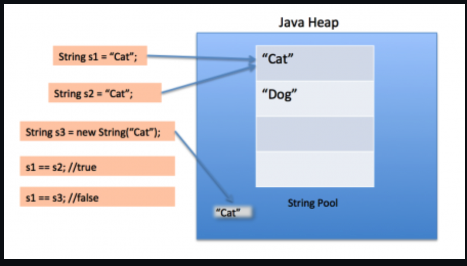

# Java源码与JVM

## Java基础

### ~~1、Java语言特点~~

1. ~~简单易学；~~
2. ~~面向对象（封装，继承，多态）；~~
3. ~~平台无关性（ Java 虚拟机实现平台无关性）；~~
4. ~~可靠性；~~
5. ~~安全性；~~
6. ~~支持多线程（ C++ 语言没有内置的多线程机制，因此必须调用操作系统的多线程功能来进行多线程程序设计，而 Java 语言却提供了多线程支持。注：C++11引入了多线程库）；~~
7. ~~支持网络编程并且很方便（ Java 语言诞生本身就是为简化网络编程设计的，因此 Java 语言不仅支持网络编程而且很方便）；~~
8. 编译与解释并存；


### 2、JVM、JDK和JRE

#### JVM

~~Java 虚拟机（JVM）是运行 Java 字节码的虚拟机。JVM 有针对不同系统的特定实现，目的是使用相同的字节码，它们都会给出相同的结果。字节码和不同系统的 JVM 实现是 Java 语言“一次编译，随处可以运行”的关键所在。~~

#### 补充：什么是字节码?采用字节码的好处是什么?

在 Java 中，JVM 可以理解的代码就叫做`字节码`（即扩展名为 `.class` 的文件），它不面向任何特定的处理器，只面向虚拟机。Java 语言通过字节码的方式，在一定程度上解决了传统解释型语言执行效率低的问题，同时又保留了解释型语言可移植的特点。所以 Java 程序运行时比较高效，而且，由于字节码并不针对一种特定的机器，因此，Java 程序无须重新编译便可在多种不同操作系统的计算机上运行。

**Java 程序从源代码到运行一般有下面 3 步：**


我们需要格外注意的是 .class->机器码 这一步。在这一步 JVM 类加载器首先加载字节码文件，然后**通过解释器逐行解释执行**，这种方式的执行速度会相对比较慢。而且，有些方法和代码块是经常需要被调用的(也就是所谓的**热点代码**)，所以后面引进了 JIT 编译器，而 **JIT 属于运行时编译**。当 JIT 编译器完成第一次编译后，其会将字节码对应的机器码保存下来，下次可以直接使用。而我们知道，机器码的运行效率肯定是高于 Java 解释器的。这也解释了我们为什么经常会说 Java 是**编译与解释共存**的语言。

~~HotSpot 采用了惰性评估(Lazy Evaluation)的做法，根据二八定律，消耗大部分系统资源的只有那一小部分的代码（热点代码），而这也就是 JIT 所需要编译的部分。JVM 会根据代码每次被执行的情况收集信息并相应地做出一些优化，因此执行的次数越多，它的速度就越快。JDK 9 引入了一种新的编译模式 AOT(Ahead of Time Compilation)，它是直接将字节码编译成机器码，这样就避免了 JIT 预热等各方面的开销。JDK 支持分层编译和 AOT 协作使用。但是 ，AOT 编译器的编译质量是肯定比不上 JIT 编译器的。~~

#### JDK

JDK 是 Java Development Kit 缩写，它是功能齐全的 Java SDK。它拥有 JRE 所拥有的一切，还有编译器（javac）和工具（如 javadoc 和 jdb）。它能够创建和编译程序。

#### JRE

JRE （Java Runtime Environment）是 Java 运行时环境。它是运行已编译 Java 程序所需的所有内容的集合，包括 Java 虚拟机（JVM），Java 类库，java 命令和其他的一些基础构件。但是，它不能用于创建新程序。


### 3、~~Oracle JDK和OpenJDK的对比~~

对于 Java 7，没什么关键的地方。OpenJDK 项目主要基于 Sun 捐赠的 HotSpot 源代码。此外，OpenJDK 被选为 Java 7 的参考实现，由 Oracle 工程师维护。

问：OpenJDK 存储库中的源代码与用于构建 Oracle JDK 的代码之间有什么区别？

非常接近 - 我们的 Oracle JDK 版本构建过程基于 OpenJDK 7 构建，只添加了几个部分，例如部署代码，~~其中包括 Oracle 的 Java 插件和 Java WebStart 的实现，以及一些封闭的源代码派对组件，如图形光栅化器，一些开源的第三方组件，如 Rhino，以及一些零碎的东西，如附加文档或第三方字体。展望未来，我们的目的是开源 Oracle JDK 的所有部分，除了我们考虑商业功能的部分。~~

1. OpenJDK 是一个参考模型并且是完全开源的，而 Oracle JDK 是 OpenJDK 的一个实现，并不是完全开源的；
2. Oracle JDK 比 OpenJDK 更稳定。OpenJDK 和 Oracle JDK 的代码几乎相同，但 Oracle JDK 有更多的类和一些错误修复。因此，如果想开发企业/商业软件，建议选择 Oracle JDK，因为它经过了彻底的测试且稳定。某些情况下，有些人提到在使用 OpenJDK 可能会遇到了许多应用程序崩溃的问题，但是，只需切换到 Oracle JDK 就可以解决问题；
3. 在响应性和 JVM 性能方面，Oracle JDK 与 OpenJDK 相比提供了更好的性能；
4. Oracle JDK 不会为即将发布的版本提供长期支持，用户每次都必须通过更新到最新版本获得支持；
5. Oracle JDK 根据二进制代码许可协议获得许可，而 OpenJDK 根据 GPL v2 许可获得许可。


### 4、~~Java和C++的区别？~~

* 都是面向对象的语言，都支持封装、继承和多态
* Java 不提供指针来直接访问内存，程序内存更加安全
* Java 的类是单继承的，C++ 支持多重继承；虽然 Java 的类不可以多继承，但是接口可以多继承。
* Java 有自动内存管理垃圾回收机制(GC)，不需要程序员手动释放无用内存


### 5、~~import java 和 import javax有什么区别？~~

~~刚开始的时候 JavaAPI 所必需的包是 java 开头的包，javax 当时只是扩展 API 包来使用。然而随着时间的推移，javax 逐渐地扩展成为 Java API 的组成部分。但是，将扩展从 javax 包移动到 java 包确实太麻烦了，最终会破坏一堆现有的代码。因此，最终决定 javax 包将成为标准 API 的一部分。~~

~~所以，实际上 java 和 javax 没有区别。这都是一个名字。~~


### 6、为什么说 Java 语言“编译与解释并存”？

高级编程语言按照程序的执行方式分为**编译型**和**解释型**两种。简单来说，编译型语言是指编译器针对特定的操作系统将源代码一次性翻译成可被该平台执行的机器码；解释型语言是指解释器对源程序逐行解释成特定平台的机器码并立即执行。

Java 语言既具有编译型语言的特征，也具有解释型语言的特征，因为 Java 程序要经过先编译，后解释两个步骤，由 Java 编写的程序需要先经过编译步骤，生成字节码（*.class 文件），这种字节码必须由 Java 解释器来解释执行。因此，我们可以认为 Java 语言编译与解释并存。


### 7、字符型常量和字符串常量的区别？


## 文件与I/O流

### 1、Java中IO流分为几种？

*   按照**流的方向**划分，分为**输入流**和**输出流**
*   按照**操作单元**划分，分为**字节流**和**字符流**
*   按照**流的角色**划分，分为**节点流**和**处理流**

Java IO 流共涉及 40 多个类，这些类看上去很杂乱，但实际上很有规则，而且彼此之间存在非常紧密的联系， Java I0 流的 40 多个类都是从4 个抽象类基类中派生出来的。这4个抽象类基类是：

*   InputStream/Reader: 所有的输入流的基类，前者是字节输入流，后者是字符输入流。
*   OutputStream/Writer: 所有输出流的基类，前者是字节输出流，后者是字符输出流。

按操作方式分类结构图：


按操作对象分类结构图：


#### 补充：既然有了字节流，为什么还要有字符流

问题本质：**不管是文件读写还是网络发送接收，信息的最小存储单元都是字节，那为什么 I/O 流操作要分为字节流操作和字符流操作呢？**

字符流是由 Java 虚拟机将字节转换得到的，问题就出在这个过程还算是非常**耗时**，并且，如果我们不知道编码类型就很容易出现**乱码**问题。所以， I/O 流就干脆提供了一个直接操作字符的接口，方便我们平时对字符进行流操作。如果音频文件、图片等媒体文件用字节流比较好，如果涉及到字符的话使用字符流比较好。


### 2、同步和异步的区别

*   同步：发送一个请求，等待返回，再发送下一个请求，同步可以避免出现死锁，脏读的发生。
*   异步：发送一个请求，不等待返回，随时可以再发送下一个请求，可以提高效率，保证并发。


### 3、 阻塞和非阻塞

*   阻塞：传统的IO流都是阻塞式的。也就是说，当一个线程调用read()或者write()方法时，该线程将被阻塞，直到有一些数据读取或者被写入，在此期间，该线程不能执行其他任何任务。在完成网络通信进行IO操作时，由于线程会阻塞，所以服务器端必须为每个客户端都提供一个独立的线程进行处理，当服务器端需要处理大量的客户端时，性能急剧下降。
*   非阻塞：当线程从某通道进行读写数据时，若没有数据可用时，该线程会去执行其他任务。线程通常将非阻塞IO的空闲时间用在其他通道上执行IO操作，所以单独的线程可以管理多个输入和输出通道。Java NIO是非阻塞式的，因此NIO可以让服务器端使用一个或有限几个线程来同时处理连接到服务器端的所有客户端。


### 4、IO和NIO的区别

首先说下核心区别：NIO是以**块**的方式处理数据，但是IO是以最基础的**字节流**的形式写入和读出的。所以在效率上的话，肯定是NIO效率比IO效率会高出很多。

其次就是说，NIO不再是和IO一样用OutputStream和InputStream输入输出流的形式来处理数据的，而是采用了**通道**和**缓冲区**的形式来进行数据处理的。

还有一点是NIO的通道是可以双向的，但是IO中的流只能是单向的。

~~NIO的缓冲区（其实就是一个**字节数组**），还可以进行**分片**，可以建立只读缓冲区、直接缓冲区和间接缓冲区，只读缓冲区很明显就是字面意思，直接缓冲区是为了加快I/O的速度，而以一种特殊的方式分配其内存的缓冲区。~~

补充一点：NIO比传统的BIO核心区别就是，NIO采用的是多路复用的IO模型，普通的IO用的是阻塞的IO模型，两个之间的效率肯定是多路复用效率更高


#### 补充：通道和缓冲区的概念

*   通道（Channel）：通道就是对原I/O包中的流的模拟。到任何目的地（或来自任何地方）的所有数据都必须通过一个Channel对象，也就是通道。发送给一个通道的所有对象都必须首先放到缓冲区中；同样的，从通道中读取的任何数据都要读到缓冲区中。通道和流的不同之处在于**通道是双向的**，流只是在一个方向移动，而且**通道可以用于读、写或者同时读写**。所有数据都通过Buffer对象来处理。也就是说，我永远不会将字节直接写入通道中，而是将数据写入包含一个或者多个字节的缓冲区。同样，我也不会直接从通道中读取字节，而是将数据从通道读取缓冲区，再从缓冲区获取这个字节。
    *   通道的类型：FileChannel（是从文件中读取数据）、DatagramChannel（从UDP网络中读取或者写入数据）、SocketChannel（从TCP网络中读取或者写入数据）、ServerSocketChannel（允许你监听来自TCP的连接，就像服务器一样。每一个连接都会有一个SocketChannel产生）
*   缓冲区（Buffer）：Buffer 是一个对象， 它包含一些要写入或者刚读出的数据。在面向流的 I/O 中，我将数据直接写入或者将数据直接读到 Stream 对象中。而在 NIO 库中，所有数据都是由缓冲区处理的。在读取数据时，它是直接读到缓冲区中的。在写入数据时，它是写入到缓冲区中的。任何时候访问 NIO 中的数据，我都是将它放到缓冲区中。缓冲区实质上是一个数组。通常它是一个**字节数组**，但是也可以使用其他种类的数组。**但是一个缓冲区不仅仅是一个数组。缓冲区提供了对数据的结构化访问，而且还可以跟踪系统的读/写进程**。
    *   缓冲区的类型：ByteBuffer、CharBuffer、ShortBuffer、IntBuffer、LongBuffer、FloatBuffer、DoubleBuffer


#### 补充：多路复用器Selector


### 5、BIO、NIO、AIO有什么区别

*   **BIO (Blocking I/O)**：**同步阻塞 I/O 模式**，数据的读取写入必须阻塞在一个线程内等待其完成。在活动连接数不是特别高（小于单机 1000）的情况下，这种模型是比较不错的，可以让每一个连接专注于自己的 I/O 并且编程模型简单，也不用过多考虑系统的过载、限流等问题。线程池本身就是一个天然的漏斗，可以缓冲一些系统处理不了的连接或请求。但是，当面对十万甚至百万级连接的时候，传统的 BIO 模型是无能为力的。因此，我们需要一种更高效的 I/O 处理模型来应对更高的并发量。（BIO方式适用于连接数目比较小且固定的框架，这种方式对服务器资源要求比较高，并发局限于应用中。）
*   **NIO (Non-blocking/New I/O)**：NIO 是一种**同步非阻塞**的 I/O 模型，在 Java 1.4 中引入了 NIO 框架，对应 java.nio 包，提供了 Channel , Selector，Buffer 等抽象。NIO 中的 N 可以理解为 Non-blocking，不单纯是 New。它支持面向缓冲的，基于通道的 I/O 操作方法。 ~~NIO 提供了与传统 BIO 模型中的 `Socket` 和 `ServerSocket` 相对应的 `SocketChannel` 和 `ServerSocketChannel` 两种不同的套接字通道实现，两种通道都支持阻塞和非阻塞两种模式。~~阻塞模式使用就像传统中的支持一样，比较简单，但是性能和可靠性都不好；非阻塞模式正好与之相反。对于低负载、低并发的应用程序，可以使用同步阻塞 I/O 来提升开发速率和更好的维护性；对于高负载、高并发的（网络）应用，应使用 NIO 的非阻塞模式来开发。（NIO方式适用于连接数目多且连接比较短（轻操作）的架构，比如聊天服务器，并发局限于应用中，编程比较复杂。）
*   **AIO (Asynchronous I/O)**：AIO 也就是 NIO 2。在 Java 7 中引入了 NIO 的改进版 NIO 2，它是**异步非阻塞的 IO 模型**。异步 IO 是基于事件和回调机制实现的，也就是应用操作之后会直接返回，不会堵塞在那里，当后台处理完成，操作系统会通知相应的线程进行后续的操作。虽然 NIO 在网络操作中，提供了非阻塞的方法，但是 NIO 的 IO 行为还是同步的。对于 NIO 来说，我们的业务线程是在 IO 操作准备好时，得到通知，接着就由这个线程自行进行 IO 操作，IO 操作本身是同步的。（AIO方式适用于连接数目多且连接比较长（重操作）的架构，比如相册服务器，充分调用OS参与并发操作，编程比较复杂。）


#### 补充：异步非阻塞与同步非阻塞的区别在哪里？

异步非阻塞无需一个线程去轮询所有IO操作的状态改变，在相应的状态改变后，系统会通知对应的线程来处理。


## Hash

### 1、HashMap


#### 为何负载因子默认为0.75？

通过源码里的javadoc注释看到，元素在哈希表中分布的桶频率服从参数为0.5的泊松分布。默认负载因子（0.75）在时间和空间成本之间提供了一个很好的折衷方案。较高的值会减少空间开销，但会增加查找成本（在HashMap类的大多数操作中都得到体现，包括get和put）。设置其初始容量时，应考虑映射中的预期条目数及其负载因子，以最大程度地减少重新哈希操作的次数。如果初始容量大于最大条目数除以负载因子，则将不会进行任何重新哈希操作。


#### 为何数组容量必须是2的n次幂？/在寻找元素索引的时候，为什么要将length - 1再与h与（&）呢（h & (length - 1)）？

1.  使元素分布的更加均匀
2.  在扩容的时候，能保证新数组的索引和老数组的索引一致，减少时间消耗。

因为数组的长度时2的n次方，用它减1操作才能得到二进制全为1的值（低为全为1），这样用它和hashcode值进行按位与（&）运算能够快速得到桶的下标，并且还是分布均匀的。否则如果出现0的话，任何值和0按位与都是0，这样有些桶将会永远是空着的。

比如16的二进制表示为 10000，那么length-1就是15，二进制为01111，同理扩容后的数组长度为32，二进制表示为100000，length-1为31，二进制表示为011111。这样会保证低位全为1，而扩容后只有一位差异，也就是多出了最左位的1，这样在通过 h&(length-1)的时候，只要h对应的最左边的那一个差异位为0，就能保证得到的新的数组索引和老数组索引一致(大大减少了之前已经散列良好的老数组的数据位置重新调换)。


还有，数组长度保持2的次幂，length-1的低位都为1，会使得获得的数组索引index更加均匀


我们看到，上面的&运算，高位是不会对结果产生影响的（hash函数采用各种位运算可能也是为了使得低位更加散列），我们只关注低位bit，如果低位全部为1，那么对于h低位部分来说，任何一位的变化都会对结果产生影响，也就是说，要得到index=21这个存储位置，h的低位只有这一种组合。这也是数组长度设计为必须为2的次幂的原因。


如果不是2的次幂，也就是低位不是全为1此时，要使得index=21，h的低位部分不再具有唯一性了，哈希冲突的几率会变的更大，同时，index对应的这个bit位无论如何不会等于1了，而对应的那些数组位置也就被白白浪费了。


#### 为什么对hashcode还要做一次hash操作呢？

因为如果不做hash操作的话，只有低位的值参与了hash的运算，而高位的值没有参加运算。hash方法是让高位的数字也参加hash运算。

假如：数组的长度是16 我们会发现hashcode为5和53的散列到同一个位置. 

hashcode: 53 00000000 00000000 00000000 00110101 

hashcode: 5  00000000 00000000 00000000 00000101

length-1: 15   00000000 00000000 00000000 00001111 

只要hashcode值的最后4位是一样的，那么他们就会散列到同一个位置。 

hash方法是通过一些位运算符，让高位的数值也尽可能的参加到运算中，让它尽可能的散列到table数组上，减少hash冲突。


#### 重写equals方法需同时重写hashCode方法

尽管我们在进行get和put操作的时候，使用的key从逻辑上讲是等值的（通过equals比较是相等的），但由于没有重写hashCode方法，所以put操作时，key(hashcode1)–>hash–>indexFor–>最终索引位置 ，而通过key取出value的时候 key(hashcode2)–>hash–>indexFor–>最终索引位置，由于hashcode1不等于hashcode2，导致没有定位到同一个数组位置而返回逻辑上错误的值null（也有可能碰巧定位到一个数组位置，但是也会判断其entry的hash值是否相等，上面get方法中有提到。）

所以，在重写equals的方法的时候，必须注意重写hashCode方法，同时还要保证通过equals判断相等的两个对象，调用hashCode方法要返回同样的整数值。而如果equals判断不相等的两个对象，其hashCode可以相同（只不过会发生哈希冲突，应尽量避免）。


#### JDK1.8中HashMap的性能优化

**假如一个数组槽位上链上数据过多（即拉链过长的情况）导致性能下降该怎么办？**

JDK1.8在JDK1.7的基础上针对增加了红黑树来进行优化。即当链表超过8时，链表就转换为红黑树，利用红黑树快速增删改查的特点提高HashMap的性能，其中会用到红黑树的插入、删除、查找等算法。

**注意：**

*   HashMap在jdk1.7中采用**表头插入法**，在扩容时会**改变**链表中元素原本的顺序，以至于在并发场景下导致链表成环的问题。
*   在jdk1.8中采用的是**尾部插入法**，在扩容时会保持链表元素原本的顺序，就不会出现链表成环的问题了。


### 2、HashMap和CurrentHashMap 哪个是线程安全的，详细展开

HashMap不是线程安全的，CurrentHashMap是线程安全的。

*   HashMap

    *   **哈希碰撞会导致hashmap的线程不安全**。现在假设A线程和B线程同时对同一个数组位置（即相同哈希码位置）调用addEntry，且该位置还没有其他的数据。假设一种情况，线程A通过if判断，该位置没有哈希冲突，进入了if语句，还没有进行数据插入，这时候CPU就把资源让给了线程B，线程A停在了if语句里面，线程B判断该位置也没有哈希冲突（线程A的数据还没有插入），也进入了if语句，线程B执行完后，轮到线程A执行，现在线程A直接在该位置插入而不用再判断。这时候，就会发现线程A把线程B插入的数据给覆盖了。发生了线程不安全的情况。本来在HashMap中，发生哈希冲突时可以用链表法或者红黑树来解决的，但是在多线程中，可能就直接给覆盖了。
    *   还有两处可能不安全：**在扩容的时候插入数据，有可能会把新插入的覆盖住；在扩容的时候删除数据，会删除不了**。如果我在扩容的时候，在数据从旧数组复制到新数组过程中，这时候某个线程插入一条数据，这时候是插入到新数组中，但是在数据复制过程中，HashMap是不会检查新数组上的位置是否为空的，所以新插入的数据会被后面从旧数组中复制过来的数据覆盖住。还有如果在数组刚新建完后，某个线程就立刻想删除以前插入的某个元素，你就会发现删除不了，因为table指向了新数组，而这时候新数组还没有数据。

    （解决方案：加同步锁。要注意用读写锁，即：多个线程可以同时读，但只有一个线程可同时写。不然数据量大的时候也会影响性能。）

*   CurrentHashMap

    *   在说ConcurrentHashMap之前，要先提到一个HashTable的数据结构。之前也说了，HashMap是一个非线程安全的数据结构，而HashTable则解决了这个问题，它是一个线程安全的数据结构，它采用和HashMap相同的存储机制，只不过内部的方法都是经过**synchronized**的修饰。但是因为同步和哈希的原因，HashTable的性能远不及HashMap。所以为了进一步的改进，就弄了一个ConcurrentHashMap的数据结构。ConcurrentHashMap也是线程安全的。**在HashTable中，synchronized关键字其实是对整个对象进行加锁**，当HashTable的大小增加到一定时，性能会急剧下降。而ConcurrentHashMap引入了**分割（Segment）**，然后在每一个分段上都用**lock锁**进行保护，相对HashTable的synchronized同步锁锁住整个对象而言，ConcurrentHashMap的锁的粒度更精细些，并发性能更好，实现了**锁分离技术**和**锁分段技术**。
    *   还有一个就是说HashMap的键值对允许有null，但是ConcurrentHashMap都不允许。
    *   ConcurrentHashMap通过把整个Map分为N个Segment，可以保证线程安全。**读操作不加锁，由于HashEntry的value变量是volatile的，也能保证读取到最新的值**。
    *   但是有些地方需要跨段，比如size()和containsValue()，它们可能需要锁定整个表而不仅仅是某个段，这需要**按顺序**锁定所有段，操作完毕后，又按顺序释放所有段的锁。
    *   ConcurrentHashMap的扩容：**段内扩容**（段内元素超过该段对应的Entry数组长度的75%触发扩容，不会对整个Map进行扩容），插入前检测需不需要扩容，有效避免无效扩容。


#### 补充：HashMap和HashTable的对比

HashTable和HashMap采用相同的存储机制，二者的实现基本一致，不同的是：

1.  HashMap是非线程安全的，HashTable是线程安全的，内部的方法基本都经过synchronized的修饰。
2.  因为同步、哈希性能等原因，性能肯定是HashMap更佳。
3.  HashMap允许有null值的存在，而在HashTable中put进的键值只要有一个null，直接抛出NullPointerException。即HashTable的键值对不允许有null值。
4.  HashMap默认初始化数组的大小为16，HashTable为11。前者扩容时乘2，使用位运算取得哈希，效率高于取模。而后者为乘2加1，都是素数和奇数，这样取模哈希结果更均匀。

两者的hash算法比较：

```java
//HashMap的散列函数，这里传入参数为键值对的key
static final int hash(Object key) {
    int h;
    return (key == null) ? 0 : (h = key.hashCode()) ^ (h >>> 16);
}
//返回hash值的索引，h & (length-1)操作等价于 hash % length操作， 但&操作性能更优
static int indexFor(int h, int length) {
    // length must be a non-zero power of 2
    return h & (length-1);
}

//HashTable的散列函数直接在put方法里实现了
int hash = key.hashCode();
int index = (hash & 0x7FFFFFFF) % tab.length;
```


#### 补充：HashTable和ConcurrentHashMap的对比

CurrentHashMap也是线程安全的。HashTable里面使用的是synchronized关键字，其实是对整个对象加锁，当HashTable的大小增加到一定的时候，性能会急剧下降。ConcurrentHashMap算得上是对上述问题的优化。

ConcurrentHashMap引入了分割（Segment），把一个大的Map拆分成N个小的HashTable，在put方法中，会根据hash(paramK.hashCode())来决定具体存放进哪个Segment，如果查看Segment的put操作，我们会发现内部使用的同步机制是基于lock操作的，这样就可以对Map的一部分（Segment）进行上锁，这样影响的只是将要放入同一个Segment的元素的put操作，保证同步的时候，锁住的不是整个Map（HashTable就是这么做的），相对于HashTable提高了多线程环境下的性能。

**ConcurrentHashMap的put和get** ：

```java
1. int hash = hash(key.hashCode());  
2. return segmentFor(hash).get(key, hash);
```

可以发现ConcurrentHashMap通过一次hash，两次定位来找到具体的值的。 先通过segmentFor方法定位到具体的Segment，再在Segment内部定位到具体的HashEntry，而第二次在Segment内部定位的时候是加锁的。 

ConcurrentHashMap的hash算法比HashMap的hash算法更复杂，应该是想让他能够更好的散列到数组上，减少hash冲突。


#### HashMap和Segment里modCount的区别

modCount都是记录table结构被修改的次数，但是对这个次数的处理上，HashMap和Segment是不一样的。 

HashMap在遍历数据的时候，会判断modCount是否被修改了，如果被修改的话会抛出ConcurrentModificationException异常。 

Segment的modCount在ConcurrentHashMap的containsValue、isEmpty、size方法中用到，ConcurrentHashMap先在不加锁的情况下去做这些计算，如果发现有Segment的modCount被修改了，会再重新获取锁计算。


### 3、HashMap和TreeMap的区别

1.  先看HashMap的定义：`public class HashMap<K,V> extends AbstractMap<K,V> implements Map<K,V>, Cloneable, Serializable`

    再看TreeMap的定义：`public class TreeMap<K,V> extends AbstractMap<K,V> implements NavigableMap<K,V>, Cloneable, java.io.Serializable`

    从类的定义来看，HashMap和TreeMap都继承自AbstractMap，不同的是HashMap实现的是Map接口，而TreeMap实现的是NavigableMap接口。**NavigableMap是SortedMap的一种，实现了对Map中key的排序**。即TreeMap是排序的而HashMap不是。

2.  HashMap的底层结构是Node的数组： `transient Node<K,V>[] table`

    TreeMap和HashMap不同的是，TreeMap的底层是一个Entry： `private transient Entry<K,V> root`。它的实现是一个红黑树，方便用来遍历和搜索。

    TreeMap的构造函数可以传入一个Comparator，实现自定义的比较方法。`public TreeMap(Comparator<? super K> comparator) { this.comparator = comparator; }`

    如果不提供自定义的比较方法，则使用的是key的natural order，即自然顺序。

*   排序区别：TreeMap输出的结果是排好序的，而HashMap的输出结果是不定的。
*   NULL值的区别：HashMap可以允许一个null key和多个null value。而TreeMap不允许null key，但是可以允许多个null value。
*   性能区别：HashMap的底层是Array，所以HashMap在添加，查找，删除等方法上面速度会非常快。而**TreeMap的底层是一个Tree结构**，所以速度会比较慢。另外HashMap因为要保存一个Array，所以会造成空间的浪费，而TreeMap只保存要保持的节点，所以占用的空间比较小。HashMap如果出现hash冲突的话，效率会变差，不过在java 8进行TreeNode转换之后，效率有很大的提升。TreeMap在添加和删除节点的时候会进行重排序，会对性能有所影响。
*   两者都不允许duplicate key,两者都不是线程安全的


## JVM

### 1、GC是是什么/为什么要有GC

**简述Java垃圾回收机制**：

首先，垃圾是指内存中已经不再被使用的空间。

在Java中，程序员是不需要显示的去释放一个对象的内存的，而是由虚拟机自行执行。在JVM中，有一个垃圾回收线程，它是低优先级的，在正常情况下是不会执行的，只有在虚拟机空闲或者当前堆内存不足时，才会触发执行，清扫那些没有被任何引用的对象，并将它们添加到要回收的集合中，进行回收。

**GC是什么？为什么要GC**：

GC，即Garbage Collection--垃圾收集。内存处理是我们容易出现问题的地方，忘记或者错误的内存回收会导致程序或系统的不稳定甚至崩溃，Java提供的GC功能可以自动监测对象是否超过作用域从而达到自动回收内存的目的，Java语言没有提供释放已分配内存的显示操作方法。我们不用担心内存管理，因为垃圾收集器会自动进行管理。~~要请求垃圾收集，可以调用下面的方法：System.gc() 或Runtime.getRuntime().gc() ，但JVM可以屏蔽掉显示的垃圾回收调用。~~垃圾回收可以有效的防止内存泄露，有效的使用可以使用的内存。垃圾回收器通常是作为一个单独的低优先级的线程运行，不可预知的情况下对内存堆中已经死亡的或者长时间没有使用的对象进行清除和回收，我们不能实时的调用垃圾回收器对某个对象或所有对象进行垃圾回收。

JVM中程序计数器、虚拟机栈、本地方法栈3个区域随线程而生随线程而灭。栈帧随着方法的进入和退出做入栈和出栈操作，实现了自动的内存清理。它们的内存分配和回收都具有确定性。因此，GC垃圾回收主要集中在**堆和方法区**，在程序运行期间，这部分内存的分配和使用都是**动态**的。


#### 补充：GC用到了哪些算法？分别应用到什么地方？

常见的回收算法有**标记清除算法、复制算法、标记整理算法、分代搜集算法**

##### **标记-清除算法：**

分为两个阶段。

第一阶段（标记）：从引用根节点开始标记所有被引用的对象

第二阶段（清除）：遍历整个堆，把未被标记的对象清除。

主要缺点：一个是效率问题，标记和清除的过程效率都不高；另外就是空间问题，标记清除之后会产生大量不连续的内存碎片，空间碎片太多可能会导致，当需要分配较大对象时无法找到足够的连续内存而不得不提前触发另一次垃圾收集动作。

##### **复制算法：**

将可用内存按容量划分为大小相等的两块，每次只使用其中的一块。当一块内存用完了，就将还存活着的对象复制到另外一块上，然后清理掉前一块。

每次对半区内存回收、分配时就不用考虑内存碎片等复杂情况，只要移动堆顶指针，按顺序分配内存即可，实现简单，运行高效。

缺点：将内存缩小为一半，性价比低，持续复制长生存期的对象则导致效率低下。

JVM堆中**新生代便采用复制算法**。堆分配结构图。


*   ~~Eden（伊甸园）：这是对象最初诞生的区域，并且对大多数对象来说，这里是它们唯一存在过的区域。~~
*   ~~Survivor（幸存者乐园）：从Eden幸存下来的对象会被挪到这里。~~
*   ~~Tenured（老年代）：这是足够老的幸存对象的归宿。年轻代收集（Minor-GC）过程是不会触及这个地方的。当年轻代收集不能把对象放进老年代时，就会触发一次完全收集（Major-GC），这里可能还会牵扯到压缩，以便为大对象腾出足够的空间。~~

在GC回收过程中，当Eden区满时，还存活的对象会被复制到其中一个Survivor区；当回收时，会将Eden和使用的Survivor区还存活的对象，复制到另外一个Survivor区，然后对Eden和用过的Survivor区进行清理。

如果另外一个Survivor区没有足够的内存存储时，则会进入老年代。

这里针对哪些对象会进入老年代有这样的机制：对象每经历一次复制，年龄加1，达到晋升年龄阈值后，转移到老年代。

在这整个过程中，由于Eden中的对象属于像浮萍一样“瞬生瞬灭”的对象，所以并不需要1：1的比例来分配内存，而是采用了8：1：1的比例来分配。

而针对那些像“水熊虫”一样，历经多次清理依旧存活的对象，则会进入老年代，而老年的清理算法则采用下面要讲到的“标记整理算法”。

##### **标记-整理算法**：

标记过程与“标记-清除”算法一样，但后续步骤不是直接对可回收对象进行清理，而是让所有存活的对象都向一端移动，然后直接清理掉端边界以外的内存。

这种算法不既不用浪费50%的内存，也解决了复制算法在对象存活率较高时的效率低下问题。

##### **分代搜集算法：**

将Java的堆内存逻辑上分成两块，新生代和老年代，针对不同存活周期、不同大小的对象采取不同的垃圾回收策略。

在**新生代**中大多数对象都是瞬间对象，只有少量对象存活，复制较少对象即可完成清理，因此采用**复制算法**。而针对**老年代**中的对象，存活率较高，又没有额外的担保内存，因此采用**标记整理**算法。


#### 补充：Java会存在内存泄漏吗？

**内存泄漏是指不再被使用的对象或者变量一直被占据在内存中**。理论上来说，Java是有GC垃圾回收机制的，也就是说，不再被使用的对象，会被GC自动回收掉，自动从内存中清除。

但是，即使这样，Java也还是存在着内存泄漏的情况，**长生命周期的对象持有短生命周期对象的引用就很可能发生内存泄露，尽管短生命周期对象已经不再需要，但是因为长生命周期对象持有它的引用而导致不能被回收**，这就是java中内存泄露的发生场景。


#### 补充：垃圾回收的基本原理是什么？垃圾回收器可以马上回收内存吗？有什么办法主动通知虚拟机进行垃圾回收？

对于GC来说，当程序员创建对象时，GC就开始监控这个对象的地址、大小以及使用情况。

通常，GC采用有向图的方式记录和管理堆中的所有对象。通过这种方式确定哪些对象是“可达的”，哪些对象是“不可达的”。当GC确定一些对象为“不可达”时，GC就有责任回收这些内存空间。

可以调用下面的方法：System.gc() 或Runtime.getRuntime().gc()，来请求垃圾收集，但JVM可以屏蔽掉显示的垃圾回收调用，并不保证GC一定会执行。


#### 补充：Java中都有哪些引用类型？

传统的引用定义（JDK1.2版本之前）：如果reference类型的数据中存储的数值代表的是**另外一块内存的起始地址**，就称该reference数据是代表某块内存、某个对象的引用。JDK1.2版本后，对引用的概念进行了扩充，将引用分为强引用、软引用、弱引用和虚引用。

* 强引用：是最传统的“引用”的定义，是指在程序代码之中普遍存在的引用赋值，即类似“Object obj = new Object()”这种引用关系。无论任何情况下，只要强引用关系还存在，垃圾收集器就永远不会回收掉被引用的对象。
* 软引用：用来描述一些还有用，但非必须的对象。只被软引用关联着的对象，在系统将要发生内存溢出异常前，会把这些对象列进回收范围之中进行第二次回收，如果这次回收还没有足够的内存，才会抛出内存溢出异常。
* 弱引用：也是用来描述那些非必须的对象，但是它的强度比软引用更弱一些，被弱引用关联的对象只能生存到下一次垃圾收集发生为止。当垃圾收集器开始工作，无论当前内存是否足够，都会回收掉只被弱引用关联的对象。
* 虚引用（幽灵引用/幻影引用）：是最弱的一种引用关系。一个对象是否有虚引用的存在，完全不会对其生存时间构成影响，也无法通过虚引用来取得一个对象实例。为一个对象设置虚引用关联的唯一目的只是为了能在这个对象被收集器回收时收到一个系统通知。


### 2、java对象什么时候会被垃圾回收器判定为可回收/如何判断对象可以回收

判断对象是否存活一般有两种方式：

1.  引用计数方法：每个对象有一个引用计数属性，新增一个引用时计数加1，引用释放时计数减1，计数为0时可以回收。此方法简单，但无法解决对象相互循环引用的问题。
2.  可达性分析方法：此方法为解决引用计数方法的循环引用的问题。这里面需要引入一个概念--GC Roots，或者说是Tracing GC，这是一组“根集合”，也是一组引用集合，这个“根集合”就是一组必须活跃的引用。可达性分析方法的基本思路是，**通过一系列名为”GCRoots”的对象作为起始点，从这个被称为GC Roots的对象开始向下搜索，如果一个对象到GCRoots没有任何引用链相连时，则说明此对象不可用。**也即给定一个集合的引用作为根出发，通过引用关系遍历对象图，能被遍历到的（可到达的）对象就被判定为存活，没有被遍历到的就自然被判定为死亡。


#### 补充：Java中可以作为GC Roots的对象

1.  在虚拟机栈（栈帧中的本地变量表）中引用的对象，譬如各个线程被调用的方法堆栈中使用到的参数、局部变量、临时变量等。
2.  在方法区中类静态属性引用的对象，譬如Java类的引用类型静态变量。
3.  在方法区中常量引用的对象，譬如字符串常量池里的引用。
4.  在本地方法栈中JNI（即Native方法）引用的对象。
5.  Java虚拟机内部的引用，如基本数据类型对应的Class对象，一些常驻的异常对象（比如NullPointException、OutOfMemoryError）等，还有系统类加载器。
6.  所有被同步锁（synchronized关键字）持有的对象。
7.  反应Java虚拟机内部情况的JMXBean、JVMTI中注册的回调、本地代码缓存等。


#### ~~补充：JVM中的永久代中会发生垃圾回收吗~~

~~垃圾回收不会发生在永久代，如果永久代满了或者是超过了临界值，会触发完全垃圾回收(Full GC)。如果仔细查看垃圾收集器的输出信息，就会发现**永久代也是被回收的**。这就是为什么正确的永久代大小对避免Full GC是非常重要的原因。~~

~~注：Java8中已经移除了永久代，新加了一个叫做元数据区的native内存区~~


#### 补充：内存分配策略

简述Java内存分配与回收策略以及Minor GC和Major GC

所谓自动内存管理，最终要解决的也就是**内存分配**和**内存回收**两个问题。

对象的内存分配通常是在 Java 堆上分配（随着虚拟机优化技术的诞生，某些场景下也会在栈上分配，后面会详细介绍），对象主要分配在新生代的 Eden 区，如果启动了本地线程缓冲，将按照线程优先在 TLAB 上分配。少数情况下也会直接在老年代上分配。总的来说分配规则不是百分百固定的，其细节取决于哪一种垃圾收集器组合以及虚拟机相关参数有关，但是虚拟机对于内存的分配还是会遵循以下几种「普世」规则：

**对象优先在Eden区分配**

多数情况，对象都在新生代 Eden 区分配。当 Eden 区分配没有足够的空间进行分配时，虚拟机将会发起一次 Minor GC。如果本次 GC 后还是没有足够的空间，则将启用分配担保机制在老年代中分配内存。

* **Minor GC** 是指发生在新生代的 GC，因为 Java 对象大多都是朝生夕死，所有 Minor GC 非常频繁，一般回收速度也非常快。
* **Major GC** 是指发生在老年代的 GC，出现了 Major GC 通常会伴随至少一次 Minor GC。Major GC 的速度通常会比 Minor GC 慢 10 倍以上。
* **Full GC**：收集整个Java堆和方法区的垃圾收集。

**大对象直接进入老年代**

所谓大对象是指需要大量连续内存空间的对象，频繁出现大对象是致命的，会导致在内存还有不少空间的情况下提前触发 GC 以获取足够的连续空间来安置新对象。

前面我们介绍过新生代使用的是复制算法来处理垃圾回收的，如果大对象直接在新生代分配就会导致 Eden 区和两个 Survivor 区之间发生大量的内存复制。因此对于大对象都会直接在老年代进行分配。

**长期存活对象将进入老年代**

虚拟机采用分代收集的思想来管理内存，那么内存回收时就必须判断哪些对象应该放在新生代，哪些对象应该放在老年代。因此虚拟机给每个对象定义了一个对象年龄的计数器，如果对象在 Eden 区出生，并且能够被 Survivor 容纳，将被移动到 Survivor 空间中，这时设置对象年龄为 1。对象在 Survivor 区中每「熬过」一次 Minor GC 年龄就加 1，当年龄达到一定程度（默认 15） 就会被晋升到老年代。


#### 补充：堆内存常见参数配置

| 参数                       | 描述                                                         |
| -------------------------- | ------------------------------------------------------------ |
| -Xms                       | 堆内存初始大小，单位m、g                                     |
| -Xmx                       | 堆内存最大允许大小，一般不要大于物理内存的80%                |
| -XX:PermSize               | 非堆内存初始大小，一般应用设置初始化200m，最大1024m就够了    |
| -XX:MaxPermSize            | 非堆内存最大允许大小                                         |
| -XX:NewSize（-Xns）        | 年轻代内存初始大小                                           |
| -XX:MaxNewSize（-Xmn）     | 年轻代内存最大允许大小                                       |
| -XX:SurvivorRatio=8        | 年轻代中Eden区与Survivor区的容量比例值，默认为8，即8:1       |
| -Xss                       | 堆栈内存大小                                                 |
| -XX:NewRatio=老年代/新生代 | 设置老年代和新生代的大小比例                                 |
| -XX:+PrintGC               | jvm启动后，只要遇到GC就会打印日志                            |
| -XX:+PrintGCDetails        | 查看GC详细信息，包括各个区的情况                             |
| -XX:MaxDirectMemorySize    | 在NIO中可以直接访问**直接内存**，这个就是设置它的大小，不设置默认就是最大堆空间的值-Xmx |
| -XX:+DisableExplicitGC     | 关闭System.gc()                                              |
| -XX:MaxTenuringThreshold   | 垃圾可以进入老年代的年龄                                     |
| -Xnoclassgc                | 禁用垃圾回收                                                 |
| -XX:TLABWasteTargetPercent | TLAB占eden区的百分比，默认是1%                               |
| -XX:+CollectGen0First      | FullGC时是否先YGC，默认false                                 |


### 3、垃圾收集器//TODO

**stop-the-world**：

需要记住一个单词：`stop-the-world`。它会在任何一种GC算法中发生。stop-the-world 意味着JVM因为需要执行GC而`停止`应用程序的执行。当stop-the-world 发生时，除GC所需的线程外，所有的`线程`都进入`等待`状态，直到GC任务完成。GC优化很多时候就是减少stop-the-world 的发生。


新生代可配置的回收器：Serial、ParNew、Parallel Scavenge

老年代配置的回收器：CMS、Serial Old、Parallel Old

新生代和老年代区域的回收器之间进行连线，说明他们之间可以搭配使用。


#### 新生代垃圾回收器

##### Serial垃圾回收器

Serial收集器是最基本的、发展历史最悠久的收集器。俗称为：`串行回收器`，采用`复制算法`进行垃圾回收

**特点**

串行回收器是指使用**单线程**进行垃圾回收的回收器。每次回收时，串行回收器只有一个工作线程。对于并行能力较弱的单CPU计算机来说，串行回收器的专注性和独占性往往有更好的性能表现。它存在Stop The World问题，及垃圾回收时，要停止程序的运行。

使用`-XX:+UseSerialGC`参数可以设置新生代使用这个串行回收器


##### ParNew垃圾回收器

ParNew其实就是Serial的`多线程`版本，除了使用多线程之外，其余参数和Serial一模一样。俗称：`并行垃圾回收器`，采用`复制算法`进行垃圾回收

**特点**

ParNew默认开启的线程数与CPU数量相同，在CPU核数很多的机器上，可以通过参数`-XX:ParallelGCThreads`来设置线程数。

它是目前新生代首选的垃圾回收器，因为除了Serial之外，它是唯一一个能与老年代CMS配合工作的。（**说法有问题，待改正**）

它同样存在Stop The World问题

使用`-XX:+UseParNewGC`参数可以设置新生代使用这个并行回收器


##### Parallel Scavenge垃圾收集器

ParallelGC使用`复制算法`回收垃圾，也是多线程的。

**特点**

非常关注系统的吞吐量，`吞吐量`=`代码运行时间`/(`代码运行时间`+`垃圾收集时间`)

`-XX:MaxGCPauseMillis`：设置最大垃圾收集停顿时间，可用把虚拟机在GC停顿的时间控制在MaxGCPauseMillis范围内，如果希望减少GC停顿时间可以将MaxGCPauseMillis设置的很小，但是会导致`GC频繁`，从而增加了GC的`总时间`，`降低`了`吞吐量`。所以需要根据实际情况设置该值。

`-Xx:GCTimeRatio`：设置吞吐量大小，它是一个0到100之间的整数，默认情况下他的取值是`99`，那么系统将花费不超过`1/(1+n)`的时间用于垃圾回收，也就是`1/(1+99)=1%`的时间。

另外还可以指定`-XX:+UseAdaptiveSizePolicy`打开自适应模式，在这种模式下，新生代的大小、eden、from/to的比例，以及晋升老年代的对象年龄参数会被自动调整，以达到在堆大小、吞吐量和停顿时间之间的平衡点。

使用`-XX:+UseParallelGC`参数可以设置新生代使用这个并行回收器


#### 老年代垃圾回收器

##### Serial Old垃圾收集器

SerialOld是Serial回收器的`老年代`回收器版本，它同样是一个`单线程`回收器。

**用途**

- 在JDK1.5及之前的版本中与Parallel Scavenge收集器搭配使用，
- 作为CMS收集器的后备预案，如果CMS出现Concurrent Mode Failure，则SerialOld将作为后备收集器。

使用算法：`标记-整理算法`


##### Parallel Old垃圾收集器

老年代`ParallelOldGC`回收器也是一种多线程的回收器，和新生代的ParallelGC回收器一样，也是一种关注吞吐量的回收器，他使用了`标记-压缩算法`进行实现。

`-XX:+UseParallelOldGc`进行设置老年代使用该回收器

`-XX:+ParallelGCThreads`也可以设置垃圾收集时的线程数量。


##### CMS垃圾收集器

CMS全称为:Concurrent Mark Sweep意为**并发标记清除**，他使用的是`标记-清除法`。主要关注系统停顿时间。

使用`-XX:+UseConcMarkSweepGC`进行设置老年代使用该回收器。

使用`-XX:ConcGCThreads`设置并发线程数量。

**特点**

CMS并不是独占的回收器，也就说**CMS回收的过程中，应用程序仍然在不停的工作**，又会有新的垃圾不断的产生，所以在使用CMS的过程中应该确保应用程序的内存足够可用。

CMS不会等到应用程序`饱和`的时候才去回收垃圾，而是在某一阀值的时候开始回收，回收阀值可用指定的参数进行配置：`-XX:CMSInitiatingoccupancyFraction`来指定，默认为`68`，也就是说当老年代的空间`使用率`达到`68%`的时候，会`执行`CMS回收。

如果内存使用率增长的很快，在CMS执行的过程中，已经出现了**内存不足**的情况，此时**CMS回收就会失败**，虚拟机**将启动老年代串行回收器；SerialOldGC进行垃圾回收**，这会**导致应用程序中断**，直到垃圾回收完成后才会正常工作。

这个过程GC的停顿时间可能较长，所以`-XX:CMSInitiatingoccupancyFraction`的设置要根据实际的情况。

之前我们在学习算法的时候说过，标记清除法有个缺点就是存在**内存碎片**的问题，那么CMS有个参数设置`-XX:+UseCMSCompactAtFullCollecion`可以使CMS回收完成之后进行一次**碎片整理**。

`-XX:CMSFullGCsBeforeCompaction`参数可以设置进行多少次CMS回收之后，对内存进行一次`压缩`。


#### 补充：Minor Gc、Major GC 和 Full GC 有什么不同

- 新生代 GC（Minor GC）:指发生新生代的的垃圾收集动作，Minor GC 非常频繁，回收速度一般也比较快。
- 老年代 GC（Major GC）:指发生在老年代的 GC，出现了 Major GC 经常会伴随至少一次的 Minor GC（并非绝对），Major GC 的速度一般会比 Minor GC 的慢 10 倍以上。
- Full GC：收集整个Java堆和方法区的垃圾收集。


#### 补充：常用的GC调优策略

GC调优目的：将转移到老年代的对象数量降低到最小； 减少 GC 的执行时间。

`策略 1`：将新对象预留在新生代，由于 Major GC 的成本远高于 Minor GC，因此尽可能将对象分配在新生代是明智的做法，实际项目中根据 GC 日志分析新生代空间大小分配是否合理，适当通过“-Xmn”命令调节新生代大小，最大限度降低新对象直接进入老年代的情况。

`策略 2`：大对象进入老年代。所谓大对象是指需要大量连续内存空间的对象，频繁出现大对象是致命的，会导致在内存还有不少空间的情况下提前触发 GC 以获取足够的**连续空间**来安置新对象。因此，对于大对象，可以设置直接进入老年代（当然短命的大对象对于垃圾回收来说简直就是噩梦）。

`策略 3`：合理设置进入老年代对象的年龄，-XX:MaxTenuringThreshold 设置对象进入老年代的年龄大小，减少老年代的内存占用，降低 Major gc 发生的频率。

`策略 4`：设置稳定的堆大小，堆大小设置有两个参数：-Xms 初始化堆大小，-Xmx 最大堆大小。

`策略5`：注意： 如果满足下面的指标，则一般不需要进行 GC 优化：

>MinorGC 执行时间不到50ms； Minor GC 执行不频繁，约10秒一次； Major GC 执行时间不到1s； Major GC 执行频率不算频繁，不低于10分钟1次。


### 4、Java内存区域

Java 虚拟机在执行 Java 程序的过程中会把它管理的内存划分成若干个不同的数据区域。


这些组成部分一些事线程私有的，其他的则是线程共享的。

线程私有：程序计数器、虚拟机栈、本地方法栈

线程共享：堆、方法区


#### 程序计数器：

程序计数器是一块较小的内存空间，**可以看作是当前线程所执行的字节码的行号指示器**。**字节码解释器工作时通过改变这个计数器的值来选取下一条需要执行的字节码指令，它是程序控制流的指示器，分支、循环、跳转、异常处理、线程恢复等功能都需要依赖这个计数器来完成。**

另外，**为了线程切换后能恢复到正确的执行位置，每条线程都需要有一个独立的程序计数器，各线程之间计数器互不影响，独立存储，我们称这类内存区域为“线程私有”的内存。**

~~如果线程正在执行的是一个Java方法，这个计数器记录的是正在执行的字节码指令的地址；如果正在执行的是Natvie方法，这个计数器值则为空（Undefined）。~~

**程序计数器主要有两个作用：**

1.  字节码解释器通过改变程序计数器来依次读取指令，从而**实现代码的流程控制**，如：顺序执行、选择、循环、异常处理。
2.  在多线程的情况下，程序计数器用于记录当前线程执行的位置，从而当线程被切换回来的时候能够知道该线程上次运行到哪儿了。

**注意：程序计数器是唯一一个不会出现OutOfMemoryError的内存区域，它的生命周期随着线程的创建而创建，随着线程的结束而死亡。**


#### 虚拟机栈：

与程序计数器一样，Java虚拟机栈也是**线程私有**的，它的生命周期和线程相同。**虚拟机栈描述的是 Java 方法执行的内存模型：每个方法被执行的时候，Java虚拟机栈都会同步创建一个栈帧用于存储局部变量表、操作数栈、动态链接、方法出口等信息。**

Java 内存可以粗糙的区分为堆内存（Heap）和栈内存(Stack)，其中栈就是现在说的虚拟机栈，或者更多的情况下只是指虚拟机栈中局部变量表部分。

**局部变量表**存放了编译期可知的各种Java虚拟机**基本数据类型**（boolean、byte、char、short、int、float、long、double）、**对象引用**（reference类型，它不同于对象本身，可能是一个指向对象起始地址的引用指针，也可能是指向一个代表对象的句柄或其他与此对象相关的位置）和**returnAddress类型**（指向一条字节码指令的地址）。

~~这些数据类型在局部变量表中的存储空间以局部变量槽（Slot）来表示，其中64位长度的long和double类型的数据会占用2个变量槽，其余的数据类型只占用一个。局部变量表所需的内存空间在编译期间完成分配，当进入一个方法时，这个方法需要在栈帧中分配多大的局部变量空间是完全确定的，在方法进行期间不会改变局部变量表的大小。注意，这里的“大小”是指变量槽的数量，虚拟机真正使用多大的内存空间（譬如按照一个变量槽占用32个比特、64个比特，或者更多）来实现一个变量槽，这是完全由具体的虚拟机实现自行决定的事情。~~

~~操作数栈(Operand Stack)也称作操作栈，是一个后入先出栈(LIFO)。随着方法执行和字节码指令的执行，会从局部变量表或对象实例的字段中复制常量或变量写入到操作数栈，再随着计算的进行将栈中元素出栈到局部变量表或者返回给方法调用者，也就是出栈/入栈操作。~~

~~动态链接：Java虚拟机栈中，每个栈帧都包含一个指向运行时常量池中该栈所属方法的符号引用，持有这个引用的目的是为了支持方法调用过程中的动态链接(Dynamic Linking)。~~
~~方法返回地址：无论方法是否正常完成，都需要返回到方法被调用的位置，程序才能继续进行。~~

**Java 虚拟机栈会出现两种异常：StackOverFlowError 和 OutOfMemoryError。**

*   **StackOverFlowError：** 如果线程请求栈深度超过当前Java虚拟机栈的最大深度的时候，就抛出StackOverFlowError异常。
*   **OutOfMemoryError：** 如果 Java 虚拟机栈容量可以动态扩展，当栈扩展时无法申请到足够的内存会抛出OutOfMemoryError异常。

HotSpot虚拟机的栈容量是不可以动态扩展的，所以在HotSpot虚拟机上是不会由于虚拟机栈无法扩展而导致OutOfMemoryError异常--只要线程申请栈空间成功了就不会有OOM，但是如果申请时就失败，仍然是会出现OOM异常的。


##### 补充：方法/函数如何调用（虚拟机栈）

栈区也叫虚拟机栈，是由一个一个的栈帧组成的后进先出的栈式结构，栈帧中存放**方法运行时产生的局部变量、方法出口等信息**。当调用一个方法时，虚拟机栈中就会创建一个栈帧存放这些数据，当方法调用完成时，栈帧消失，如果方法中调用了其他方法，则继续在栈顶创建新的栈帧。

Java 方法有两种返回方式：1、return语句；2、抛出异常

不管哪种返回方式都会导致栈帧被弹出。


#### 本地方法栈：

和虚拟机栈所发挥的作用非常相似，区别是： **虚拟机栈为虚拟机执行 Java 方法 （也就是字节码）服务，而本地方法栈则为虚拟机使用到的本地（Native） 方法服务。** 在 HotSpot 虚拟机中把本地方法栈和虚拟机栈合二为一。

本地方法被执行的时候，在本地方法栈也会创建一个栈帧，用于存放该本地方法的局部变量表、操作数栈、动态链接、出口信息。

方法执行完毕后相应的栈帧也会出栈并释放内存空间，也会出现 StackOverFlowError 和 OutOfMemoryError 两种异常。

#### 堆：

Java 虚拟机所管理的内存中最大的一块，Java 堆是所有**线程共享**的一块内存区域，在虚拟机启动时创建。**此内存区域的唯一目的就是存放对象实例，几乎所有的对象实例以及数组都在这里分配内存。**

~~Java世界中“几乎”所有的对象都在堆中分配，但是，随着即使编译技术的发展与逃逸分析技术逐渐成熟，栈上分配、标量替换优化技术将会导致一些微妙的变化，所有的对象都分配到堆上也渐渐变得不那么绝对了。~~

Java 堆是垃圾收集器管理的主要区域，因此也被称作GC堆（Garbage Collected Heap）。从**回收内存**的角度看，由于现代垃圾收集器大部分都是基于**分代收集理论**设计的，所以Java堆还可以细分为：新生代和老年代：再细致一点有：Eden空间、From Survivor、To Survivor空间等。


如果从**分配内存**的角度看，所有线程共享的Java堆中可以划分出多个线程私有的分配缓冲区（Thread Local Allocation Buffer，TLAB），以提升对象分配时的效率。不过无论从什么角度，无论如何划分，都不会改变Java堆中存储内容的共性，无论是哪个区域，存储的都只能是对象的实例。**将Java堆细分的目的只是更好地回收内存，或者更快地分配内存。**

Java虚拟机规范规定，Java堆可以处于物理上不连续的内存空间中，但在逻辑上它应该被视为连续的。但对于大对象（典型的如数组对象），多数虚拟机实现出于实现简单、存储高效的考虑，很可能会要求连续的内存空间。当堆中没有内存完成实例分配，并且堆也无法再扩展时，将会抛出OutOfMemoryError异常。


#### 方法区：

方法区与 Java 堆一样，是各个**线程共享**的内存区域，它**用于存储已被虚拟机加载的类信息、常量、静态变量、即时编译器编译后的代码缓存等数据**。虽然Java虚拟机规范把方法区描述为堆的一个逻辑部分，但是它却有一个别名叫做 Non-Heap（非堆），目的应该是与 Java 堆区分开来。

**方法区和永久代的关系**：《Java 虚拟机规范》只是规定了有方法区这么个概念和它的作用，并没有规定如何去实现它。在不同的 JVM 上方法区的实现是不同的。 **方法区和永久代的关系很像 Java 中接口和类的关系，类实现了接口，而永久代就是 HotSpot 虚拟机对虚拟机规范中方法区的一种实现方式。** 也就是说，永久代是 HotSpot 的概念，方法区是 Java 虚拟机规范中的定义，是一种规范，而永久代是一种实现，一个是标准一个是实现，其他的虚拟机实现并没有永久代这一说法。**JDK 1.8 的时候，方法区（HotSpot 的永久代）被彻底移除了（JDK1.7 就已经开始了），取而代之是元空间，元空间使用的是直接内存。**

方法区与堆有很多共性：线程共享、内存不连续、可扩展、可垃圾回收，甚至可以不实现垃圾收集，同样当无法再扩展时会抛出OutOfMemoryError异常。

**相对而言，垃圾收集行为在这个区域是比较少出现的，但并非数据进入方法区后就“永久存在”了。这个区域的内存回收目标主要是针对常量池的回收和对类型的卸载**，一般来说这个区域的回收效果比较难令人满意，尤其是类型的卸载，条件相当苛刻，但是这部分区域的回收有时又确实是必要的。

*   **运行时常量池**：

    运行时常量池是方法区的一部分。Class 文件中除了有类的版本、字段、方法、接口等描述信息外，还有**常量池表**（用于存放编译期生成的各种字面量和符号引用，这部分内容将在类加载后存放到方法区的运行时常量池中）。除了保存Class文件中描述的符号引用外，还会把符号应用翻译出来的直接引用也存储在运行时常量池中。

    既然运行时常量池时方法区的一部分，自然受到方法区内存的限制，当常量池无法再申请到内存时会抛出 OutOfMemoryError 异常。

    **JDK1.7之前运行时常量池包含的字符串常量池存放在方法区, 此时hotspot虚拟机对方法区的实现为永久代。JDK1.7 字符串常量池被从方法区拿到了堆中,运行时常量池剩下的东西还在方法区, 也就是hotspot中的永久代 。JDK1.8 hotspot移除了永久代用元空间(Metaspace)取而代之, 这时候字符串常量池还在堆, 运行时常量池还在方法区, 只不过方法区的实现从永久代变成了元空间(Metaspace)，元空间也在直接内存中实现。**

    

#### 直接内存：

直接内存并不是虚拟机运行时数据区的一部分，也不是虚拟机规范中定义的内存区域，但是这部分内存也被频繁地使用。而且也可能导致OutOfMemoryError异常出现。

JDK1.4中新加入的 **NIO(New Input/Output) 类**，引入了一种基于**通道（Channel）** 与**缓存区（Buffer）** 的 I/O 方式，它可以直接使用Native函数库直接分配**堆外内存**，然后通过一个存储在 Java 堆中的 DirectByteBuffer 对象作为这块内存的引用进行操作。这样就能在一些场景中显著提高性能，因为**避免了在 Java 堆和 Native 堆之间来回复制数据**。

本机直接内存的分配不会受到 Java 堆大小的限制，但是，既然是内存就会受到本机总内存大小以及处理器寻址空间的限制。


#### ~~补充：方法区/元空间常用参数~~

~~JDK 1.8 之前永久代还没被彻底移除的时候通常通过下面这些参数来调节方法区大小~~

```java
-XX:PermSize=N //方法区 (永久代) 初始大小
-XX:MaxPermSize=N //方法区 (永久代) 最大大小,超过这个值将会抛出 OutOfMemoryError 异常:java.lang.OutOfMemoryError: PermGen
```

~~JDK 1.8 的时候，方法区（HotSpot 的永久代）被彻底移除了（JDK1.7 就已经开始了），取而代之是元空间，元空间使用的是直接内存。~~

```java
-XX:MetaspaceSize=N //设置 Metaspace 的初始（和最小大小）
-XX:MaxMetaspaceSize=N //设置 Metaspace 的最大大小
```

~~与永久代很大的不同就是，如果不指定大小的话，随着更多类的创建，虚拟机会耗尽所有可用的系统内存。~~


#### 补充：为什么要将永久代 (PermGen) 替换为元空间 (MetaSpace) 呢?

1.  整个永久代有一个 JVM 本身设置固定大小上限，无法进行调整，而**元空间使用的是直接内存，受本机可用内存的限制，虽然元空间仍旧可能溢出，但是比原来出现的几率会更小**。

    当你元空间溢出时会得到如下错误： `java.lang.OutOfMemoryError: MetaSpace`

    你可以使用 `-XX：MaxMetaspaceSize` 标志设置最大元空间大小，默认值为 unlimited，这意味着它只受系统内存的限制。`-XX：MetaspaceSize` 调整标志定义元空间的初始大小，如果未指定此标志，则 Metaspace 将根据运行时的应用程序需求动态地重新调整大小。

2.  元空间里面存放的是类的元数据，这样加载多少类的元数据就不由 `MaxPermSize` 控制了, 而由系统的实际可用空间来控制，这样能**加载的类就更多了**。

3.  在 JDK8，合并 HotSpot 和 JRockit 的代码时, JRockit 从来没有一个叫永久代的东西, 合并之后就没有必要额外的设置这么一个永久代的地方了。


### 5、HotSpot虚拟机对象探秘（对象的创建过程、对象的内存布局、对象的访问定位）

1. **对象的创建过程**

   

   *   **类加载检查**：虚拟机遇到一条 new 指令时，首先将去检查这个指令的参数是否能在**常量池**中定位到这个类的符号引用，并且检查这个符号引用代表的类是否已被加载过、解析和初始化过。如果没有，那必须先执行相应的类加载过程。

   * **分配内存**：在**类加载检查**通过后，接下来虚拟机将为新生对象**分配内存**。对象所需的内存大小在类加载完成后便可确定，为对象分配空间的任务等同于把一块确定大小的内存从 Java 堆中划分出来。**分配方式**有 **“指针碰撞”** 和 **“空闲列表”** 两种，**选择那种分配方式由 Java 堆是否规整决定，而Java堆是否规整又由所采用的垃圾收集器是否带有压缩整理功能决定**。

     **内存分配的两种方式**：**“指针碰撞”** 和 **“空闲列表”** 

     * 指针碰撞：如果Java堆的内存是规整，即所有用过的内存放在一边，而空闲的的放在另一边。分配内存时将位于中间的指针指示器向空闲的内存移动一段与对象大小相等的距离，这样便完成分配内存工作。
     * 空闲列表：如果Java堆的内存不是规整的，则需要由虚拟机维护一个列表来记录那些内存是可用的，这样在分配的时候可以从列表中查询到足够大的内存分配给对象，并在分配后更新列表记录。

     选择以上两种方式中的哪一种，取决于 Java 堆内存是否规整。而 Java 堆内存是否规整，取决于 GC 收集器的算法是"标记-清除"，还是"标记-整理"（也称作"标记-压缩"），值得注意的是，复制算法内存也是规整的

     

     **内存分配并发问题**：

     在创建对象的时候有一个很重要的问题，就是线程安全。因为在实际开发过程中，创建对象是很频繁的事情，哪怕只是修改一个指针所指向的位置，在并发情况下也是不安全的，可能出现正在给对象 A 分配内存，指针还没来得及修改，对象 B 又同时使用了原来的指针来分配内存的情况。作为虚拟机来说，必须要保证线程是安全的，通常来讲，虚拟机采用两种方式来保证线程安全：

     *   **CAS+失败重试：** CAS 是乐观锁的一种实现方式。所谓乐观锁就是，每次不加锁而是假设没有冲突而去完成某项操作，如果因为冲突失败就重试，直到成功为止。**虚拟机采用 CAS 配上失败重试的方式保证更新操作的原子性。**
     *   **TLAB：** 为每一个线程预先在堆中分配一块儿内存，称为**线程本地分配缓冲区TLAB**（Thread Local Allocation Buffe，这是一个线程专用的内存分配区域），哪个线程要分配内存，就在哪个线程的TLAB上分配。当对象大于TLAB中的剩余内存或TLAB的内存已用尽时，再采用上述的CAS进行内存分配

   *   **初始化零值**：内存分配完成后，虚拟机需要将分配到的内存空间都初始化为零值（不包括对象头），这一步操作保证了对象的实例字段在 Java 代码中可以不赋初始值就直接使用，程序能访问到这些字段的数据类型所对应的零值。

   *   **设置对象头**：初始化零值完成之后，**虚拟机要对对象进行必要的设置**，例如这个对象是哪个类的实例、如何才能找到类的元数据信息、对象的哈希吗、对象的 GC 分代年龄等信息。 **这些信息存放在对象头中。** 另外，根据虚拟机当前运行状态的不同，如是否启用偏向锁等，对象头会有不同的设置方式。

   *   **指定init方法**：在上面工作都完成之后，从虚拟机的视角来看，一个新的对象已经产生了，但从 Java 程序的视角来看，对象创建才刚开始----构造函数，即Class文件中的`<init>` 方法还没有执行，所有的字段都还为零。所以一般来说，执行 new 指令之后会接着执行 `<init>` 方法，把对象按照程序员的意愿进行初始化，这样一个真正可用的对象才算完全产生出来。

2.  **对象的内存布局**

    在 Hotspot 虚拟机中，对象在内存中的布局可以分为3块区域：**对象头**、**实例数据**和**对齐填充**。

    **Hotspot虚拟机的对象头包括两部分信息**，**第一部分用于存储对象自身的自身运行时数据**（哈希吗、GC分代年龄、锁状态标志等等），**另一部分是类型指针**，即对象指向它的类型元数据的指针，虚拟机通过这个指针来确定这个对象是那个类的实例。

    **实例数据部分是对象真正存储的有效信息**，也是在程序中所定义的各种类型的字段内容。

    **对齐填充部分不是必然存在的，也没有什么特别的含义，仅仅起占位作用。** 因为Hotspot虚拟机的自动内存管理系统要求对象起始地址必须是8字节的整数倍，换句话说就是对象的大小必须是8字节的整数倍。而对象头部分正好是8字节的倍数（1倍或2倍），因此，当对象实例数据部分没有对齐时，就需要通过对齐填充来补全。

3.  **对象的访问定位**

    建立对象就是为了使用对象，我们的Java程序通过栈上的 reference 数据（引用）来操作堆上的具体对象。对象的访问方式由虚拟机实现而定，目前主流的访问方式有**①使用句柄**和**②直接指针**两种：

    指针：指向对象，代表一个对象在内存中的起始地址。

    句柄：可以理解为指向指针的指针，维护着对象的指针。句柄不直接指向对象，而是指向对象的指针（句柄不发生变化，指向固定内存地址），再由对象的指针指向对象的真实内存地址。

    * **句柄**：Java堆中会划分出一块内存来作为**句柄池**，引用中存储的就是对象的**句柄地址**，而句柄中包含了**对象实例数据**与**对象类型数据**各自的**具体地址**信息；

      

      **优势**：引用中存储的是**稳定**的句柄地址，在对象被移动（垃圾收集时移动对象是非常普遍的行为）时只会改变**句柄中**的**实例数据指针**，而**引用**本身不需要修改。

    *   **直接指针**：如果使用直接指针访问，**引用**中存储的直接就是**对象的地址**，那么 Java 堆对像的布局中就必须考虑如何放置访问**类型数据**的相关信息。

        

    *   使用直接指针访问方式最大的好处就是速度快，它节省了一次指针定位的时间开销。由于对象的访问在Java中非常频繁，因此这类开销积少成多后也是非常可观的执行成本。HotSpot 中采用的就是这种方式。


#### 补充：String类和常量池

1.  **String对象的两种创建方式**

    ```java
    String str1 = "abcd";//先检查字符串常量池中有没有"abcd"，如果字符串常量池中没有，则创建一个，然后 str1 指向字符串常量池中的对象，如果有，则直接将 str1 指向"abcd""；
    String str2 = new String("abcd");//堆中创建一个新的对象
    String str3 = new String("abcd");//堆中创建一个新的对象
    System.out.println(str1==str2);//false
    System.out.println(str2==str3);//false
    ```

    这两种不同的创建方法是有差别的，第一种方式是在常量池中拿对象，第二种方式是直接在堆内存空间创建一个新的对象。

    

    **记住：只要使用new方法，便需要创建新的对象。**

2.  **String 类型的常量池比较特殊。它的主要使用方法有两种**

    *   直接使用双引号声明出来的 String 对象会直接存储在常量池中。

    *   如果不是用双引号声明的 String 对象，可以使用 String 提供的 intern 方String.intern() 是一个 Native 方法，它的作用是：如果运行时常量池中已经包含一个等于此 String 对象内容的字符串，则返回常量池中该字符串的引用；如果没有，JDK1.7之前（不包含1.7）的处理方式是在常量池中创建与此 String 内容相同的字符串，并返回常量池中创建的字符串的引用，JDK1.7以及之后的处理方式是在常量池中记录此字符串的引用（对象的创建在堆中，引用指向的是堆中对象），并返回该引用。

        ```java
        String s1 = new String("计算机");
        String s2 = s1.intern();
        String s3 = "计算机";
        System.out.println(s2);//计算机
        System.out.println(s1 == s2);//false，因为一个是堆内存中的String对象,一个是常量池中的String对象，
        System.out.println(s3 == s2);//true，因为两个都是常量池中的String对
        ```

3.  **String字符串拼接**

    ```java
    String str1 = "str";
    String str2 = "ing";
    		  
    String str3 = "str" + "ing";//常量池中的对象
    String str4 = str1 + str2; //在堆上创建的新的对象	  
    String str5 = "string";//常量池中的对象
    System.out.println(str3 == str4);//false
    System.out.println(str3 == str5);//true
    System.out.println(str4 == str5);//false
    ```

    

    尽量避免多个字符串拼接，因为这样会重新创建对象。如果需要改变字符串的化，可以使用 StringBuilder 或者 StringBuffer。


#### 补充：String s1 = new String("abc");这句话创建了几个对象？

**创建了两个对象**

```java
String s1 = new String("abc");// 堆内存的地值值
String s2 = "abc";
System.out.println(s1 == s2);// 输出false,因为一个是堆内存，一个是常量池的内存，故两者是不同的。
System.out.println(s1.equals(s2));// 输出true
```

先有字符串"abc"放入常量池，然后 new 了一份字符串"abc"放入Java堆(字符串常量"abc"在编译期就已经确定放入常量池，而 Java 堆上的"abc"是在运行期初始化阶段才确定)，然后 Java 栈的 str1 指向Java堆上的"abc"。


#### 补充：8种基本类型的包装类和常量池

*   **Java 基本类型的包装类的大部分都实现了常量池技术，即 Byte,Short,Integer,Long,Character,Boolean；前面 4 种包装类默认创建了数值[-128，127] 的相应类型的缓存数据，Character创建了数值在[0,127]范围的缓存数据，Boolean 直接返回True Or False。如果超出对应范围仍然会去创建新的对象。**

*   **两种浮点数类型的包装类 Float,Double 并没有实现常量池技术。**

    ```java
    Integer i1 = 33;
    Integer i2 = 33;
    System.out.println(i1 == i2);// 输出true
    Integer i11 = 333;
    Integer i22 = 333;
    System.out.println(i11 == i22);// 输出false
    Double i3 = 1.2;
    Double i4 = 1.2;
    System.out.println(i3 == i4);// 输出false
    ```

**Integer 缓存源代码：**

```java
/**
*此方法将始终缓存-128到127（包括端点）范围内的值，并可以缓存此范围之外的其他值。
*/
    public static Integer valueOf(int i) {
        if (i >= IntegerCache.low && i <= IntegerCache.high)
            return IntegerCache.cache[i + (-IntegerCache.low)];
        return new Integer(i);
    }
```

**应用场景：**

1.  Integer i1=40；Java 在编译的时候会直接将代码封装成Integer i1=Integer.valueOf(40);，从而使用常量池中的对象。
2.  Integer i1 = new Integer(40);这种情况下会创建新的对象。

```java
Integer i1 = 40;
Integer i2 = new Integer(40);
System.out.println(i1==i2);//输出false
```

**Integer比较更丰富的一个例子:**

```java
Integer i1 = 40;
Integer i2 = 40;
Integer i3 = 0;
Integer i4 = new Integer(40);
Integer i5 = new Integer(40);
Integer i6 = new Integer(0);
  
System.out.println("i1=i2   " + (i1 == i2));
System.out.println("i1=i2+i3   " + (i1 == i2 + i3));
System.out.println("i1=i4   " + (i1 == i4));
System.out.println("i4=i5   " + (i4 == i5));
System.out.println("i4=i5+i6   " + (i4 == i5 + i6));   
System.out.println("40=i5+i6   " + (40 == i5 + i6));     
```

**结果**：

```java
i1=i2   true
i1=i2+i3   true
i1=i4   false
i4=i5   false
i4=i5+i6   true
40=i5+i6   true
```

语句i4 == i5 + i6，因为+这个操作符不适用于Integer对象，首先i5和i6进行自动拆箱操作，进行数值相加，即i4 == 40。然后Integer对象无法与数值进行直接比较，所以i4自动拆箱转为int值40，最终这条语句转为40 == 40进行数值比较


### 6、类加载机制

**类的生命周期**

类的生命周期包括：加载、链接、初始化、使用和卸载

**类加载概机制念**

Java虚拟机把**描述类的数据**从Class文件加载到内存，并对数据进行**校验**、**转换解析**和**初始化**，最终形成可以**被虚拟机直接使用的Java类型**，这就是虚拟机的加载机制。Class文件由类装载器装载后，在JVM中将形成一份**描述Class结构的元信息对象**，通过该元信息对象可以获知**Class的结构信息：如构造函数，属性和方法等**，Java允许用户借由这个Class相关的元信息对象**间接调用Class对象的功能**，这里就是我们经常能见到的Class类。

**类加载过程**


类装载器就是寻找类的字节码文件，并构造出类在JVM内部表示的对象组件。在Java中，类装载器把一个类装入JVM中，要经过以下步骤：

1.  加载：查找和导入Class文件；
2.  链接：把类的二进制数据合并到JRE中；
    1.  校验：检查载入Class文件数据的正确性；
    2.  准备：给类的静态变量分配存储空间；
    3.  解析：将符号引用转成直接引用；
3.  初始化：对类的静态变量，静态代码块执行初始化操作

加载、验证、准备、初始化和卸载这五个阶段的顺序是确定的，类的加载过程必须按照这个顺序来按部就班地开始，而**解析**阶段则不一定，它在某些情况下可以在初始化阶段后再开始。因为java支持运行时绑定。

**Java程序可以动态扩展是由运行期动态加载和动态链接实现的**；比如：如果编写一个使用接口的应用程序，可以等到运行时再指定其实际的实现(多态)，解析过程有时候还可以在初始化之后执行；比如：动态绑定(多态) ，如上图所示，加载、验证、准备、初始化和卸载这五个阶段的顺序是确定的，类的加载过程必须按照这个顺序来按部就班地开始，而**解析阶段**则不一定，它在某些情况下可以在初始化阶段后再开始。 类的生命周期的每一个阶段通常都是互相交叉混合式进行的，通常会在一个阶段执行的过程中调用或激活另外一个阶段。

**1、装载（加载）**

类的装载指的是将类的.class文件中的二进制数据读入到内存中，将其放在运行时数据区的**方法区**内，然后在**堆区**创建一个**java.lang.Class对象，用来封装类在方法区内的数据结构**。类的加载的最终产品是位于堆区中的Class对象，Class对象封装了类在方法区内的数据结构，并且向Java程序员提供了访问方法区内的数据结构的接口。

类加载器并不需要等到某个类被“首次主动使用”时再加载它，JVM规范允许类加载器在**预料某个类将要被使用时就预先加载它**，如果在预先加载的过程中遇到了.class文件缺失或存在错误，类加载器**必须在程序首次主动使用该类时才报告错误**（LinkageError错误）。如果这个类一直没有被程序主动使用，那么类加载器就不会报告错误。

加载.class文件的方式有：1）从本地系统中直接加载；2）通过网络下载.class文件；3）从zip，jar等归档文件中加载.class文件；4）从专有数据库中提取.class文件；5）将Java源文件动态编译为.class文件

JVM虚拟机在类加载阶段需要完成一下三件事：

1.  通过一个**类的全限定名称**来获取定义此类的二进制字节流。
2.  将这个字节流所代表的**静态存储结构**转化为**方法区的运行时数据结构**。
3.  在java堆中生成一个代表这个类的java.lang.Class对象，作为方法区这些数据的访问入口。

相对于类加载过程的其他阶段，加载阶段是开发期相对来说可控性比较强，该阶段既可以使用系统提供的类加载器完成，也可以由用户自定义的类加载器来完成，开发人员可以通过定义自己的类加载器去控制字节流的获取方式。 加载阶段完成后，虚拟机外部的 二进制字节流就按照虚拟机所需的格式存储在方法区之中，而且在Java堆中也创建一个java.lang.Class类的对象，这样便可以通过该对象访问方法区中的这些数据。

**2、验证**

验证的目的是为了**确保Class文件中的字节流包含的信息符合当前虚拟机的要求**，而且不会危害虚拟机自身的安全。不同的虚拟机对类验证的实现可能会有所不同，但大致都会完成以下四个阶段的验证：**文件格式的验证**、**元数据的验证**、**字节码验证**和**符号引用验证**。

1.  文件格式的验证：**验证字节流是否符合Class文件格式的规范**，并且能被当前版本的虚拟机处理，该验证的**主要目的是保证输入的字节流能正确地解析并存储于方法区之内**。经过该阶段的验证后，字节流才会进入内存的方法区中进行存储，后面的三个验证都是基于方法区的存储结构进行的。
2.  元数据验证：**对类的元数据信息进行语义校验**（其实就是对类中的各数据类型进行语法校验），保证不存在不符合Java语法规范的元数据信息。
3.  字节码验证：该阶段验证的主要工作是**进行数据流和控制流分析，对类的方法体进行校验分析**，以保证被校验的类的方法在运行时不会做出危害虚拟机安全的行为。
4.  符号引用验证：这是最后一个阶段的验证，它发生在虚拟机将符号引用转化为直接引用的时候（解析阶段中发生该转化），主要是**对类自身以外的信息（常量池中的各种符号引用）进行匹配性的校验**。

**3、准备**

准备阶段是**正式为类变量（即static修饰的字段变量）分配内存并设置类变量初始值的阶段**（如static int i=5;这里只将i初始化为0，至于5的值将在初始化时赋值），这里不包含用**final修饰的static**，因为final在编译的时候就会分配了，注意这里不会为**成员变量**分配初始化，**类变量**都将在**方法区**中进行分配，而**成员变量**会随着对象一起分配到**堆**中。 注：

1.  **内存分配的对象**。Java 中的变量有**类变量**和**成员变量**两种类型，类变量指的是被 static 修饰的变量，而其他所有类型的变量都属于成员变量。在准备阶段，JVM只会为类变量分配内存，而不会为成员变量分配内存。
2.  **初始化的类型**。在准备阶段，JVM 会为类变量分配内存，并为其初始化。但是这里的初始化指的是为变量赋予 Java 语言中该数据类型的零值（即默认值，如0、0L、null、false等），而不是用户代码里初始化的值。

**4、解析**

解析阶段JVM 针对类或接口、字段、类方法、接口方法、方法类型、方法句柄和调用点限定符 7 类引用进行解析。这个阶段的主要任务是虚拟机**将其在常量池内的符号引用替换为内存中的直接引用**。

**符号引用**（Symbolic Reference）：符号引用**以一组符号来描述所引用的目标**，符号引用可以是**任何形式的字面量**，符号引用**与虚拟机实现的内存布局无关**，**引用的目标并不一定已经在内存中**。

**直接引用**（Direct Reference）：直接引用可以是**直接指向目标的指针、相对偏移量或是一个能间接定位到目标的句柄**。直接引用是**与虚拟机实现的内存布局相关的**，同一个符号引用在不同的虚拟机实例上翻译出来的直接引用一般都不相同，如果有了直接引用，那**引用的目标必定已经在内存中存在**。

1.  类或接口的解析：判断所要转化成的直接引用是对**数组类型**，还是**普通的对象类型**的引用，从而进行不同的解析。
2.  字段解析：对字段进行解析时，会先在本类中查找是否包含有简单名称和字段描述符都与目标相匹配的字段，如果有，则查找结束；如果没有，则会按照继承关系**从上往下递归搜索**该类所实现的各个接口和它们的父接口，还没有，则按照继承关系从上往下递归搜索其父类，直至查找结束。
3.  类方法解析：对类方法的解析与对字段解析的搜索步骤差不多，只是多了**判断该方法所处的是类还是接口**的步骤，而且对类方法的匹配搜索，是**先搜索父类，再搜索接口**。
4.  接口方法解析：与类方法解析步骤类似，只是**接口不会有父类**，因此，**只递归向上搜索父接口**就行了。

**5、初始化**

类初始化阶段是类加载过程的最后一步，前面的类加载过程中，除了加载（Loading）阶段用户应用程序可以通过自定义类加载器参与之外，其余动作完全由虚拟机主导和控制。到了初始化阶段，才**真正开始执行类中定义的Java程序代码**。这个方法不需要定义，是javac编译器自动收集类中所有类变量的赋值动作和静态代码块中的语句合并来的。 初始化，**为类的静态变量赋予正确的初始值，JVM负责对类进行初始化，主要对类变量进行初始化**。在Java中对类变量进行初始值设定有两种方式：

1.  定义静态变量时指定初始值。如 private static String x=“123”;
2.  在静态代码块里为静态变量赋值。如 static{ x=“123”; }

**JVM初始化步骤**：

1.  假如这个类还没有被加载和连接，则程序先加载并连接该类
2.  假如该类的直接父类还没有被初始化，则先初始化其直接父类
3.  假如类中有初始化语句，则系统依次执行这些初始化语句

**初始化阶段时执行类构造器方法的过程**：

1.  **类构造器方法是由编译器自动收集类中的所有类变量的赋值动作和静态语句块（static{}块）中的语句合并产生的**，编译器收集的顺序由语句在源文件中出现的顺序所决定。
2.  **类构造器方法与类的构造函数不同，它不需要显式地调用父类构造器，虚拟机会保证在子类的类构造器方法执行之前，父类的类构造器方法已经执行完毕**，因此在虚拟机中第一个执行的类构造器方法的类一定是java.lang.Object。
3.  由于父类的类构造器方法方法先执行，也就意味着父类中定义的静态语句块要优先于子类的变量赋值操作。
4.  类构造器方法对于类或者接口来说并**不是必需的**，如果一个类中没有静态语句块也没有对类变量的赋值操作，那么编译器可以不为这个类生成类构造器方法。
5.  接口中可能会有变量赋值操作，因此**接口也会生成类构造器方法**。但是接口与类不同，**执行接口的类构造器方法不需要先执行父接口的类构造器方法**。只有当父接口中定义的变量被使用时，父接口才会被初始化。另外，**接口的实现类在初始化时也不会执行接口的类构造器方法**。
6.  虚拟机会保证一个类的类构造器方法在多线程环境中**被正确地加锁和同步**。如果有多个线程去同时初始化一个类，那么只会有一个线程去执行这个类的类构造器方法，其它线程都需要阻塞等待，直到活动线程执行类构造器方法完毕。如果在一个类的类构造器方法中有耗时很长的操作，那么就可能造成多个进程阻塞。

**6、卸载**

在以下情况的时候，Java虚拟机会结束生命周期 

1.   执行了System.exit()方法 
2.  程序正常执行结束
3.  程序在执行过程中遇到了异常或错误而异常终止 
4.  由于操作系统出现错误而导致Java虚拟机进程终止


#### 补充：何时开始类的初始化

什么情况下需要开始类加载过程的第一个阶段:"加载"。虚拟机规范中并没强行约束，这点可以交给虚拟机的的具体实现自由把握，但是对于初始化阶段虚拟机规范是严格规定了如下几种情况，如果类未初始化会对类进行初始化。

1.  创建类的实例
2.  访问类的静态变量(除常量【被final修辞的静态变量】原因:常量是一种特殊的变量，因为编译器把他们当作值(value)而不是域(field)来对待。**如果你的代码中用到了常变量(constant variable)，编译器并不会生成字节码来从对象中载入域的值，而是直接把这个值插入到字节码中**。这是一种很有用的优化，但是如果你需要改变final域的值那么每一块用到那个域的代码都需要重新编译。
3.  访问类的静态方法
4.  反射如(Class.forName("my.xyz.Test"))
5.  当初始化一个类时，发现其父类还未初始化，则先出发父类的初始化
6.  虚拟机启动时，定义了main()方法的那个类先初始化
7.  以上情况称为对一个类进行“主动引用”，除此种情况之外，均不会触发类的初始化，称为“被动引用” 接口的加载过程与类的加载过程稍有不同。**接口中不能使用static{}块**。当一个接口在初始化时，并不要求其父接口全部都完成了初始化，只有真正在使用到父接口时（例如引用接口中定义的常量）才会初始化。

**被动引用的例子**

1.  子类调用父类的静态变量，子类不会被初始化。只有父类被初始化。对于静态字段，只有直接定义这个字段的类才会被初始化.
2.  通过数组定义来引用类，不会触发类的初始化
3.  访问类的常量，不会初始化类

```java
class SuperClass {  
    static {  
        System.out.println("superclass init");  
    }  
    public static int value = 123;  
}  
  
class SubClass extends SuperClass {  
    static {  
        System.out.println("subclass init");  
    }  
}  
  
public class Test {  
    public static void main(String[] args) {  
        System.out.println(SubClass.value);// 被动应用1  
        SubClass[] sca = new SubClass[10];// 被动引用2  
    }  
} 
```

程序运行输出 superclass init 123 从上面的输入结果证明了被动引用1与被动引用2

```java
class ConstClass {  
    static {  
        System.out.println("ConstClass init");  
    }  
    public static final String HELLOWORLD = "hello world";  
}  
  
public class Test {  
    public static void main(String[] args) {  
        System.out.println(ConstClass.HELLOWORLD);// 调用类常量  
    }  
}  
```

程序输出结果 hello world 从上面的输出结果证明了被动引用3

**题目分析**

```java
class SingleTon {  
    private static SingleTon singleTon = new SingleTon();  
    public static int count1;  
    public static int count2 = 0;  
  
    private SingleTon() {  
        count1++;  
        count2++;  
    }  
  
    public static SingleTon getInstance() {  
        return singleTon;  
    }  
}  
  
public class Test {  
    public static void main(String[] args) {  
        SingleTon singleTon = SingleTon.getInstance();  
        System.out.println("count1=" + singleTon.count1);  
        System.out.println("count2=" + singleTon.count2);  
    }  
}  
```

分析：

1.  SingleTon singleTon = SingleTon.getInstance();调用了类的SingleTon调用了类的静态方法，触发类的初始化
2.  类加载的时候在准备过程中为类的静态变量分配内存并初始化默认值 singleton=null, count1=0, count2=0
3.  类初始化，为类的静态变量赋值和执行静态代码快。singleton赋值为new SingleTon()调用类的构造方法
4.  调用类的构造方法后count=1;count2=1
5.  继续为count1与count2赋值,此时count1没有赋值操作,所以count1为1,但是count2执行赋值操作就变为0


#### 补充：类初始化顺序

但了解清楚 域（fields，静态的还是非静态的）、块（block静态的还是非静态的）、不同类（子类和超类）和不同的接口（子接口，实现类和超接口）的初始化顺序也很重要类。下面是类初始化的一些规则：

1.  类从顶至底的顺序初始化，所以声明在顶部的字段的早于底部的字段初始化
2.  超类早于子类和衍生类的初始化
3.  如果类的初始化是由于访问静态域而触发，那么只有声明静态域的类才被初始化，而不会触发超类的初始化或者子类的初始化，即使静态域被子类或子接口或者它的实现类所引用
4.  接口初始化不会导致父接口的初始化。
5.  静态域的初始化是在类的静态初始化期间，非静态域的初始化时在类的实例创建期间。这意味这静态域初始化在非静态域之前。
6.  非静态域通过构造器初始化，子类在做任何初始化之前构造器会隐含地调用父类的构造器，他保证了非静态或实例变量（父类）初始化早于子类


#### 补充：类加载器

“**类加载器**”的任务是，根据一个类的**全限定名**来读取此类的二进制字节流到JVM中，然后转换为一个与目标类对应的java.lang.Class对象实例。在Java中，一个类用其**全限定类名**（包括包名和类名）作为标识；但在JVM中，一个类用其**全限定类名**和其**类加载器**作为其唯一标识。

虚拟机提供了3种类加载器，**启动（Bootstrap）类加载器**、**扩展（Extension）类加载器**、**应用程序（Application）类加载器**（也称系统类加载器）。

1.  启动（BootStrap）类加载器：用来加载java核心类库，无法被java程序直接引用

    Bootstrap类加载器主要加载的是JVM自身需要的类，这个加载器是使用C++语言实现的，是虚拟机自身的一部分，它负责将 <JAVA_HOME>/lib 路径下的核心类库，或 -Xbootclasspath 参数指定的路径下的jar包加载到内存中，注意由于虚拟机是按照文件名识别加载jar包的，如rt.jar，如果文件名不被虚拟机识别，即使把jar包丢到lib目录下也是没有作用的(出于安全考虑，Bootstrap启动类加载器只加载包名为java、javax、sun等开头的类)。

    并不是继承自java.lang.ClassLoader，它没有父类加载器

    它加载`扩展类加载器`和`应用程序类加载器`，并成为他们的父类加载器

2.  扩展（Extension）类加载器：用来加载java的扩展库。Java虚拟机的实现会提供一个扩展库目录。该类加载器在此目录里面查找并加载java类

    扩展类加载器是指 sun.misc.Launcher$ExtClassLoader类，由Java语言实现的，是Launcher的静态内部类，它负责加载 <JAVA_HOME>/lib/ext 目录下，或者系统变量 -Djava.ext.dir 指定路径中的类库，开发者可以直接使用标准扩展类加载器。

3.  应用程序（Application）类加载器：根据java应用的类路径（CLASSPATH）来加载java类。一般来说，java应用的类都是由它来完成加载

    也叫系统（System）类加载器，应用程序加载器 sun.misc.Launcher$AppClassLoader 类。它负责加载系统类路径java -classpath或-D java.class.path 指定路径下的类库，也就是我们经常用到的classpath路径，开发者可以直接使用应用程序类加载器，一般情况下该类加载是程序中默认的类加载器，通过ClassLoader#getSystemClassLoader()方法可以获取到该类加载器。
    
4.  在Java的日常应用程序开发中，类的加载几乎是由上述3种类加载器相互配合执行的，在必要时，我们还可以**自定义类加载器**（通过继承java.lang.ClassLoader类的方式实现）。比如用网络加载Java类，为了保证传输中的安全性，采用了加密操作，那么以上3种加载器就无法加载这个类，这时候就需要`自定义加载器`

需要注意的是，Java虚拟机对class文件采用的是按需加载的方式，也就是说当需要使用该类时才会将它的class文件加载到内存生成class对象，而且加载某个类的class文件时，Java虚拟机采用的是**双亲委派模型（Parent Delegation Model）**。


##### 双亲委派机制

该机制要求除了顶层的启动类加载器外，其余的类加载器都应当有自己的父类加载器。子类加载器和父类加载器不是以继承（Inheritance）的关系来实现，而是通过**组合**（Composition）关系来复用父加载器的代码。

**双亲委派模型的工作过程为：如果一个类加载器收到了类加载的请求，它首先不会自己去尝试加载这个类，而是把这个请求委派给父类加载器去完成，每一个层次的加载器都是如此，因此所有的类加载请求都会传给顶层的启动类加载器，只有当父加载器反馈自己无法完成该加载请求（该加载器的搜索范围中没有找到对应的类）时，子加载器才会尝试自己去加载。**


使用这种模型来组织类加载器之间的关系的好处，是Java类随着它的类加载器一起具备了一种带有**优先级的层次关系**。通过这种层级关系可以**避免类的重复加载**，当父加载器已经加载了该类时，子加载器就不会再加载一次。例如java.lang.Object类，无论哪个类加载器去加载该类，最终都是由启动类加载器进行加载，因此Object类在程序的各种类加载器环境中都是同一个类。


##### 反向委派机制

在Java应用中存在着很多服务提供者接口（Service Provider Interface，SPI），这些接口允许第三方为它们提供实现，~~如常见的 SPI 有 JDBC、JNDI等，这些 SPI 的接口属于 Java 核心库，一般存在rt.jar包中，~~由Bootstrap类加载器加载。而Bootstrap类加载器无法直接加载SPI的实现类，同时由于双亲委派模式的存在，Bootstrap类加载器也无法反向委托AppClassLoader加载器SPI的实现类。在这种情况下，我们就需要一种特殊的类加载器来加载第三方的类库，而**线程上下文类加载器（双亲委派模型的破坏者）**就是很好的选择。

从图可知rt.jar核心包是有Bootstrap类加载器加载的，其内包含SPI核心接口类，由于SPI中的类经常需要调用外部实现类的方法，而jdbc.jar包含外部实现类(jdbc.jar存在于classpath路径)无法通过Bootstrap类加载器加载，因此只能委派线程上下文类加载器把jdbc.jar中的实现类加载到内存以便SPI相关类使用。显然这种线程上下文类加载器的加载方式破坏了“双亲委派模型”，它在执行过程中抛弃双亲委派加载链模式，**使程序可以逆向使用类加载器**，当然这也使得Java类加载器变得更加灵活。


*   **沙箱安全机制**

    自定义 String 类，但是在加载自定义 String 类的时候会率先使用启动类加载器加载，而启动类加载器在加载的过程中会先加载 JDK 自带的文件（rt.jar 包中的 java\lang\String.class），报错信息说没有 main 方法就是因为加载的 rt.jar 包中的 String 类。这样可以保证对 Java 核心源代码的保护，这就是沙箱安全机制。


**类加载器详解**

下面我们从代码层面了解几个Java中定义的类加载器及其双亲委派模式的实现，它们类图关系如下：


顶层的类加载器是ClassLoader类，它是一个抽象类，其后所有的类加载器都继承自ClassLoader（不包括启动类加载器），这里我们主要介绍ClassLoader中几个比较重要的方法。

*   loadClass(String)：该方法加载指定名称（包括包名）的二进制类型，该方法在JDK1.2之后不再建议用户重写，但用户可以直接调用该方法，loadClass()方法是ClassLoader类自己实现的，该方法中的逻辑就是双亲委派模式的实现，其源码如下，loadClass(String name, boolean resolve)是一个重载方法，resolve参数代表是否生成class对象的同时进行解析相关操作。

    ```java
    protected Class<?> loadClass(String name, boolean resolve)
            throws ClassNotFoundException
        {
            synchronized (getClassLoadingLock(name)) {
                // First, check if the class has already been loaded
                // 先从缓存查找该class对象，找到就不用重新加载
                Class<?> c = findLoadedClass(name);
                if (c == null) {
                    long t0 = System.nanoTime();
                    try {
                        if (parent != null) {
                        //如果找不到，则委托给父类加载器去加载
                            c = parent.loadClass(name, false);
                        } else {
                        //如果没有父类，则委托给启动类加载器去加载
                            c = findBootstrapClassOrNull(name);
                        }
                    } catch (ClassNotFoundException e) {
                        // ClassNotFoundException thrown if class not found
                        // from the non-null parent class loader
                    }
    
                    if (c == null) {
                        // If still not found, then invoke findClass in order
                        // to find the class.
                        // 如果都没有找到，则通过自定义实现的findClass去查找并加载
                        long t1 = System.nanoTime();
                        c = findClass(name);
    
                        // this is the defining class loader; record the stats
                        sun.misc.PerfCounter.getParentDelegationTime().addTime(t1 - t0);
                        sun.misc.PerfCounter.getFindClassTime().addElapsedTimeFrom(t1);
                        sun.misc.PerfCounter.getFindClasses().increment();
                    }
                }
                // 是否需要在加载时进行解析
                if (resolve) {
                    resolveClass(c);
                }
                return c;
            }
        }
    ```

    当类加载请求到来时，先从缓存中查找该类对象，如果存在直接返回，如果不存在则交给该类加载器的父加载器去加载，倘若没有父加载则交给顶级启动类加载器去加载，最后倘若仍没有找到，则使用findClass()方法去加载。

*   findClass(String)：在JDK1.2之前，在JDK1.2之后已不再建议用户去覆盖loadClass() 方法，而是建议把自定义的类加载逻辑写在findClass() 方法中，从前面的分析可知，findClass()方法是在loadClass()方法中被调用的，当loadClass()方法中父加载器加载失败后，则会调用自己的 findClass() 方法来完成类加载，这样就可以保证自定义的类加载器也符合双亲委托模型。ClassLoader类中findClass()方法源码如下：

    ```java
    protected Class<?> findClass(String name) throws ClassNotFoundException {
            throw new ClassNotFoundException(name);
        }
    ```

*   defineClass(String name, byte[] b, int off, int len)：defineClass()方法是用来将byte字节流解析成JVM能够识别的Class对象(ClassLoader中已实现该方法逻辑)，通过这个方法不仅能够通过class文件实例化class对象，也可以通过其他方式实例化class对象，如通过网络接收一个类的字节码，然后转换为byte字节流创建对应的Class对象，defineClass()方法通常与findClass()方法一起使用，一般情况下，在自定义类加载器时，会直接覆盖ClassLoader的findClass()方法并编写加载规则，取得要加载类的字节码后转换成流，然后调用defineClass()方法生成类的Class对象，URLClassLOader中findClass代码如下：

    ```java
    protected Class<?> findClass(final String name)
            throws ClassNotFoundException
        {
            final Class<?> result;
            try {
                result = AccessController.doPrivileged(
                    new PrivilegedExceptionAction<Class<?>>() {
                        public Class<?> run() throws ClassNotFoundException {
                            String path = name.replace('.', '/').concat(".class");
                            Resource res = ucp.getResource(path, false);
                            if (res != null) {
                                try {
                                    return defineClass(name, res);
                                } catch (IOException e) {
                                    throw new ClassNotFoundException(name, e);
                                }
                            } else {
                                return null;
                            }
                        }
                    }, acc);
            } catch (java.security.PrivilegedActionException pae) {
                throw (ClassNotFoundException) pae.getException();
            }
            if (result == null) {
                throw new ClassNotFoundException(name);
            }
            return result;
        }
    ```

*   resolveClass(Class≺?≻ c)：该方法可以使类的Class对象创建完成同时被解析。前面我们说链接阶段主要是对字节码进行验证，为类变量分配内存并设置初始值同时将字节码文件中的符号引用转换为直接引用。

上述4个方法是ClassLoader类中的比较重要且常用的方法。SercureClassLoader 扩展了 ClassLoader，新增了几个与使用相关的代码源(对代码源的位置及其证书的验证)和权限定义类验证(主要指对class源码的访问权限)的方法，一般我们不会直接跟这个类打交道，更多是与它的子类 URLClassLoader 有所关联，前面说过，ClassLoader是一个抽象类，很多方法是空的没有实现，比如 findClass()、findResource()等。而URLClassLoader这个实现类为这些方法提供了具体的实现。


这里额外介绍一下 **sun.misc.URLClassPath** 类，通过这个类就可以找到要加载的字节码流，也就是说URLClassPath类负责找到要加载的字节码，再读取成字节流，如 URLClassLoader中findClass代码中有下面这句：`Resource res = ucp.getResource(path, false);`

这里的 ucp 就是 URLClassPath。如上类图所示，URLClassPath 有3个内部类，分别是FileLoader、JarLoader、Loader，加载的字节码流的具体工作就是由这些内部类完成。至于如何分配，在创建URLClassPath对象时，会根据传递过来的URL数组中的路径判断是文件还是jar包，然后根据不同的路径创建FileLoader或者JarLoader或默认Loader类。

了解完URLClassLoader后接着看看剩余的两个类加载器，即拓展类加载器ExtClassLoader和应用程序类加载器AppClassLoader，这两个类都继承自URLClassLoader，是sun.misc.Launcher的静态内部类。sun.misc.Launcher主要被系统用于启动主应用程序，ExtClassLoader和AppClassLoader都是由sun.misc.Launcher创建的，其类主要类结构如下：


它们间的关系正如前面所阐述的那样，同时我们发现ExtClassLoader并没有重写loadClass()方法，这足矣说明其遵循双亲委派模式，而AppClassLoader重载了loadCass()方法，但最终调用的还是父类loadClass()方法，因此依然遵守双亲委派模式。


**类加载器之间的关系**

并非指继承关系，主要可以分为以下4点：

*   启动类加载器，由C++实现，没有父类。
*   扩展类加载器(ExtClassLoader)，由Java语言实现，父类加载器为null
*   系统类加载器(AppClassLoader)，由Java语言实现，父类加载器为ExtClassLoader
*   自定义类加载器，在没有指定的情况下，父类加载器默认为当前系统加载器，即 AppClassLoader。


**自定义类加载器**

实现自定义类加载器需要继承ClassLoader或者URLClassLoader，继承ClassLoader则需要自己重写findClass()方法并编写加载逻辑，继承URLClassLoader则可以省去编写findClass()方法以及class文件加载转换成字节码流的代码。那么编写自定义类加载器的意义何在呢？

*   当class文件不在ClassPath路径下，默认系统类加载器无法找到该class文件，在这种情况下我们需要实现一个自定义的ClassLoader来加载特定路径下的class文件生成class对象。
*   当一个class文件是通过网络传输并且可能会进行相应的加密操作时，需要先对class文件进行相应的解密后再加载到JVM内存中，这种情况下也需要编写自定义的ClassLoader并实现相应的逻辑。
*   当需要实现热部署功能时(一个class文件通过不同的类加载器产生不同class对象从而实现热部署功能)，需要实现自定义ClassLoader的逻辑。


**注：在JVM中表示两个class对象是否为同一个类对象存在两个必要条件：**

1.  类的完整类名必须一致，包括包名。
2.  加载这个类的ClassLoader(指ClassLoader**实例对象**)必须相同。

也就是说，在JVM中，即使这个两个类对象(class对象)来源同一个Class文件，被同一个虚拟机所加载，但只要加载它们的ClassLoader实例对象不同，那么这两个类对象也是不相等的。


#### 补充：ClassLoader 隔离问题

**有没有可能同时存在两个包名和类名完全一致的类？**

 JVM 及 Dalvik 对类唯一的识别是 ClassLoader id + PackageName + ClassName，所以一个运行程序中是有可能存在两个包名和类名完全一致的类的。并且如果这两个”类”不是由一个 ClassLoader 加载，是无法将一个类的示例强转为另外一个类的，这就是 ClassLoader 隔离。 当碰到这种问题时可以通过 instance.getClass().getClassLoader(); 得到 ClassLoader，看 ClassLoader 是否一样。


#### 补充：能不能自己写个类叫java.lang.System？

通常不可以，但可以采取另类方法达到这个需求。 解释：为了不让我们写System类，类加载采用委托机制，这样可以保证父亲们（父类加载器）优先，父亲们能找到的类，儿子（子类加载器）就没有机会加载。而System类是Bootstrap加载器加载的，就算自己重写，也总是使用Java系统提供的System，自己写的System类根本没有机会得到加载。

但是，我们可以**自己定义一个类加载器**来达到这个目的，**为了避免双亲委托机制，这个类加载器也必须是特殊的**。由于系统自带的三个类加载器都加载特定目录下的类，如果我们自己的类加载器放在**一个特殊的目录**，那么系统的加载器就无法加载，也就是最终还是由我们自己的加载器加载。


### 7、反射 //TODO

Java 反射机制是在运行状态中，**对于任意一个类，都能够获得这个类的所有属性和方法**，**对于任意一个对象都能够调用它的任意一个属性和方法**。这种在**运行时动态的获取信息以及动态调用对象的方法**的功能称为Java 的反射机制。

在Java中用来表示**运行时类型信息**的对应类就是Class类（java.lang.Class），在Java中每个类都有且只有一个Class对象，每当我们编写并且编译一个新创建的类就会产生一个对应的Class对象，这个Class对象保存在同名的.class文件里(编译后的字节码文件保存的就是Class对象)。当我们new一个新对象或者引用静态成员变量时，JVM中的类加载器子系统，会将对应的Class对象加载到JVM中，然后JVM再根据这个类型信息相关的Class对象，创建我们需要的实例对象或者提供静态变量的引用值。

*   Class类也是类的一种，只有一个私有构造函数，因此只能有jvm创建和加载
*   每个类被编译后会产生一个Class对象，其表示的是该类的类型信息，而且这个Class对象保存在同名.class的文件中(字节码文件)
*   每个通过关键字class标识的类，在内存中有且只有一个与之对应的Class对象来描述其类型信息，无论创建多少个实例对象，其依据的都是同一个Class对象。

Java反射的主要组成部分有4个：

*   **Class**：任何运行在内存中的所有类都是该 Class 类的实例对象，每个 Class 类对象内部都包含了类的**所有信息**。
*   **Field**：描述一个类的**属性**，内部包含了类的属性的所有信息，例如**数据类型**，**属性名**，**访问修饰符**······
*   **Constructor**：描述一个类的**构造方法**，内部包含了构造方法的所有信息，例如**参数类型**，**参数名字**，**访问修饰符**······
*   **Method**：描述一个类的**所有方法**（包括抽象方法），内部包含了该方法的所有信息，与**Constructor**类似，不同之处是 Method 拥有**返回值类型**信息，因为构造方法是没有返回值的。


### 8、JVM的主要组成部分及其作用


JVM包含两个子系统和两个组件，两个子系统为Class loader(类装载)、Execution engine(执行引擎)；两个组件为Runtime data area(运行时数据区)、Native Interface(本地接口)。

*   Class loader(类装载)：根据给定的全限定名类名(如：java.lang.Object)来装载class文件到Runtime data area中的method area。
*   Execution engine（执行引擎）：执行classes中的指令。
*   Native Interface(本地接口)：与native libraries交互，是其它编程语言交互的接口。
*   Runtime data area(运行时数据区域)：这就是我们常说的JVM的内存区域。

作用：首先通过编译器把 Java 代码转换成字节码，类加载器（ClassLoader）再把字节码加载到内存中，将其放在运行时数据区（Runtime data area）的方法区内，而字节码文件只是 JVM 的一套指令集规范，并不能直接交给底层操作系统去执行，因此需要特定的命令解析器执行引擎（Execution Engine），将字节码翻译成底层系统指令，再交由 CPU 去执行，而这个过程中需要调用其他语言的本地库接口（Native Interface）来实现整个程序的功能。


### 9、浅拷贝和深拷贝

在 Java 中，除了**基本数据类型**（元类型）之外，还存在 类的实例对象这个**引用数据类型**。而一般使用 『 = 』号做赋值操作的时候。对于基本数据类型，实际上是拷贝的它的值，但是对于对象而言，其实赋值的只是这个对象的引用，将原对象的引用传递过去，他们实际上还是指向的同一个对象。

*   浅拷贝是按位拷贝对象，它会创建一个新对象，这个对象有着原始对象属性值的一份精确拷贝。

    如果属性是基本类型，拷贝的就是基本类型的值；如果属性是内存地址（引用类型），拷贝的就是内存地址 ，因此如果其中一个对象改变了这个地址，就会影响到另一个对象。

*   深拷贝会拷贝所有的属性，并拷贝属性指向的动态分配的内存，也就是引用型对象数据。深拷贝相比于浅拷贝速度较慢并且花销较大。

序列化属于深拷贝


### 10、堆栈的区别

堆：主要用于存储**实例化的对象，数组**。用JVM动态分配内存空间。一个JVM只有一个堆内存，线程是可以**共享**数据的。注：静态变量放在方法区（详细见类加载机制），静态对象还是放在堆。

栈：主要用于存储**局部变量和对象的引用变量**，每个线程都会有一个独立的栈空间，所以线程之间是**不共享数据**的。

**Java中所有对象的存储空间都是在堆中分配的，但是这个对象的引用却是在栈中分配，也就是说在建立一个对象时从两个地方都分配内存，在堆中分配的内存实际建立这个对象，而在栈中分配的内存只是一个指向这个堆对象的指针（引用）而已。**

堆和栈的共同点和优缺点：

1. 栈（stack）与堆（heap）都是Java用来在RAM中存放数据的地方。与C++不同，Java自动管理栈和堆，程序员不能直接地设置栈或堆。
2. 栈的优势是，**存取速度比堆要快**，仅次于直接位于CPU中的寄存器。但缺点是，存在**栈中的数据大小与生存期必须是确定的，缺乏灵活性**。另外，**栈数据可以共享**（同一个线程）。堆的优势是可以**动态分配内存大小**，生存期也不必事先告诉编译器，Java的垃圾收集器会自动收走这些不再使用的数据。但缺点是，由于要运行时动态分配内存，**存取速度较慢**。
3. Java中的数据类型有两种。一种是**基本类型**，共8种，即int，short，long，byte，float，double，boolean，char（注意，并没有String的基本类型）。这种类型的定义是通过诸如int a = 3；long b = 255L；的形式来定义的，称为自动变量。自动变量存的是字面值，不是类的实例，即不是类的引用，这里并没有类的存在。如int a = 3；这里的a是一个指向int类型的引用，指向3这个字面值。这些字面值的数据，由于大小可知，生存期可知（这些字面值固定定义在某个程序块里面，程序块退出后，字段值就消失了），出于追求速度的原因，就存在于栈中。栈有一个很重要的特殊性，就是存在栈中的数据可以共享。假设我们同时定义int a = 3；int b = 3；编译器先处理int a = 3；首先它会在栈中创建一个变量为a的引用，然后查找有没有字面值为3的内存地址，没找到，就开辟一个存放3这个字面值的地址，然后将a指向3的地址。接着处理int b = 3；在创建完b的引用变量后，由于在栈中已经有3这个字面值，便将b直接指向3的地址。这样，就出现了**a与b同时均指向3**的情况。特别注意的是，这种字面值的引用与类对象的引用不同。假定两个类对象的引用同时指向一个对象，如果一个对象引用变量修改了这个对象的内部状态，那么另一个对象引用变量也即刻反映出这个变化。相反，通过字面值的引用来修改其值，不会导致另一个指向此字面值的引用的值也跟着改变的情况。如上例，我们定义完a与b的值后，再令a=4；那么，b不会等于4，还是等于3。在编译器内部，遇到a=4；时，它就会重新搜索栈中是否有4的字面值，如果没有，重新开辟地址存放4的值；如果已经有了，则直接将a指向这个地址。因此a值的改变不会影响到b的值。另一种是**包装类数据**，如Integer，String，Double等相应的基本数据类型包装起来的类。这些类数据全部存在于堆中，Java用new()语句来显示地告诉编译器，在运行时才根据需要动态创建，因此比较灵活，但缺点是要占用更多的时间。

堆和栈的区别

1. 各司其职：最主要的区别就是栈内存用来存储局部变量和方法调用。而堆内存用来存储Java中的对象。无论是成员变量，局部变量，还是类变量，它们指向的对象都存储在堆内存中。
2. 独有还是共享：栈内存归属于单个线程，每个线程都会有一个内存，其存储的变量只能在其所属线程中可见，即栈内存可以理解成线程的私有内存。而堆内存中的对象对所有线程可见。堆内存中的对象可以被所有线程访问。
3. 异常错误：如果栈内存没有可用的空间存储方法调用和局部变量，JVM会抛出java.lang.StackOverFlowError。而如果是堆内存没有可用的空间存储生成的对象，JVM会抛出java.lang.OutOfMemoryError。
4. 空间大小：栈的内存要远远小于堆内存，如果你是用递归的话，那么你的栈很快就会充满。如果递归没有及时跳出，很可能发生StackOverFlowError问题。~~你可以通过-Xss选项设置栈内存的大小。-Xms选项可以设置堆的开始时的大小，-Xmx选项可以设置堆的最大值。~~


### 11、JVM调优的工具？

JDK 自带了很多监控工具，都位于 JDK 的 bin 目录下，其中最常用的是 jconsole 和 jvisualvm 这两款视图监控工具。

* jconsole：用于对 JVM 中的内存、线程和类等进行监控；
* jvisualvm：JDK 自带的全能分析工具，可以分析：内存快照、线程快照、程序死锁、监控内存的变化、gc 变化等


### 12、常用的JVM调优的参数有哪些？

* -Xms2g：初始化推大小为 2g；
* -Xmx2g：堆最大内存为 2g；
* -XX:NewRatio=4：设置年轻的和老年代的内存比例为 1:4；
* -XX:SurvivorRatio=8：设置新生代 Eden 和 Survivor 比例为 8:2；
* –XX:+UseParNewGC：指定使用 ParNew + Serial Old 垃圾回收器组合；
* -XX:+UseParallelOldGC：指定使用 ParNew + ParNew Old 垃圾回收器组合；
* -XX:+UseConcMarkSweepGC：指定使用 CMS + Serial Old 垃圾回收器组合；
* -XX:+PrintGC：开启打印 gc 信息；
* -XX:+PrintGCDetails：打印 gc 详细信息。


## 并发

### 1、并发与并行

1.  并发就是在一段时间内，以交替的方式去完成多个任务，而并行就是以齐头并进的方式去完成多个任务。
2.  如果一个任务的处理，可以由串行改为并发（或并行），那么就称这个任务可并发化。
3.  并发的极致是并行。


### CAS与原子变量

1.  是对一种处理器指令的称呼
2.  CAS能够将read-modify-write和check-then-act之类的操作转换为原子操作。
3.  CAS只是保障了共享变量更新这个操作的原子性，它并不操作可见性。


### 轻量级同步机制：volatile关键字

volatile字面是“易挥发”，引伸开来就是“不稳定”的意思。

-   用于修饰共享可变变量，即没有使用final关键字修饰的实例变量或静态变量。
-   volatile变量的不稳定性，意味着这种变量的读和写操作都必须从主内存中读取，以读取变量的相对新值。因此变量不会被分配到寄存器进行存储。
-   此关键字常被称为轻量级锁，
    -   其作用与锁的作用有相同的地方：保障可见性和有序性。不同的地方：在原子性方面，仅保障写volatile变量操作的原子性，但没有锁的排他性。
    -   volatile关键字的使用，不会引起上下文的切换（这是volatile被冠以“轻量级”锁的原因）


### volatile的作用

1.  保障可见性、保障有序性、保障long/double型变量读写操作的原子性

2.  volatile仅仅保障对其修饰的变量的写操作以及读操作的原子性，而这并不表示对volatile变量的赋值操作一定具有原子性。如：count = count + 1;

3.  对volatile变量赋值，其右边表达式中只要涉及共享变量（包括被赋值的volatile变量本身），那么这个赋值操作也不是原子操作。

4.  volatile关键字在原子性方面，仅保障对被修饰的变量的读操作、写操作本身的原子性。如果要保障对volatile变量赋值操作的原子性，那么这个赋值操作不能涉及任何共享变量（包括自身）。

5.  对volatile变量的写操作：

    *   Java虚拟机会在该操作之前插入一个*释放屏障*，并在该操作之后，插入一个*存储屏障*。

    -   释放屏障禁止了对volatile写操作与该操作之前对任何读、写操作进行重排序。保证了volatile写操作之前的任何读、写操作会先于volatile写操作被提交，即之前的写操作对之后的读写线程可见。
    -   存储屏障具有冲刷处理器缓存的作用，因此变量写操作之后插入一个存储屏障，就使得该存储屏障前所有操作的结果（包括写操作和之前的任何操作），对其他处理器来说是可同步的。

6.  对volatile变量的读操作：

    *   JVM会在该操作之前，插入一个*加载屏障*，并在该操作之后，插入一个*获得屏障*。

    -   加载屏障：通过冲刷处理器缓存，使其执行线程（读线程）所在的处理器将其他处理器对共享变量（可能是多个变量）所做的更新同步到该处理器的高速缓存中。
    -   读线程执行的加载屏障和写线程执行的存储屏障，配合在一起使得写线程对volatile变量的写操作以及之前所执行的其他内存操作的结果对读线程可见。即保障了可见性。

7.  volatile禁止了如下重排序：

    *   写volatile变量操作与该操作之前的任何读，写操作不会被重排序

    -   读volatile变量操作与该操作之后的任何读，写操作不会被重排序
    -   作用体现在对其所修饰的变量的读、写操作上。
    -   如果修饰的变量是个数组，volatile只能够对数组引用本身的操作（读数组引用和更新数组引用）起作用，而无法对数组元素的操作起作用。
    -   对于引用型volatile变量，volatile关键字只是保证读线程能够读取到一个指向对象的相对新的内存地址，而这个内存地址指向的对象的实例/静态变量值是否是相对新的，则没有保障。


### 原子类操作：原子变量类

1.  原子变量类，是基于CAS实现的，并能够保障对共享变量进行read-modify-write更新操作的原子性和可见性的一组工具类。
2.  变量内部实现通常借助一个volatile变量并保障对该变量read-modify-write更新操作的原子性，因此可看作增强型的volatile变量。
3.  CAS实现原子操作背后一个假设：共享变量的当前值与当前线程所提供的旧值相同，我们就认为这个变量没有被其他线程修改过。实际上这个假设并不总是成立。
4.  ABA问题，共享变量经历了A-B-A的更新。规避ABA问题也不难，为共享变量的更新加入一个（版本号）也叫时间戳。AtomicStampedReference类就是基于这种思想产生的。


### 乐观锁和悲观锁

乐观锁和悲观锁是两种思想，用于解决并发场景下的数据竞争问题。

*   乐观锁：乐观锁在操作数据时非常乐观，认为别人不会同时修改数据。因此乐观锁不会上锁，只是在执行更新的时候判断一下在此期间别人是否修改了数据：如果别人修改了数据则放弃操作，否则执行操作。
*   悲观锁：悲观锁在操作数据时比较悲观，认为别人会同时修改数据。因此操作数据时直接把数据锁住，直到操作完成后才会释放锁；上锁期间其他人不能修改数据。

乐观锁和悲观锁是两种思想，它们的使用是非常广泛的，不局限于某种编程语言或数据库。

悲观锁的实现方式是加锁，加锁既可以是对代码块加锁（如Java的synchronized关键字），也可以是对数据加锁（如MySQL中的排它锁）。

乐观锁的实现方式主要有两种：CAS机制和版本号机制。

1.  CAS（Compare And Swap）

    CAS操作包括了3个操作数：

    *   需要读写的内存位置（V）
    *   进行比较的预期值（A）
    *   拟写入的新值（B）

    CAS操作逻辑如下：如果内存位置V的值等于预期的A值，则将该位置更新为新值B，否则不进行任何操作。许多CAS的操作是自旋的：如果操作不成功，会一直重试，知道操作成功为止。

    这里引出一个新的问题，既然CAS包含了Compare和Swap两个操作，它又如何保证原子性呢？答案是：CAS是由CPU支持的原子操作，其原子性是在硬件层面进行保证的。

2.  版本号机制

    除了CAS，版本号机制也可以用来实现乐观锁。版本号机制的基本思路是在数据中增加一个字段version，表示该数据的版本号，每当数据被修改，版本号加1。当某个线程查询数据时，将该数据的版本号一起查出来；当该线程更新数据时，判断当前版本号与之前读取的版本号是否一致，如果一致才进行操作。

    需要注意的是，这里使用了版本号作为判断数据变化的标记，实际上可以根据实际情况选用其他能够标记数据版本的字段，如时间戳等。

优缺点和适用场景：

乐观锁和悲观锁并没有优劣之分，它们有各自适合的场景；下面从两个方面进行说明。

1.  功能限制

    与悲观锁相比，乐观锁适用的场景受到了更多的限制，无论是CAS还是版本号机制。

    例如，CAS只能保证单个变量操作的原子性，当涉及到多个变量时，CAS是无能为力的，而synchronized则可以通过对整个代码块加锁来处理。再比如版本号机制，如果query的时候是针对表1，而update的时候是针对表2，也很难通过简单的版本号来实现乐观锁。

2.  竞争激烈程度

    如果悲观锁和乐观锁都可以使用，那么选择就要考虑竞争的激烈程度：

    *   当竞争不激烈（出现并发冲突的概率小）时，乐观锁更有优势，因为悲观锁会锁住代码块或数据，其他线程无法同时访问，影响并发，而且加锁和释放锁都需要消耗额外的资源。
    *   当竞争激烈（出现并发冲突的概率大）时，悲观锁更有优势，因为乐观锁在执行更新时频繁失败，需要不断重试，浪费CPU资源。


**面试官追问：乐观锁加锁吗？**

1.  乐观锁本身是不加锁的，只是在更新时判断一下数据是否被其他线程更新了；AtomicInteger便是一个例子
2.  有时乐观锁可能与加锁操作合作，（例如，在前述updateCoins()的例子中，MySQL在执行update时会加排它锁）。但这只是乐观锁与加锁操作合作的例子，不能改变“乐观锁本身不加锁”这一事实


**面试官追问：CAS有哪些缺点？**

1.  ABA问题

    假设有两个线程--线程1和线程2，两个线程按照顺序进行以下操作：

    1.  线程1读取内存中数据为A；
    2.  线程2将该数据修改为B；
    3.  线程2将该数据修改为A；
    4.  线程1对数据进行CAS操作

    在第4步中，由于内存中数据仍然为A，因此CAS操作成功，但实际上该数据已经被线程2修改过了。这就是ABA问题。

    在AtomicInteger的例子中，ABA似乎没有什么危害。但是在某些场景下，ABA却会带来隐患，例如栈顶问题：一个栈的栈顶经过两次（或多次）变化又恢复了原值，但是栈可能已经发生了变化。

    对于ABA问题，比较有效的方案时引入版本号，内存中的值每发生一次变化，版本号都+1；在进行CAS操作时，不仅比较内存中的值，也会比较版本号，只有当二者都没有变化时，CAS才能执行成功。Java中AtomicStampedReference类便是使用版本号来解决ABA问题的。

2.  高竞争下的开销问题

    在并发冲突概率大的竞争环境下，如果CAS一直失败，会一直重试，CPU开销较大。针对这一问题的一个思路时引入退出机制，如重试次数超过一定阈值后失败退出。当然，更重要的是避免在高竞争环境下使用乐观锁。

3.  功能限制

    CAS的功能是比较受限的，例如CAS只能保证单个变量（或者说单个内存值）操作的原子性，这意味着：（1）原子性不一定能保证线程安全，例如在Java中需要与volatile配合来保证线程安全；（2）当涉及到多个变量（内存值）时，CAS也无能为力。

    除此之外，CAS的实现需要硬件层面处理器的支持，在Java中普通用户无法直接使用，只能借助atomic包下的原子类使用，灵活性受到限制。


### 有多少种实现线程的方法？

方法一：实现Runnable接口   方法二：继承Thread类

但是看原理（源码），这两种实现方式的本质是一样的。Thread类里面有一个Runnable的成员类target，如果新建一个Thread对象的时候传入一个Runnable实例，就会初始化这个target，而Thread类里面的run()方法源码如下：

```java
public void run() {
    if (this.target != null) {
        this.target.run();
    }
}
```

总结：方法一和方法二，也就是“实现Runnable接口并传入Thread类”和“继承Thread类然后重写run()方法”在实现多线程的本质上并没有区别，都是最终调用了start()方法来新建线程。这两个方法主要的区别在于run()方法的内容来源：方法一：最终调用target.run()；方法二：run()整个被重写。

（除了以上两种方法，还有其他许多种方法，比如线程池、计时器、匿名内部类、lambda表达式等，但是细看源码之后发现，它们都没有逃脱出以上的本质）

总结：也就是说实现线程的方法其实只有一个，即通过Thread类来实现，只不过我们把它区分为两种方式，一种是实现Runnable接口，另一种就是继承Thread类。


### 实现Runnable接口和继承Thread类哪种方式更好？

实现Runnable接口更好。

1.  从代码架构角度

    首先一个就是具体的任务，也就是run()方法里面的内容， 还有一个就是线程的生命周期相关的东西，比如线程的创建、运行、销毁等，这些都应该是Thread类去做的事情，也就说这两个东西的目的不一样，站在代码架构的角度看的话应该要解耦。所以要使用Runnable接口方法。

2.  新建线程的损耗

    如果使用继承Thread类的方法，通常我们想新建任务的时候只能去new一个对象，这样做的损耗比较大，需要新建一个线程，执行完之后还要销毁。而如果我们使用实现Runnable接口的方式，传入实现Runnable接口的实例，我们就可以反复利用这同一个线程，比如线程池就是这么做的，这样一来，我们用于线程生命周期的损耗就减少了。

3.  Java不支持多重继承

    对于扩展性而言，java类在继承了Thread类之后就不能再继承其他的类了，这就大大限制了我们的扩展性。


### 一个线程两次调用start()方法会出现什么情况？为什么？

两次调用start()会抛出异常。从源码可以看出，start方法会先检查线程状态，只有new状态下的线程才能继续执行，否则会抛出IllegalThreadStateException的异常。

解析：

start()的源码：

```java
public synchronized void start() {
    if (threadStatus != 0) 
        throw new IllegalThreadStateException();
    group.add(this);

    boolean started = false;
    try {
        start0();
        started = true;
    } finally {
        try {
            if (!started) {
                group.threadStartFailed(this);
            }
        } catch (Throwable ignore) {
        }
    }
}

private native void start0();
```

从源码中我们可以看出，start方法首先会检查线程的状态，只有new状态下的线程才能继续执行，否则会抛出IllegalThreadStateException的异常，这表明在运行中或者已结束的线程，都不能再次启动。启动之后，线程被加入线程组，然后再调用start0()方法启动线程。

**注意**：start方法是被synchronized修饰的方法，可以保证线程安全。由JVM创建的main方法线程和system组线程，并不会通过start来启动。


### 引申问题：既然Thread.start()只能调用一次。那么线程池是如何实现线程复用的呢？

线程复用的核心是，线程池对Thread做了包装，不重复调用thread.start()，而是自己有一个Runnable.run()，run方法里面循环在跑，跑的过程中不断检查我们是否有新加入的子Runnable对象，有新的Runnable进来的话就调一下我们的run()，其实就一个大的run()把其他小的run()#1, run()#2, ...给串联了起来。同一个Thread可以执行不同的Runnable，主要原因是线程池把线程和Runnable通过BlockingQueue给解耦了，线程可以从BlockingQueue中不断获取新任务。


### 既然start()方法会调用run()方法，为什么我们选择调用start()方法，而不是直接调用run()方法呢？

start()方法才是真正的启动一个线程，而如果直接调用run()，那么run只是一个普通的方法而已，和线程的生命周期没有任何关系。


# 数据结构/算法

## 1、基本排序

### 1.1 冒泡排序

时间复杂度O(n^2)，平均O(n^2)，稳定

**基本冒泡**

```java
public static void bubbleSort(int[] a) {
    int temp;
  	for (int i = 1; i < a.length; ++i) {
      	for (int j = 0; j < a.length - i; ++j) {
          	if (a[j] > a[j + 1]) {
              	temp = a[j];
              	a[j] = a[j + 1];
              	a[j + 1] = temp;
            }
        }
    }
}
```


## 2、二叉查找树

二叉查找树（BST）具备以下特性：

1.  **左**子树上所有结点的值均**小于或等于**它的根结点的值
2.  **右**子树上所有结点的值均**大于或等于**它的根结点的值
3.  左、右子树也分别是二叉排序树

查找的时候也是二分查找的思想，**查找所需要的最大次数等同于二叉查找树的高度**。在插入节点的时候也是利用类似的方法，通过一层一层比较大小，找到新节点适合插入的位置。

二叉查找树提供便利的同时，本身也存在着缺陷，这个缺陷体现在插入新节点的时候，退化成了了链表结构，查找的性能却大幅度降低，几乎变成了线性查找。


为了解决二叉查找树多次插入新节点而导致的数的不平衡问题，**[红黑树]**应运而生。

**注：**这也是Java8中在HashMap中增加了红黑树进行优化的原因。JDK的集合类TreeMap和TreeSet底层也是用红黑树实现的。


## 3、红黑树

红黑树（Red Black Tree）是一种自平衡的二叉查找树。除了符合二叉查找树的基本特性外，它还具有下列的附加特性：

1.  节点是红色或黑色
2.  根节点是黑色
3.  每个叶子节点都是黑色的空节点（NIL节点）
4.  每个红色节点的两个子节点都是黑色（从每个叶子到根的所有路径上不能有两个连续的红色节点）
5.  从任一节点到其每个叶子的所有简单路径都包含相同数目的黑色节点

这些规则，保证了红黑树的自平衡。**红黑树从根到叶子的最长路径不会超过最短路径的两倍**。

当我们插入或者删除节点的时候，红黑树的规则有可能会被打破，这时候就需要做出一些调整，来继续维持规则。


#### 红黑树调整策略

调整方法有两种：[变色] 和 [旋转]。而旋转又分为两种形式：[左旋转] 和 [右旋转]

**变色**

为了重新符合红色树的规则，尝试把红色节点变为黑色，或者把黑色节点变为红色。

**左旋转**

**逆时针**旋转红黑树的两个节点，使得父节点被自己的右孩子取代，而自己成为自己右孩子的左孩子，过程如下：


上图中，身为右孩子的Y取代了X的位置，而X变成了Y的左孩子。此为左旋转。

**右旋转**

**顺时针**旋转红黑树的两个节点，使得父节点被自己的左孩子取代，而自己成为自己左孩子的右孩子，过程如下：


上图中，身为左孩子的Y取代了X的位置，而X变成了Y的左孩子。此为右旋转。

**插入删除节点**

在红黑树上进行插入和删除操作会导致原树不再符合红黑树的性质。恢复红黑树（自平衡）的性质需要少量O(logn)的颜色变更（实际是非常快速的）和不超过三次树旋转（对于插入操作是两次）。虽然插入和删除很复杂，但操作时间仍可以保持为O(logn)次。

**插入**

**为什么要着成红色？**-------如果设置为黑色，就会导致根到叶子节点的路径上，多一个额外的黑色节点，这个将会很难调整。但是设置为红色节点后，可能会导致出现两个连续红色节点冲突，那么可以通过调整颜色和树旋转来进行调整。

调整过程详细描述如下：

1.  **第一步：将红黑树当做一颗二叉查找树，将节点插入。**

    红黑树本身就是一颗二叉查找树，将节点插入后，该树仍是一颗二叉查找树。也就意味着，树的键值仍然是有序的。此外，无论是左旋还是右旋，若旋转之前这棵树是二叉查找树，旋转之后它一定还是二叉查找树。这也就意味着，任何旋转和着色操作，并不会改变它仍然是一颗二叉查找树的事实。

2.  **将插入的节点着色为“红色”**

    在上面我们已经讲过，如果将插入的节点着成黑色，将违背红色树的特性（5）--（从任一节点到其每个叶子的所有简单路径都包含相同数目的黑色节点），这将会很难调整，而着成红色的话，就不会违背该特性，我们处理的情况也会减少，所以应将其着成红色。

3.  **通过一系列的旋转或着色等操作，使之重新成为一颗红黑树。**

    在第二步的操作，不会违背特性（5），也不会违背特性（1-3）。而特性（4）--（每个红色节点的两个子节点都是黑色（从每个叶子到根的所有路径上不能有两个连续的红色节点）是有可能违背的。

**插入**

1.  **将红黑树当作一颗二叉查找树，将节点删除。**

    这和删除常规二叉查找树中的节点的方法是一样的，分3钟情况：

    1.  被删除节点没有儿子，即为叶节点。那么，直接将节点删除就行。
    2.  被删除节点只有一个儿子。那么，直接删除该节点，并用该节点的唯一子节点顶替它的位置。
    3.  被删除节点有两个儿子。那么，先找出它的后继节点；然后把“它的后继节点的内容”复制给“该节点的内容”；之后，删除“它的后继节点”。在这里，后继节点相当于替身，在将后继节点的内容复制给“被删除节点”之后，再将后继节点删除。这样就巧妙的将问题转换为“删除后继节点“的情况，下面就考虑后继节点。在”被删除节点“有两个非空子节点的情况下，它的后继节点不可能是双子非空。既然”被删节点的后继节点“不可能双子都非空，就意味着”该节点的后继节点“要么没有儿子，要么只有一个儿子。若没有儿子，则按情况1处理；若只有一个儿子，则按情况2处理。

2.  **通过“旋转和重新着色”等一系列操作来修正该树，使之重新成为一颗红黑树。**

    因为第一步中删除节点之后，可能会违背红黑树的特性，所以需要修正操作。


# 计算机网络

## 1、分层协议


每层的作用：

**物理层：**物理层的主要作用是实现相邻计算机结点之间比特流的透明传输，并尽量屏蔽掉具体传输介质和物理设备的差异。**（比特Bit）**

**数据链路层**：数据链路层的作用是在物理层提供比特流服务的基础上，建立相邻结点之间的数据链路，通过差错控制提供数据帧在信道上无差错的传输。 常见的协议有SDLC、HDLC、PPP等。**（帧Frame）**

**网络层**：网络层的主要作用是选择合适的网间路由和交换结点，确保数据及时送达。常见的协议有IP协议，因此分组也叫 IP 数据报 ，简称数据报。~~这里要注意：不要把运输层的“用户数据报 UDP ”和网络层的“ IP 数据报”弄混。另外，无论是哪一层的数据单元，都可笼统地用“分组”来表示。~~**（包PackeT）**

**传输层**：传输层的主要作用是负责向两台主机进程之间的通信提供数据传输服务。传输层的协议主要有传输控制协议TCP和用户数据报协议UDP。**（段Segment）**

~~**会话层**：会话层的主要作用是建立通信链接，保持会话过程通信链接的畅通，同步两个节点之间的对话，决定通信是否被中断以及通信中断时决定从何处重新发送。**（会话协议数据单元SPDU）**~~

~~**表示层**：表示层的主要作用是数据的表示、安全、压缩。可确保一个系统的应用层所发送的信息可以被另一个系统的应用层读取。**（表示协议数据单元PPDU）**~~

**应用层**：应用层的任务是通过应用进程之间的交互来完成特定的网络作用，常见的应用层协议有域名系统DNS，HTTP协议，支持电子邮件的 SMTP 协议等。**（应用协议数据单元APDU--报文）**


网络协议是计算机在**通信过程**中要遵循的一些约定好的规则。网络分层的原因：易于实现和维护，因为各层之间是独立的，层与层之间不会收到影响。有利于标准化的制定


### 补充：TCP/IP四层协议模型及各层有哪些协议？

数据链路层
网络层：IP
传输层：TCP、UDP
应用层：HTTP、DNS、SMTP、FTP


### ~~补充：七层网络协议和四层网络协议的区别？~~

1.  ~~四层网络协议的应用层处理七层网络协议中会话层、表示层、应用层的功能~~
2.  ~~四层网络协议传输层不能总是保证在传输层可靠地传输数据包，因为其还提供一个名为UDP的选择，UDP不能保证可靠的数据包传输，而七层模型可以做到。~~


## 2、TCP和UDP

TCP和UDP是**传输层**的两种协议。传输控制协议TCP（Transmisson Control Protocol）提供面向连接的，可靠的数据传输服务。而用户数据协议UDP（User Datagram Protocol）提供无连接的，尽最大努力的数据传输服务，不保证数据传输的可靠性。

TCP的主要特点是：

1.  TCP是面向连接的，在传输数据之前要先建立连接，结束之后还要释放连接。
2.  每一条TCP连接只能有两个端点，是点对点的（一对一）。
3.  TCP提供可靠交付的服务。通过TCP连接传送的数据，无差错、不丢失、不重复，并且按序到达。
4.  TCP提供全双工通信。TCP允许通信双方的应用进程在任何时候都能发送数据。TCP连接的两端都设有发送缓存和接收缓存，用来临时存放双方通信的数据。
5.  面向字节流。TCP中的“流”（Stream）指的是流入进程或从进程流出的字节序列。“面向字节流”的含义是：虽然应用程序和TCP的交互是一次一个数据块（大小不等），但TCP把应用程序交下来的数据仅仅看成是一连串的无结构的字节流。

UDP的主要特点是：

1.  UDP是无连接的，即在发送数据前，不需要先建立连接，远地主机在收到报文后也不需要给出任何确认；
2.  UDP使用尽最大努力交付，即不保证可靠交付，因此主机不需要维持复杂的连接状态（这里面有许多参数）；
3.  UDP是面相报文的。也没有拥塞控制，因此网络出现拥塞不会使源主机的发送速率降低（对实时应用很有用，如直播，实时视频会议等）；
4.  UDP支持一对一、一对多、多对一和多对多的交互通信；
5.  UDP的首部开销小，只有8个字节，比TCP的20-60个字节的首部要短。

主要区别：

UDP在传送数据之前不需要先建立连接，远地主机在收到UDP报文后，不需要给出任何确认。虽然UDP不提供可靠交付，但在某些情况下UDP却是一种最有效的工作方式（一般用于即时通信），比如：网络语音、直播等。

TCP提供面向连接的服务。在传送数据之前必须先建立连接，数据传送结束后要释放连接。TCP不提供广播或多播服务。由于TCP提供可靠的，面向连接的运输服务~~（TCP的可靠性体现在TCP在传输数据之前，会有三次握手来建立连接，而且在数据传递时，有确认、窗口、重传、拥塞控制机制，在数据传完之后，还会断开连接用来节约系统资源）~~，这会难以避免的增加许多开销，如确认、流量控制，计时器以及连接管理等。这不仅使协议数据单元的首部增大很多，还要占用许多处理机资源。TCP一般用于文件传输、发送和接收邮件、远程登录等场景。


### 补充：如何改进TCP？

采用一块确认的机制。（累积确认）


### 补充：UDP怎么实现可靠传输

1.  UDP它不属于连接型协议，因而具有资源消耗小，处理速度快的优点，所以通常音频、视频和普通数据在传送时使用UDP较多，因为它们即使偶尔丢失一两个数据包，也不会对接收结果产生太大影响。传输层无法保证数据的可靠传输，只能通过**应用层**来实现了。实现的方式可以参照TCP可靠性传输的方式，只是实现不在传输层，实现转移到了应用层。

2.  最简单的方式是在应用层模仿传输层TCP的可靠性传输。不考虑拥塞处理，可靠UDP的简单设计为：

    *   添加seq/ack机制，确保数据发送到对端
    *   添加发送和接收缓冲区，主要是用户超时重传
    *   添加超时重传机制

    发送端发送数据时，生成一个随机seq=x，然后每一片按照数据大小分配seq。数据到达接收端后接收端放入缓存，并发送一个ack=x的包，表示对方已经收到了数据。发送端收到了ack包后，删除缓冲区对应的数据。时间到后，定时任务检查是否需要重传数据。

3.  目前有如下开源程序利用udp实现了可靠的数据传输。分别为**RUDP、RTP、UDT**。

    *   RUDP（Reliable User Datagram Protocol）。**RUDP 提供一组数据服务质量增强机制，如拥塞控制的改进、重发机制及淡化服务器算法等**，~~从而在包丢失和网络拥塞的情况下， RTP 客户机（实时位置）面前呈现的就是一个高质量的 RTP 流。在不干扰协议的实时特性的同时，可靠 UDP 的拥塞控制机制允许 TCP 方式下的流控制行为。~~
    *   RTP（Real Time Protocol）。**RTP为数据提供了具有实时特征的端对端传送服务**，如在组播或单播网络服务下的交互式视频音频或模拟数据。应用程序通常在 UDP 上运行 RTP 以便使用其多路结点和校验服务；这两种协议都提供了传输层协议的功能。但是 RTP 可以与其它适合的底层网络或传输协议一起使用。~~如果底层网络提供组播方式，那么 RTP 可以使用该组播表传输数据到多个目的地。RTP 本身并没有提供按时发送机制或其它服务质量（QoS）保证，它依赖于底层服务去实现这一过程。 RTP 并不保证传送或防止无序传送，也不确定底层网络的可靠性。 RTP 实行有序传送， RTP 中的序列号允许接收方重组发送方的包序列，同时序列号也能用于决定适当的包位置，例如：在视频解码中，就不需要顺序解码。~~
    *   UDT（UDP-based Data Transfer Protocol）。**UDT的主要目的是支持高速广域网上的海量数据传输**，而互联网上的标准数据传输协议TCP在高带宽长距离网络上性能很差。~~顾名思义，UDT建于UDP之上，并引入新的拥塞控制和数据可靠性控制机制。UDT是面向连接的双向的应用层协议。它同时支持可靠的数据流传输和部分可靠的数据报传输。由于UDT完全在UDP上实现，它也可以应用在除了高速数据传输之外的其它应用领域，例如点到点技术（P2P），防火墙穿透，多媒体数据传输等等。~~


### 补充：TCP的首部

前20个字节是固定的，后面有4n个字节是根据需而增加的选项，所以TCP首部最小长度为20字节。


### 补充：UDP首部

UDP的首部只有8个字节，源端口号、目的端口号、长度和校验和各两个字节。


## 3、TCP拥塞控制

在某段时间，若对网络中某一资源的需求超过了该资源所能提供的可用部分，网络的性能就要变坏。这种情况就叫拥塞。**拥塞控制就是为了 防止过多的数据注入到网络中，这样就可以使网络中的路由器或链路不致过载**。拥塞控制所要做的都有一个前提，就是网络能够承受现有的网络负荷。**拥塞控制是一个全局性的过程，涉及到所有的主机，所有的路由器，以及与降低网络传输性能有关的所有因素**。

为了进行拥塞控制，TCP发送方要维持一个 **拥塞窗口(cwnd)** 的状态变量。拥塞控制窗口的大小取决于网络的拥塞程度，并且动态变化。发送方让自己的发送窗口取为拥塞窗口和接收方的接受窗口中较小的一个。

TCP的拥塞控制采用了四种算法，即 **慢开始** 、 **拥塞避免** 、**快重传** 和 **快恢复**。在网络层也可以使路由器采用适当的分组丢弃策略（如主动队列管理 AQM），以减少网络拥塞的发生。

*   慢开始：慢开始算法的思路是当主机开始发送数据时，如果立即把大量数据字节注入到网络，那么可能会引起网络阻塞，因为现在还不知道网络的符合情况。经验表明，较好的方法是先探测一下，即由小到大逐渐增大发送窗口，也就是由小到大逐渐增大拥塞窗口数值。cwnd初始值为1，每经过一个传播轮次，cwnd加倍


*   拥塞避免： 因为cwnd的数量在慢开始是指数增长的，为了防止cwnd数量过大而导致网络阻塞，会设置一个慢开始的门限值ssthresh，当cwnd>=ssthresh时，进入到拥塞避免阶段，cwnd每个传输轮次加1。但网络出现超时，会将门限值ssthresh变为出现超时cwnd数值的一半，cwnd重新设置为1。
*   快重传：当发送方连续收到三个重复确认时，就立即重传对方尚未收到的报文段，并执行快恢复算法。


从上图可知，接收方正确地接收到M1和M2，而M3丢失，由于没有接收到M3，在接收方收到M5、M6和M7时，并不会进行确认，也就是不会发送ACK。这时根据前面说的保证TCP可靠性传输中的序列号的作用，接收方这时不会接收M5，M6，M7，接收方可以什么都不回，因为发送方长时间未收到M3的确认报文，会对M3进行重传。除了这样，接收方也可以重复发送M2的确认报文，这样发送端长时间未收到M3的确认报文也会继续发送M3报文。

**比如接收方正确的接收到了M1和M2，而M3丢失，由于没有接收到M3，在接收方收到M5、M6和M7时，并不会进行确认，也就是不会发送ACK。但是根据快重传算法，要求在这种情况下，需要快速向发送端发送M2的确认报文，在发送方收到三个M2的确认报文后，无需等待重传计时器所设置的时间，可直接进行M3的重传，这就是快重传**。*(面试时说这一句就够了，前面是帮助理解)*

*   快恢复：将ssthresh（慢开始门限）设置为发生快重传时拥塞窗口大小的一半，拥塞窗口也不是设置为1，而是设置为慢开始门限值ssthresh，并开始拥塞避免阶段。


## 4、拥塞控制和流量控制

在某段时间，若对网络中某一资源的需求超过了该资源所能提供的可用部分，网络的性能就要变坏。这种情况就叫拥塞。**拥塞控制就是为了 防止过多的数据注入到网络中，这样就可以使网络中的路由器或链路不致过载**。拥塞控制所要做的都有一个前提，就是网络能够承受现有的网络负荷。**拥塞控制是一个全局性的过程，涉及到所有的主机，所有的路由器，以及与降低网络传输性能有关的所有因素**。

拥塞控制的一些方法：

*   慢开始（慢启动）：为了避免一开始发送大量的数据而产生网络阻塞，会先初始化cwnd为1，当收到ACK后到下一个传输轮次，cwnd为2，以此类推成指数形式增长。
*   拥塞避免：当拥塞窗口达到一个阈值（慢开始门限ssthresh）时，窗口大小不再呈指数上升，而是以线性上升（窗口大小+1），避免增长过快导致网络拥塞。无论是慢启动还是拥塞避免阶段，只要发送方判断网络出现拥塞（没有收到确认ACK，既超时），就将拥塞窗口设置为1，慢开始门限（ssthresh）更新为拥塞时发送窗口的一半，再执行慢启动算法。
*   快重传：当发送方连续收到三个重复确认时，就立即重传对方尚未收到的报文段，并执行快恢复算法。
*   快恢复：将ssthresh（慢开始门限）设置为发生快重传时拥塞窗口大小的一半，拥塞窗口也不是设置为1，而是设置为慢开始门限值ssthresh，并开始拥塞避免阶段。

相反，流量控制往往是**点对点通信量的控制，是个端到端的问题**。流量控制所要做到的就是抑制发送端发送数据的速率，以便使接收端来得及接收。


## 5、TCP滑动窗口

TCP通过滑动窗口的概念来进行流量控制，抑制发送端发送数据的速率，以便接收端来得及接收。

窗口：对应一段发送者可以发送的字节序列。这个序列是可以改变的，接收端发给发送端自己的接受能力。然后发送端根据已确认接收的序列号和接收能力滑动窗口，一下子全部发送，等待接收端确认。

滑动窗口协议是**传输层**进行**流量控制**的一种措施。


## 6、TCP如何实现可靠传输

主要有**校验和**、**序列号**、**超时重传**、**流量控制**及**拥塞控制**等几种方法。

*   校验和：在发送端和接收端分别计算数据的校验和，如果发现两者不一致，则说明数据在传输过程中出现了差错，TCP将丢弃和不确认此报文段。
*   序列号：TCP会对每一个发送的字节进行编号，接收方接到数据后，会对发送方发送确认应答（ACK报文），并且这个ACK报文中带有相应的确认编号，告诉发送方，下一次发送的数据从编号多少开始发。如果发送方发送相同的数据，接收端也可以通过序列号判断出，直接将数据丢弃。
*   超时重传：如果发送方在发送数据后一段时间内（可以设置重传计时器规定这段时间）没有收到确认序号ACK，那么发送方就会重新发送数据。这里发送方没有收到ACK可以分为两种情况，如果是发送方发送的数据包丢失了，接收方收到发送方重新发送的数据包后会马上给发送方发送ACK；如果是接收方之前接收到了发送方发送的数据包，而返回给发送方的ACK丢失了，这种情况，发送方重传后，接收方会直接丢弃发送方重传的数据包，然后再次发送ACK响应报文。如果数据被重发之后还是没有收到接收方的确认应答，则进行再次发送。此时，等待确认应答的时间将会以2倍、4倍的指数函数延长，直到最后关闭连接。
*   流量控制：如果发送端发送的数据太快，接收端来不及接收就会出现丢包问题。为了解决这个问题，TCP协议利用了滑动窗口进行了流量控制。在TCP首部有一个16位字段大小的窗口，窗口的大小就是接收端接收数据缓冲区的剩余大小。接收端会在收到数据包后发送ACK报文时，将自己的窗口填入ACK中，发送方会根据ACK报文中的窗口大小进而控制发送速度。如果窗口大小为零，发送方会停止发送数据。
*   拥塞控制：如果网络出现拥塞，则会产生丢包等问题，这时发送方会将丢失的数据包继续重传，网络拥塞会更加严重，所以在网络出现拥塞时应该注意控制发送方的发送数据，降低整个网络的拥塞程度。拥塞控制主要有四部分组成：慢开始、拥塞避免、快重传和快恢复。
    *   
    *   这里的发送方会维护一个拥塞窗口的状态变量，它和流量控制的滑动窗口是不一样的，滑动窗口是根据接收方数据缓冲区大小确定的，而拥塞窗口是根据网络的拥塞情况动态确定的，一般来说发送方真实的发送窗口为滑动窗口和拥塞窗口中的最小值。
    *   1.慢开始：为了避免一开始发送大量的数据而产生网络阻塞，会先初始化cwnd为1，当收到ACK后到下一个传输轮次，cwnd为2，以此类推成指数形式增长。
    *   2.拥塞避免：因为cwnd的数量在慢开始是指数增长的，为了防止cwnd数量过大而导致网络阻塞，会设置一个慢开始的门限值ssthresh，当cwnd>=ssthresh时，进入到拥塞避免阶段，cwnd每个传输轮次加1。但网络出现超时，会将门限值ssthresh变为出现超时cwnd数值的一半，cwnd重新设置为1，如上图，在第12轮出现超时后，cwnd变为1，ssthresh变为12。
    *   3.快重传：在网络中如果出现超时或者阻塞，则按慢开始和拥塞避免算法进行调整。但如果只是丢失某一个报文段，如下图(图片来源于网络)，则使用快重传算法。
    *   
    *   从上图可知，接收方正确地接收到M1和M2，而M3丢失，由于没有接收到M3，在接收方收到M5、M6和M7时，并不会进行确认，也就是不会发送ACK。这时根据前面说的保证TCP可靠性传输中的序列号的作用，接收方这时不会接收M5，M6，M7，接收方可以什么都不回，因为发送方长时间未收到M3的确认报文，会对M3进行重传。除了这样，接收方也可以重复发送M2的确认报文，这样发送端长时间未收到M3的确认报文也会继续发送M3报文。
    *   **比如接收方正确的接收到了M1和M2，而M3丢失，由于没有接收到M3，在接收方收到M5、M6和M7时，并不会进行确认，也就是不会发送ACK。但是根据快重传算法，要求在这种情况下，需要快速向发送端发送M2的确认报文，在发送方收到三个M2的确认报文后，无需等待重传计时器所设置的时间，可直接进行M3的重传，这就是快重传**。*(面试时说这一句就够了，前面是帮助理解)*
    *   4.快恢复：将ssthresh（慢开始门限）设置为发生快重传时拥塞窗口大小的一半，拥塞窗口也不是设置为1，而是设置为慢开始门限值ssthresh，并开始拥塞避免阶段。
*   ~~（停止等待协议ARQ也是为了TCP协议传输稳定可靠，它的基本原理是每发完一个分组就停止发送，等待对方确认。在收到确认后再发下一个分组。）~~


## 7、TCP三次握手和四次挥手

在介绍三次握手和四次挥手之前，先介绍一下TCP头部的一些常用字段。

-   序号：seq，占32位，用来标识从发送端到接收端发送的字节流。
-   确认号：ack，占32位，只有ACK标志为1时，确认号字段才有效，ack=seq+1。
-   标志位：
    -   SYN：发起一个新连接。
    -   FIN：释放一个连接。
    -   ACK：确认序号有效

**三次握手：**

三次握手的本质就是确定发送端和接收端具备首发信息的能力，在能流畅描述三次握手的流程及其中的字段含义作用的同时还需要记住每次握手时**接收端和发送端的状态**。这个比较容易忽略。


*   第一次握手： 客户端向服务端发起建立连接请求，客户端会随机生成一个起始序列号x，客户端向服务端发送的字段中包含标志位SYN=1，序列号seq=x。第一次握手前客户端的状态为CLOSE，第一次握手后客户端的状态为SYN-SENT。此时服务端的状态为LISTEN
*   第二次握手：服务端在收到客户端发来的报文后，会随机生成一个服务端的起始序列号y，然后给客户端回复一段报文，其中包括标志位SYN=1，ACK=1，序列号seq=y，确认号ack=x+1。第二次握手前服务端的状态为LISTEN，第二次握手后服务端的状态为SYN-RCVD，此时客户端的状态为SYN-SENT。（其中SYN=1表示要和客户端建立一个连接，ACK=1表示确认序号有效）
*   第三次握手：客户端收到服务端发来的报文后，会再向服务端发送报文，其中包含标志位ACK=1，序列号seq=x+1，确认号ack=y+1。第三次握手前客户端的状态为SYN-SENT，第三次握手后客户端和服务端的状态都为ESTABLISHED。

需要注意的一点是，第一次握手，客户端向服务端发起建立连接报文，会占一个序列号。但是第三次握手，同样是客户端向服务端发送报文，这次却不占序列号，所以建立连接后，客户端向服务端发送的第一个数据的序列号为x+1。


**四次挥手：**

和三次握手一样，客户端在四次挥手过程中有ESTABLISHED、FIN-WAIT-1、FIN-WAIT-2、TIME-WAIT、CLOSED等五个状态，服务端有ESTABLISHED、CLOSE-WAIT、LAST-ACK、CLOSED等四种状态。最好记住每次挥手时服务端和客户端的状态。

假设客户端首先发起的断开连接请求


*   第一次挥手：客户端向服务端发送的数据完成后，向服务端发起释放连接报文，报文包含标志位FIN=1，序列号seq=u。此时客户端只能接收数据，不能向服务端发送数据。
*   第二次挥手：服务端收到客户端的释放连接报文后，向客户端发送确认报文，包含标志位ACK=1，序列号seq=v，确认号ack=u+1。此时客户端到服务端的连接已经释放掉，客户端不能像服务端发送数据，服务端也不能向客户端发送数据。但服务端到客户端的单向连接还能正常传输数据。
*   第三次挥手：服务端发送完数据后向客户端发出连接释放报文，报文包含标志位FIN=1，标志位ACK=1，序列号seq=w，确认号ack=u+1。
*   第四次挥手：客户端收到服务端发送的释放连接请求，向服务端发送确认报文，包含标志位ACK=1，序列号seq=u+1，确认号ack=w+1。


### 补充：为什么TCP连接的时候是3次？两次是否可以？

不可以是两次，主要从以下两个方面考虑（假设客户端是首先发起连接请求）：

1.  假设建立TCP连接仅需要两次握手，那么如果第二次握手时，服务端返回给客户端的确认报文丢失了，客户端这边认为服务端没有和它建立连接，而服务端却以为已经和客户端建立了连接，并且可能服务端已经开始向客户端发送数据，但客户端并不会接收这些数据，浪费了资源。如果是三次握手，不会出现双方连接还未完全建立成功就开始发送数据的情况。
2.  如果服务端接收到了一个早已失效的来自客户端的连接请求报文，会向客户端发送确认报文同意建立TCP连接。但因为客户端并不需要向服务端发送数据，所以此次TCP连接没有意义并且浪费了资源。


### 补充：为什么TCP连接的时候是3次，关闭的时候却是4次？

因为需要确保通信双方都能通知对方释放连接，假设客户端发送完数据向服务端发送释放连接请求，而此时客户端并不知道服务端是否已经发送完数据，所以此次断开的是客户端到服务端到单向连接，服务端返回给客户端确认报文后，服务端还能继续单向给客户端发送数据。当服务端发送完数据后还需要向客户端发送释放连接请求，客户端返回确认报文，TCP连接才能彻底关闭。所以断开TCP连接需要客户端和服务端分别通知对方释放连接并分别收到确认报文，一共需要四次。


### 补充：TIME_WAIT和CLOSE_WAIT的区别在哪？

默认客户端首先发起断开连接请求

-   CLOSE_WAIT是被动关闭形成的，当客户端发送FIN报文，服务端返回ACK报文后进入CLOSE_WAIT。
-   TIME_WAIT是主动关闭形成的，当第四次挥手完成后，客户端进入TIME_WAIT状态。


### 补充：为什么客户端发出第四次挥手的确认报文后要等2MSL的时间才能释放TCP连接？

MSL的意思是报文的最长寿命，可以从两方面考虑：

1.  客户端发送第四次挥手的报文后，再经过2MSL，可使本次TCP连接中的所有报文全部消失，不会出现在下一个TCP连接中。
2.  考虑到丢包问题，如果第四次挥手发送的报文在传输过程中丢失了，那么服务端没收到确认ACK报文就会重发第三次挥手的报文。如果客户端发送完第四次挥手的确认报文后直接关闭，而这次报文又恰好丢失，则会造成服务端重发的第三次挥手报文一直收不到ACK确认报文，会导致服务端无法正常关闭。


### 补充：如果已经建立了连接，但是客户端突然出现故障了怎么办？

如果TCP连接已经建立，在通信过程中，客户端突然故障，那么服务端不会一直等下去，过一段时间就关闭连接了。具体原理是TCP有一个保活机制，主要用在服务器端，用于检测已建立TCP连接的客户端的状态，防止因客户端崩溃或者客户端网络不可达，而服务器端一直保持该TCP连接，占用服务器端的大量资源（因为Linux系统中可以创建的总TCP连接数是有限制的）。

保活机制的原理：设置TCP保活机制的保活时间keepIdle，即在TCP链接超过该时间没有任何数据交互时，发送保活探测报文；设置保活探测报文的发送时间间隔keepInterval；设置保活探测报文的总发送次数keepCount。如果在keepCount次的保活探测报文均没有收到客户端的回应，则服务器端关闭与客户端的TCP链接。


### 补充：客户端和服务端同时请求关闭连接


**实际中还会出现同时发起主动关闭的情况**

CLOSING ：这种状态在实际情况中应该很少见，属于一种比较罕见的例外状态。正常情况下，当一方发送FIN报文后，按理来说是应该先收到（或同时收到）对方的ACK报文，再收到对方的FIN报文。但是CLOSING 状态表示一方发送FIN报文后，并没有先收到对方的ACK报文，反而却先收到了对方的FIN报文。什么情况下会出现此种情况呢？那就是当双方几乎在同时close()一个SOCKET的话，就出现了双方同时发送FIN报文的情况，这是就会出现CLOSING 状态，表示双方都正在关闭SOCKET连接。

同时断开时，如果主机在FIN_WAIT1状态下首先收到对端主机的FIN包的话，那么该主机在确认已经收到了对端主机全部的Data数据包后，就响应一个ACK给对端主机，然后自己进入CLOSEING状态，主机在CLOSEING状态下收到自己的FIN包的ACK包的话，那么就进入TIME WAIT 状态。于是TCP的主机两端同时发起FIN包进行断开连接，那么两端主机可能出现完全一样的状态转移 FIN_WAIT1——>CLOSEING——->TIME_WAIT，也就会Client和Server最后同时进入TIME_WAIT状态


## 8、URI和URL的区别

*   URI(Uniform Resource Identifier)：统一资源标识符，主要作用是唯一标识一个资源。
*   URL(Uniform Resource Location)：统一资源定位符，主要作用是提供资源的路径。

URI像是身份证，可以唯一标识一个人，而URL更像一个住址，可以通过URL找到这个人。


## 9、DNS

DNS的定义：DNS的全称是domain name system，即域名系统。**DNS是因特网上作为域名和IP地址相互映射的一个分布式数据库，能够使用户更方便的去访问互联网而不用去记住能够被机器直接读取的IP地址**。比如大家访问百度，更多地肯定是访问www.baidu.com，而不是访问112.80.248.74，因为这几乎无规则的IP地址实在太难记了。DNS要做的就是将www.baidu.com解析成112.80.248.74。


### 补充：DNS是集群式的工作方式还是 单点式的，为什么？

是集群式的。很容易想到的一个方案就是只用一个DNS服务器，包含了所有域名和IP地址的映射。尽管这种设计方式看起来很简单，但是缺点显而易见，如果这个唯一的DNS服务器出了故障，那么就全完了，因特网就几乎崩了。为了避免这种情况出现，DNS系统采用的是分布式的层次数据数据库模式，还有缓存的机制也能解决这种问题。


### 补充：**DNS的工作流程**

**主机向本地域名服务器的查询一般是采用递归查询，而本地域名服务器向根域名的查询一般是采用迭代查询。**

递归查询是，主机向本地域名发送查询请求报文，而本地域名服务器不知道该域名对应的IP地址时，本地域名会继续向根域名发送查询请求报文，不是通知主机自己向根域名发送查询请求报文。

迭代查询是，本地域名服务器向根域名发出查询请求报文后，根域名不会继续向顶级域名服务器发送查询请求报文，而是通知本地域名服务器向顶级域名发送查询请求报文。

1.  在浏览器中输入www.baidu.com域名，操作系统会先检查自己本地的hosts文件是否有这个域名的映射关系，如果有，就先调用这个IP地址映射，完成域名解析。
2.  如果hosts文件中没有，则查询本地DNS解析器缓存，如果有，则完成地址解析。
3.  如果本地DNS解析器缓存中没有，则去查找本地DNS服务器，如果查到，完成解析。
4.  如果没有，则本地服务器会向根域名服务器发起查询请求。根域名服务器会告诉本地域名服务器去查询哪个顶级域名服务器。
5.  本地域名服务器向顶级域名服务器发起查询请求，顶级域名服务器会告诉本地域名服务器去查找哪个权限域名服务器。
6.  本地域名服务器向权限域名服务器发起查询请求，权限域名服务器告诉本地域名服务器www.baidu.com所对应的IP地址。
7.  本地域名服务器告诉主机www.baidu.com所对应的IP地址。


## 10、ARP协议（Address Resolution Protocol）

ARP协议属于网络层的协议，主要作用是**实现从IP地址转换为MAC地址**。在每个主机或者路由器中都建有一个ARP缓存表，表中有IP地址及IP地址对应的MAC地址。先来看一下什么时IP地址和MAC地址。

*   ~~IP地址：IP地址是指互联网协议地址，IP地址是IP协议提供的一种统一的地址格式，它为互联网上的每一个网络和每一台主机分配一个逻辑地址，以此来屏蔽物理地址的差异。~~
*   ~~MAC地址：MAC地址又称物理地址，由网络设备制造商生产时写在硬件内部，不可更改，并且每个以太网设备的MAC地址都是唯一的。~~

数据在传输过程中，会先从高层传到底层，然后在通信链路上传输。TCP报文在网络层会被封装成IP数据报，在数据链路层被封装成MAC帧，然后在通信链路中传输。在网络层使用的是IP地址，在数据据链路层使用的是MAC地址。MAC帧在传送时的源地址和目的地址使用的都是MAC地址，在通信链路上的主机或路由器也都是根据MAC帧首部的MAC地址接收MAC帧。并且在数据链路层是看不到IP地址的，只有当数据传到网络层时去掉MAC帧的首部和尾部时才能在IP数据报的首部中找到源IP地址和目的地址。


网络层实现的是主机之间的通信，而链路层实现的是链路之间的通信，在数据传输过程中，IP数据报的源地址(IP1)和目的地址(IP2)是一直不变的，而MAC地址(硬件地址)却一直随着链路的改变而改变。


### 补充：ARP的工作流程（面试说这个就行）

1.  在局域网内，主机A要向主机B发送IP数据报时，首先会在主机A的ARP缓存表中查找是否有IP地址及其对应的MAC地址，如果有，则将MAC地址写入到MAC帧的首部，并通过局域网将该MAC帧发送到MAC地址所在的主机B。
2.  如果主机A的ARP缓存表中没有主机B的IP地址及所对应的MAC地址，主机A会在局域网内**广播**发送一个ARP请求分组。局域网内的所有主机都会收到这个ARP请求分组。
3.  主机B在看到主机A发送的ARP请求分组中有自己的IP地址，会像主机A以**单播**的方式发送一个带有自己MAC地址的响应分组。
4.  主机A收到主机B的ARP响应分组后，会在ARP缓存表中写入主机B的IP地址及其IP地址对应的MAC地址。
5.  如果主机A和主机B不在同一个局域网内，即使知道主机B的MAC地址也是不能直接通信的，必须通过路由器转发到主机B的局域网才可以通过主机B的MAC地址找到主机B。并且主机A和主机B已经可以通信的情况下，主机A的ARP缓存表中存的并不是主机B的IP地址及主机B的MAC地址，而是主机B的IP地址及该通信链路上的下一跳路由器的MAC地址。这就是源IP地址和目的IP地址一直不变，而MAC地址却随着链路的不同而改变。
6.  如果主机A和主机B不在同一个局域网，参考上图中的主机H1和主机H2，这时主机H1需要先广播找到路由器R1的MAC地址，再由R1广播找到路由器R2的MAC地址，最后R2广播找到主机H2的MAC地址，建立起通信链路。


## 11、有了IP地址，为什么还要用MAC地址？

简单来说，标识网络中的一台计算机，比较常用的就是IP地址和MAC地址，但计算机的IP地址可由用户自行更改，管理起来相对困难，而MAC地址不可更改，所以一般会把IP地址和MAC地址组合起来使用。组合使用的方式就是采用ARP协议。

那只用MAC地址不用IP地址也是不行的，因为在最早就是MAC地址先出现的，并且当时并不用IP地址，只用MAC地址，后来随着网络中的设备越来越多，整个路由过程越来越复杂，便出现了子网的概念。对于目的地址在其他子网的数据包，路由只需要将数据包送到那个子网即可，~~这个过程就是上面说的ARP协议~~。

那为什么要用IP地址呢？是因为IP地址是和地域相关的，对于同一个子网上的设备，IP地址的前缀都是一样的，这样路由器通过IP地址的前缀就知道设备在在哪个子网上了，而只用MAC地址的话，路由器则需要记住每个MAC地址在哪个子网，这需要路由器有极大的存储空间，是无法实现的。

IP地址可以比作为地址，MAC地址为收件人，在一次通信过程中，两者是缺一不可的。


## 12、ping的过程

ping是ICMP(网际控制报文协议)中的一个重要应用，ICMP是网络层的协议。ping的作用是测试两个主机的连通性。ping的工作过程：

*   向目的主机发送多个ICMP回送请求报文
*   根据目的主机返回的回送报文的时间和成功响应的次数估算出数据包往返时间及丢包率。


## 13、路由器和交换机的区别？（不那么重要）

路由器属于**网络层**，识别IP地址并根据IP地址转发数据包，维护数据表并基于数据表进行最佳路径选择

交换机属于**数据链路层**，识别MAC地址并根据MAC地址转发数据帧


## 14、HTTP和HTTPS的区别

1.  端口：HTTP的默认端口是80，HTTPS的是443
2.  安全性：HTTP无加密，安全性较差，HTTPS有加密机制，安全性较高
3.  资源消耗：HTTP消耗资源较少，HTTPS由于加密处理，资源消耗更多
4.  是否需要证书：HTTP不需要证书，HTTPS需要证书
5.  协议：HTTP运行在TCP协议之上，HTTPS运行在SSL协议之上，SSL运行在TCP协议之上

http + 加密 + 认证 + 完整性保护 = https，即http加上加密处理和认证以及完整性保护后就是https。

https并非是应用层的一种新协议，只是http通信接口部分用SSL（Secure Socket Layer）和TLS（Transport Layer Security）协议代替而已。通常http直接和tcp通信。当使用SSL时，则演化为变成先和SSL通信，再由SSL和TCP通信了。简而言之，HTTPS其实就是身披SSL协议这层外衣的http。

~~SSL采用一种叫做公开密钥加密的加密处理方式。近代的加密方法中，加密算法是公开的，而秘钥却是保密的。通过这种方式得以保持加密方法的安全性。~~

~~HTTPS采用混合加密机制：采用共享秘钥加密和公开秘钥加密两者并用的混合加密机制。~~


### 15、什么是对称加密和非对称加密

*   对称加密：对称加密指加密和解密使用同一密钥，优点是运算速度快，缺点是如何安全将密钥传输给另一方。常见的对称加密算法有DES、AES等等。

*   非对称加密：非对称加密指的是加密和解密使用不同的密钥，一把公开的公钥，一把私有的私钥。公钥加密的信息只有私钥才能解密，私钥加密的信息只有公钥才能解密。优点解决了对称加密中存在的问题。缺点是运算速度较慢。常见的非对称加密算法有RSA、DSA、ECC等等。

    非对称加密的工作流程：A生成一对非堆成密钥，将公钥向所有人公开，B拿到A的公钥后使用A的公钥对信息加密后发送给A，经过加密的信息只有A手中的私钥能解密。这样B可以通过这种方式将自己的公钥加密后发送给A，两方建立起通信，可以通过对方的公钥加密要发送的信息，接收方用自己的私钥解密信息。


## 16、HTTPS的加密过程

对于对称加密和非对称加密的优缺点，HTTPS是将两者结合起来，使用的对称加密和非对称加密的混合加密算法。具体做法就是**使用非对称加密来传输对称密钥来保证安全性，使用对称加密来保证通信的效率**。

工作流程：服务端生成一对非对称密钥，将公钥发给客户端。客户端生成对称密钥，用服务端发来的公钥进行加密，加密后发给服务端。服务端收到后用私钥进行解密，得到客户端发送的对称密钥。通信双方就可以通过对称密钥进行高效地通信了。

但是这其中存在一个很大地问题，就是客户端最开始如何判断收到的这个公钥就是来自服务端而不是其他人冒充的？

这就需要证书上场了，服务端会向一个权威机构申请一个证书来证明自己的身份，到时候将证书（证书中包含了公钥）发给客户端就可以了，客户端收到证书后既证明了服务端的身份又拿到了公钥就可以进行下一步操作了。

HTTPS的加密过程：

1.  客户端向服务端发起第一次握手请求，告诉服务端客户端所支持的SSL的指定版本、加密算法及密钥长度等信息。
2.  服务端将自己的公钥发给数字证书认证机构，数字证书认证机构利用自己的私钥对服务器的公钥进行数字签名，并给服务器颁发公钥证书。
3.  服务端将证书发给客服端。
4.  客服端利用数字认证机构的公钥，向数字证书认证机构验证公钥证书上的数字签名，确认服务器公开密钥的真实性。
5.  客服端使用服务端的公开密钥加密自己生成的对称密钥，发给服务端。
6.  服务端收到后利用私钥解密信息，获得客户端发来的对称密钥。
7.  通信双方可用对称密钥来加密解密信息。

上述流程存在的一个问题是客户端哪里来的数字认证机构的公钥，其实，在很多浏览器开发时，会内置常用数字证书认证机构的公钥。


## 17、HTTP常用状态码


常见的HTTP状态码

1XX

*   100 Continue：表示正常，客户端可以继续发送请求
*   101 Switching Protocols：切换协议，服务器根据客户端的请求切换协议。

2XX

*   200 OK：请求成功
*   201 Created：已创建，表示成功请求并创建了新的资源
*   202 Accepted：已接受，已接受请求，但未处理完成。
*   204 No Content：无内容，服务器成功处理，但未返回内容。
*   205 Reset Content：重置内容，服务器处理成功，客户端应重置文档视图。
*   206 Partial Content：表示客户端进行了范围请求，响应报文应包含Content-Range指定范围的实体内容

3XX

*   301 Moved Permanently：永久性重定向
*   302 Found：临时重定向
*   303 See Other：和301功能类似，但要求客户端采用get方法获取资源
*   304 Not Modified：所请求的资源未修改，服务器返回此状态码时，不会返回任何资源。
*   305 Use Proxy：所请求的资源必须通过代理访问
*   307 Temporary Redirect： 临时重定向，与302类似，要求使用get请求重定向。

4XX

*   400 Bad Request：客户端请求的语法错误，服务器无法理解。
*   401 Unauthorized：表示发送的请求需要有认证信息。
*   403 Forbidden：服务器理解用户的请求，但是拒绝执行该请求
*   404 Not Found：服务器无法根据客户端的请求找到资源。
*   405 Method Not Allowed：客户端请求中的方法被禁止
*   406 Not Acceptable：服务器无法根据客户端请求的内容特性完成请求
*   408 Request Time-out：服务器等待客户端发送的请求时间过长，超时

5XX

*   500 Internal Server Error：服务器内部错误，无法完成请求
*   501 Not Implemented：服务器不支持请求的功能，无法完成请求


## 18、HTTP常见的方法


为了方便记忆，可以将PUT、DELETE、POST、GET理解为客户端对服务端的增删改查。

-   PUT：上传文件，向服务器添加数据，可以看作增
-   DELETE：删除文件
-   POST：传输数据，向服务器提交数据，对服务器数据进行更新。
-   GET：获取资源，查询服务器资源


## 19、GET和POST区别

-   作用：GET用于获取资源，POST用于传输实体主体
-   参数位置：GET的参数放在URL中，POST的参数存储在实体主体中，并且GET方法提交的请求的URL中的数据做多是2048字节，POST请求没有大小限制。
-   安全性：GET方法因为参数放在URL中，安全性相对于POST较差一些
-   幂等性：GET方法是具有幂等性的，而POST方法不具有幂等性。这里幂等性指客户端连续发出多次请求，收到的结果都是一样的.


## 20、HTTP 1.0、HTTP 1.1及HTTP 2.0的主要区别是什么

HTTP 1.0和HTTP 1.1的区别

-   长连接

    HTTP 1.1支持长连接和请求的流水线操作。长连接是指不在需要每次请求都重新建立一次连接，HTTP 1.0默认使用短连接，每次请求都要重新建立一次TCP连接，资源消耗较大。请求的流水线操作是指客户端在收到HTTP的响应报文之前可以先发送新的请求报文，不支持请求的流水线操作需要等到收到HTTP的响应报文后才能继续发送新的请求报文。

-   缓存处理

    在HTTP 1.0中主要使用header中的If-Modified-Since,Expires作为缓存判断的标准，HTTP 1.1引入了Entity tag，If-Unmodified-Since, If-Match等更多可供选择的缓存头来控制缓存策略。

-   错误状态码

    在HTTP 1.1新增了24个错误状态响应码

-   HOST域

    在HTTP 1.0 中认为每台服务器都会绑定唯一的IP地址，所以，请求中的URL并没有传递主机名。但后来一台服务器上可能存在多个虚拟机，它们共享一个IP地址，所以HTTP 1.1中请求消息和响应消息都应该支持Host域。

-   带宽优化及网络连接的使用

    在HTTP 1.0中会存在浪费带宽的现象，主要是因为不支持断点续传功能，客户端只是需要某个对象的一部分，服务端却将整个对象都传了过来。在HTTP 1.1中请求头引入了range头域，它支持只请求资源的某个部分，返回的状态码为206。

HTTP 2.0的新特性

-   新的二进制格式：HTTP 1.x的解析是基于文本，HTTP 2.0的解析采用二进制，实现方便，健壮性更好。
-   多路复用：每一个request对应一个id，一个连接上可以有多个request，每个连接的request可以随机混在一起，这样接收方可以根据request的id将request归属到各自不同的服务端请求里。
-   header压缩：在HTTP 1.x中，header携带大量信息，并且每次都需要重新发送，HTTP 2.0采用编码的方式减小了header的大小，同时通信双方各自缓存一份header fields表，避免了header的重复传输。
-   服务端推送：客户端在请求一个资源时，会把相关资源一起发给客户端，这样客户端就不需要再次发起请求。


## 21、Session、Cookie和Token的主要区别

HTTP协议是无状态的，即服务器无法判断用户身份。Session和Cookie可以用来进行身份辨认。

-   Cookie

    Cookie是保存在**客户端**一个小数据块，其中包含了用户信息。当客户端向服务端发起请求，服务端会像客户端浏览器发送一个Cookie，客户端会把Cookie存起来，当下次客户端再次请求服务端时，会携带上这个Cookie，服务端会通过这个Cookie来确定身份。

-   Session

    Session是通过Cookie实现的，和Cookie不同的是，Session是存在**服务端**的。当客户端浏览器第一次访问服务器时，服务器会为浏览器创建一个sessionid，将sessionid放到Cookie中，存在客户端浏览器。比如浏览器访问的是购物网站，将一本《图解HTTP》放到了购物车，当浏览器再次访问服务器时，服务器会取出Cookie中的sessionid，并根据sessionid获取会话中的存储的信息，确认浏览器的身份是上次将《图解HTTP》放入到购物车那个用户。

-   Token（// TODO 修改）

    客户端在浏览器第一次访问服务端时，服务端生成的一串字符串作为Token发给客户端浏览器，下次浏览器在访问服务端时携带token即可无需验证用户名和密码，省下来大量的资源开销。看到这里很多人感觉这不是和sessionid作用一样吗？


### 补充：如果客户端禁止 cookie 能实现 session 还能用吗？

可以，Session的作用是在服务端来保持状态，通过sessionid来进行确认身份，但sessionid一般是通过Cookie来进行传递的。如果Cooike被禁用了，可以通过在URL中传递sessionid。


## 22、在浏览器中输⼊url地址到显示主⻚的过程（重要）

1.  对输入到浏览器的url进行DNS解析，将域名转换为IP地址。
    *   浏览器搜索自身的DNS缓存
    *   搜索操作系统的DNS缓存
    *   读取本地的host文件
    *   发起一个DNS的系统调用：宽带运营服务查看本身的缓存，运营商服务器发起一个迭代DNS解析请求
2.  和目的服务器建立TCP连接
3.  向目的服务器发送HTTP请求
4.  服务器处理请求并返回HTTP报文
5.  浏览器解析并渲染页面，如果遇到引用的外部CSS，JS，图片等静态资源，它们同样也是一个个HTTP请求，都需要经过上述步骤。


## ~~21、Servlet是线程安全的吗~~

~~Servlet不是线程安全的，多线程的读写会导致数据不同步的问题。~~


# 操作系统

## 1、进程和线程

进程(process)与线程(thread)最大的区别是**进程拥有自己的地址空间**，某进程内的线程对于其他进程不可见，即进程A不能通过传地址的方式直接读写进程B的存储区域。进程之间的通信需要通过进程间通信(Inter-process communication，IPC)。与之相对的，同一进程的各线程间之间可以直接通过传递地址或全局变量的方式传递信息。

此外，**进程作为操作系统中拥有资源和独立调度的基本单位，可以拥有多个线程**。通常操作系统中运行的一个程序就对应一个进程。在同一进程中，线程的切换不会引起进程切换。在不同进程中进行线程切换，如从一个进程内的线程切换到另一个进程中的线程时，会引起进程切换。**相比进程切换，线程切换的开销要小很多**。线程与进程相互结合能够提高系统的运行效率。

线程可以分为两类：

一类是**用户级线程**(user level thread)。对于这类线程，有关线程管理的所有工作都由应用程序完成，内核意识不到线程的存在。在应用程序启动后，操作系统分配给该程序一个进程号，以及其对应的内存空间等资源。应用程序通常先在一个线程中运行，该线程被成为主线“程。在其运行的某个时刻，可以通过调用线程库中的函数创建一个在相同进程中运行的新线程。 用户级线程的好处是非常高效，不需要进入内核空间，但并发效率不高。

另一类是**内核级线程**(kernel level thread)。对于这类线程，有关线程管理的所有工作由内核完成，应用程序没有进行线程管理的代码，只能调用内核线程的接口。内核维护进程及其内部的每个线程，调度也由内核基于线程架构完成。内核级线程的好处是，内核可以将不同线程更好地分配到不同的CPU，以实现真正的并行计算。

事实上，在现代操作系统中，往往使用组合方式实现多线程，即线程创建完全在用户空间中完成，并且一个应用程序中的多个用户级线程被映射到一些内核级线程上，相当于是一种折中方案。


## 2、上下文切换

对于单核单线程CPU而言，在某一时刻只能执行一条CPU指令。上下文切换(Context Switch)是一种**将CPU资源从一个进程分配给另一个进程的机制**。从用户角度看，计算机能够并行运行多个进程，这恰恰是操作系统通过快速上下文切换造成的结果。在切换的过程中，操作系统需要先存储当前进程的状态(包括内存空间的指针，当前执行完的指令等等)，再读入下一个进程的状态，然后执行此进程。


## 3、中断与系统调用

### 中断

所谓的中断就是**在计算机执行程序的过程中，由于出现了某些特殊事情，使得CPU暂停对程序的执行，转而去执行处理这一事件的程序**。等这些特殊事情处理完之后再回去执行之前的程序。中断一般分为三类：

1.  由计算机硬件异常或故障引起的中断，称为内部异常中断；
2.  由程序中执行了引起中断的指令而造成的中断，称为软中断（系统调用相关的中断）；
3.  由外部设备请求引起的中断，称为外部中断。简单来说，对中断的理解就是对一些特殊事情的处理。

与中断紧密相连的一个概念就是**中断处理程序**了。当中断发生的时候，系统需要去对中断进行处理，**对这些中断的处理是由操作系统内核中的特定函数进行的**，这些**处理中断的特定的函数就是我们所说的中断处理程序**了。 

另一个与中断紧密相连的概念就是**中断的优先级**。中断的优先级说明的是当一个中断正在被处理的时候，**处理器能接受的中断的级别**。中断的优先级也表明了**中断需要被处理的紧急程度**。每个中断都有一个对应的优先级，当处理器在处理某一中断的时候，只有比这个中断优先级高的中断可以被处理器接受并且被处理。优先级比这个当前正在被处理的中断优先级要低的中断将会被忽略。

~~典型的中断优先级如下所示：机器错误 > 时钟 > 磁盘 > 网络设备 >  终端 > 软件中断~~

~~当发生软件中断时，其他所有的中断都可能发生并被处理；但当发生磁盘中断时，就只有时钟中断和机器错误中断能被处理了。~~

### 系统调用

在讲系统调用之前，先说下进程的执行在系统上的两个级别：用户级和核心级，也称为**用户态**和**系统态（核心态）**(user mode and kernel mode)。

程序的执行一般是在用户态下执行的，**但当程序需要使用操作系统提供的服务时，比如说打开某一设备、创建文件、读写文件等，就需要向操作系统发出调用服务的请求，这就是系统调用**。

~~Linux系统有专门的函数库来提供这些请求操作系统服务的入口，这个函数库中包含了操作系统所提供的对外服务的接口。~~**当进程发出系统调用之后，它所处的运行状态就会由用户态变成核心态**。但这个时候，进程本身其实并没有做什么事情，这个时候是由内核在做相应的操作，去完成进程所提出的这些请求。

系统调用和中断的关系就在于，**当进程发出系统调用申请的时候，会产生一个软件中断。产生这个软件中断以后，系统会去对这个软中断进行处理，这个时候进程就处于核心态了**。


### 补充：那么用户态和核心态之间的区别是什么呢？

1.  处于用户态执行时，进程所能访问的内存空间和对象受到限制，只能存取它们自己的指令和数据，但不能存取内核指令和数据（或其他进程的指令和数据），其占有的处理机是可被抢占的 ；
2.  处于核心态执行中的进程，则能访问所有的内存空间和对象，能够存取内核和用户地址，且所占有的处理机是不允许被抢占的。
3.  某些机器指令是特权指令，在用户态下执行特权指令会引起错误


# Mysql

## 1、什么是Mysql

MySQL 是一种关系型数据库，在Java企业级开发中非常常用，因为 MySQL 是开源免费的，并且方便扩展，同时稳定性也非常可靠。MySQL是开放源代码的，因此任何人都可以在 GPL(General Public License) 的许可下下载并根据个性化的需要对其进行修改。


## 2、存储引擎

**MyISAM和InnoDB区别**：

MyISAM是MySQL的默认数据库引擎（5.5版之前）。虽然性能极佳，而且提供了大量的特性，包括全文索引、压缩、空间函数等，但**MyISAM不支持事务和行级锁，而且最大的缺陷就是崩溃后无法安全恢复**。不过，5.5版本之后，MySQL引入了**InnoDB（事务性数据库引擎）**，MySQL 5.5版本后默认的存储引擎为InnoDB。

~~大多数时候我们使用的都是 InnoDB 存储引擎，但是在某些情况下使用 MyISAM 也是合适的比如读密集的情况下。（如果你不介意 MyISAM 崩溃恢复问题的话）。~~

两者的对比：

1. **是否支持行级锁** : MyISAM 只有表级锁(table-level locking)，而InnoDB 支持行级锁(row-level locking)和表级锁,默认为行级锁。
2. **是否支持事务和崩溃后的安全恢复： MyISAM** 强调的是性能，每次查询具有原子性，其执行速度比InnoDB类型更快，但是**不提供事务支持**。但是**InnoDB** 提供**事务支持**，外部键等高级数据库功能。 具有事务(commit)、回滚(rollback)和崩溃修复能力(crash recovery capabilities)的事务安全(transaction-safe (ACID compliant))型表。
3. **是否支持外键：** MyISAM不支持，而InnoDB支持。
4. **是否支持MVCC** ：Multiversion concurrency control 。仅 InnoDB 支持。应对高并发事务, MVCC比单纯的加锁更高效；MVCC只在 `READ COMMITTED` 和 `REPEATABLE READ` 两个隔离级别下工作；MVCC可以使用 乐观(optimistic)锁 和 悲观(pessimistic)锁来实现；各数据库中MVCC实现并不统一。


### 补充：[MVCC](https://segmentfault.com/a/1190000012650596)

Multiversion concurrency control 。多版本控制指的是一种高并发的技术。最早的数据库系统，只有读读之间可以并发，读写，写读，写写都要阻塞。引入多版本之后，只有写写之间相互阻塞，其他三种操作都可以并行，这样大幅度提高了InnoDB的并发度。可以认为**MVCC是行级锁的一个变种**, 但是它在很多情况下避免了加锁操作, 因此开销更低。虽然实现机制有所不同, 但大都实现了非阻塞的读操作，写操作也只锁定必要的行。

* MVCC是被Mysql中 `事务型存储引擎InnoDB` 所支持的;
* **应对高并发事务, MVCC比`单纯的加锁`更高效**；
* MVCC只在 `READ COMMITTED` 和 `REPEATABLE READ` 两个隔离级别下工作;
* MVCC可以使用 `乐观(optimistic)锁` 和 `悲观(pessimistic)锁`来实现;
* 各数据库中MVCC实现并不统一
* InnoDB存储引擎在数据库每行数据的后面添加了**三个字段（隐藏列）**，来实现MVCC


## 3、字符集及校对规则

**字符集指的是一种从二进制编码到某类字符符号的映射**。校对规则则是指某种字符集下的排序规则。MySQL中每一种字符集都会对应一系列的校对规则。

MySQL采用的是类似继承的方式指定字符集的默认值，每个数据库以及每张数据表都有自己的默认值，他们逐层继承。比如：某个库中所有表的默认字符集将是该数据库所指定的字符集（这些表在没有指定字符集的情况下，才会采用默认字符集）


## 4、索引

**索引是一种用于快速查询和检索数据的数据结构**。MySQL索引使用的数据结构主要有**BTree索引** 和 **哈希索引** 。对于哈希索引来说，底层的数据结构就是哈希表，因此在绝大多数需求为单条记录查询的时候，可以选择哈希索引，查询性能最快；其余大部分场景，建议选择BTree索引。

MySQL的BTree索引使用的是B树中的B+Tree，但对于主要的两种存储引擎的实现方式是不同的。

* **MyISAM:** B+Tree叶节点的data域存放的是**数据记录的地址**。在索引检索的时候，首先按照B+Tree搜索算法搜索索引，如果指定的Key存在，则取出其 data 域的值，然后以 data 域的值为地址读取相应的数据记录。这被称为**“非聚簇索引”**。
* **InnoDB:**  **其数据文件本身就是索引文件**。相比MyISAM，索引文件和数据文件是分离的，其表数据文件本身就是按B+Tree组织的一个索引结构，树的叶节点data域保存了**完整的数据记录（其实B+树data域存的是页，B+ 树在查找对应的记录时，并不会直接从树中找出对应的行记录，它只能获取记录所在的页，将整个页加载到内存中，再通过 Page Directory 中存储的稀疏索引和 n_owned、 next_record属性取出对应的记录，不过因为这一操作是在内存中进行的，所以通常会忽略这部分查找的耗时）**。这个索引的key是数据表的主键，因此InnoDB表数据文件本身就是主索引。这被称为**“聚簇索引（或聚集索引）”**。而其余的索引都作为辅助索引，辅助索引的data域存储相应记录主键的值而不是地址，这也是和MyISAM不同的地方。**在根据主索引搜索时，直接找到key所在的节点即可取出数据；在根据辅助索引查找时，则需要先取出主键的值，再走一遍主索引。** **因此，在设计表的时候，不建议使用过长的字段作为主键，也不建议使用非单调的字段作为主键，这样会造成主索引频繁分裂。**


### 补充：为什么要用索引？索引的优缺点分析

**索引的优点**：**可以大大加快数据的检索速度（大大减少的检索的数据量）, 这也是创建索引的最主要的原因。毕竟大部分系统的读请求总是大于写请求的。** 另外，通过创建唯一性索引，可以保证数据库表中每一行数据的唯一性。帮助服务器避免排序和临时表。将随机IO变为顺序IO。可以加速表与表之间的连接，特别是在实现数据的参考完整性方面特别有意义。

**索引的缺点**：1、**创建索引和维护索引需要耗费许多时间**：当对表中的数据进行增删改的时候，如果数据有索引，那么索引也需要动态的修改，会降低 SQL 执行效率。2、**占用物理存储空间** ：索引需要使用物理文件存储，也会耗费一定空间，如果要建立聚簇索引，那么需要的空间就会更大。


### 补充：B树和B+树的区别

* B 树的所有节点既存放键(key) 也存放数据(data)--（data是真正的数据）；而 B+树只有叶子节点存放 key 和 data--（data其实是页），其他内节点只存放 key。
* B 树的叶子节点都是独立的；B+树的叶子节点有一条引用链指向与它相邻的叶子节点。
* B 树的检索的过程相当于对范围内的每个节点的关键字做二分查找，可能还没有到达叶子节点，检索就结束了。而 B+树的检索效率就很稳定了，任何查找都是从根节点到叶子节点的过程，叶子节点的顺序检索很明显。


### 补充：Hash索引和B+树索引优劣分析

**Hash 索引定位快**

Hash 索引指的就是 Hash 表，最大的优点就是能够在很短的时间内，根据 Hash 函数定位到数据所在的位置，这是 B+树所不能比的。

**Hash 冲突问题**

**Hash 索引不支持顺序和范围查询是它最大的缺点。**

试想一种情况：`SELECT * FROM tb1 WHERE id < 500;`

B+树是有序的，在这种范围查询中，优势非常大，直接遍历比 500 小的叶子节点就够了。而 Hash 索引是根据 hash 算法来定位的，难不成还要把 1 - 499 的数据，每个都进行一次 hash 计算来定位吗?这就是 Hash 最大的缺点了。


### 补充：索引类型

**主键索引（Primary Key）**

**数据表的主键列使用的就是主键索引。一张数据表有只能有一个主键，并且主键不能为 null，不能重复。**

**在 mysql 的 InnoDB 的表中，当没有显示的指定表的主键时，InnoDB 会自动先检查表中是否有唯一索引的字段，如果有，则选择该字段为默认的主键，否则 InnoDB 将会自动创建一个 6Byte 的自增主键。**

**二级索引（辅助索引）**

**二级索引又称为辅助索引，是因为二级索引的叶子节点存储的数据是主键。也就是说，通过二级索引，可以定位主键的位置。**

唯一索引，普通索引，前缀索引等索引属于二级索引。

* **唯一索引(Unique Key)** ：唯一索引也是一种约束。**唯一索引的属性列不能出现重复的数据，但是允许数据为 NULL，一张表允许创建多个唯一索引。** 建立唯一索引的目的大部分时候都是为了该属性列的数据的唯一性，而不是为了查询效率。
* **普通索引(Index)** ：**普通索引的唯一作用就是为了快速查询数据，一张表允许创建多个普通索引，并允许数据重复和 NULL。**
* **前缀索引(Prefix)** ：前缀索引只适用于字符串类型的数据。前缀索引是对文本的前几个字符创建索引，相比普通索引建立的数据更小， 因为只取前几个字符。
* **全文索引(Full Text)** ：全文索引主要是为了检索大文本数据中的关键字的信息，是目前搜索引擎数据库使用的一种技术。Mysql5.6 之前只有 MYISAM 引擎支持全文索引，5.6 之后 InnoDB 也支持了全文索引。


**聚集索引与非聚集索引**

**聚集索引**

**聚集索引即索引结构和数据一起存放的索引。主键索引属于聚集索引。**

在 Mysql 中，InnoDB 引擎的表的 `.ibd`文件就包含了该表的索引和数据，对于 InnoDB 引擎表来说，该表的索引(B+树)的每个非叶子节点存储索引，叶子节点存储索引和索引对应的数据。

**聚集索引的优点**：聚集索引的查询速度非常的快，因为整个 B+树本身就是一颗多叉平衡树，叶子节点也都是有序的，定位到索引的节点，就相当于定位到了数据。

**聚集索引的缺点**：1、**依赖于有序的数据** ：因为 B+树是多路平衡树，如果索引的数据不是有序的，那么就需要在插入时排序，如果数据是整型还好，否则类似于字符串或 UUID 这种又长又难比较的数据，插入或查找的速度肯定比较慢。2、**更新代价大** ： 如果对索引列的数据被修改时，那么对应的索引也将会被修改， 而且况聚集索引的叶子节点还存放着数据，修改代价肯定是较大的， 所以对于主键索引来说，主键一般都是不可被修改的。

***

**非聚集索引**

**非聚集索引即索引结构和数据分开存放的索引。**

**二级索引属于非聚集索引。**

MYISAM 引擎的表的.MYI 文件包含了表的索引， 该表的索引(B+树)的每个叶子非叶子节点存储索引， 叶子节点存储索引和索引对应数据的指针，指向.MYD 文件的数据。

**非聚集索引的叶子节点并不一定存放数据的指针， 因为二级索引的叶子节点就存放的是主键，根据主键再回表查数据。**

**非聚集索引的优点**：**更新代价比聚集索引要小** 。非聚集索引的更新代价就没有聚集索引那么大了，非聚集索引的叶子节点是不存放数据的

**非聚集索引的缺点**：1、跟聚集索引一样，非聚集索引也依赖于有序的数据。2、**可能会二次查询(回表)** :这应该是非聚集索引最大的缺点了。 当查到索引对应的指针或主键后，可能还需要根据指针或主键再到数据文件或表中查询。


### 补充：非聚集索引一定回表查询吗（覆盖索引）？

**非聚集索引不一定回表查询。**

试想一种情况，用户准备使用 SQL 查询用户名，而用户名字段正好建立了索引。` SELECT name FROM table WHERE name='guang19';`

那么这个索引的 key 本身就是 name，查到对应的 name 直接返回就行了，无需回表查询。

**即使是 MYISAM 也是这样，虽然 MYISAM 的主键索引确实需要回表， 因为它的主键索引的叶子节点存放的是指针。但是如果 SQL 查的就是主键呢?**

`SELECT id FROM table WHERE id=1;`

主键索引本身的 key 就是主键，查到返回就行了。这种情况就称之为覆盖索引了。


### 补充：覆盖索引

如果一个索引包含（或者说覆盖）所有需要查询的字段的值，我们就称之为“覆盖索引”。我们知道在 InnoDB 存储引擎中，如果不是主键索引，叶子节点存储的是主键+列值。最终还是要“回表”，也就是要通过主键再查找一次。这样就会比较慢，覆盖索引就是要查询出的列和索引是对应的，不做回表操作！

**覆盖索引即需要查询的字段正好是索引的字段，那么直接根据该索引，就可以查到数据了， 而无需回表查询。**

如主键索引，如果一条 SQL 需要查询主键，那么正好根据主键索引就可以查到主键。

再如普通索引，如果一条 SQL 需要查询 name，name 字段正好有索引， 那么直接根据这个索引就可以查到数据，也无需回表。如现在我创建了索引(username,age)，我们执行下面的 sql 语句`select username , age from user where username = 'Java' and age = 22`。在查询数据的时候：要查询出的列在叶子节点都存在！所以，就不用回表。


### 补充：索引创建原则

**单列索引**：单列索引即由一列属性组成的索引。

**联合索引（多列索引）**：联合索引即由多列属性组成索引。

**最左前缀原则**：假设创建的联合索引由三个字段组成：`ALTER TABLE table ADD INDEX index_name (num,name,age)`

那么当查询的条件有为:num / (num AND name) / (num AND name AND age)时，索引才生效。所以在创建联合索引时，尽量把查询最频繁的那个字段作为最左(第一个)字段。查询的时候也尽量以这个字段为第一条件。


### 补充：索引创建注意点

**最左前缀原则**

**选择合适的字段**：

1. **不为 NULL 的字段**

   索引字段的数据应该尽量不为 NULL，因为对于数据为 NULL 的字段，数据库较难优化。如果字段频繁被查询，但又避免不了为 NULL，建议使用 0,1,true,false 这样语义较为清晰的短值或短字符作为替代。（将某一列设置为default null，where是可以走索引的，另外索引列是否设置null是不影响性能的。但是还是不建议列上允许为空，最好限制not null，因为null需要更多的存储空间并且null值无法参与某些运算。）

2. **被频繁查询的字段**

   我们创建索引的字段应该是查询操作非常频繁的字段。

3. **被作为条件查询的字段**

   被作为 WHERE 条件查询的字段，应该被考虑建立索引，加快条件的判断速度。

4. **被经常频繁用于连接的字段**

   经常用于连接的字段可能是一些外键列，对于外键列并不一定要建立外键，只是说该列涉及到表与表的关系。对于频繁被连接查询的字段，可以考虑建立索引，提高多表连接查询的效率。
   
5. **在经常需要排序的列上创建索引**

   因为索引已经排序，这样查询可以利用索引的排序，加快排序查询的时间

**不适合创建索引的字段**

1. **被频繁更新的字段应该慎重建立索引**

   虽然索引能带来查询上的效率，但是维护索引的成本也是不小的。 如果一个字段不被经常查询，反而被经常修改，那么就更不应该在这种字段上建立索引了。

2. **不被经常查询的字段没有必要建立索引**

3. **尽可能的考虑建立联合索引而不是单列索引**

   因为索引是需要占用磁盘空间的，可以简单理解为每个索引都对应着一棵 B+树。如果一个表的字段过多，索引过多，那么当这个表的数据达到一个体量后，索引占用的空间也是很多的，且修改索引时，耗费的时间也是较多的。如果是联合索引，多个字段在一个索引上，那么将会节约很大磁盘空间，且修改数据的操作效率也会提升。

4. **注意避免冗余索引**

   冗余索引指的是索引的功能相同，能够命中索引(a, b)就肯定能命中索引(a) ，那么索引(a)就是冗余索引。如（name,city ）和（name ）这两个索引就是冗余索引，能够命中前者的查询肯定是能够命中后者的，在大多数情况下，都应该尽量扩展已有的索引而不是创建新索引。

5. **考虑在字符串类型的字段上使用前缀索引代替普通索引**

   前缀索引仅限于字符串类型，较普通索引会占用更小的空间，所以可以考虑使用前缀索引带替普通索引。


### 补充：选择索引和编写利用这些索引的查询的3个原则

1. 单行访问是很慢的。特别是在机械硬盘存储中(SSD的随机I/O要快很多，不过这一点仍然成立）。如果服务器从存储中读取一个数据块只是为了获取其中一行，那么就浪费了很多工作。最好读取的块中能包含尽可能多所需要的行。使用索引可以创建位置引，用以提升效率。
2. 按顺序访问范围数据是很快的，这有两个原因。第一，**顺序 I/O 不需要多次磁盘寻道**，所以比随机I/O要快很多（特别是对机械硬盘）。第二，**如果服务器能够按需要顺序读取数据，那么就不再需要额外的排序操作**，并且GROUPBY查询也无须再做排序和将行按组进行聚合计算了。
3. 索引覆盖查询是很快的。如果一个索引包含了查询需要的所有列，那么存储引擎就不需要再回表查找行。这避免了大量的单行访问，而上面的第1点已经写明单行访 问是很慢的。


### 补充：使用索引一定能提高查询性能吗？

大多数情况下，索引查询都是比全表扫描要快的。但是如果数据库的数据量不大，那么使用索引也不一定能够带来很大提升。


### 补充：索引深度探究/各概念详解

#### MySQL的基本存储结构

MySQL的基本存储结构是**页**(记录都存在页里边)：


* **各个数据页**可以组成一个**双向链表**
* **每个数据页的记录**又可以组成一个**单向链表**
  * 每个数据页都会为存储在它里边的记录生成一个**页目录**，在通过**主键**查找某条记录的时候可以在页目录中使用**二分法快速定位**到对应的槽，然后再遍历该槽对应分组中的记录即可快速找到指定的记录
  * 以**其他列**(非主键)作为搜索条件：只能从最小记录开始**依次遍历单链表中的每条记录**。

所以说，如果我们写select * from user where indexname = 'xxx'这样没有进行任何优化的sql语句，默认会这样做：

1. **定位到记录所在的页：需要遍历双向链表，找到所在的页**
2. **从所在的页内中查找相应的记录：由于不是根据主键查询，只能遍历所在页的单链表了**

很明显，在数据量很大的情况下这样查找会很慢！这样的时间复杂度为O（n）。

#### 使用索引之后（提高检索速度）

索引做了些什么可以让我们查询加快速度呢？其实就是**将无序的数据变成有序(相对)**：


要找到id为8的记录简要步骤：


很明显的是：**没有用索引**我们是需要**遍历双向链表**来定位对应的页，现在通过 **“目录”** 就可以很快地定位到对应的页上了！（二分查找，时间复杂度近似为O(logn)）。其实底层结构就是B+树，B+树作为树的一种实现，能够让我们很快地查找出对应的记录。

#### 索引降低增删改的速度

B+树是**平衡树**的一种，平衡树：它是一棵空树或它的左右两个子树的高度差的绝对值不超过1，并且左右两个子树都是一棵平衡二叉树。如果一棵普通的树在**极端**的情况下，是能**退化成链表**的(树的优点就不复存在了)

B+树是平衡树的一种，**是不会退化成链表的**，树的高度都是相对比较低的【这样一来我们检索的时间复杂度就是O(logn)】！从上一节的图我们也可以看见，建立索引实际上就是建立一棵B+树。

* B+树是一颗平衡树，如果我们对这颗树增删改的话，那肯定会**破坏它的原有结构**
* **要维持平衡树，就必须做额外的工作**。正因为这些额外的工作**开销**，导致索引会降低增删改的速度

#### 哈希索引

除了B+树之外，还有一种常见的是哈希索引。哈希索引就是采用一定的**哈希算法**，把键值换算成新的哈希值，检索时不需要类似B+树那样从根节点到叶子节点逐级查找，只需一次哈希算法即可**立刻定位到相应的位置，速度非常快**。

* 本质上就是**把键值换算成新的哈希值**，根据这个**哈希值来定位**。
* 哈希索引也没办法利用索引完成**排序**
* 不支持**最左匹配原则**
* 在有大量重复键值情况下，哈希索引的效率也是极低的---->**哈希碰撞**问题。
* **不支持范围查询**

#### 聚集和非聚集索引

* 聚集索引就是以**主键**创建的索引
* 非聚集索引就是以**非主键**创建的索引，**非聚集索引也叫做二级索引**

区别：

* 聚集索引在叶子节点存储的是**表中的数据**
* 非聚集索引在叶子节点存储的是**主键和索引列**
* 使用非聚集索引查询出数据时，**拿到叶子上的主键再去查到想要查找的数据**。(拿到主键再查找这个过程叫做**回表**)

非聚集索引在建立的时候也**未必是单列**的，可以多个列来创建索引。此时就涉及到了哪个列会走索引，哪个列不走索引的问题了(最左匹配原则)。**创建多个单列(非聚集)索引的时候，会生成多个索引树**(所以过多创建索引会占用磁盘空间)

在创建多列索引中也涉及到了一种特殊的索引-->**覆盖索引**

* 我们前面知道了，如果不是聚集索引，叶子节点存储的是主键+列值
* 最终还是要“回表”，也就是要通过主键**再**查找一次。这样就会比较慢

- 覆盖索引就是把要**查询出的列和索引是对应的**，不做回表操作！

比如说：

* 现在我创建了索引`(username,age)`，在查询数据的时候：`select username , age from user where username = 'Java3y' and age = 20`。
* 很明显地知道，我们上边的查询是走索引的，并且，**要查询出的列在叶子节点都存在**！所以，就不用回表了

#### 索引最左匹配原则

* 索引可以简单如一个列`(a)`，也可以复杂如多个列`(a, b, c, d)`，即**联合索引**。
* 如果是联合索引，那么key也由多个列组成，同时，索引只能用于查找key是否**存在（相等）**，遇到范围查询`(>、<、between、like`左匹配)等就**不能进一步匹配**了，后续退化为线性查找。
* 因此，**列的排列顺序决定了可命中索引的列数**。

例如：如有索引`(a, b, c, d)`，查询条件`a = 1 and b = 2 and c > 3 and d = 4`，则会在每个节点依次命中a、b、c，无法命中d。(很简单：索引命中只能是**相等**的情况，不能是范围匹配)

#### =、in自动优化顺序

**不需要考虑=、in等的顺序**，mysql会自动优化这些条件的顺序，以匹配尽可能多的索引列。

例如：如有索引`(a, b, c, d)`，查询条件`c > 3 and b = 2 and a = 1 and d < 4`与`a = 1 and c > 3 and b = 2 and d < 4`等顺序都是可以的，MySQL会自动优化为`a = 1 and b = 2 and c > 3 and d < 4`，依次命中a、b、c。

#### 总结

* **最左前缀匹配原则**。这是非常重要的原则，MySQL会一直向右匹配直到遇到范围查询`（>,<,BETWEEN,LIKE）`就停止匹配。
* 尽量选择**区分度高的列作为索引**，~~区分度的公式是 `COUNT(DISTINCT col) / COUNT(*)`。表示字段不重复的比率，比率越大我们扫描的记录数就越少。~~
* **索引列不能参与计算，尽量保持列“干净”**。比如，`FROM_UNIXTIME(create_time) = '2016-06-06'` 就不能使用索引，原因很简单，**B+树中存储的都是数据表中的字段值**，但是进行检索时，需要把所有元素都应用函数才能比较，显然这样的代价太大。所以语句要写成 ：`create_time = UNIX_TIMESTAMP('2016-06-06')`。
* 尽可能的**扩展索引**，不要新建立索引。比如表中已经有了a的索引，现在要加（a,b）的索引，那么只需要修改原来的索引即可。
* 单个多列组合索引和多个单列索引的检索查询效果不同，因为在执行SQL时，**MySQL只能使用一个索引**，会从多个单列索引中选择一个限制最为严格的索引。


### 补充：最左前缀原则（很重要）

MySQL中的索引可以以一定顺序引用多列，这种索引叫作联合索引。如User表的name和city加联合索引就是(name,city)，而最左前缀原则指的是，如果查询的时候查询条件精确匹配索引的左边连续一列或几列，则此列就可以被用到。如下：

```sql
select * from user where name=xx and city=xx ; ／／可以命中索引
select * from user where name=xx ; // 可以命中索引
select * from user where city=xx ; // 无法命中索引
```

这里需要注意的是，查询的时候如果两个条件都用上了，但是顺序不同，如 `city= xx and name ＝xx`，那么现在的查询引擎会自动优化为匹配联合索引的顺序，这样是能够命中索引的。

由于最左前缀原则，在创建联合索引时，索引字段的顺序需要考虑字段值去重之后的个数，较多的放前面。ORDER BY子句也遵循此规则。


### 补充：Mysql如何为表字段添加索引？

1. 添加PRIMARY KEY（主键索引）：ALTER TABLE `table_name` ADD PRIMARY KEY ( `column` ) 
2. 添加UNIQUE(唯一索引)：ALTER TABLE `table_name` ADD UNIQUE ( `column` ) 
3. 添加INDEX(普通索引)：ALTER TABLE `table_name` ADD INDEX index_name ( `column` )
4. 添加FULLTEXT(全文索引)：ALTER TABLE `table_name` ADD FULLTEXT ( `column`) 
5. 添加多列索引：ALTER TABLE `table_name` ADD INDEX index_name ( `column1`, `column2`, `column3` )


## 5、什么是事务

事务是一个**不可分割**的数据库操作序列，也是数据库并发控制的基本单位，其执行的结果必须使数据库从一种一致性状态变到另一种一致性状态。**事务是逻辑上的一组操作，要么都执行，要么都不执行**。


### 补充：事务的四大特性（ACID）

1.  原子性：事务是最小的执行单位，不允许分割。事务的原子性确保动作要么全部完成，要么完全不起作用；
2.  一致性：执行事务前后，数据保持一致，多个事务对同一个数据读取的结果是相同的；
3.  隔离性：并发访问数据库时，一个用户的事务不被其他事务所干扰，各并发事务之间数据库是独立的；
4.  持久性：一个事务被提交之后。它对数据库中数据的改变是持久的，即使数据库发生故障也不应该对其有任何影响。


## 6、事务的隔离级别


## 7、并发事务带来的问题

*   脏读：某个事务已更新一份数据，另一个事务在此时读取了同一份数据，由于某些原因，前一个RollBack了操作，则后一个事务所读取的数据就会是不正确的。
*   不可重复读：在一个事务的两次查询之中数据不一致，这可能是两次查询过程中间插入了一个事务更新了原有的数据。
*   幻读：在一个事务的两次查询中数据总量不一致，例如有一个事务查询了几列(Row)数据，而另一个事务却在此时插入了新的几列数据，先前的事务在接下来的查询中，就会发现有几列数据是它先前所没有的。


# 设计模式

## 1、什么是设计模式

设计模式，是一套被反复使用、经过分类编目的、**代码设计经验的总结**。使用设计模式是为了**可重用代码、让代码更容易被他人理解、保证代码可靠性、程序的重用性**。

设计模式是为了更好的**代码重用性，可读性，可靠性，可维护性**。


## 2、设计模式分类

* 创建型模式：工厂方法模式、抽象工厂模式、单例模式、建造者模式、原型模式
* 结构性模式：适配器模式、装饰器模式、代理模式、外观模式、桥接模式、组合模式、享元模式
* 行为型模式：策略模式、模板方法模式、观察者模式、迭代子模式、责任链模式、命令模式、备忘录模式、状态模式、访问者模式、中介者模式、解释器模式


## 3、设计模式六大原则

### 1、开放封闭原则

尽量通过扩展软件实体来解决需求变化，而不是通过修改已有的代码来完成变化

一个软件产品在生命周期内，都会发生变化，既然变化是一个既定的事实，我们就应该在设计的时候尽量适应这些变化，以提高项目的稳定性和灵活性。

单一原则告诉我们，每个类都有自己负责的职责，里氏替换原则不能破坏继承关系的体系。

### 2、里氏替换原则

基类可以在任何地方使用继承的子类，完美的替换基类。

子类可以扩展父类的功能，但不能改变父类原有的功能。子类可以实现父类的抽象方法，但不能覆盖父类的非抽象方法，子类中可以增加自己特有的方法。

增加程序的健壮性，即使增加了子类，原有的子类还可以继续运行，互不影响。

### 3、依赖倒转原则

依赖倒置原则的核心思想是面向接口编程。

依赖倒转原则要求我们在程序代码中传递参数时或在关联关系中，尽量引用层次高的抽象层类。

这个是开放封闭原则的基础，具体内容是：对接口编程，依赖于抽象而不依赖于具体。

### 4、接口隔离原则

使用多个隔离的接口，比使用单个接口要好，并能降低类之间的耦合度

例如：支付类的接口和订单类的接口，需要把这俩个类别的接口变成俩个隔离的接口

### 5、迪米特法则（最少知道原则）

一个对象应当对其他对象尽可能少地了解，简称类间解耦。

大概意思就是一个类尽量减少自己对其他对象的依赖，原则是低耦合，高内聚，只有使各个模块之间的耦合尽量的低，才能提高代码的复用率。

优点：低耦合，高内聚。

### 6、单一职责原则

一个方法只负责一件事情。

单一职责原则很简单，一个方法 一个类只负责一个职责，各个职责的程序改动，不影响其它程序。 这是常识，几乎所有程序员都会遵循这个原则。

优点：降低类和类的耦合，提高可读性，增加可维护性和可拓展性，降低可变性的风险。


## 4、单例模式

在整个系统上共享一些创建时较耗资源的对象。整个应用中只维护一个特定类实例，它被所有组件共同使用。

单例模式具备典型的3个特点：1、只有一个实例。 2、自我实例化。 3、提供全局访问点。

`Java.lang.Runtime`是单例模式的经典例子。

### 补充：哪些地方用到了单例模式

1. 网站的计数器，一般也是采用单例模式实现，否则难以同步。
2. 应用程序的日志应用，一般都是单例模式实现，只有一个实例去操作才好，否则内容不好追加显示。
3. 多线程的线程池的设计一般也是采用单例模式，因为线程池要方便对池中的线程进行控制
4. Windows的（任务管理器）就是很典型的单例模式，他不能打开俩个
5. windows的（回收站）也是典型的单例应用。在整个系统运行过程中，回收站只维护一个实例。

### 补充：优缺点

**优点**

1. 在单例模式中，活动的单例只有一个实例，对单例类的所有实例化得到的都是相同的一个实例。这样就防止其它对象对自己的实例化，确保所有的对象都访问一个实例。提供了对唯一实例的受控访问。
2. 单例模式具有一定的伸缩性，类自己来控制实例化进程，类就在改变实例化进程上有相应的伸缩性。且允许可变数目的实例。
3. 由于在系统内存中只存在一个对象，因此可以节约系统资源，当需要频繁创建和销毁的对象时单例模式无疑可以提高系统的性能。避免对共享资源的多重占用。

**缺点**

1. 不适用于变化的对象，如果同一类型的对象总是要在不同的用例场景发生变化，单例就会引起数据的错误，不能保存彼此的状态。
2. 由于单利模式中没有抽象层，因此单例类的扩展有很大的困难。
3. 如果单例类的职责过重，在一定程度上违背了“单一职责原则”。
4. 滥用单例将带来一些负面问题，如为了节省资源将数据库连接池对象设计为的单例类，可能会导致共享连接池对象的程序过多而出现连接池溢出；如果实例化的对象长时间不被利用，系统会认为是垃圾而被回收，这将导致对象状态的丢失。


### 补充：单例模式使用注意事项

1. 使用时不能用反射模式创建单例，否则会实例化一个新的对象
2. 使用懒单例模式时注意线程安全问题
3. 饿单例模式和懒单例模式构造方法都是私有的，因而是不能被继承的，有些单例模式可以被继承（如登记式模式）


### 补充：单例防止反射漏洞攻击

```java
private static boolean flag = false;

private Singleton() {

	if (flag == false) {
	    flag = !flag;
	} else {
	    throw new RuntimeException("单例模式被侵犯！");
	}
}

public static void main(String[] args) {

}
```


### 补充：如何选择单例创建方式

如果**不需要延迟加载**单例，可以使用枚举或者饿汉式，相对来说枚举性好于饿汉式。

如果**需要延迟加载**，可以使用静态内部类或者懒汉式，相对来说静态内部类好于懒汉式。


### 补充：单例创建方式

**（主要使用）**

1. 饿汉式：类初始化时,会立即加载该对象，线程天生安全,调用效率高。
2. 懒汉式：类初始化时,不会初始化该对象,真正需要使用的时候才会创建该对象,具备懒加载功能。
3. 静态内部方式：结合了懒汉式和饿汉式各自的优点，真正需要对象的时候才会加载，加载类是线程安全的。
4. 枚举单例: 使用枚举实现单例模式。优点：实现简单、调用效率高，枚举本身就是单例，由jvm从根本上提供保障！避免通过反射和反序列化的漏洞， 缺点没有延迟加载。
5. 双重检测锁方式： (因为JVM本质重排序的原因，可能会初始化多次，不推荐使用)

**1.饿汉式**：类初始化时,会立即加载该对象，线程天生安全,调用效率高。

```java
package com.xxx;

//饿汉式
public class Demo1 {

    // 类初始化时,会立即加载该对象，线程安全,调用效率高
    private static Demo1 demo1 = new Demo1();

    private Demo1() {
        System.out.println("私有Demo1构造参数初始化");
    }

    public static Demo1 getInstance() {
        return demo1;
    }

    public static void main(String[] args) {
        Demo1 s1 = Demo1.getInstance();
        Demo1 s2 = Demo1.getInstance();
        System.out.println(s1 == s2);
    }
}
```

**2.懒汉式**：类初始化时,不会初始化该对象,真正需要使用的时候才会创建该对象,具备懒加载功能。

```java
package com.xxx;

//懒汉式
public class Demo2 {

    //类初始化时，不会初始化该对象，真正需要使用的时候才会创建该对象。
    private static Demo2 demo2;

    private Demo2() {
        System.out.println("私有Demo2构造参数初始化");
    }

    public synchronized static Demo2 getInstance() {
        if (demo2 == null) {
            demo2 = new Demo2();
        }
        return demo2;
    }

    public static void main(String[] args) {
        Demo2 s1 = Demo2.getInstance();
        Demo2 s2 = Demo2.getInstance();
        System.out.println(s1 == s2);
    }
}
```

**3.静态内部类**：结合了懒汉式和饿汉式各自的优点，真正需要对象的时候才会加载，加载类是线程安全的。

```java
package com.xxx;

// 静态内部类方式
public class Demo3 {

    private Demo3() {
        System.out.println("私有Demo3构造参数初始化");
    }

    public static class SingletonClassInstance {
        private static final Demo3 DEMO_3 = new Demo3();
    }

    // 方法没有同步
    public static Demo3 getInstance() {
        return SingletonClassInstance.DEMO_3;
    }

    public static void main(String[] args) {
        Demo3 s1 = Demo3.getInstance();
        Demo3 s2 = Demo3.getInstance();
        System.out.println(s1 == s2);
    }
}
```

**4.枚举单例式**：使用枚举实现单例模式。优点：实现简单、调用效率高，枚举本身就是单例，由jvm从根本上提供保障！避免通过反射和反序列化的漏洞， 缺点没有延迟加载。

```java
package com.xxx;

//使用枚举实现单例模式 优点:实现简单、枚举本身就是单例，由jvm从根本上提供保障!避免通过反射和反序列化的漏洞 缺点没有延迟加载
public class Demo4 {

    public static Demo4 getInstance() {
        return Demo.INSTANCE.getInstance();
    }

    public static void main(String[] args) {
        Demo4 s1 = Demo4.getInstance();
        Demo4 s2 = Demo4.getInstance();
        System.out.println(s1 == s2);
    }

    //定义枚举
	private static enum Demo {
		INSTANCE;
		// 枚举元素为单例
		private Demo4 demo4;

		private Demo() {
			System.out.println("枚举Demo私有构造参数");
			demo4 = new Demo4();
		}

		public Demo4 getInstance() {
			return demo4;
		}
	}
}
```

**5.双重检测锁方式**：(因为JVM本质重排序的原因，可能会初始化多次，不推荐使用)

```java
package com.xxx;

//双重检测锁方式
public class Demo5 {

	private static Demo5 demo5;

	private Demo5() {
		System.out.println("私有Demo4构造参数初始化");
	}

	public static Demo5 getInstance() {
		if (demo5 == null) {
			synchronized (Demo5.class) {
				if (demo5 == null) {
					demo5 = new Demo5();
				}
			}
		}
		return demo5;
	}

	public static void main(String[] args) {
		Demo5 s1 = Demo5.getInstance();
		Demo5 s2 = Demo5.getInstance();
		System.out.println(s1 == s2);
	}
}
```


### 补充：双重检测锁方式，JVM重排序说明

**JVM重排序问题说明**：双重检测锁方式是一个不完备的优化，在线程执行`if (demo5 == null)`，读取到instance不为null时（第一个if），instance引用的对象有可能还没有完成初始化。

问题的根源是，创建对象的语句`demo5 = new Demo5();` 上，在java中创建一个对象并非是一个原子操作，可以被分解成三行伪代码：

```java
//1：分配对象的内存空间
memory = allocate();
//2：初始化对象
ctorInstance(memory);  
//3：设置instance指向刚分配的内存地址
instance = memory;     
```

上面三行伪代码中的2和3之间，可能会被重排序（在一些JIT编译器中）,即编译器或处理器为提高性能改变代码执行顺序，这一部分的内容稍后会详细解释，重排序之后的伪代码是这样的：

```java
//1：分配对象的内存空间
memory = allocate(); 
//3：设置instance指向刚分配的内存地址
instance = memory;
//2：初始化对象
ctorInstance(memory);
```

在单线程程序下，重排序不会对最终结果产生影响，但是并发的情况下，可能会导致某些线程访问到未初始化的变量。

模拟一个2个线程创建单例的场景，如下表：


按照这样的顺序执行，线程B将会获得一个未初始化的对象，并且自始至终，线程B无需获取锁！

**指令重排序**

前面我们已经分析到，导致问题的原因在于“指令重排序”，那么什么是“指令重排序”，它为什么在并发时会影响到程序处理结果？ 首先我们看一下“顺序一致性内存模型”概念。

**顺序一致性理论内存模型**

顺序一致性内存模型是一个被计算机科学家理想化了的理论参考模型，它为程序员提供了极强的内存可见性保证。顺序一致性内存模型有两大特性：

1.  一个线程中的所有操作必须按照程序的顺序来执行。
2.  （不管程序是否同步）所有线程都只能看到一个单一的操作执行顺序。在顺序一致性内存模型中，每个操作都必须原子执行且立刻对所有线程可见。

**实际JMM模型**

但是，顺序一致性模型只是一个理想化了的模型，在实际的JMM实现中，为了尽量提高程序运行效率，和理想的顺序一致性内存模型有以下差异：

*   在顺序一致性模型中，所有操作完全按程序的顺序串行执行。在JMM中不保证单线程操作会按程序顺序执行（即`指令重排序`）。
*   顺序一致性模型保证所有线程只能看到一致的操作执行顺序，而JMM不保证所有线程能看到一致的操作执行顺序。
*   顺序一致性模型保证对所有的内存写操作都具有原子性，而JMM不保证对64位的long型和double型变量的读/写操作具有原子性（分为2个32位写操作进行）

**指令重排序**

指令重排序是指编译器或处理器为了优化性能而采取的一种手段，在不存在数据依赖性情况下（如写后读，读后写，写后写），调整代码执行顺序。

举个例子

```java
//A
double pi  = 3.14;
//B
double r   = 1.0;
 //C
double area = pi * r * r;
```

这段代码C依赖于A,B，但A，B没有依赖关系，所以代码可能有2种执行顺序：

1.  A->B->C
2.  B->A->C

但无论哪种最终结果都一致，这种满足单线程内无论如何重排序不改变最终结果的语义，被称作`as-if-serial语义`，遵守as-if-serial语义的编译器，runtime 和处理器共同为编写单线程程序的程序员创建了一个幻觉：单线程程序是按程序的顺序来执行的。

**双重检查锁问题解决方案**

回来看下我们出问题的双重检查锁程序，它是满足`as-if-serial语义`的吗？是的，单线程下它没有任何问题，但是在多线程下，会因为重排序出现问题。

解决方案就是大名鼎鼎的volatile关键字，对于volatile我们最深的印象是它保证了”可见性“，它的”可见性“是通过它的内存语义实现的:

*   写volatile修饰的变量时，JMM会把本地内存中值刷新到主内存
*   读volatile修饰的变量时，JMM会设置本地内存无效

重点：为了实现可见性内存语义，编译器在生成字节码时，会在指令序列中插入内存屏障来防止重排序！

对之前代码加入volatile关键字，即可实现线程安全的单例模式。

```java
 /**
 * 单例模式三：DCL(double checked locking)双重校验锁
 */
public class Singleton3 {
    private static volatile Singleton3 singleton3;
    private Singleton3() {
    }
    public static Singleton3 getInstance() {
        if (singleton3 == null) {
            synchronized (Singleton3.class) {
                if (singleton3 == null) {
                    singleton3 = new Singleton3();
                }
            }
        }
        return singleton3;
    }
}
```


## 5、工厂模式

工厂模式提供了一种创建对象的最佳方式。在工厂模式中，我们在创建对象时不会对客户端暴露创建逻辑，并且是通过使用一个共同的接口来指向新创建的对象。**实现了创建者和调用者分离**，工厂模式分为**简单工厂**、**工厂方法**、**抽象工厂模式**

**好处**：

* 工厂模式是我们最常用的实例化对象模式，是用工厂方法代替new操作的一种模式。
* 利用工厂模式可以降低程序的耦合性，为后期的维护修改提供了很大的便利。
* 将选择实现类、创建对象统一管理和控制。从而将调用者跟我们的实现类解耦。


### 补充：Spring开发中的工厂设计模式

1. **Spring IOC**
   * 在Spring IOC容器创建bean的过程是使用了工厂设计模式
   * Spring中无论是通过xml配置还是通过配置类还是注解进行创建bean，大部分都是通过简单工厂来进行创建的。
   * 当容器拿到了beanName和class类型后，动态的通过反射创建具体的某个对象，最后将创建的对象放到Map中。
2. **为什么Spring IOC要使用工厂设计模式创建Bean呢**
   * 在实际开发中，如果我们A对象调用B，B调用C，C调用D的话我们程序的耦合性就会变高。（耦合大致分为类与类之间的依赖，方法与方法之间的依赖。）
   * 在之前的三层架构编程时，都是控制层调用业务层，业务层调用数据访问层时，都是直接new对象，耦合性大大提升，代码重复量很高
   * 为了避免这种情况，Spring使用工厂模式编程，写一个工厂，由工厂创建Bean，以后我们如果要对象就直接管工厂要就可以，剩下的事情不归我们管了。Spring IOC容器的工厂中有个**静态的Map集合，是为了让工厂符合单例设计模式**，即每个对象只生产一次，生产出对象后就存入到Map集合中，保证了实例不会重复影响程序效率。


### 补充：工厂模式分类（简单工厂、工厂方法、抽象工厂模式）

```
简单工厂 ：用来生产同一等级结构中的任意产品。（不支持拓展增加产品）
工厂方法 ：用来生产同一等级结构中的固定产品。（支持拓展增加产品）
抽象工厂 ：用来生产不同产品族的全部产品。（不支持拓展增加产品；支持增加产品族）
```

#### 简单工厂

简单工厂模式相当于是一个工厂中有各种产品，创建在一个类中，客户无需知道具体产品的名称，只需要知道产品类所对应的参数即可。但是工厂的职责过重，而且当类型过多时不利于系统的扩展维护。

* 创建工厂

  ```java
  package com.xxx;
  
  public interface Car {
  	public void run();
  }
  ```

* 创建工厂的产品

  ```java
  package com.xxx;
  
  public class Bmw implements Car {
  	public void run() {
  		System.out.println("我是宝马汽车...");
  	}
  }
  ```

* 创建工厂另外一种产品

  ```java
  package com.xxx;
  
  public class AoDi implements Car {
  	public void run() {
  		System.out.println("我是奥迪汽车..");
  	}
  }
  ```

* 创建核心工厂类，由它决定具体调用哪个产品

  ```java
  package com.xxx;
  
  public class CarFactory {
  
  	 public static Car createCar(String name) {
  		if ("".equals(name)) {
               return null;
  		}
  		if(name.equals("奥迪")){
  			return new AoDi();
  		}
  		if(name.equals("宝马")){
  			return new Bmw();
  		}
  		return null;
  	}
  }
  ```

* 演示创建工厂的具体实例

  ```java
  package com.lijie;
  
  public class Client01 {
  
  	public static void main(String[] args) {
  		Car aodi  =CarFactory.createCar("奥迪");
  		Car bmw  =CarFactory.createCar("宝马");
  		aodi.run();
  		bmw.run();
  	}
  }
  ```

单工厂的优点/缺点

* 优点：简单工厂模式能够根据外界给定的信息，决定究竟应该创建哪个具体类的对象。明确区分了各自的职责和权力，有利于整个软件体系结构的优化。
* 缺点：很明显工厂类集中了所有实例的创建逻辑，容易违反高内聚的责任分配原则

#### 工厂方法模式

工厂方法模式Factory Method，又称**多态性工厂模式**。在工厂方法模式中，核心的工厂类不再负责所有的产品的创建，而是**将具体创建的工作交给子类去做**。该核心类成为一个抽象工厂角色，仅负责给出具体工厂子类必须实现的接口，而不接触哪一个产品类应当被实例化这种细节

* 创建工厂

  ```java
  package com.xxx;
  
  public interface Car {
  	public void run();
  }
  ```

* 创建工厂方法调用接口（所有的产品需要new出来必须继承他来实现方法）

  ```java
  package com.xxx;
  
  public interface CarFactory {
  	Car createCar();
  }
  ```

* 创建工厂的产品

  ```java
  package com.xxx;
  
  public class AoDi implements Car {
  	public void run() {
  		System.out.println("我是奥迪汽车..");
  	}
  }
  ```

* 创建工厂另外一种产品

  ```java
  package com.xxx;
  
  public class Bmw implements Car {
  	public void run() {
  		System.out.println("我是宝马汽车...");
  	}
  }
  ```

* 创建工厂方法调用接口的实例

  ```java
  package com.xxx;
  
  public class BmwFactory implements CarFactory {
  	public Car createCar() {
  		return new Bmw();
  	}
  }
  ```

* 演示创建工厂的具体实例

  ```java
  package com.xxx;
  
  public class Client {
  	public static void main(String[] args) {
  		Car aodi = new AoDiFactory().createCar();
  		Car jili = new BmwFactory().createCar();
  		aodi.run();
  		jili.run();
  	}
  }
  ```

#### 抽象工厂模式

抽象工厂简单地说是工厂的工厂，抽象工厂可以创建具体工厂，由具体工厂来产生具体产品。

* 创建第一个子工厂，及实现类

  ```java
  package com.xxx;
  
  //汽车
  public interface Car {
  	   void run();
  }
  
   class CarA implements Car{
  
  	public void run() {
  		System.out.println("宝马");
  	}
  	
  }
   class CarB implements Car{
  
  	public void run() {
  		System.out.println("摩拜");
  	}
  	
  }
  ```

* 创建第二个子工厂，及实现类

  ```java
  package com.xxx;
  
  //发动机
  public interface Engine {
  
      void run();
  
  }
  
  class EngineA implements Engine {
  
      public void run() {
          System.out.println("转的快!");
      }
  
  }
  
  class EngineB implements Engine {
  
      public void run() {
          System.out.println("转的慢!");
      }
  
  }
  
  ```

* 创建一个总工厂，及实现类（由总工厂的实现类决定调用那个工厂的那个实例）

  ```java
  package com.xxx;
  
  public interface TotalFactory {
  	// 创建汽车
  	Car createChair();
  	// 创建发动机
  	Engine createEngine();
  }
  
  //总工厂实现类，由他决定调用哪个工厂的那个实例
  class TotalFactoryReally implements TotalFactory {
  
  	public Engine createEngine() {
  
  		return new EngineA();
  	}
  
  	public Car createChair() {
  
  		return new CarA();
  	}
  }
  ```

* 演示

  ```java
  package com.lijie;
  
  public class Test {
  
      public static void main(String[] args) {
          TotalFactory totalFactory2 = new TotalFactoryReally();
          Car car = totalFactory2.createChair();
          car.run();
  
          TotalFactory totalFactory = new TotalFactoryReally();
          Engine engine = totalFactory.createEngine();
          engine.run();
      }
  }
  ```


## 6、代理模式

通过代理控制对象的访问，可以**在这个对象调用方法之前、调用方法之后去处理/添加新的功能**。~~(也就是AOP微实现)~~

代理在原有代码乃至原业务流程都不修改的情况下，直接在业务流程中切入新代码，增加新功能。~~这也和Spring的（面向切面编程）很相似~~

应用场景：Spring AOP、日志打印、异常处理、事务控制、权限控制等

代理分类：

* 静态代理（静态定义代理类）：简单代理模式，是动态代理的理论基础。
* 动态代理（动态生成代理类，也称为JDK动态代理）：使用反射完成代理。需要有顶层接口才能使用，常见是mybatis的mapper文件是代理。
* CGLIB动态代理：也是使用反射完成代理，可以直接代理类（jdk动态代理不行），使用字节码技术，不能对 final类进行继承。（需要导入jar包）


### 补充：三种代理（静态代理、动态代理、CGLIB动态代理）

#### 静态代理

由程序员创建或工具生成代理类的源码，再编译代理类。所谓静态也就是在程序运行前就已经存在代理类的字节码文件，代理类和委托类的关系在运行前就确定了。

* 如何能在不修改UserDao接口类的情况下开事务和关闭事务

  ```java
  package com.xxx;
  
  //接口类
  public class UserDao{
  	public void save() {
  		System.out.println("保存数据方法");
  	}
  }
  ```

  ```java
  package com.xxx;
  
  //运行测试类
  public  class Test{
  	public static void main(String[] args) {
  		UserDao userDao = new UserDao();
  		userDao.save();
  	}
  }
  ```

* 修改代码，添加代理类

  ```java
  package com.xxx;
  
  //代理类
  public class UserDaoProxy extends UserDao {
  	private UserDao userDao;
  
  	public UserDaoProxy(UserDao userDao) {
  		this.userDao = userDao;
  	}
  
  	public void save() {
  		System.out.println("开启事物...");
  		userDao.save();
  		System.out.println("关闭事物...");
  	}
  
  }
  ```

  ```java
  //添加完静态代理的测试类
  public class Test{
  	public static void main(String[] args) {
  		UserDao userDao = new UserDao();
  		UserDaoProxy userDaoProxy = new UserDaoProxy(userDao);
  		userDaoProxy.save();
  	}
  }
  ```

缺点：每个需要代理的对象都需要自己重复编写代理

优点：但是可以面向实际对象或者接口的方式实现代理

#### 动态代理

动态代理，也叫做JDK代理、接口代理

动态代理的对象，是利用JDK的API，动态的在内存中构建代理对象（是根据被代理的接口来动态生成代理类的class文件，并加载运行的过程），这就叫动态代理

```java
package com.xxx;

//接口
public interface UserDao {
    void save();
}
```

```java
package com.xxx;

//接口实现类
public class UserDaoImpl implements UserDao {
	public void save() {
		System.out.println("保存数据方法");
	}
}
```

下面是代理类，可重复使用，不像静态代理那样要自己重复编写代理

```java
package com.xxx;

import java.lang.reflect.InvocationHandler;
import java.lang.reflect.Method;

// 每次生成动态代理类对象时,实现了InvocationHandler接口的调用处理器对象
public class InvocationHandlerImpl implements InvocationHandler {

	// 这其实是业务实现类对象，用来调用具体的业务方法
    private Object target;

    // 通过构造函数传入目标对象
    public InvocationHandlerImpl(Object target) {
        this.target = target;
    }

    //动态代理实际运行的代理方法
    public Object invoke(Object proxy, Method method, Object[] args) throws Throwable {
        System.out.println("调用开始处理");
        //下面invoke()方法是以反射的方式来创建对象，第一个参数是要创建的对象，第二个是构成方法的参数，由第二个参数来决定创建对象使用哪个构造方法
		Object result = method.invoke(target, args);
        System.out.println("调用结束处理");
        return result;
    }
}
```

利用动态代理使用代理方法

```java
package com.xxx;

import java.lang.reflect.Proxy;

public class Test {
    public static void main(String[] args) {
        // 被代理对象
        UserDao userDaoImpl = new UserDaoImpl();
        InvocationHandlerImpl invocationHandlerImpl = new InvocationHandlerImpl(userDaoImpl);

        //类加载器
        ClassLoader loader = userDaoImpl.getClass().getClassLoader();
        Class<?>[] interfaces = userDaoImpl.getClass().getInterfaces();

        // 主要装载器、一组接口及调用处理动态代理实例
        UserDao newProxyInstance = (UserDao) Proxy.newProxyInstance(loader, interfaces, invocationHandlerImpl);
        newProxyInstance.save();
    }
}
```

- 缺点：必须是面向接口，目标业务类必须实现接口
- 优点：不用关心代理类，只需要在运行阶段才指定代理哪一个对象


#### CGLIB动态代理

利用asm字节码操作和分析框架的开源包，对代理对象类的class文件加载进来，通过修改其字节码生成子类来处理。~~ASM它可以用于修改现有类或直接以二进制形式动态生成类。 ASM提供了一些常见的字节码转换和分析算法，可以从中构建自定义复杂转换和代码分析工具。~~

CGLIB动态代理和jdk代理一样，使用**反射**完成代理，不同的是他可以直接代理类（jdk动态代理不行，他代理目标业务类必须实现接口），CGLIB动态代理底层使用字节码技术，CGLIB动态代理不能对 final类进行继承。（CGLIB动态代理需要导入jar包）

```java
package com.xxx;

//接口
public interface UserDao {
    void save();
}
```

```java
package com.xxx;

//接口实现类
public class UserDaoImpl implements UserDao {
	public void save() {
		System.out.println("保存数据方法");
	}
}
```

```java
package com.xxx;

import org.springframework.cglib.proxy.Enhancer;
import org.springframework.cglib.proxy.MethodInterceptor;
import org.springframework.cglib.proxy.MethodProxy;
import java.lang.reflect.Method;

//代理主要类
public class CglibProxy implements MethodInterceptor {
	private Object targetObject;
	// 这里的目标类型为Object，则可以接受任意一种参数作为被代理类，实现了动态代理
	public Object getInstance(Object target) {
		// 设置需要创建子类的类
		this.targetObject = target;
		Enhancer enhancer = new Enhancer();
		enhancer.setSuperclass(target.getClass());
		enhancer.setCallback(this);
		return enhancer.create();
	}

	//代理实际方法
	public Object intercept(Object obj, Method method, Object[] args, MethodProxy proxy) throws Throwable {
		System.out.println("开启事物");
		Object result = proxy.invoke(targetObject, args);
		System.out.println("关闭事物");
		// 返回代理对象
		return result;
	}
}
```

```java
package com.xxx;

//测试CGLIB动态代理
public class Test {
    public static void main(String[] args) {
        CglibProxy cglibProxy = new CglibProxy();
        UserDao userDao = (UserDao) cglibProxy.getInstance(new UserDaoImpl());
        userDao.save();
    }
}
```


## 7、建造者模式

建造者模式：是**将一个复杂的对象的构建与它的表示分离**，使得同样的构建过程可以通过不同的方式进行创建。

工厂类模式是提供的是创建单个类的产品，而建造者模式则是将各种产品集中起来进行管理，用来创建具有不同的属性的产品

**创建者模式通常包括下面几个角色**

1. uilder：给出一个抽象接口，以规范产品对象的各个组成成分的建造。这个接口规定要实现复杂对象的哪些部分的创建，并不涉及具体的对象部件的创建。
2. ConcreteBuilder：实现Builder接口，针对不同的商业逻辑，具体化复杂对象的各部分的创建。 在建造过程完成后，提供产品的实例。
3. Director：调用具体建造者来创建复杂对象的各个部分，在Director中不涉及具体产品的信息，只负责保证对象各部分完整创建或按某种顺序创建。
4. Product：要创建的复杂对象。

**建造者模式的使用场景**

1. 需要生成的对象具有复杂的内部结构。
2. 需要生成的对象内部属性本身相互依赖。

* 与工厂模式的区别是：建造者模式更加关注与零件装配的顺序。
* JAVA 中的 StringBuilder就是建造者模式创建的，他把一个单个字符的char数组组合起来
* String不是建造者模式，它提供的操作应该是对于字符串本身的一些操作，而不是创建或改变一个字符串。

代码案例

建立一个装备对象Arms

```java
package com.xxx;

//装备类
public class Arms {
	//头盔
	private String helmet;
	//铠甲
	private String armor;
	//武器
	private String weapon;
	
	//省略Git和Set方法...........
}
```

创建Builder接口（给出一个抽象接口，以规范产品对象的各个组成成分的建造，这个接口只是规范）

```java
package com.xxx;

public interface PersonBuilder {

	void builderHelmetMurder();

	void builderArmorMurder();

	void builderWeaponMurder();

	void builderHelmetYanLong();

	void builderArmorYanLong();

	void builderWeaponYanLong();

	Arms BuilderArms(); //组装
}
```

创建Builder实现类（这个类主要实现复杂对象创建的哪些部分需要什么属性）

```java
package com.xxx;

public class ArmsBuilder implements PersonBuilder {
    private Arms arms;

    //创建一个Arms实例,用于调用set方法
    public ArmsBuilder() {
        arms = new Arms();
    }

    public void builderHelmetMurder() {
        arms.setHelmet("夺命头盔");
    }

    public void builderArmorMurder() {
        arms.setArmor("夺命铠甲");
    }

    public void builderWeaponMurder() {
        arms.setWeapon("夺命宝刀");
    }

    public void builderHelmetYanLong() {
        arms.setHelmet("炎龙头盔");
    }

    public void builderArmorYanLong() {
        arms.setArmor("炎龙铠甲");
    }

    public void builderWeaponYanLong() {
        arms.setWeapon("炎龙宝刀");
    }

    public Arms BuilderArms() {
        return arms;
    }
}
```

Director（调用具体建造者来创建复杂对象的各个部分，在Director中不涉及具体产品的信息，只负责保证对象各部分完整创建或按某种顺序创建）

```java
package com.xxx;

public class PersonDirector {
	
	//组装
	public Arms constructPerson(PersonBuilder pb) {
		pb.builderHelmetYanLong();
		pb.builderArmorMurder();
		pb.builderWeaponMurder();
		return pb.BuilderArms();
	}

	//这里进行测试
	public static void main(String[] args) {
		PersonDirector pb = new PersonDirector();
		Arms arms = pb.constructPerson(new ArmsBuilder());
		System.out.println(arms.getHelmet());
		System.out.println(arms.getArmor());
		System.out.println(arms.getWeapon());
	}
}
```


## 8、模板方法模式

模板方法模式：定义一个操作中的算法骨架（父类），而将一些步骤延迟到子类中。
模板方法使得子类可以不改变一个算法的结构来重定义该算法

**什么时候使用模版方法模式**

实现一些操作时，整体步骤很固定，但是其中一小部分需要改变，这时候可以使用模板方法模式，将容易变的部分抽象出来，供子类实现。

**实际开发中应用场景哪里用到了模板方法**

数据库访问的封装、Junit单元测试、servlet中关于doGet/doPost方法的调用等等

**现实生活中的模版方法**

去餐厅吃饭，餐厅给我们提供了一个模板就是：看菜单，点菜，吃饭，付款，走人（这里 “**点菜和付款**” 是不确定的由子类来完成的，其他的则是一个模板。）

1.  先定义一个模板。把模板中的点菜和付款，让子类来实现。

    ```java
    package com.xxx;
    
    //模板方法
    public abstract class RestaurantTemplate {
    
    	// 1.看菜单
    	public void menu() {
    		System.out.println("看菜单");
    	}
    
    	// 2.点菜业务
    	abstract void spotMenu();
    
    	// 3.吃饭业务
    	public void havingDinner(){ System.out.println("吃饭"); }
    
    	// 3.付款业务
    	abstract void payment();
    
    	// 3.走人
    	public void GoR() { System.out.println("走人"); }
    
    	//模板通用结构
    	public void process(){
    		menu();
    		spotMenu();
    		havingDinner();
    		payment();
    		GoR();
    	}
    }
    ```

2.  具体的模板方法子类 1

    ```java
    package com.xxx;
    
    public class RestaurantGinsengImpl extends RestaurantTemplate {
    
        void spotMenu() {
            System.out.println("人参");
        }
    
        void payment() {
            System.out.println("5快");
        }
    }
    ```

3.  具体的模板方法子类 2

    ```java
    package com.xxx;
    
    public class RestaurantLobsterImpl  extends RestaurantTemplate  {
    
        void spotMenu() {
            System.out.println("龙虾");
        }
    
        void payment() {
            System.out.println("50块");
        }
    }
    ```

4.  客户端测试

    ```java
    package com.xxx;
    
    public class Client {
    
        public static void main(String[] args) {
            //调用第一个模板实例
            RestaurantTemplate restaurantTemplate = new RestaurantGinsengImpl();
            restaurantTemplate.process();
        }
    }
    ```


## 9、外观模式

外观模式：也叫门面模式，隐藏系统的复杂性，并向客户端提供了一个客户端可以访问系统的接口。它向现有的系统添加一个接口，用这一个接口来隐藏实际的系统的复杂性。使用外观模式，他外部看起来就是一个接口，其实他的内部有很多复杂的接口已经被实现

**外观模式的例子**：用户注册完之后，需要调用阿里短信接口、邮件接口、微信推送接口。

1.  创建阿里短信接口

    ```java
    package com.xxx;
    
    //阿里短信消息
    public interface AliSmsService {
    	void sendSms();
    }
    ```

    ```java
    package com.xxx;
    
    public class AliSmsServiceImpl implements AliSmsService {
    
        public void sendSms() {
            System.out.println("阿里短信消息");
        }
    
    }
    ```

2.  创建邮件接口

    ```java
    package com.xxx;
    
    //发送邮件消息
    public interface EamilSmsService {
    	void sendSms();
    }
    ```

    ```java
    package com.xxx;
    
    public class EamilSmsServiceImpl implements EamilSmsService{
    	public void sendSms() {
    		System.out.println("发送邮件消息");
    	}
    }
    ```

3.  创建微信推送接口

    ```java
    package com.xxx;
    
    //微信消息推送
    public interface WeiXinSmsService {
       void sendSms();
    }
    ```

    ```java
    package com.xxx;
    
    public class WeiXinSmsServiceImpl implements  WeiXinSmsService {
        public void sendSms() {
            System.out.println("发送微信消息推送");
        }
    }
    ```

4.  创建门面（门面看起来很简单使用，复杂的东西以及被门面给封装好了）

    ```java
    package com.xxx;
    
    public class Computer {
    	AliSmsService aliSmsService;
    	EamilSmsService eamilSmsService;
    	WeiXinSmsService weiXinSmsService;
    
    	public Computer() {
    		aliSmsService = new AliSmsServiceImpl();
    		eamilSmsService = new EamilSmsServiceImpl();
    		weiXinSmsService = new WeiXinSmsServiceImpl();
    	}
    
    	//只需要调用它
    	public void sendMsg() {
    		aliSmsService.sendSms();
    		eamilSmsService.sendSms();
    		weiXinSmsService.sendSms();
    	}
    }
    ```

5.  测试

    ```java
    package com.xxx;
    
    public class Client {
    
        public static void main(String[] args) {
            //普通模式需要这样
            AliSmsService aliSmsService = new AliSmsServiceImpl();
            EamilSmsService eamilSmsService = new EamilSmsServiceImpl();
            WeiXinSmsService weiXinSmsService = new WeiXinSmsServiceImpl();
            aliSmsService.sendSms();
            eamilSmsService.sendSms();
            weiXinSmsService.sendSms();
    
            //利用外观模式简化方法
            new Computer().sendMsg();
        }
    }
    ```


## 10、原型模式

原型设计模式简单来说就是克隆。原型表明了有一个样板实例，这个原型是可定制的。原型模式多用于创建复杂的或者构造耗时的实例，因为这种情况下，复制一个已经存在的实例可使程序运行更高效。

**原型模式的应用场景**

1.  类初始化需要消耗非常多的资源，这个资源包括数据、硬件资源等。这时我们就可以通过原型拷贝避免这些消耗。
2.  通过new产生的一个对象需要非常繁琐的数据准备或者权限，这时可以使用原型模式。
3.  一个对象需要提供给其他对象访问，而且各个调用者可能都需要修改其值时，可以考虑使用原型模式拷贝多个对象供调用者使用，即保护性拷贝。

~~Spring框架中的多例就是使用原型。~~

**原型模式的使用方式**

1.  实现Cloneable接口。在java语言有一个Cloneable接口，它的作用只有一个，就是在运行时通知虚拟机可以安全地在实现了此接口的类上使用clone方法。在java虚拟机中，只有实现了这个接口的类才可以被拷贝，否则在运行时会抛出CloneNotSupportedException异常。
2.  重写Object类中的clone方法。Java中，所有类的父类都是Object类，Object类中有一个clone方法，作用是返回对象的一个拷贝，但是其作用域是protected类型的，一般的类无法调用，因此protected类需要将clone方法的作用域修改为public类型。

**原型模式分为浅复制和深复制**

（浅复制）只是拷贝了基本类型的数据，而引用类型数据，只是拷贝了一份引用地址。

（深复制）在计算机中开辟了一块新的内存地址用于存放复制的对象。

1.  创建User类

    ```java
    package com.xxx;
    
    import java.util.ArrayList;
    
    public class User implements Cloneable {
        private String name;
        private String password;
        private ArrayList<String> phones;
    
        protected User clone() {
            try {
                User user = (User) super.clone();
                //重点，如果要连带引用类型一起复制，需要添加底下一条代码，如果不加就对于是复制了引用地址
                user.phones = (ArrayList<String>) this.phones.clone();//设置深复制
                return user;
            } catch (CloneNotSupportedException e) {
                e.printStackTrace();
            }
            return null;
        }
    	
    	//省略所有属性Git Set方法......
    }
    ```

2.  测试复制

    ```java
    package com.xxx;
    
    import java.util.ArrayList;
    
    public class Client {
        public static void main(String[] args) {
            //创建User原型对象
            User user = new User();
            user.setName("李三");
            user.setPassword("123456");
            ArrayList<String> phones = new ArrayList<>();
            phones.add("17674553302");
            user.setPhones(phones);
    
            //copy一个user对象,并且对象的属性
            User user2 = user.clone();
            user2.setPassword("654321");
    
            //查看俩个对象是否是一个
            System.out.println(user == user2);
    
            //查看属性内容
            System.out.println(user.getName() + " | " + user2.getName());
            System.out.println(user.getPassword() + " | " + user2.getPassword());
            //查看对于引用类型拷贝
            System.out.println(user.getPhones() == user2.getPhones());
        }
    }
    ```

3.  如果不需要深复制，需要删除User 中的

    ```java
    //默认引用类型为浅复制，这是设置了深复制
    user.phones = (ArrayList<String>) this.phones.clone();
    ```


## 11、策略模式

定义了一系列的算法 或 逻辑 或 相同意义的操作，并将每一个算法、逻辑、操作封装起来，而且使它们还可以相互替换。（其实策略模式Java中用的非常非常广泛）

**策略模式应用场景**

策略模式的用意是针对一组算法或逻辑，将每一个算法或逻辑封装到具有共同接口的独立的类中，从而使得它们之间可以相互替换。

例如：我要做一个不同会员打折力度不同的三种策略，初级会员，中级会员，高级会员（三种不同的计算）。

例如：我要一个支付模块，我要有微信支付、支付宝支付、银联支付等

**策略模式的优点和缺点**

优点： 1、算法可以自由切换。 2、避免使用多重条件判断。 3、扩展性非常良好。

缺点： 1、策略类会增多。 2、所有策略类都需要对外暴露。

1.  定义抽象的公共方法

    ```java
    package com.xxx;
    
    //策略模式 定义抽象方法 所有支持公共接口
    abstract class PayStrategy {
    
    	// 支付逻辑方法
    	abstract void algorithmInterface();
    
    }
    ```

2.  定义实现微信支付

    ```java
    package com.xxx;
    
    class PayStrategyA extends PayStrategy {
    
    	void algorithmInterface() {
    		System.out.println("微信支付");
    	}
    }
    ```

3.  定义实现支付宝支付

    ```java
    package com.xxx;
    
    class PayStrategyB extends PayStrategy {
    
    	void algorithmInterface() {
    		System.out.println("支付宝支付");
    	}
    }
    ```

4.  定义实现银联支付

    ```java
    package com.xxx;
    
    class PayStrategyC extends PayStrategy {
    
    	void algorithmInterface() {
    		System.out.println("银联支付");
    	}
    }
    ```

5.  定义下文维护算法策略

    ```java
    package com.xxx;// 使用上下文维护算法策略
    
    class Context {
    
    	PayStrategy strategy;
    
    	public Context(PayStrategy strategy) {
    		this.strategy = strategy;
    	}
    
    	public void algorithmInterface() {
    		strategy.algorithmInterface();
    	}
    
    }
    ```

6.  运行测试

    ```java
    package com.xxx;
    
    class ClientTestStrategy {
    	public static void main(String[] args) {
    		Context context;
    		//使用支付逻辑A
    		context = new Context(new PayStrategyA());
    		context.algorithmInterface();
    		//使用支付逻辑B
    		context = new Context(new PayStrategyB());
    		context.algorithmInterface();
    		//使用支付逻辑C
    		context = new Context(new PayStrategyC());
    		context.algorithmInterface();
    	}
    }
    ```


## 12、观察者模式

先讲什么是行为性模型，行为型模式关注的是系统中对象之间的相互交互，解决系统在运行时对象之间的相互通信和协作，进一步明确对象的职责

观察者模式，是一种行为性模型，又叫发布-订阅模式，他定义对象之间**一种一对多的依赖关系**，使得当一个对象改变状态，则所有依赖于它的对象都会得到通知并自动更新。观察者模式主要用于1对N的通知。当一个对象的状态变化时，他需要及时告知一系列对象，令他们做出相应。

**实现有两种方式**

推：每次都会把通知以广播的方式发送给所有观察者，所有的观察者只能被动接收。

拉：观察者只要知道有情况即可，至于什么时候获取内容，获取什么内容，都可以自主决定。

**观察者模式应用场景**

1.  关联行为场景，需要注意的是，关联行为是可拆分的，而不是“组合”关系。事件多级触发场景。
2.  跨系统的消息交换场景，如消息队列、事件总线的处理机制。

代码实现

1.  定义抽象观察者，每一个实现该接口的实现类都是具体观察者。

    ```java
    package com.xxx;
    
    //观察者的接口，用来存放观察者共有方法
    public interface Observer {
        // 观察者方法
        void update(int state);
    }
    ```

2.  定义具体观察者

    ```java
    package com.xxx;
    
    // 具体观察者
    public class ObserverImpl implements Observer {
    
        // 具体观察者的属性
        private int myState;
    
        public void update(int state) {
            myState=state;
            System.out.println("收到消息,myState值改为："+state);
        }
    
        public int getMyState() {
            return myState;
        }
    }
    ```

3.  定义主题。主题定义观察者数组，并实现增、删及通知操作。

    ```java
    package com.xxx;
    
    import java.util.Vector;
    
    //定义主题，以及定义观察者数组，并实现增、删及通知操作。
    public class Subjecct {
    	//观察者的存储集合，不推荐ArrayList，线程不安全，
    	private Vector<Observer> list = new Vector<>();
    
    	// 注册观察者方法
    	public void registerObserver(Observer obs) {
    		list.add(obs);
    	}
        // 删除观察者方法
    	public void removeObserver(Observer obs) {
    		list.remove(obs);
    	}
    
    	// 通知所有的观察者更新
    	public void notifyAllObserver(int state) {
    		for (Observer observer : list) {
    			observer.update(state);
    		}
    	}
    }
    ```

4.  定义具体的被观察者，继承Subject类，在这里实现具体业务，在具体项目中，该类会有很多。

    ```java
    package com.xxx;
    
    //具体主题
    public class RealObserver extends Subjecct {
        //被观察对象的属性
    	 private int state;
    	 public int getState(){
    		 return state;
    	 }
    	 public void  setState(int state){
    		 this.state=state;
    		 //主题对象(目标对象)值发生改变
    		 this.notifyAllObserver(state);
    	 }
    }
    ```

5.  测试

    ```java
    package com.xxx;
    
    public class Client {
    
    	public static void main(String[] args) {
    		// 目标对象
    		RealObserver subject = new RealObserver();
    		// 创建多个观察者
    		ObserverImpl obs1 = new ObserverImpl();
    		ObserverImpl obs2 = new ObserverImpl();
    		ObserverImpl obs3 = new ObserverImpl();
    		// 注册到观察队列中
    		subject.registerObserver(obs1);
    		subject.registerObserver(obs2);
    		subject.registerObserver(obs3);
    		// 改变State状态
    		subject.setState(300);
    		System.out.println("obs1观察者的MyState状态值为："+obs1.getMyState());
    		System.out.println("obs2观察者的MyState状态值为："+obs2.getMyState());
    		System.out.println("obs3观察者的MyState状态值为："+obs3.getMyState());
    		// 改变State状态
    		subject.setState(400);
    		System.out.println("obs1观察者的MyState状态值为："+obs1.getMyState());
    		System.out.println("obs2观察者的MyState状态值为："+obs2.getMyState());
    		System.out.println("obs3观察者的MyState状态值为："+obs3.getMyState());
    	}
    }
    ```


# 分布式

## 1、RPC（Remote Procedure Call）


# elasticsearch

## 1、es召回率


# Git

## 1、Merge和Rebase区别


Merge会自动根据两个分支的共同祖先和两个分支的最新提交进行一个三方合并，然后将合并中修改的内容生成一个新的commit，即merge合并两个分支并生成一个新的提交，并且仍然保存原来分支的commit记录。


Rebase会从两个分支的共同祖先开始提取当前分支上的修改，然后将当前分支上的所有修改合并到目标分支的最新提交后面，如果提取的修改有多个，那git将依次应用到最新的提交后面。Rebase后只剩下一个分支的commit记录。


