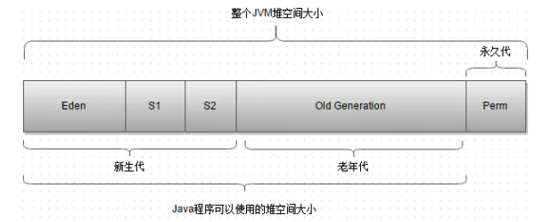
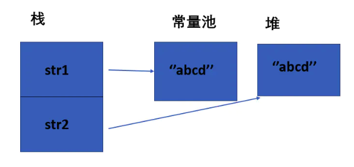

# Java源码与JVM


## 文件与I/O流

### 1、Java中IO流分为几种？

*   按照**流的方向**划分，分为**输入流**和**输出流**
*   按照**操作单元**划分，分为**字节流**和**字符流**
*   按照**流的角色**划分，分为**节点流**和**处理流**

Java Io 流共涉及 40 多个类，这些类看上去很杂乱，但实际上很有规则，而且彼此之间存在非常紧密的联系， Java I0 流的 40 多个类都是从4 个抽象类基类中派生出来的。这4个抽象类基类是：

*   InputStream/Reader: 所有的输入流的基类，前者是字节输入流，后者是字符输入流。
*   OutputStream/Writer: 所有输出流的基类，前者是字节输出流，后者是字符输出流。

按操作方式分类结构图：


按操作对象分类结构图：


#### 补充：既然有了字节流，为什么还要有字符流

问题本质：**不管是文件读写还是网络发送接收，信息的最小存储单元都是字节，那为什么 I/O 流操作要分为字节流操作和字符流操作呢？**

字符流是由 Java 虚拟机将字节转换得到的，问题就出在这个过程还算是非常**耗时**，并且，如果我们不知道编码类型就很容易出现**乱码**问题。所以， I/O 流就干脆提供了一个直接操作字符的接口，方便我们平时对字符进行流操作。如果音频文件、图片等媒体文件用字节流比较好，如果涉及到字符的话使用字符流比较好。


### 2、同步和异步的区别

*   同步：发送一个请求，等待返回，再发送下一个请求，同步可以避免出现死锁，脏读的发生。
*   异步：发送一个请求，不等待返回，随时可以再发送下一个请求，可以提高效率，保证并发。


### 3、 阻塞和非阻塞

*   阻塞：传统的IO流都是阻塞式的。也就是说，当一个线程调用read()或者write()方法时，该线程将被阻塞，直到有一些数据读取或者被写入，在此期间，该线程不能执行其他任何任务。在完成网络通信进行IO操作时，由于线程会阻塞，所以服务器端必须为每个客户端都提供一个独立的线程进行处理，当服务器端需要处理大量的客户端时，性能急剧下降。
*   非阻塞：Java NIO是非阻塞式的。当线程从某通道进行读写数据时，若没有数据可用时，该线程会去执行其他任务。线程通常将非阻塞IO的空闲时间用在其他通道上执行IO操作，所以单独的线程可以管理多个输入和输出通道。因此NIO可以让服务器端使用一个或有限几个线程来同时处理连接到服务器端的所有客户端。


### 4、IO和NIO的区别

首先说下核心区别：NIO是以**块**的方式处理数据，但是IO是以最基础的**字节流**的形式写入和读出的。所以在效率上的话，肯定是NIO效率比IO效率会高出很多。

其次就是说，NIO不再是和IO一样用OutputStream和InputStream输入输出流的形式来处理数据的，而是采用了**通道**和**缓冲区**的形式来进行数据处理的。

还有一点是NIO的通道是可以双向的，但是IO中的流只能是单向的。

NIO的缓冲区（其实就是一个**字节数组**），还可以进行**分片**，可以建立只读缓冲区、直接缓冲区和间接缓冲区，只读缓冲区很明显就是字面意思，直接缓冲区是为了加快I/O的速度，而以一种特殊的方式分配其内存的缓冲区。

补充一点：NIO比传统的BIO核心区别就是，NIO采用的是多路复用的IO模型，普通的IO用的是阻塞的IO模型，两个之间的效率肯定是多路复用效率更高


#### 补充：通道和缓冲区的概念

*   通道（Channel）：通道就是对原I/O包中的流的模拟。到任何目的地（或来自任何地方）的所有数据都必须通过一个Channel对象，也就是通道。发送给一个通道的所有对象都必须首先放到缓冲区中；同样的，从通道中读取的任何数据都要读到缓冲区中。通道和流的不同之处在于**通道是双向的**，流只是在一个方向移动，而且**通道可以用于读、写或者同时读写**。正如前面提到的，所有数据都通过Buffer对象来处理。我永远不会将字节直接写入通道中，相反，我是将数据写入包含一个或者多个字节的缓冲区。同样，我也不会直接从通道中读取字节，而是将数据从通道读取缓冲区，再从缓冲区获取这个字节。
    *   通道的类型：FileChannel（是从文件中读取数据）、DatagramChannel（从UDP网络中读取或者写入数据）、SocketChannel（从TCP网络中读取或者写入数据）、ServerSocketChannel（允许你监听来自TCP的连接，就像服务器一样。每一个连接都会有一个SocketChannel产生）
*   缓冲区（Buffer）：Buffer 是一个对象， 它包含一些要写入或者刚读出的数据。在 NIO 中加入 Buffer 对象，体现了新库与原 I/O 的一个重要区别。在面向流的 I/O 中，我将数据直接写入或者将数据直接读到 Stream 对象中。而在 NIO 库中，所有数据都是用缓冲区处理的。在读取数据时，它是直接读到缓冲区中的。在写入数据时，它是写入到缓冲区中的。任何时候访问 NIO 中的数据，我都是将它放到缓冲区中。缓冲区实质上是一个数组。通常它是一个**字节数组**，但是也可以使用其他种类的数组。**但是一个缓冲区不仅仅是一个数组。缓冲区提供了对数据的结构化访问，而且还可以跟踪系统的读/写进程**。
    *   缓冲区的类型：ByteBuffer、CharBuffer、ShortBuffer、IntBuffer、LongBuffer、FloatBuffer、DoubleBuffer


#### 补充：多路复用器Selector


### 5、BIO、NIO、AIO有什么区别

*   **BIO (Blocking I/O)**：**同步阻塞 I/O 模式**，数据的读取写入必须阻塞在一个线程内等待其完成。在活动连接数不是特别高（小于单机 1000）的情况下，这种模型是比较不错的，可以让每一个连接专注于自己的 I/O 并且编程模型简单，也不用过多考虑系统的过载、限流等问题。线程池本身就是一个天然的漏斗，可以缓冲一些系统处理不了的连接或请求。但是，当面对十万甚至百万级连接的时候，传统的 BIO 模型是无能为力的。因此，我们需要一种更高效的 I/O 处理模型来应对更高的并发量。（BIO方式适用于连接数目比较小且固定的框架，这种方式对服务器资源要求比较高，并发局限于应用中。）
*   **NIO (Non-blocking/New I/O)**：NIO 是一种**同步非阻塞**的 I/O 模型，在 Java 1.4 中引入了 NIO 框架，对应 java.nio 包，提供了 Channel , Selector，Buffer 等抽象。NIO 中的 N 可以理解为 Non-blocking，不单纯是 New。它支持面向缓冲的，基于通道的 I/O 操作方法。 NIO 提供了与传统 BIO 模型中的 `Socket` 和 `ServerSocket` 相对应的 `SocketChannel` 和 `ServerSocketChannel` 两种不同的套接字通道实现，两种通道都支持阻塞和非阻塞两种模式。阻塞模式使用就像传统中的支持一样，比较简单，但是性能和可靠性都不好；非阻塞模式正好与之相反。对于低负载、低并发的应用程序，可以使用同步阻塞 I/O 来提升开发速率和更好的维护性；对于高负载、高并发的（网络）应用，应使用 NIO 的非阻塞模式来开发。（NIO方式适用于连接数目多且连接比较短（轻操作）的架构，比如聊天服务器，并发局限于应用中，编程比较复杂。）
*   **AIO (Asynchronous I/O)**：AIO 也就是 NIO 2。在 Java 7 中引入了 NIO 的改进版 NIO 2，它是**异步非阻塞的 IO 模型**。异步 IO 是基于事件和回调机制实现的，也就是应用操作之后会直接返回，不会堵塞在那里，当后台处理完成，操作系统会通知相应的线程进行后续的操作。虽然 NIO 在网络操作中，提供了非阻塞的方法，但是 NIO 的 IO 行为还是同步的。对于 NIO 来说，我们的业务线程是在 IO 操作准备好时，得到通知，接着就由这个线程自行进行 IO 操作，IO 操作本身是同步的。~~查阅网上相关资料，我发现就目前来说 AIO 的应用还不是很广泛，Netty 之前也尝试使用过 AIO，不过又放弃了。~~（AIO方式适用于连接数目多且连接比较长（重操作）的架构，比如相册服务器，充分调用OS参与并发操作，编程比较复杂。）


#### 补充：异步非阻塞与同步非阻塞的区别在哪里？

异步非阻塞无需一个线程去轮询所有IO操作的状态改变，在相应的状态改变后，系统会通知对应的线程来处理。


## Hash

### 1、HashMap和CurrentHashMap 哪个是线程安全的，详细展开

HashMap不是线程安全的，CurrentHashMap是线程安全的。

*   HashMap

    *   **哈希碰撞会导致hashmap的线程不安全**。现在假设A线程和B线程同时对同一个数组位置（即相同哈希码位置）调用addEntry，且该位置还没有其他的数据。假设一种情况，线程A通过if判断，该位置没有哈希冲突，进入了if语句，还没有进行数据插入，这时候CPU就把资源让给了线程B，线程A停在了if语句里面，线程B判断该位置也没有哈希冲突（线程A的数据还没有插入），也进入了if语句，线程B执行完后，轮到线程A执行，现在线程A直接在该位置插入而不用再判断。这时候，就会发现线程A把线程B插入的数据给覆盖了。发生了线程不安全的情况。本来在HashMap中，发生哈希冲突时可以用链表法或者红黑树来解决的，但是在多线程中，可能就直接给覆盖了。
    *   还有两处可能不安全：**在扩容的时候插入数据，有可能会把新插入的覆盖住；在扩容的时候删除数据，会删除不了**。如果我在扩容的时候，在数据从旧数组复制到新数组过程中，这时候某个线程插入一条数据，这时候是插入到新数组中，但是在数据复制过程中，HashMap是不会检查新数组上的位置是否为空的，所以新插入的数据会被后面从旧数组中复制过来的数据覆盖住。还有如果在数组刚新建完后，某个线程就立刻想删除以前插入的某个元素，你就会发现删除不了，因为table指向了新数组，而这时候新数组还没有数据。

    （解决方案：加同步锁。要注意用读写锁，即：多个线程可以同时读，但只有一个线程可同时写。不然数据量大的时候也会影响性能。）

*   CurrentHashMap

    *   在说ConcurrentHashMap之前，要先提到一个HashTable的数据结构。之前也说了，HashMap是一个非线程安全的数据结构，而HashTable则解决了这个问题，它是一个线程安全的数据结构，它采用和HashMap相同的存储机制，只不过内部的方法都是经过**synchronized**的修饰。但是因为同步和哈希的原因，HashTable的性能远不及HashMap。所以为了进一步的改进，就弄了一个ConcurrentHashMap的数据结构。ConcurrentHashMap也是线程安全的。**在HashTable中，synchronized关键字其实是对整个对象进行加锁**，当HashTable的大小增加到一定时，性能会急剧下降。而ConcurrentHashMap引入了**分割（Segment）**，然后在每一个分段上都用**lock锁**进行保护，相对HashTable的synchronized同步锁锁住整个对象而言，ConcurrentHashMap的锁的粒度更精细些，并发性能更好，实现了**锁分离技术**和**锁分段技术**。
    *   还有一个就是说HashMap的键值对允许有null，但是ConcurrentHashMap都不允许。
    *   ConcurrentHashMap通过把整个Map分为N个Segment，可以保证线程安全。**读操作不加锁，由于HashEntry的value变量时volatile的，也能保证读取到最新的值**。
    *   但是有些地方需要跨段，比如size()和containsValue()，它们可能需要锁定整个表而不仅仅是某个段，这需要按顺序锁定所有段，操作完毕后，又按顺序释放所有段的锁。
    *   ConcurrentHashMap的扩容：**段内扩容**（段内元素超过该段对应的Entry数组长度的75%触发扩容，不会对整个Map进行扩容），插入前检测需不需要扩容，有效避免无效扩容。


## JVM

### 1、GC是是什么/为什么要有GC

首先，垃圾是指内存中已经不再被使用的空间。

GC，即Garbage Collection--垃圾收集。内存处理是我们容易出现问题的地方，忘记或者错误的内存回收会导致程序或系统的不稳定甚至崩溃，Java提供的GC功能可以自动监测对象是否超过作用域从而达到自动回收内存的目的，Java语言没有提供释放已分配内存的显示操作方法。我们不用担心内存管理，因为垃圾收集器会自动进行管理。~~要请求垃圾收集，可以调用下面的方法：System.gc() 或Runtime.getRuntime().gc() ，但JVM可以屏蔽掉显示的垃圾回收调用。~~垃圾回收可以有效的防止内存泄露，有效的使用可以使用的内存。垃圾回收器通常是作为一个单独的低优先级的线程运行，不可预知的情况下对内存堆中已经死亡的或者长时间没有使用的对象进行清除和回收，我们不能实时的调用垃圾回收器对某个对象或所有对象进行垃圾回收。

JVM中程序计数器、虚拟机栈、本地方法栈3个区域随线程而生随线程而灭。栈帧随着方法的进入和退出做入栈和出栈操作，实现了自动的内存清理。它们的内存分配和回收都具有确定性。因此，GC垃圾回收主要集中在**堆和方法区**，在程序运行期间，这部分内存的分配和使用都是动态的。


### 补充：GC用到了哪些算法？分别应用到什么地方？

常见的回收算法有**标记清除算法、复制算法、标记整理算法、分代搜集算法**

**标记-清除算法：**

分为两个阶段。

第一阶段（标记）：从引用根节点开始标记所有被引用的对象

第二阶段（清除）：遍历整个堆，把未被标记的对象清除。

主要缺点：一个是效率问题，标记和清除的过程效率都不高；另外就是空间问题，标记清除之后会产生大量不连续的内存碎片，空间碎片太多可能会导致，当程序在以后的运行过程中需要分配较大对象时无法找到足够的连续内存而不得不提前触发另一次垃圾收集动作。

**复制算法：**

将可用内存按容量划分为大小相等的两块，每次只使用其中的一块。当一块内存用完了，就将还存活着的对象复制到另外一块上，然后清理掉前一块。

每次对半区内存回收、分配时就不用考虑内存碎片等复杂情况，只要移动堆顶指针，按顺序分配内存即可，实现简单，运行高效。

缺点：将内存缩小为一半，性价比低，持续复制长生存期的对象则导致效率低下。

JVM堆中新生代便采用复制算法。堆分配结构图。


*   ~~Eden（伊甸园）：这是对象最初诞生的区域，并且对大多数对象来说，这里是它们唯一存在过的区域。~~
*   ~~Survivor（幸存者乐园）：从Eden幸存下来的对象会被挪到这里。~~
*   ~~Tenured（老年代）：这是足够老的幸存对象的归宿。年轻代收集（Minor-GC）过程是不会触及这个地方的。当年轻代收集不能把对象放进老年代时，就会触发一次完全收集（Major-GC），这里可能还会牵扯到压缩，以便为大对象腾出足够的空间。~~

在GC回收过程中，当Eden区满时，还存活的对象会被复制到其中一个Survivor区；当回收时，会将Eden和使用的Survivor区还存活的对象，复制到另外一个Survivor区，然后对Eden和用过的Survivor区进行清理。

如果另外一个Survivor区没有足够的内存存储时，则会进入老年代。

这里针对哪些对象会进入老年代有这样的机制：对象每经历一次复制，年龄加1，达到晋升年龄阈值后，转移到老年代。

在这整个过程中，由于Eden中的对象属于像浮萍一样“瞬生瞬灭”的对象，所以并不需要1：1的比例来分配内存，而是采用了8：1：1的比例来分配。

而针对那些像“水熊虫”一样，历经多次清理依旧存活的对象，则会进入老年代，而老年的清理算法则采用下面要讲到的“标记整理算法”。

**标记-整理算法**：

标记过程与“标记-清除”算法一样，但后续步骤不是直接对可回收对象进行清理，而是让所有存活的对象都向一端移动，然后直接清理掉端边界以外的内存。

这种算法不既不用浪费50%的内存，也解决了复制算法在对象存活率较高时的效率低下问题。

**分代搜集算法：**

将Java的堆内存逻辑上分成两块，新生代和老年代，针对不同存活周期、不同大小的对象采取不同的垃圾回收策略。

在**新生代**中大多数对象都是瞬间对象，只有少量对象存活，复制较少对象即可完成清理，因此采用**复制算法**。而针对**老年代**中的对象，存活率较高，又没有额外的担保内存，因此采用**标记整理**算法。


### 2、java对象什么时候会被垃圾回收器判定为可回收/如何判断对象可以回收

判断对象是否存活一般有两种方式：

1.  引用计数方法：每个对象有一个引用计数属性，新增一个引用时计数加1，引用释放时计数减1，计数为0时可以回收。此方法简单，但无法解决对象相互循环引用的问题。
2.  可达性分析方法：此方法为解决引用计数方法的循环引用的问题。这里面需要引入一个概念--GC Roots，或者说是Tracing GC，这是一组“根集合”，也是一组引用集合，这个“根集合”就是一组必须活跃的引用。可达性分析方法的基本思路是，通过一系列名为”GCRoots”的对象作为起始点，从这个被称为GC Roots的对象开始向下搜索，如果一个对象到GCRoots没有任何引用链相连时，则说明此对象不可用。也即给定一个集合的引用作为根出发，通过引用关系遍历对象图，能被遍历到的（可到达的）对象就被判定为存活，没有被遍历到的就自然被判定为死亡。


#### 补充：Java中可以作为GC Roots的对象

1.  虚拟机栈（栈帧中的本地变量表）中引用的对象
2.  方法区中类静态属性引用的对象
3.  方法区中常量引用的对象
4.  本地方法栈中JNI（即一般说的native方法）中引用的对象
5.  活着的线程Thread
6.  由系统类加载器(system class loader)加载的对象，这些类是不能够被回收的，他们可以以静态字段的方式保存持有其它对象。
7.  用于同步的监视对象


### 3、Java内存区域

Java 虚拟机在执行 Java 程序的过程中会把它管理的内存划分成若干个不同的数据区域。


这些组成部分一些事线程私有的，其他的则是线程共享的。

线程私有：程序计数器、虚拟机栈、本地方法栈

线程共享：堆、方法区、直接内存


*   #### 程序计数器：

    程序计数器是一块较小的内存空间，可以看作是当前线程所执行的字节码的行号指示器。**字节码解释器工作时通过改变这个计数器的值来选取下一条需要执行的字节码指令，分支、循环、跳转、异常处理、线程恢复等功能都需要依赖这个计数器来完成。**

    另外，**为了线程切换后能恢复到正确的执行位置，每条线程都需要有一个独立的程序计数器，各线程之间计数器互不影响，独立存储，我们称这类内存区域为“线程私有”的内存。**

    ~~如果线程正在执行的是一个Java方法，这个计数器记录的是正在执行的虚拟机字节码指令的地址；如果正在执行的是Natvie方法，这个计数器值则为空（Undefined）。~~

    **程序计数器主要有两个作用：**

    1.  字节码解释器通过改变程序计数器来依次读取指令，从而实现代码的流程控制，如：顺序执行、选择、循环、异常处理。
    2.  在多线程的情况下，程序计数器用于记录当前线程执行的位置，从而当线程被切换回来的时候能够知道该线程上次运行到哪儿了。

    **注意：程序计数器是唯一一个不会出现OutOfMemoryError的内存区域，它的生命周期随着线程的创建而创建，随着线程的结束而死亡。**

*   #### 虚拟机栈：

    **与程序计数器一样，Java虚拟机栈也是线程私有的，它的生命周期和线程相同，描述的是 Java 方法执行的内存模型。**

    **Java 内存可以粗糙的区分为堆内存（Heap）和栈内存(Stack)，其中栈就是现在说的虚拟机栈，或者说是虚拟机栈中局部变量表部分。** （实际上，Java虚拟机栈是由一个个栈帧组成，而每个栈帧中都拥有：局部变量表、操作数栈、动态链接、方法返回地址。）

    **局部变量表是一组变量值存储空间，用于存放方法参数和方法内定义的局部变量**，包括8种**基本类型**（boolean、byte、char、short、int、float、long、double）、**对象引用**（reference类型，它不同于对象本身，可能是一个指向对象起始地址的引用指针，也可能是指向一个代表对象的句柄或其他与此对象相关的位置）和returnAddress（只想一条字节码指令的地址）。

    ~~其中64位长度的long和double类型的数据会占用2个局部变量空间（Slot），其余的数据类型只占用1个。~~

    ~~操作数栈(Operand Stack)也称作操作栈，是一个后入先出栈(LIFO)。随着方法执行和字节码指令的执行，会从局部变量表或对象实例的字段中复制常量或变量写入到操作数栈，再随着计算的进行将栈中元素出栈到局部变量表或者返回给方法调用者，也就是出栈/入栈操作。~~

    ~~动态链接：Java虚拟机栈中，每个栈帧都包含一个指向运行时常量池中该栈所属方法的符号引用，持有这个引用的目的是为了支持方法调用过程中的动态链接(Dynamic Linking)。~~
    ~~方法返回：无论方法是否正常完成，都需要返回到方法被调用的位置，程序才能继续进行。~~

    **Java 虚拟机栈会出现两种异常：StackOverFlowError 和 OutOfMemoryError。**

    *   **StackOverFlowError：** 若Java虚拟机栈的内存大小不允许动态扩展，那么当线程请求栈的深度超过当前Java虚拟机栈的最大深度的时候，就抛出StackOverFlowError异常。
    *   **OutOfMemoryError：** 若 Java 虚拟机栈的内存大小允许动态扩展，且当线程请求栈时内存用完了，无法再动态扩展了，此时抛出OutOfMemoryError异常。

    Java 虚拟机栈也是线程私有的，每个线程都有各自的Java虚拟机栈，而且随着线程的创建而创建，随着线程的死亡而死亡。

*   #### 本地方法栈：

    和虚拟机栈所发挥的作用非常相似，区别是： **虚拟机栈为虚拟机执行 Java 方法 （也就是字节码）服务，而本地方法栈则为虚拟机使用到的 Native 方法服务。** 在 HotSpot 虚拟机中和 Java 虚拟机栈合二为一。

    本地方法被执行的时候，在本地方法栈也会创建一个栈帧，用于存放该本地方法的局部变量表、操作数栈、动态链接、出口信息。

    方法执行完毕后相应的栈帧也会出栈并释放内存空间，也会出现 StackOverFlowError 和 OutOfMemoryError 两种异常。

*   #### 堆：

    Java 虚拟机所管理的内存中最大的一块，Java 堆是所有线程共享的一块内存区域，在虚拟机启动时创建。**此内存区域的唯一目的就是存放对象实例，几乎所有的对象实例以及数组都在这里分配内存。**

    Java 堆是垃圾收集器管理的主要区域，因此也被称作**GC堆（Garbage Collected Heap）**。从垃圾回收的角度，由于现在收集器基本都采用**分代垃圾收集算法**，所以Java堆还可以细分为：新生代和老年代：在细致一点有：Eden空间、From Survivor、To Survivor空间等。**进一步划分的目的是更好地回收内存，或者更快地分配内存。**

    

    **在 JDK 1.8中移除整个永久代，取而代之的是一个叫元空间（Metaspace）的区域（永久代使用的是JVM的堆内存空间，而元空间使用的是物理内存，直接受到本机的物理内存限制）。**

    Java虚拟机规范规定，Java堆可以处于物理上不连续的内存空间中，只要逻辑上是连续的即可。也就是说堆的内存是一块块拼凑起来的。要增加堆空间时，往上“拼凑”（可扩展性）即可，但当堆中没有内存完成实例分配，并且堆也无法再扩展时，将会抛出OutOfMemoryError异常。

*   #### 方法区：

    **方法区与 Java 堆一样，是各个线程共享的内存区域，它用于存储已被虚拟机加载的类信息、常量、静态变量、即时编译器编译后的代码等数据。虽然Java虚拟机规范把方法区描述为堆的一个逻辑部分，但是它却有一个别名叫做 Non-Heap（非堆），目的应该是与 Java 堆区分开来。**

    方法区与堆有很多共性：线程共享、内存不连续、可扩展、可垃圾回收，同样当无法再扩展时会抛出OutOfMemoryError异常。

    **相对而言，垃圾收集行为在这个区域是比较少出现的，但并非数据进入方法区后就“永久存在”了。**

    *   运行时常量池：

        运行时常量池是方法区的一部分。Class 文件中除了有类的版本、字段、方法、接口等描述信息外，还有常量池信息（用于存放编译期生成的各种字面量和符号引用）

        既然运行时常量池时方法区的一部分，自然受到方法区内存的限制，当常量池无法再申请到内存时会抛出 OutOfMemoryError 异常。

        **JDK1.7及之后版本的 JVM 已经将运行时常量池从方法区中移了出来，在 Java 堆（Heap）中开辟了一块区域存放运行时常量池。**

*   #### 直接内存：

    直接内存并不是虚拟机运行时数据区的一部分，也不是虚拟机规范中定义的内存区域，但是这部分内存也被频繁地使用。而且也可能导致OutOfMemoryError异常出现。

    JDK1.4中新加入的 **NIO(New Input/Output) 类**，引入了一种基于**通道（Channel）** 与**缓存区（Buffer）** 的 I/O 方式，它可以直接使用Native函数库直接分配堆外内存，然后通过一个存储在 Java 堆中的 DirectByteBuffer 对象作为这块内存的引用进行操作。这样就能在一些场景中显著提高性能，因为**避免了在 Java 堆和 Native 堆之间来回复制数据**。

    本机直接内存的分配不会受到 Java 堆的限制，但是，既然是内存就会受到本机总内存大小以及处理器寻址空间的限制。


#### 补充：Java8内存模型--永久代（PermGen）和元空间（Metaspace）


#### 补充：HotSpot虚拟机对象探秘

1.  对象的创建

    

    *   **类加载检查**：虚拟机遇到一条 new 指令时，首先将去检查这个指令的参数是否能在常量池中定位到这个类的符号引用，并且检查这个符号引用代表的类是否已被加载过、解析和初始化过。如果没有，那必须先执行相应的类加载过程。

    *   **分配内存**：在**类加载检查**通过后，接下来虚拟机将为新生对象**分配内存**。对象所需的内存大小在类加载完成后便可确定，为对象分配空间的任务等同于把一块确定大小的内存从 Java 堆中划分出来。**分配方式**有 **“指针碰撞”** 和 **“空闲列表”** 两种，**选择那种分配方式由 Java 堆是否规整决定，而Java堆是否规整又由所采用的垃圾收集器是否带有压缩整理功能决定**。

        **内存分配的两种方式**：

        选择以上两种方式中的哪一种，取决于 Java 堆内存是否规整。而 Java 堆内存是否规整，取决于 GC 收集器的算法是"标记-清除"，还是"标记-整理"（也称作"标记-压缩"），值得注意的是，复制算法内存也是规整的

        

        **内存分配并发问题**：

        在创建对象的时候有一个很重要的问题，就是线程安全，因为在实际开发过程中，创建对象是很频繁的事情，作为虚拟机来说，必须要保证线程是安全的，通常来讲，虚拟机采用两种方式来保证线程安全：

        *   **CAS+失败重试：** CAS 是乐观锁的一种实现方式。所谓乐观锁就是，每次不加锁而是假设没有冲突而去完成某项操作，如果因为冲突失败就重试，直到成功为止。**虚拟机采用 CAS 配上失败重试的方式保证更新操作的原子性。**
        *   **TLAB：** 为每一个线程预先在Eden区分配一块儿内存，JVM在给线程中的对象分配内存时，首先在TLAB（Thread Local Allocation Buffer，即线程本地分配缓存区，这是一个线程专用的内存分配区域。）分配，当对象大于TLAB中的剩余内存或TLAB的内存已用尽时，再采用上述的CAS进行内存分配

    *   **初始化零值**：内存分配完成后，虚拟机需要将分配到的内存空间都初始化为零值（不包括对象头），这一步操作保证了对象的实例字段在 Java 代码中可以不赋初始值就直接使用，程序能访问到这些字段的数据类型所对应的零值。

    *   **设置对象头**：初始化零值完成之后，**虚拟机要对对象进行必要的设置**，例如这个对象是那个类的实例、如何才能找到类的元数据信息、对象的哈希吗、对象的 GC 分代年龄等信息。 **这些信息存放在对象头中。** 另外，根据虚拟机当前运行状态的不同，如是否启用偏向锁等，对象头会有不同的设置方式。

    *   **指定init方法**：在上面工作都完成之后，从虚拟机的视角来看，一个新的对象已经产生了，但从 Java 程序的视角来看，对象创建才刚开始，`<init>` 方法还没有执行，所有的字段都还为零。所以一般来说，执行 new 指令之后会接着执行 `<init>` 方法，把对象按照程序员的意愿进行初始化，这样一个真正可用的对象才算完全产生出来。

2.  对象的内存布局

    在 Hotspot 虚拟机中，对象在内存中的布局可以分为3块区域：**对象头**、**实例数据**和**对齐填充**。

    **Hotspot虚拟机的对象头包括两部分信息**，**第一部分用于存储对象自身的自身运行时数据**（哈希吗、GC分代年龄、锁状态标志等等），**另一部分是类型指针**，即对象指向它的类元数据的指针，虚拟机通过这个指针来确定这个对象是那个类的实例。

    **实例数据部分是对象真正存储的有效信息**，也是在程序中所定义的各种类型的字段内容。

    **对齐填充部分不是必然存在的，也没有什么特别的含义，仅仅起占位作用。** 因为Hotspot虚拟机的自动内存管理系统要求对象起始地址必须是8字节的整数倍，换句话说就是对象的大小必须是8字节的整数倍。而对象头部分正好是8字节的倍数（1倍或2倍），因此，当对象实例数据部分没有对齐时，就需要通过对齐填充来补全。

3.  对象的访问定位

    建立对象就是为了使用对象，我们的Java程序通过栈上的 reference 数据来操作堆上的具体对象。对象的访问方式有虚拟机实现而定，目前主流的访问方式有**①使用句柄**和**②直接指针**两种：

    *   **句柄**：如果使用句柄的话，那么Java堆中将会划分出一块内存来作为句柄池，reference 中存储的就是对象的句柄地址，而句柄中包含了对象实例数据与类型数据各自的具体地址信息；

        

    *   **直接指针**：如果使用直接指针访问，那么 Java 堆对像的布局中就必须考虑如何防止访问类型数据的相关信息，reference 中存储的直接就是对象的地址。

        

    *   这两种对象访问方式各有优势。使用句柄来访问的最大好处是 reference 中存储的是稳定的句柄地址，在对象被移动时只会改变句柄中的实例数据指针，而 reference 本身不需要修改。使用直接指针访问方式最大的好处就是速度快，它节省了一次指针定位的时间开销。


#### 补充：String类和常量池

1.  **String对象的两种创建方式**

    ```java
    String str1 = "abcd";
    String str2 = new String("abcd");
    System.out.println(str1==str2);//false
    ```

    这两种不同的创建方法是有差别的，第一种方式是在常量池中拿对象，第二种方式是直接在堆内存空间创建一个新的对象。

    

    **记住：只要使用new方法，便需要创建新的对象。**

2.  **String 类型的常量池比较特殊。它的主要使用方法有两种**

    *   直接使用双引号声明出来的 String 对象会直接存储在常量池中。

    *   如果不是用双引号声明的 String 对象，可以使用 String 提供的 intern 方String.intern() 是一个 Native 方法，它的作用是：如果运行时常量池中已经包含一个等于此 String 对象内容的字符串，则返回常量池中该字符串的引用；如果没有，则在常量池中创建与此 String 内容相同的字符串，并返回常量池中创建的字符串的引用。

        ```java
        String s1 = new String("计算机");
        String s2 = s1.intern();
        String s3 = "计算机";
        System.out.println(s2);//计算机
        System.out.println(s1 == s2);//false，因为一个是堆内存中的String对象一个是常量池中的String对象，
        System.out.println(s3 == s2);//true，因为两个都是常量池中的String对
        ```

3.  **String字符串拼接**

    ```java
    String str1 = "str";
    String str2 = "ing";
    		  
    String str3 = "str" + "ing";//常量池中的对象
    String str4 = str1 + str2; //在堆上创建的新的对象	  
    String str5 = "string";//常量池中的对象
    System.out.println(str3 == str4);//false
    System.out.println(str3 == str5);//true
    System.out.println(str4 == str5);//false
    ```

    

    尽量避免多个字符串拼接，因为这样会重新创建对象。如果需要改变字符串的化，可以使用 StringBuilder 或者 StringBuffer。

    **String s1 = new String("abc");这句话创建了几个对象？**

    **创建了两个对象**

    ```java
    String s1 = new String("abc");// 堆内存的地值值
    String s2 = "abc";
    System.out.println(s1 == s2);// 输出false,因为一个是堆内存，一个是常量池的内存，故两者是不同的。
    System.out.println(s1.equals(s2));// 输出true
    ```

    先有字符串"abc"放入常量池，然后 new 了一份字符串"abc"放入Java堆(字符串常量"abc"在编译期就已经确定放入常量池，而 Java 堆上的"abc"是在运行期初始化阶段才确定)，然后 Java 栈的 str1 指向Java堆上的"abc"。


#### 补充：8种基本类型的包装类和常量池

*   **Java 基本类型的包装类的大部分都实现了常量池技术，即Byte,Short,Integer,Long,Character,Boolean；这5种包装类默认创建了数值[-128，127]的相应类型的缓存数据，但是超出此范围仍然会去创建新的对象。**

*   **两种浮点数类型的包装类 Float,Double 并没有实现常量池技术。**

    ```java
    Integer i1 = 33;
    Integer i2 = 33;
    System.out.println(i1 == i2);// 输出true
    Integer i11 = 333;
    Integer i22 = 333;
    System.out.println(i11 == i22);// 输出false
    Double i3 = 1.2;
    Double i4 = 1.2;
    System.out.println(i3 == i4);// 输出false
    ```

**Integer 缓存源代码：**

```java
/**
*此方法将始终缓存-128到127（包括端点）范围内的值，并可以缓存此范围之外的其他值。
*/
    public static Integer valueOf(int i) {
        if (i >= IntegerCache.low && i <= IntegerCache.high)
            return IntegerCache.cache[i + (-IntegerCache.low)];
        return new Integer(i);
    }
```

**应用场景：**

1.  Integer i1=40；Java 在编译的时候会直接将代码封装成Integer i1=Integer.valueOf(40);，从而使用常量池中的对象。
2.  Integer i1 = new Integer(40);这种情况下会创建新的对象。

```java
Integer i1 = 40;
Integer i2 = new Integer(40);
System.out.println(i1==i2);//输出false
```

**Integer比较更丰富的一个例子:**

```java
Integer i1 = 40;
Integer i2 = 40;
Integer i3 = 0;
Integer i4 = new Integer(40);
Integer i5 = new Integer(40);
Integer i6 = new Integer(0);
  
System.out.println("i1=i2   " + (i1 == i2));
System.out.println("i1=i2+i3   " + (i1 == i2 + i3));
System.out.println("i1=i4   " + (i1 == i4));
System.out.println("i4=i5   " + (i4 == i5));
System.out.println("i4=i5+i6   " + (i4 == i5 + i6));   
System.out.println("40=i5+i6   " + (40 == i5 + i6));     
```

**结果**：

```java
i1=i2   true
i1=i2+i3   true
i1=i4   false
i4=i5   false
i4=i5+i6   true
40=i5+i6   true
```

语句i4 == i5 + i6，因为+这个操作符不适用于Integer对象，首先i5和i6进行自动拆箱操作，进行数值相加，即i4 == 40。然后Integer对象无法与数值进行直接比较，所以i4自动拆箱转为int值40，最终这条语句转为40 == 40进行数值比较


## 并发

### 1、并发与并行

1.  并发就是在一段时间内，以交替的方式去完成多个任务，而并行就是以齐头并进的方式去完成多个任务。
2.  如果一个任务的处理，可以由串行改为并发（或并行），那么就称这个任务可并发化。
3.  并发的极致是并行。


### CAS与原子变量

1.  是对一种处理器指令的称呼
2.  CAS能够将read-modify-write和check-then-act之类的操作转换为原子操作。
3.  CAS只是保障了共享变量更新这个操作的原子性，它并不操作可见性。


### 轻量级同步机制：volatile关键字

volatile字面是“易挥发”，引伸开来就是“不稳定”的意思。

-   用于修饰共享可变变量，即没有使用final关键字修饰的实例变量或静态变量。
-   volatile变量的不稳定性，意味着这种变量的读和写操作都必须从主内存中读取，以读取变量的相对新值。因此变量不会被分配到寄存器进行存储。
-   此关键字常被称为轻量级锁，
    -   其作用与锁的作用有相同的地方：保障可见性和有序性。不同的地方：在原子性方面，仅保障写volatile变量操作的原子性，但没有锁的排他性。
    -   volatile关键字的使用，不会引起上下文的切换（这是volatile被冠以“轻量级”锁的原因）


### volatile的作用

1.  保障可见性、保障有序性、保障long/double型变量读写操作的原子性

2.  volatile仅仅保障对其修饰的变量的写操作以及读操作的原子性，而这并不表示对volatile变量的赋值操作一定具有原子性。如：count = count + 1;

3.  对volatile变量赋值，其右边表达式中只要涉及共享变量（包括被赋值的volatile变量本身），那么这个赋值操作也不是原子操作。

4.  volatile关键字在原子性方面，仅保障对被修饰的变量的读操作、写操作本身的原子性。如果要保障对volatile变量赋值操作的原子性，那么这个赋值操作不能涉及任何共享变量（包括自身）。

5.  对volatile变量的写操作：

    *   Java虚拟机会在该操作之前插入一个*释放屏障*，并在该操作之后，插入一个*存储屏障*。

    -   释放屏障禁止了对volatile写操作与该操作之前对任何读、写操作进行重排序。保证了volatile写操作之前的任何读、写操作会先于volatile写操作被提交，即之前的写操作对之后的读写线程可见。
    -   存储屏障具有冲刷处理器缓存的作用，因此变量写操作之后插入一个存储屏障，就使得该存储屏障前所有操作的结果（包括写操作和之前的任何操作），对其他处理器来说是可同步的。

6.  对volatile变量的读操作：

    *   JVM会在该操作之前，插入一个*加载屏障*，并在该操作之后，插入一个*获得屏障*。

    -   加载屏障：通过冲刷处理器缓存，使其执行线程（读线程）所在的处理器将其他处理器对共享变量（可能是多个变量）所做的更新同步到该处理器的高速缓存中。
    -   读线程执行的加载屏障和写线程执行的存储屏障，配合在一起使得写线程对volatile变量的写操作以及之前所执行的其他内存操作的结果对读线程可见。即保障了可见性。

7.  volatile禁止了如下重排序：

    *   写volatile变量操作与该操作之前的任何读，写操作不会被重排序

    -   读volatile变量操作与该操作之后的任何读，写操作不会被重排序
    -   作用体现在对其所修饰的变量的读、写操作上。
    -   如果修饰的变量是个数组，volatile只能够对数组引用本身的操作（读数组引用和更新数组引用）起作用，而无法对数组元素的操作起作用。
    -   对于引用型volatile变量，volatile关键字只是保证读线程能够读取到一个指向对象的相对新的内存地址，而这个内存地址指向的对象的实例/静态变量值是否是相对新的，则没有保障。


### 原子类操作：原子变量类

1.  原子变量类，是基于CAS实现的，并能够保障对共享变量进行read-modify-write更新操作的原子性和可见性的一组工具类。
2.  变量内部实现通常借助一个volatile变量并保障对该变量read-modify-write更新操作的原子性，因此可看作增强型的volatile变量。
3.  CAS实现原子操作背后一个假设：共享变量的当前值与当前线程所提供的旧值相同，我们就认为这个变量没有被其他线程修改过。实际上这个假设并不总是成立。
4.  ABA问题，共享变量经历了A-B-A的更新。规避ABA问题也不难，为共享变量的更新加入一个（版本号）也叫时间戳。AtomicStampedReference类就是基于这种思想产生的。


### 乐观锁和悲观锁

乐观锁和悲观锁是两种思想，用于解决并发场景下的数据竞争问题。

*   乐观锁：乐观锁在操作数据时非常乐观，认为别人不会同时修改数据。因此乐观锁不会上锁，只是在执行更新的时候判断一下在此期间别人是否修改了数据：如果别人修改了数据则放弃操作，否则执行操作。
*   悲观锁：悲观锁在操作数据时比较悲观，认为别人会同时修改数据。因此操作数据时直接把数据锁住，直到操作完成后才会释放锁；上锁期间其他人不能修改数据。

乐观锁和悲观锁是两种思想，它们的使用是非常广泛的，不局限于某种编程语言或数据库。

悲观锁的实现方式是加锁，加锁既可以是对代码块加锁（如Java的synchronized关键字），也可以是对数据加锁（如MySQL中的排它锁）。

乐观锁的实现方式主要有两种：CAS机制和版本号机制。

1.  CAS（Compare And Swap）

    CAS操作包括了3个操作数：

    *   需要读写的内存位置（V）
    *   进行比较的预期值（A）
    *   拟写入的新值（B）

    CAS操作逻辑如下：如果内存位置V的值等于预期的A值，则将该位置更新为新值B，否则不进行任何操作。许多CAS的操作是自旋的：如果操作不成功，会一直重试，知道操作成功为止。

    这里引出一个新的问题，既然CAS包含了Compare和Swap两个操作，它又如何保证原子性呢？答案是：CAS是由CPU支持的原子操作，其原子性是在硬件层面进行保证的。

2.  版本号机制

    除了CAS，版本号机制也可以用来实现乐观锁。版本号机制的基本思路是在数据中增加一个字段version，表示该数据的版本号，每当数据被修改，版本号加1。当某个线程查询数据时，将该数据的版本号一起查出来；当该线程更新数据时，判断当前版本号与之前读取的版本号是否一致，如果一致才进行操作。

    需要注意的是，这里使用了版本号作为判断数据变化的标记，实际上可以根据实际情况选用其他能够标记数据版本的字段，如时间戳等。

优缺点和适用场景：

乐观锁和悲观锁并没有优劣之分，它们有各自适合的场景；下面从两个方面进行说明。

1.  功能限制

    与悲观锁相比，乐观锁适用的场景受到了更多的限制，无论是CAS还是版本号机制。

    例如，CAS只能保证单个变量操作的原子性，当涉及到多个变量时，CAS是无能为力的，而synchronized则可以通过对整个代码块加锁来处理。再比如版本号机制，如果query的时候是针对表1，而update的时候是针对表2，也很难通过简单的版本号来实现乐观锁。

2.  竞争激烈程度

    如果悲观锁和乐观锁都可以使用，那么选择就要考虑竞争的激烈程度：

    *   当竞争不激烈（出现并发冲突的概率小）时，乐观锁更有优势，因为悲观锁会锁住代码块或数据，其他线程无法同时访问，影响并发，而且加锁和释放锁都需要消耗额外的资源。
    *   当竞争激烈（出现并发冲突的概率大）时，悲观锁更有优势，因为乐观锁在执行更新时频繁失败，需要不断重试，浪费CPU资源。


**面试官追问：乐观锁加锁吗？**

1.  乐观锁本身是不加锁的，只是在更新时判断一下数据是否被其他线程更新了；AtomicInteger便是一个例子
2.  有时乐观锁可能与加锁操作合作，（例如，在前述updateCoins()的例子中，MySQL在执行update时会加排它锁）。但这只是乐观锁与加锁操作合作的例子，不能改变“乐观锁本身不加锁”这一事实


**面试官追问：CAS有哪些缺点？**

1.  ABA问题

    假设有两个线程--线程1和线程2，两个线程按照顺序进行以下操作：

    1.  线程1读取内存中数据为A；
    2.  线程2将该数据修改为B；
    3.  线程2将该数据修改为A；
    4.  线程1对数据进行CAS操作

    在第4步中，由于内存中数据仍然为A，因此CAS操作成功，但实际上该数据已经被线程2修改过了。这就是ABA问题。

    在AtomicInteger的例子中，ABA似乎没有什么危害。但是在某些场景下，ABA却会带来隐患，例如栈顶问题：一个栈的栈顶经过两次（或多次）变化又恢复了原值，但是栈可能已经发生了变化。

    对于ABA问题，比较有效的方案时引入版本号，内存中的值每发生一次变化，版本号都+1；在进行CAS操作时，不仅比较内存中的值，也会比较版本号，只有当二者都没有变化时，CAS才能执行成功。Java中AtomicStampedReference类便是使用版本号来解决ABA问题的。

2.  高竞争下的开销问题

    在并发冲突概率大的竞争环境下，如果CAS一直失败，会一直重试，CPU开销较大。针对这一问题的一个思路时引入退出机制，如重试次数超过一定阈值后失败退出。当然，更重要的是避免在高竞争环境下使用乐观锁。

3.  功能限制

    CAS的功能是比较受限的，例如CAS只能保证单个变量（或者说单个内存值）操作的原子性，这意味着：（1）原子性不一定能保证线程安全，例如在Java中需要与volatile配合来保证线程安全；（2）当涉及到多个变量（内存值）时，CAS也无能为力。

    除此之外，CAS的实现需要硬件层面处理器的支持，在Java中普通用户无法直接使用，只能借助atomic包下的原子类使用，灵活性受到限制。


### 有多少种实现线程的方法？

方法一：实现Runnable接口   方法二：继承Thread类

但是看原理（源码），这两种实现方式的本质是一样的。Thread类里面有一个Runnable的成员类target，如果新建一个Thread对象的时候传入一个Runnable实例，就会初始化这个target，而Thread类里面的run()方法源码如下：

```java
public void run() {
    if (this.target != null) {
        this.target.run();
    }
}
```

总结：方法一和方法二，也就是“实现Runnable接口并传入Thread类”和“继承Thread类然后重写run()方法”在实现多线程的本质上并没有区别，都是最终调用了start()方法来新建线程。这两个方法主要的区别在于run()方法的内容来源：方法一：最终调用target.run()；方法二：run()整个被重写。

（除了以上两种方法，还有其他许多种方法，比如线程池、计时器、匿名内部类、lambda表达式等，但是细看源码之后发现，它们都没有逃脱出以上的本质）

总结：也就是说实现线程的方法其实只有一个，即通过Thread类来实现，只不过我们把它区分为两种方式，一种是实现Runnable接口，另一种就是继承Thread类。


### 实现Runnable接口和继承Thread类哪种方式更好？

实现Runnable接口更好。

1.  从代码架构角度

    首先一个就是具体的任务，也就是run()方法里面的内容， 还有一个就是线程的生命周期相关的东西，比如线程的创建、运行、销毁等，这些都应该是Thread类去做的事情，也就说这两个东西的目的不一样，站在代码架构的角度看的话应该要解耦。所以要使用Runnable接口方法。

2.  新建线程的损耗

    如果使用继承Thread类的方法，通常我们想新建任务的时候只能去new一个对象，这样做的损耗比较大，需要新建一个线程，执行完之后还要销毁。而如果我们使用实现Runnable接口的方式，传入实现Runnable接口的实例，我们就可以反复利用这同一个线程，比如线程池就是这么做的，这样一来，我们用于线程生命周期的损耗就减少了。

3.  Java不支持多重继承

    对于扩展性而言，java类在继承了Thread类之后就不能再继承其他的类了，这就大大限制了我们的扩展性。


### 一个线程两次调用start()方法会出现什么情况？为什么？

两次调用start()会抛出异常。从源码可以看出，start方法会先检查线程状态，只有new状态下的线程才能继续执行，否则会抛出IllegalThreadStateException的异常。

解析：

start()的源码：

```java
public synchronized void start() {
    if (threadStatus != 0) 
        throw new IllegalThreadStateException();
    group.add(this);

    boolean started = false;
    try {
        start0();
        started = true;
    } finally {
        try {
            if (!started) {
                group.threadStartFailed(this);
            }
        } catch (Throwable ignore) {
        }
    }
}

private native void start0();
```

从源码中我们可以看出，start方法首先会检查线程的状态，只有new状态下的线程才能继续执行，否则会抛出IllegalThreadStateException的异常，这表明在运行中或者已结束的线程，都不能再次启动。启动之后，线程被加入线程组，然后再调用start0()方法启动线程。

**注意**：start方法是被synchronized修饰的方法，可以保证线程安全。由JVM创建的main方法线程和system组线程，并不会通过start来启动。


### 引申问题：既然Thread.start()只能调用一次。那么线程池是如何实现线程复用的呢？

线程复用的核心是，线程池对Thread做了包装，不重复调用thread.start()，而是自己有一个Runnable.run()，run方法里面循环在跑，跑的过程中不断检查我们是否有新加入的子Runnable对象，有新的Runnable进来的话就调一下我们的run()，其实就一个大的run()把其他小的run()#1, run()#2, ...给串联了起来。同一个Thread可以执行不同的Runnable，主要原因是线程池把线程和Runnable通过BlockingQueue给解耦了，线程可以从BlockingQueue中不断获取新任务。


### 既然start()方法会调用run()方法，为什么我们选择调用start()方法，而不是直接调用run()方法呢？

start()方法才是真正的启动一个线程，而如果直接调用run()，那么run只是一个普通的方法而已，和线程的生命周期没有任何关系。


# 数据结构


# 计算机网络

## 1、分层协议


每层的作用：

**物理层：**物理层的主要作用是实现相邻计算机结点之间比特流的透明传输，并尽量屏蔽掉具体传输介质和物理设备的差异。**（比特Bit）**

**数据链路层**：数据链路层的作用是在物理层提供比特流服务的基础上，建立相邻结点之间的数据链路，通过差错控制提供数据帧在信道上无差错的传输。 常见的协议有SDLC、HDLC、PPP等。**（帧Frame）**

**网络层**：网络层的主要作用是选择合适的网间路由和交换结点，确保数据及时送达。常见的协议有IP协议，因此分组也叫 IP 数据报 ，简称数据报。~~这里要注意：不要把运输层的“用户数据报 UDP ”和网络层的“ IP 数据报”弄混。另外，无论是哪一层的数据单元，都可笼统地用“分组”来表示。~~**（包PackeT）**

**传输层**：传输层的主要作用是负责向两台主机进程之间的通信提供数据传输服务。传输层的协议主要有传输控制协议TCP和用户数据报协议UDP。**（段Segment）**

~~**会话层**：会话层的主要作用是建立通信链接，保持会话过程通信链接的畅通，同步两个节点之间的对话，决定通信是否被中断以及通信中断时决定从何处重新发送。**（会话协议数据单元SPDU）**~~

~~**表示层**：表示层的主要作用是数据的表示、安全、压缩。可确保一个系统的应用层所发送的信息可以被另一个系统的应用层读取。**（表示协议数据单元PPDU）**~~

**应用层**：应用层的任务是通过应用进程之间的交互来完成特定的网络作用，常见的应用层协议有域名系统DNS，HTTP协议，支持电子邮件的 SMTP 协议等。**（应用协议数据单元APDU--报文）**


网络协议是计算机在**通信过程**中要遵循的一些约定好的规则。网络分层的原因：易于实现和维护，因为各层之间是独立的，层与层之间不会收到影响。有利于标准化的制定


### 补充：TCP/IP四层协议模型及各层有哪些协议？

数据链路层
网络层：IP
传输层：TCP、UDP
应用层：HTTP、DNS、SMTP、FTP


### ~~补充：七层网络协议和四层网络协议的区别？~~

1.  ~~四层网络协议的应用层处理七层网络协议中会话层、表示层、应用层的功能~~
2.  ~~四层网络协议传输层不能总是保证在传输层可靠地传输数据包，因为其还提供一个名为UDP的选择，UDP不能保证可靠的数据包传输，而七层模型可以做到。~~


## 2、TCP和UDP

TCP和UDP是**传输层**的两种协议。传输控制协议TCP（Transmisson Control Protocol）提供面向连接的，可靠的数据传输服务。而用户数据协议UDP（User Datagram Protocol）提供无连接的，尽最大努力的数据传输服务，不保证数据传输的可靠性。

TCP的主要特点是：

1.  TCP是面向连接的，在传输数据之前要先建立连接，结束之后还要释放连接。
2.  每一条TCP连接只能有两个端点，是点对点的（一对一）。
3.  TCP提供可靠交付的服务。通过TCP连接传送的数据，无差错、不丢失、不重复，并且按序到达。
4.  TCP提供全双工通信。TCP允许通信双方的应用进程在任何时候都能发送数据。TCP连接的两端都设有发送缓存和接收缓存，用来临时存放双方通信的数据。
5.  面向字节流。TCP中的“流”（Stream）指的是流入进程或从进程流出的字节序列。“面向字节流”的含义是：虽然应用程序和TCP的交互是一次一个数据块（大小不等），但TCP把应用程序交下来的数据仅仅看成是一连串的无结构的字节流。

UDP的主要特点是：

1.  UDP是无连接的，即在发送数据前，不需要先建立连接，远地主机在收到报文后也不需要给出任何确认；
2.  UDP使用尽最大努力交付，即不保证可靠交付，因此主机不需要维持复杂的连接状态（这里面有许多参数）；
3.  UDP是面相报文的。也没有拥塞控制，因此网络出现拥塞不会使源主机的发送速率降低（对实时应用很有用，如直播，实时视频会议等）；
4.  UDP支持一对一、一对多、多对一和多对多的交互通信；
5.  UDP的首部开销小，只有8个字节，比TCP的20-60个字节的首部要短。

主要区别：

UDP在传送数据之前不需要先建立连接，远地主机在收到UDP报文后，不需要给出任何确认。虽然UDP不提供可靠交付，但在某些情况下UDP却是一种最有效的工作方式（一般用于即时通信），比如：网络语音、直播等。

TCP提供面向连接的服务。在传送数据之前必须先建立连接，数据传送结束后要释放连接。TCP不提供广播或多播服务。由于TCP提供可靠的，面向连接的运输服务~~（TCP的可靠性体现在TCP在传输数据之前，会有三次握手来建立连接，而且在数据传递时，有确认、窗口、重传、拥塞控制机制，在数据传完之后，还会断开连接用来节约系统资源）~~，这会难以避免的增加许多开销，如确认、流量控制，计时器以及连接管理等。这不仅使协议数据单元的首部增大很多，还要占用许多处理机资源。TCP一般用于文件传输、发送和接收邮件、远程登录等场景。


### 补充：如何改进TCP？

采用一块确认的机制。


### 补充：UDP怎么实现可靠传输

1.  UDP它不属于连接型协议，因而具有资源消耗小，处理速度快的优点，所以通常音频、视频和普通数据在传送时使用UDP较多，因为它们即使偶尔丢失一两个数据包，也不会对接收结果产生太大影响。传输层无法保证数据的可靠传输，只能通过**应用层**来实现了。实现的方式可以参照TCP可靠性传输的方式，只是实现不在传输层，实现转移到了应用层。

2.  最简单的方式是在应用层模仿传输层TCP的可靠性传输。不考虑拥塞处理，可靠UDP的简单设计为：

    *   添加seq/ack机制，确保数据发送到对端
    *   添加发送和接收缓冲区，主要是用户超时重传
    *   添加超时重传机制

    发送端发送数据时，生成一个随机seq=x，然后每一片按照数据大小分配seq。数据到达接收端后接收端放入缓存，并发送一个ack=x的包，表示对方已经收到了数据。发送端收到了ack包后，删除缓冲区对应的数据。时间到后，定时任务检查是否需要重传数据。

3.  目前有如下开源程序利用udp实现了可靠的数据传输。分别为**RUDP、RTP、UDT**。

    *   RUDP（Reliable User Datagram Protocol）。**RUDP 提供一组数据服务质量增强机制，如拥塞控制的改进、重发机制及淡化服务器算法等**，~~从而在包丢失和网络拥塞的情况下， RTP 客户机（实时位置）面前呈现的就是一个高质量的 RTP 流。在不干扰协议的实时特性的同时，可靠 UDP 的拥塞控制机制允许 TCP 方式下的流控制行为。~~
    *   RTP（Real Time Protocol）。**RTP为数据提供了具有实时特征的端对端传送服务**，如在组播或单播网络服务下的交互式视频音频或模拟数据。应用程序通常在 UDP 上运行 RTP 以便使用其多路结点和校验服务；这两种协议都提供了传输层协议的功能。但是 RTP 可以与其它适合的底层网络或传输协议一起使用。~~如果底层网络提供组播方式，那么 RTP 可以使用该组播表传输数据到多个目的地。RTP 本身并没有提供按时发送机制或其它服务质量（QoS）保证，它依赖于底层服务去实现这一过程。 RTP 并不保证传送或防止无序传送，也不确定底层网络的可靠性。 RTP 实行有序传送， RTP 中的序列号允许接收方重组发送方的包序列，同时序列号也能用于决定适当的包位置，例如：在视频解码中，就不需要顺序解码。~~
    *   UDT（UDP-based Data Transfer Protocol）。**UDT的主要目的是支持高速广域网上的海量数据传输**，而互联网上的标准数据传输协议TCP在高带宽长距离网络上性能很差。~~顾名思义，UDT建于UDP之上，并引入新的拥塞控制和数据可靠性控制机制。UDT是面向连接的双向的应用层协议。它同时支持可靠的数据流传输和部分可靠的数据报传输。由于UDT完全在UDP上实现，它也可以应用在除了高速数据传输之外的其它应用领域，例如点到点技术（P2P），防火墙穿透，多媒体数据传输等等。~~


### 补充：TCP的首部

前20个字节是固定的，后面有4n个字节是根据需而增加的选项，所以TCP首部最小长度为20字节。


### 补充：UDP首部

UDP的首部只有8个字节，源端口号、目的端口号、长度和校验和各两个字节。


## 3、TCP拥塞控制

在某段时间，若对网络中某一资源的需求超过了该资源所能提供的可用部分，网络的性能就要变坏。这种情况就叫拥塞。**拥塞控制就是为了 防止过多的数据注入到网络中，这样就可以使网络中的路由器或链路不致过载**。拥塞控制所要做的都有一个前提，就是网络能够承受现有的网络负荷。**拥塞控制是一个全局性的过程，涉及到所有的主机，所有的路由器，以及与降低网络传输性能有关的所有因素**。

为了进行拥塞控制，TCP发送方要维持一个 **拥塞窗口(cwnd)** 的状态变量。拥塞控制窗口的大小取决于网络的拥塞程度，并且动态变化。发送方让自己的发送窗口取为拥塞窗口和接收方的接受窗口中较小的一个。

TCP的拥塞控制采用了四种算法，即 **慢开始** 、 **拥塞避免** 、**快重传** 和 **快恢复**。在网络层也可以使路由器采用适当的分组丢弃策略（如主动队列管理 AQM），以减少网络拥塞的发生。

*   慢开始：慢开始算法的思路是当主机开始发送数据时，如果立即把大量数据字节注入到网络，那么可能会引起网络阻塞，因为现在还不知道网络的符合情况。经验表明，较好的方法是先探测一下，即由小到大逐渐增大发送窗口，也就是由小到大逐渐增大拥塞窗口数值。cwnd初始值为1，每经过一个传播轮次，cwnd加倍


*   拥塞避免： 因为cwnd的数量在慢开始是指数增长的，为了防止cwnd数量过大而导致网络阻塞，会设置一个慢开始的门限值ssthresh，当cwnd>=ssthresh时，进入到拥塞避免阶段，cwnd每个传输轮次加1。但网络出现超时，会将门限值ssthresh变为出现超时cwnd数值的一半，cwnd重新设置为1。
*   快重传：当发送方连续收到三个重复确认时，就立即重传对方尚未收到的报文段，并执行快恢复算法。


从上图可知，接收方正确地接收到M1和M2，而M3丢失，由于没有接收到M3，在接收方收到M5、M6和M7时，并不会进行确认，也就是不会发送ACK。这时根据前面说的保证TCP可靠性传输中的序列号的作用，接收方这时不会接收M5，M6，M7，接收方可以什么都不回，因为发送方长时间未收到M3的确认报文，会对M3进行重传。除了这样，接收方也可以重复发送M2的确认报文，这样发送端长时间未收到M3的确认报文也会继续发送M3报文。

**比如接收方正确的接收到了M1和M2，而M3丢失，由于没有接收到M3，在接收方收到M5、M6和M7时，并不会进行确认，也就是不会发送ACK。但是根据快重传算法，要求在这种情况下，需要快速向发送端发送M2的确认报文，在发送方收到三个M2的确认报文后，无需等待重传计时器所设置的时间，可直接进行M3的重传，这就是快重传**。*(面试时说这一句就够了，前面是帮助理解)*

*   快恢复：将ssthresh（慢开始门限）设置为发生快重传时拥塞窗口大小的一半，拥塞窗口也不是设置为1，而是设置为慢开始门限值ssthresh，并开始拥塞避免阶段。


## 4、拥塞控制和流量控制

在某段时间，若对网络中某一资源的需求超过了该资源所能提供的可用部分，网络的性能就要变坏。这种情况就叫拥塞。**拥塞控制就是为了 防止过多的数据注入到网络中，这样就可以使网络中的路由器或链路不致过载**。拥塞控制所要做的都有一个前提，就是网络能够承受现有的网络负荷。**拥塞控制是一个全局性的过程，涉及到所有的主机，所有的路由器，以及与降低网络传输性能有关的所有因素**。

拥塞控制的一些方法：

*   慢开始（慢启动）：为了避免一开始发送大量的数据而产生网络阻塞，会先初始化cwnd为1，当收到ACK后到下一个传输轮次，cwnd为2，以此类推成指数形式增长。
*   拥塞避免：当拥塞窗口达到一个阈值（慢开始门限ssthresh）时，窗口大小不再呈指数上升，而是以线性上升（窗口大小+1），避免增长过快导致网络拥塞。无论是慢启动还是拥塞避免阶段，只要发送方判断网络出现拥塞（没有收到确认ACK，既超时），就将拥塞窗口设置为1，慢开始门限（ssthresh）更新为拥塞时发送窗口的一半，再执行慢启动算法。
*   快重传：当发送方连续收到三个重复确认时，就立即重传对方尚未收到的报文段，并执行快恢复算法。
*   快恢复：将ssthresh（慢开始门限）设置为发生快重传时拥塞窗口大小的一半，拥塞窗口也不是设置为1，而是设置为慢开始门限值ssthresh，并开始拥塞避免阶段。

相反，流量控制往往是**点对点通信量的控制，是个端到端的问题**。流量控制所要做到的就是抑制发送端发送数据的速率，以便使接收端来得及接收。


## 5、TCP滑动窗口

TCP通过滑动窗口的概念来进行流量控制，抑制发送端发送数据的速率，以便接收端来得及接收。

窗口：对应一段发送者可以发送的字节序列。这个序列是可以改变的，接收端发给发送端自己的接受能力。然后发送端根据已确认接收的序列号和接收能力滑动窗口，一下子全部发送，等待接收端确认。

滑动窗口协议是**传输层**进行**流量控制**的一种措施。


## 6、TCP如何实现可靠传输

主要有**校验和**、**序列号**、**超时重传**、**流量控制**及**拥塞控制**等几种方法。

*   校验和：在发送端和接收端分别计算数据的校验和，如果发现两者不一致，则说明数据在传输过程中出现了差错，TCP将丢弃和不确认此报文段。
*   序列号：TCP会对每一个发送的字节进行编号，接收方接到数据后，会对发送方发送确认应答（ACK报文），并且这个ACK报文中带有相应的确认编号，告诉发送方，下一次发送的数据从编号多少开始发。如果发送方发送相同的数据，接收端也可以通过序列号判断出，直接将数据丢弃。
*   超时重传：如果发送方在发送数据后一段时间内（可以设置重传计时器规定这段时间）没有收到确认序号ACK，那么发送方就会重新发送数据。这里发送方没有收到ACK可以分为两种情况，如果是发送方发送的数据包丢失了，接收方收到发送方重新发送的数据包后会马上给发送方发送ACK；如果是接收方之前接收到了发送方发送的数据包，而返回给发送方的ACK丢失了，这种情况，发送方重传后，接收方会直接丢弃发送方重传的数据包，然后再次发送ACK响应报文。如果数据被重发之后还是没有收到接收方的确认应答，则进行再次发送。此时，等待确认应答的时间将会以2倍、4倍的指数函数延长，直到最后关闭连接。
*   流量控制：如果发送端发送的数据太快，接收端来不及接收就会出现丢包问题。为了解决这个问题，TCP协议利用了滑动窗口进行了流量控制。在TCP首部有一个16位字段大小的窗口，窗口的大小就是接收端接收数据缓冲区的剩余大小。接收端会在收到数据包后发送ACK报文时，将自己的窗口填入ACK中，发送方会根据ACK报文中的窗口大小进而控制发送速度。如果窗口大小为零，发送方会停止发送数据。
*   拥塞控制：如果网络出现拥塞，则会产生丢包等问题，这时发送方会将丢失的数据包继续重传，网络拥塞会更加严重，所以在网络出现拥塞时应该注意控制发送方的发送数据，降低整个网络的拥塞程度。拥塞控制主要有四部分组成：慢开始、拥塞避免、快重传和快恢复。
    *   
    *   这里的发送方会维护一个拥塞窗口的状态变量，它和流量控制的滑动窗口是不一样的，滑动窗口是根据接收方数据缓冲区大小确定的，而拥塞窗口是根据网络的拥塞情况动态确定的，一般来说发送方真实的发送窗口为滑动窗口和拥塞窗口中的最小值。
    *   1.慢开始：为了避免一开始发送大量的数据而产生网络阻塞，会先初始化cwnd为1，当收到ACK后到下一个传输轮次，cwnd为2，以此类推成指数形式增长。
    *   2.拥塞避免：因为cwnd的数量在慢开始是指数增长的，为了防止cwnd数量过大而导致网络阻塞，会设置一个慢开始的门限值ssthresh，当cwnd>=ssthresh时，进入到拥塞避免阶段，cwnd每个传输轮次加1。但网络出现超时，会将门限值ssthresh变为出现超时cwnd数值的一半，cwnd重新设置为1，如上图，在第12轮出现超时后，cwnd变为1，ssthresh变为12。
    *   3.快重传：在网络中如果出现超时或者阻塞，则按慢开始和拥塞避免算法进行调整。但如果只是丢失某一个报文段，如下图(图片来源于网络)，则使用快重传算法。
    *   
    *   从上图可知，接收方正确地接收到M1和M2，而M3丢失，由于没有接收到M3，在接收方收到M5、M6和M7时，并不会进行确认，也就是不会发送ACK。这时根据前面说的保证TCP可靠性传输中的序列号的作用，接收方这时不会接收M5，M6，M7，接收方可以什么都不回，因为发送方长时间未收到M3的确认报文，会对M3进行重传。除了这样，接收方也可以重复发送M2的确认报文，这样发送端长时间未收到M3的确认报文也会继续发送M3报文。
    *   **比如接收方正确的接收到了M1和M2，而M3丢失，由于没有接收到M3，在接收方收到M5、M6和M7时，并不会进行确认，也就是不会发送ACK。但是根据快重传算法，要求在这种情况下，需要快速向发送端发送M2的确认报文，在发送方收到三个M2的确认报文后，无需等待重传计时器所设置的时间，可直接进行M3的重传，这就是快重传**。*(面试时说这一句就够了，前面是帮助理解)*
    *   4.快恢复：将ssthresh（慢开始门限）设置为发生快重传时拥塞窗口大小的一半，拥塞窗口也不是设置为1，而是设置为慢开始门限值ssthresh，并开始拥塞避免阶段。
*   ~~（停止等待协议ARQ也是为了TCP协议传输稳定可靠，它的基本原理是每发完一个分组就停止发送，等待对方确认。在收到确认后再发下一个分组。）~~


## 7、TCP三次握手和四次挥手

在介绍三次握手和四次挥手之前，先介绍一下TCP头部的一些常用字段。

-   序号：seq，占32位，用来标识从发送端到接收端发送的字节流。
-   确认号：ack，占32位，只有ACK标志为1时，确认号字段才有效，ack=seq+1。
-   标志位：
    -   SYN：发起一个新连接。
    -   FIN：释放一个连接。
    -   ACK：确认序号有效

**三次握手：**

三次握手的本质就是确定发送端和接收端具备首发信息的能力，在能流畅描述三次握手的流程及其中的字段含义作用的同时还需要记住每次握手时**接收端和发送端的状态**。这个比较容易忽略。


*   第一次握手： 客户端向服务端发起建立连接请求，客户端会随机生成一个起始序列号x，客户端向服务端发送的字段中包含标志位SYN=1，序列号seq=x。第一次握手前客户端的状态为CLOSE，第一次握手后客户端的状态为SYN-SENT。此时服务端的状态为LISTEN
*   第二次握手：服务端在收到客户端发来的报文后，会随机生成一个服务端的起始序列号y，然后给客户端回复一段报文，其中包括标志位SYN=1，ACK=1，序列号seq=y，确认号ack=x+1。第二次握手前服务端的状态为LISTEN，第二次握手后服务端的状态为SYN-RCVD，此时客户端的状态为SYN-SENT。（其中SYN=1表示要和客户端建立一个连接，ACK=1表示确认序号有效）
*   第三次握手：客户端收到服务端发来的报文后，会再向服务端发送报文，其中包含标志位ACK=1，序列号seq=x+1，确认号ack=y+1。第三次握手前客户端的状态为SYN-SENT，第三次握手后客户端和服务端的状态都为ESTABLISHED。

需要注意的一点是，第一次握手，客户端向服务端发起建立连接报文，会占一个序列号。但是第三次握手，同样是客户端向服务端发送报文，这次却不占序列号，所以建立连接后，客户端向服务端发送的第一个数据的序列号为x+1。


**四次挥手：**

和三次握手一样，客户端在四次挥手过程中有ESTABLISHED、FIN-WAIT-1、FIN-WAIT-2、TIME-WAIT、CLOSED等五个状态，服务端有ESTABLISHED、CLOSE-WAIT、LAST-ACK、CLOSED等四种状态。最好记住每次挥手时服务端和客户端的状态。

假设客户端首先发起的断开连接请求


*   第一次挥手：客户端向服务端发送的数据完成后，向服务端发起释放连接报文，报文包含标志位FIN=1，序列号seq=u。此时客户端只能接收数据，不能向服务端发送数据。
*   第二次挥手：服务端收到客户端的释放连接报文后，向客户端发送确认报文，包含标志位ACK=1，序列号seq=v，确认号ack=u+1。此时客户端到服务端的连接已经释放掉，客户端不能像服务端发送数据，服务端也不能向客户端发送数据。但服务端到客户端的单向连接还能正常传输数据。
*   第三次挥手：服务端发送完数据后向客户端发出连接释放报文，报文包含标志位FIN=1，标志位ACK=1，序列号seq=w，确认号ack=u+1。
*   第四次挥手：客户端收到服务端发送的释放连接请求，向服务端发送确认报文，包含标志位ACK=1，序列号seq=u+1，确认号ack=w+1。


### 补充：为什么TCP连接的时候是3次？两次是否可以？

不可以是两次，主要从以下两个方面考虑（假设客户端是首先发起连接请求）：

1.  假设建立TCP连接仅需要两次握手，那么如果第二次握手时，服务端返回给客户端的确认报文丢失了，客户端这边认为服务端没有和它建立连接，而服务端却以为已经和客户端建立了连接，并且可能服务端已经开始向客户端发送数据，但客户端并不会接收这些数据，浪费了资源。如果是三次握手，不会出现双方连接还未完全建立成功就开始发送数据的情况。
2.  如果服务端接收到了一个早已失效的来自客户端的连接请求报文，会向客户端发送确认报文同意建立TCP连接。但因为客户端并不需要向服务端发送数据，所以此次TCP连接没有意义并且浪费了资源。


### 补充：为什么TCP连接的时候是3次，关闭的时候却是4次？

因为需要确保通信双方都能通知对方释放连接，假设客户端发送完数据向服务端发送释放连接请求，而此时客户端并不知道服务端是否已经发送完数据，所以此次断开的是客户端到服务端到单向连接，服务端返回给客户端确认报文后，服务端还能继续单向给客户端发送数据。当服务端发送完数据后还需要向客户端发送释放连接请求，客户端返回确认报文，TCP连接才能彻底关闭。所以断开TCP连接需要客户端和服务端分别通知对方释放连接并分别收到确认报文，一共需要四次。


### 补充：TIME_WAIT和CLOSE_WAIT的区别在哪？

默认客户端首先发起断开连接请求

-   CLOSE_WAIT是被动关闭形成的，当客户端发送FIN报文，服务端返回ACK报文后进入CLOSE_WAIT。
-   TIME_WAIT是主动关闭形成的，当第四次挥手完成后，客户端进入TIME_WAIT状态。


### 补充：为什么客户端发出第四次挥手的确认报文后要等2MSL的时间才能释放TCP连接？

MSL的意思是报文的最长寿命，可以从两方面考虑：

1.  客户端发送第四次挥手的报文后，再经过2MSL，可使本次TCP连接中的所有报文全部消失，不会出现在下一个TCP连接中。
2.  考虑到丢包问题，如果第四次挥手发送的报文在传输过程中丢失了，那么服务端没收到确认ACK报文就会重发第三次挥手的报文。如果客户端发送完第四次挥手的确认报文后直接关闭，而这次报文又恰好丢失，则会造成服务端重发的第三次挥手报文一直收不到ACK确认报文，会导致服务端无法正常关闭。


### 补充：如果已经建立了连接，但是客户端突然出现故障了怎么办？

如果TCP连接已经建立，在通信过程中，客户端突然故障，那么服务端不会一直等下去，过一段时间就关闭连接了。具体原理是TCP有一个保活机制，主要用在服务器端，用于检测已建立TCP连接的客户端的状态，防止因客户端崩溃或者客户端网络不可达，而服务器端一直保持该TCP连接，占用服务器端的大量资源（因为Linux系统中可以创建的总TCP连接数是有限制的）。

保活机制的原理：设置TCP保活机制的保活时间keepIdle，即在TCP链接超过该时间没有任何数据交互时，发送保活探测报文；设置保活探测报文的发送时间间隔keepInterval；设置保活探测报文的总发送次数keepCount。如果在keepCount次的保活探测报文均没有收到客户端的回应，则服务器端关闭与客户端的TCP链接。


## 8、URI和URL的区别

*   URI(Uniform Resource Identifier)：统一资源标志符，主要作用是唯一标识一个资源。
*   URL(Uniform Resource Location)：统一资源定位符，主要作用是提供资源的路径。

URI像是身份证，可以唯一标识一个人，而URL更像一个住址，可以通过URL找到这个人。


## 9、DNS

DNS的定义：DNS的全称是domain name system，即域名系统。**DNS是因特网上作为域名和IP地址相互映射的一个分布式数据库，能够使用户更方便的去访问互联网而不用去记住能够被机器直接读取的IP地址**。比如大家访问百度，更多地肯定是访问www.baidu.com，而不是访问112.80.248.74，因为这几乎无规则的IP地址实在太难记了。DNS要做的就是将www.baidu.com解析成112.80.248.74。


### 补充：DNS是集群式的工作方式还是 单点式的，为什么？

是集群式的。很容易想到的一个方案就是只用一个DNS服务器，包含了所有域名和IP地址的映射。尽管这种设计方式看起来很简单，但是缺点显而易见，如果这个唯一的DNS服务器出了故障，那么就全完了，因特网就几乎崩了。为了避免这种情况出现，DNS系统采用的是分布式的层次数据数据库模式，还有缓存的机制也能解决这种问题。


### 补充：**DNS的工作流程**

**主机向本地域名服务器的查询一般是采用递归查询，而本地域名服务器向根域名的查询一般是采用迭代查询。**

递归查询是，主机向本地域名发送查询请求报文，而本地域名服务器不知道该域名对应的IP地址时，本地域名会继续向根域名发送查询请求报文，不是通知主机自己向根域名发送查询请求报文。

迭代查询是，本地域名服务器向根域名发出查询请求报文后，根域名不会继续向顶级域名服务器发送查询请求报文，而是通知本地域名服务器向顶级域名发送查询请求报文。

1.  在浏览器中输入www.baidu.com域名，操作系统会先检查自己本地的hosts文件是否有这个域名的映射关系，如果有，就先调用这个IP地址映射，完成域名解析。
2.  如果hosts文件中没有，则查询本地DNS解析器缓存，如果有，则完成地址解析。
3.  如果本地DNS解析器缓存中没有，则去查找本地DNS服务器，如果查到，完成解析。
4.  如果没有，则本地服务器会向根域名服务器发起查询请求。根域名服务器会告诉本地域名服务器去查询哪个顶级域名服务器。
5.  本地域名服务器向顶级域名服务器发起查询请求，顶级域名服务器会告诉本地域名服务器去查找哪个权限域名服务器。
6.  本地域名服务器向权限域名服务器发起查询请求，权限域名服务器告诉本地域名服务器www.baidu.com所对应的IP地址。
7.  本地域名服务器告诉主机www.baidu.com所对应的IP地址。


## 10、ARP协议（Address Resolution Protocol）

ARP协议属于网络层的协议，主要作用是**实现从IP地址转换为MAC地址**。在每个主机或者路由器中都建有一个ARP缓存表，表中有IP地址及IP地址对应的MAC地址。先来看一下什么时IP地址和MAC地址。

*   ~~IP地址：IP地址是指互联网协议地址，IP地址是IP协议提供的一种统一的地址格式，它为互联网上的每一个网络和每一台主机分配一个逻辑地址，以此来屏蔽物理地址的差异。~~
*   ~~MAC地址：MAC地址又称物理地址，由网络设备制造商生产时写在硬件内部，不可更改，并且每个以太网设备的MAC地址都是唯一的。~~

数据在传输过程中，会先从高层传到底层，然后在通信链路上传输。TCP报文在网络层会被封装成IP数据报，在数据链路层被封装成MAC帧，然后在通信链路中传输。在网络层使用的是IP地址，在数据据链路层使用的是MAC地址。MAC帧在传送时的源地址和目的地址使用的都是MAC地址，在通信链路上的主机或路由器也都是根据MAC帧首部的MAC地址接收MAC帧。并且在数据链路层是看不到IP地址的，只有当数据传到网络层时去掉MAC帧的首部和尾部时才能在IP数据报的首部中找到源IP地址和目的地址。


网络层实现的是主机之间的通信，而链路层实现的是链路之间的通信，在数据传输过程中，IP数据报的源地址(IP1)和目的地址(IP2)是一直不变的，而MAC地址(硬件地址)却一直随着链路的改变而改变。


### 补充：ARP的工作流程（面试说这个就行）

1.  在局域网内，主机A要向主机B发送IP数据报时，首先会在主机A的ARP缓存表中查找是否有IP地址及其对应的MAC地址，如果有，则将MAC地址写入到MAC帧的首部，并通过局域网将该MAC帧发送到MAC地址所在的主机B。
2.  如果主机A的ARP缓存表中没有主机B的IP地址及所对应的MAC地址，主机A会在局域网内**广播**发送一个ARP请求分组。局域网内的所有主机都会收到这个ARP请求分组。
3.  主机B在看到主机A发送的ARP请求分组中有自己的IP地址，会像主机A以**单播**的方式发送一个带有自己MAC地址的响应分组。
4.  主机A收到主机B的ARP响应分组后，会在ARP缓存表中写入主机B的IP地址及其IP地址对应的MAC地址。
5.  如果主机A和主机B不在同一个局域网内，即使知道主机B的MAC地址也是不能直接通信的，必须通过路由器转发到主机B的局域网才可以通过主机B的MAC地址找到主机B。并且主机A和主机B已经可以通信的情况下，主机A的ARP缓存表中存的并不是主机B的IP地址及主机B的MAC地址，而是主机B的IP地址及该通信链路上的下一跳路由器的MAC地址。这就是源IP地址和目的IP地址一直不变，而MAC地址却随着链路的不同而改变。
6.  如果主机A和主机B不在同一个局域网，参考上图中的主机H1和主机H2，这时主机H1需要先广播找到路由器R1的MAC地址，再由R1广播找到路由器R2的MAC地址，最后R2广播找到主机H2的MAC地址，建立起通信链路。


## 11、有了IP地址，为什么还要用MAC地址？

简单来说，标识网络中的一台计算机，比较常用的就是IP地址和MAC地址，但计算机的IP地址可由用户自行更改，管理起来相对困难，而MAC地址不可更改，所以一般会把IP地址和MAC地址组合起来使用。组合使用的方式就是采用ARP协议。

那只用MAC地址不用IP地址也是不行的，因为在最早就是MAC地址先出现的，并且当时并不用IP地址，只用MAC地址，后来随着网络中的设备越来越多，整个路由过程越来越复杂，便出现了子网的概念。对于目的地址在其他子网的数据包，路由只需要将数据包送到那个子网即可，~~这个过程就是上面说的ARP协议~~。

那为什么要用IP地址呢？是因为IP地址是和地域相关的，对于同一个子网上的设备，IP地址的前缀都是一样的，这样路由器通过IP地址的前缀就知道设备在在哪个子网上了，而只用MAC地址的话，路由器则需要记住每个MAC地址在哪个子网，这需要路由器有极大的存储空间，是无法实现的。

IP地址可以比作为地址，MAC地址为收件人，在一次通信过程中，两者是缺一不可的。


## 12、ping的过程

ping是ICMP(网际控制报文协议)中的一个重要应用，ICMP是网络层的协议。ping的作用是测试两个主机的连通性。ping的工作过程：

*   向目的主机发送多个ICMP回送请求报文
*   根据目的主机返回的回送报文的时间和成功响应的次数估算出数据包往返时间及丢包率。


## 13、路由器和交换机的区别？（不那么重要）

路由器属于**网络层**，识别IP地址并根据IP地址转发数据包，维护数据表并基于数据表进行最佳路径选择

交换机属于**数据链路层**，识别MAC地址并根据MAC地址转发数据帧


## 14、HTTP和HTTPS的区别

1.  端口：HTTP的默认端口是80，HTTPS的是443
2.  安全性：HTTP无加密，安全性较差，HTTPS有加密机制，安全性较高
3.  资源消耗：HTTP消耗资源较少，HTTPS由于加密处理，资源消耗更多
4.  是否需要证书：HTTP不需要证书，HTTPS需要证书
5.  协议：HTTP运行在TCP协议之上，HTTPS运行在SSL协议之上，SSL运行在TCP协议之上

http + 加密 + 认证 + 完整性保护 = https，即http加上加密处理和认证以及完整性保护后就是https。

https并非是应用层的一种新协议，只是http通信接口部分用SSL（Secure Socket Layer）和TLS（Transport Layer Security）协议代替而已。通常http直接和tcp通信。当使用SSL时，则演化为变成先和SSL通信，再由SSL和TCP通信了。简而言之，HTTPS其实就是身披SSL协议这层外衣的http。

~~SSL采用一种叫做公开密钥加密的加密处理方式。近代的加密方法中，加密算法是公开的，而秘钥却是保密的。通过这种方式得以保持加密方法的安全性。~~

~~HTTPS采用混合加密机制：采用共享秘钥加密和公开秘钥加密两者并用的混合加密机制。~~


### 15、什么是对称加密和非对称加密

*   对称加密：对称加密指加密和解密使用同一密钥，优点是运算速度快，缺点是如何安全将密钥传输给另一方。常见的对称加密算法有DES、AES等等。

*   非对称加密：非对称加密指的是加密和解密使用不同的密钥，一把公开的公钥，一把私有的私钥。公钥加密的信息只有私钥才能解密，私钥加密的信息只有公钥才能解密。优点解决了对称加密中存在的问题。缺点是运算速度较慢。常见的非对称加密算法有RSA、DSA、ECC等等。

    非对称加密的工作流程：A生成一对非堆成密钥，将公钥向所有人公开，B拿到A的公钥后使用A的公钥对信息加密后发送给A，经过加密的信息只有A手中的私钥能解密。这样B可以通过这种方式将自己的公钥加密后发送给A，两方建立起通信，可以通过对方的公钥加密要发送的信息，接收方用自己的私钥解密信息。


## 16、HTTPS的加密过程

对于对称加密和非对称加密的优缺点，HTTPS是将两者结合起来，使用的对称加密和非对称加密的混合加密算法。具体做法就是**使用非对称加密来传输对称密钥来保证安全性，使用对称加密来保证通信的效率**。

工作流程：服务端生成一对非对称密钥，将公钥发给客户端。客户端生成对称密钥，用服务端发来的公钥进行加密，加密后发给服务端。服务端收到后用私钥进行解密，得到客户端发送的对称密钥。通信双方就可以通过对称密钥进行高效地通信了。

但是这其中存在一个很大地问题，就是客户端最开始如何判断收到的这个公钥就是来自服务端而不是其他人冒充的？

这就需要证书上场了，服务端会向一个权威机构申请一个证书来证明自己的身份，到时候将证书（证书中包含了公钥）发给客户端就可以了，客户端收到证书后既证明了服务端的身份又拿到了公钥就可以进行下一步操作了。

HTTPS的加密过程：

1.  客户端向服务端发起第一次握手请求，告诉服务端客户端所支持的SSL的指定版本、加密算法及密钥长度等信息。
2.  服务端将自己的公钥发给数字证书认证机构，数字证书认证机构利用自己的私钥对服务器的公钥进行数字签名，并给服务器颁发公钥证书。
3.  服务端将证书发给客服端。
4.  客服端利用数字认证机构的公钥，向数字证书认证机构验证公钥证书上的数字签名，确认服务器公开密钥的真实性。
5.  客服端使用服务端的公开密钥加密自己生成的对称密钥，发给服务端。
6.  服务端收到后利用私钥解密信息，获得客户端发来的对称密钥。
7.  通信双方可用对称密钥来加密解密信息。

上述流程存在的一个问题是客户端哪里来的数字认证机构的公钥，其实，在很多浏览器开发时，会内置常用数字证书认证机构的公钥。


## 17、HTTP常用状态码


常见的HTTP状态码

1XX

*   100 Continue：表示正常，客户端可以继续发送请求
*   101 Switching Protocols：切换协议，服务器根据客户端的请求切换协议。

2XX

*   200 OK：请求成功
*   201 Created：已创建，表示成功请求并创建了新的资源
*   202 Accepted：已接受，已接受请求，但未处理完成。
*   204 No Content：无内容，服务器成功处理，但未返回内容。
*   205 Reset Content：重置内容，服务器处理成功，客户端应重置文档视图。
*   206 Partial Content：表示客户端进行了范围请求，响应报文应包含Content-Range指定范围的实体内容

3XX

*   301 Moved Permanently：永久性重定向
*   302 Found：临时重定向
*   303 See Other：和301功能类似，但要求客户端采用get方法获取资源
*   304 Not Modified：所请求的资源未修改，服务器返回此状态码时，不会返回任何资源。
*   305 Use Proxy：所请求的资源必须通过代理访问
*   307 Temporary Redirect： 临时重定向，与302类似，要求使用get请求重定向。

4XX

*   400 Bad Request：客户端请求的语法错误，服务器无法理解。
*   401 Unauthorized：表示发送的请求需要有认证信息。
*   403 Forbidden：服务器理解用户的请求，但是拒绝执行该请求
*   404 Not Found：服务器无法根据客户端的请求找到资源。
*   405 Method Not Allowed：客户端请求中的方法被禁止
*   406 Not Acceptable：服务器无法根据客户端请求的内容特性完成请求
*   408 Request Time-out：服务器等待客户端发送的请求时间过长，超时

5XX

*   500 Internal Server Error：服务器内部错误，无法完成请求
*   501 Not Implemented：服务器不支持请求的功能，无法完成请求


## 18、HTTP常见的方法


为了方便记忆，可以将PUT、DELETE、POST、GET理解为客户端对服务端的增删改查。

-   PUT：上传文件，向服务器添加数据，可以看作增
-   DELETE：删除文件
-   POST：传输数据，向服务器提交数据，对服务器数据进行更新。
-   GET：获取资源，查询服务器资源


## 19、GET和POST区别

-   作用：GET用于获取资源，POST用于传输实体主体
-   参数位置：GET的参数放在URL中，POST的参数存储在实体主体中，并且GET方法提交的请求的URL中的数据做多是2048字节，POST请求没有大小限制。
-   安全性：GET方法因为参数放在URL中，安全性相对于POST较差一些
-   幂等性：GET方法是具有幂等性的，而POST方法不具有幂等性。这里幂等性指客户端连续发出多次请求，收到的结果都是一样的.


## 20、HTTP 1.0、HTTP 1.1及HTTP 2.0的主要区别是什么

HTTP 1.0和HTTP 1.1的区别

-   长连接

    HTTP 1.1支持长连接和请求的流水线操作。长连接是指不在需要每次请求都重新建立一次连接，HTTP 1.0默认使用短连接，每次请求都要重新建立一次TCP连接，资源消耗较大。请求的流水线操作是指客户端在收到HTTP的响应报文之前可以先发送新的请求报文，不支持请求的流水线操作需要等到收到HTTP的响应报文后才能继续发送新的请求报文。

-   缓存处理

    在HTTP 1.0中主要使用header中的If-Modified-Since,Expires作为缓存判断的标准，HTTP 1.1引入了Entity tag，If-Unmodified-Since, If-Match等更多可供选择的缓存头来控制缓存策略。

-   错误状态码

    在HTTP 1.1新增了24个错误状态响应码

-   HOST域

    在HTTP 1.0 中认为每台服务器都会绑定唯一的IP地址，所以，请求中的URL并没有传递主机名。但后来一台服务器上可能存在多个虚拟机，它们共享一个IP地址，所以HTTP 1.1中请求消息和响应消息都应该支持Host域。

-   带宽优化及网络连接的使用

    在HTTP 1.0中会存在浪费带宽的现象，主要是因为不支持断点续传功能，客户端只是需要某个对象的一部分，服务端却将整个对象都传了过来。在HTTP 1.1中请求头引入了range头域，它支持只请求资源的某个部分，返回的状态码为206。

HTTP 2.0的新特性

-   新的二进制格式：HTTP 1.x的解析是基于文本，HTTP 2.0的解析采用二进制，实现方便，健壮性更好。
-   多路复用：每一个request对应一个id，一个连接上可以有多个request，每个连接的request可以随机混在一起，这样接收方可以根据request的id将request归属到各自不同的服务端请求里。
-   header压缩：在HTTP 1.x中，header携带大量信息，并且每次都需要重新发送，HTTP 2.0采用编码的方式减小了header的大小，同时通信双方各自缓存一份header fields表，避免了header的重复传输。
-   服务端推送：客户端在请求一个资源时，会把相关资源一起发给客户端，这样客户端就不需要再次发起请求。


## 21、Session、Cookie和Token的主要区别

HTTP协议是无状态的，即服务器无法判断用户身份。Session和Cookie可以用来进行身份辨认。

-   Cookie

    Cookie是保存在**客户端**一个小数据块，其中包含了用户信息。当客户端向服务端发起请求，服务端会像客户端浏览器发送一个Cookie，客户端会把Cookie存起来，当下次客户端再次请求服务端时，会携带上这个Cookie，服务端会通过这个Cookie来确定身份。

-   Session

    Session是通过Cookie实现的，和Cookie不同的是，Session是存在**服务端**的。当客户端浏览器第一次访问服务器时，服务器会为浏览器创建一个sessionid，将sessionid放到Cookie中，存在客户端浏览器。比如浏览器访问的是购物网站，将一本《图解HTTP》放到了购物车，当浏览器再次访问服务器时，服务器会取出Cookie中的sessionid，并根据sessionid获取会话中的存储的信息，确认浏览器的身份是上次将《图解HTTP》放入到购物车那个用户。

-   Token

    客户端在浏览器第一次访问服务端时，服务端生成的一串字符串作为Token发给客户端浏览器，下次浏览器在访问服务端时携带token即可无需验证用户名和密码，省下来大量的资源开销。看到这里很多人感觉这不是和sessionid作用一样吗？


### 补充：如果客户端禁止 cookie 能实现 session 还能用吗？

可以，Session的作用是在服务端来保持状态，通过sessionid来进行确认身份，但sessionid一般是通过Cookie来进行传递的。如果Cooike被禁用了，可以通过在URL中传递sessionid。


## 22、在浏览器中输⼊url地址到显示主⻚的过程（重要）

1.  对输入到浏览器的url进行DNS解析，将域名转换为IP地址。
    *   浏览器搜索自身的DNS缓存
    *   搜索操作系统的DNS缓存
    *   读取本地的host文件
    *   发起一个DNS的系统调用：宽带运营服务查看本身的缓存，运营商服务器发起一个迭代DNS解析请求
2.  和目的服务器建立TCP连接
3.  向目的服务器发送HTTP请求
4.  服务器处理请求并返回HTTP报文
5.  浏览器解析并渲染页面，如果遇到引用的外部CSS，JS，图片等静态资源，它们同样也是一个个HTTP请求，都需要经过上述步骤。


## ~~21、Servlet是线程安全的吗~~

~~Servlet不是线程安全的，多线程的读写会导致数据不同步的问题。~~


# 操作系统

## 1、进程和线程

进程(process)与线程(thread)最大的区别是**进程拥有自己的地址空间**，某进程内的线程对于其他进程不可见，即进程A不能通过传地址的方式直接读写进程B的存储区域。进程之间的通信需要通过进程间通信(Inter-process communication，IPC)。与之相对的，同一进程的各线程间之间可以直接通过传递地址或全局变量的方式传递信息。

此外，**进程作为操作系统中拥有资源和独立调度的基本单位，可以拥有多个线程**。通常操作系统中运行的一个程序就对应一个进程。在同一进程中，线程的切换不会引起进程切换。在不同进程中进行线程切换，如从一个进程内的线程切换到另一个进程中的线程时，会引起进程切换。**相比进程切换，线程切换的开销要小很多**。线程与进程相互结合能够提高系统的运行效率。

线程可以分为两类：

一类是**用户级线程**(user level thread)。对于这类线程，有关线程管理的所有工作都由应用程序完成，内核意识不到线程的存在。在应用程序启动后，操作系统分配给该程序一个进程号，以及其对应的内存空间等资源。应用程序通常先在一个线程中运行，该线程被成为主线“程。在其运行的某个时刻，可以通过调用线程库中的函数创建一个在相同进程中运行的新线程。 用户级线程的好处是非常高效，不需要进入内核空间，但并发效率不高。

另一类是**内核级线程**(kernel level thread)。对于这类线程，有关线程管理的所有工作由内核完成，应用程序没有进行线程管理的代码，只能调用内核线程的接口。内核维护进程及其内部的每个线程，调度也由内核基于线程架构完成。内核级线程的好处是，内核可以将不同线程更好地分配到不同的CPU，以实现真正的并行计算。

事实上，在现代操作系统中，往往使用组合方式实现多线程，即线程创建完全在用户空间中完成，并且一个应用程序中的多个用户级线程被映射到一些内核级线程上，相当于是一种折中方案。


## 2、上下文切换

对于单核单线程CPU而言，在某一时刻只能执行一条CPU指令。上下文切换(Context Switch)是一种**将CPU资源从一个进程分配给另一个进程的机制**。从用户角度看，计算机能够并行运行多个进程，这恰恰是操作系统通过快速上下文切换造成的结果。在切换的过程中，操作系统需要先存储当前进程的状态(包括内存空间的指针，当前执行完的指令等等)，再读入下一个进程的状态，然后执行此进程。


## 3、中断与系统调用

### 中断

所谓的中断就是**在计算机执行程序的过程中，由于出现了某些特殊事情，使得CPU暂停对程序的执行，转而去执行处理这一事件的程序**。等这些特殊事情处理完之后再回去执行之前的程序。中断一般分为三类：

1.  由计算机硬件异常或故障引起的中断，称为内部异常中断；
2.  由程序中执行了引起中断的指令而造成的中断，称为软中断（系统调用相关的中断）；
3.  由外部设备请求引起的中断，称为外部中断。简单来说，对中断的理解就是对一些特殊事情的处理。

与中断紧密相连的一个概念就是**中断处理程序**了。当中断发生的时候，系统需要去对中断进行处理，**对这些中断的处理是由操作系统内核中的特定函数进行的**，这些**处理中断的特定的函数就是我们所说的中断处理程序**了。 

另一个与中断紧密相连的概念就是**中断的优先级**。中断的优先级说明的是当一个中断正在被处理的时候，**处理器能接受的中断的级别**。中断的优先级也表明了**中断需要被处理的紧急程度**。每个中断都有一个对应的优先级，当处理器在处理某一中断的时候，只有比这个中断优先级高的中断可以被处理器接受并且被处理。优先级比这个当前正在被处理的中断优先级要低的中断将会被忽略。

~~典型的中断优先级如下所示：机器错误 > 时钟 > 磁盘 > 网络设备 >  终端 > 软件中断~~

~~当发生软件中断时，其他所有的中断都可能发生并被处理；但当发生磁盘中断时，就只有时钟中断和机器错误中断能被处理了。~~

### 系统调用

在讲系统调用之前，先说下进程的执行在系统上的两个级别：用户级和核心级，也称为**用户态**和**系统态（核心态）**(user mode and kernel mode)。

程序的执行一般是在用户态下执行的，**但当程序需要使用操作系统提供的服务时，比如说打开某一设备、创建文件、读写文件等，就需要向操作系统发出调用服务的请求，这就是系统调用**。

~~Linux系统有专门的函数库来提供这些请求操作系统服务的入口，这个函数库中包含了操作系统所提供的对外服务的接口。~~**当进程发出系统调用之后，它所处的运行状态就会由用户态变成核心态**。但这个时候，进程本身其实并没有做什么事情，这个时候是由内核在做相应的操作，去完成进程所提出的这些请求。

系统调用和中断的关系就在于，**当进程发出系统调用申请的时候，会产生一个软件中断。产生这个软件中断以后，系统会去对这个软中断进行处理，这个时候进程就处于核心态了**。


### 补充：那么用户态和核心态之间的区别是什么呢？

1.  处于用户态执行时，进程所能访问的内存空间和对象受到限制，只能存取它们自己的指令和数据，但不能存取内核指令和数据（或其他进程的指令和数据），其占有的处理机是可被抢占的 ；
2.  处于核心态执行中的进程，则能访问所有的内存空间和对象，能够存取内核和用户地址，且所占有的处理机是不允许被抢占的。
3.  某些机器指令是特权指令，在用户态下执行特权指令会引起错误


# 设计模式


# elasticsearch

## 1、es召回率


