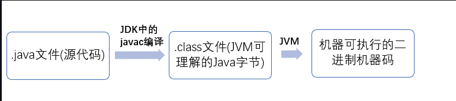
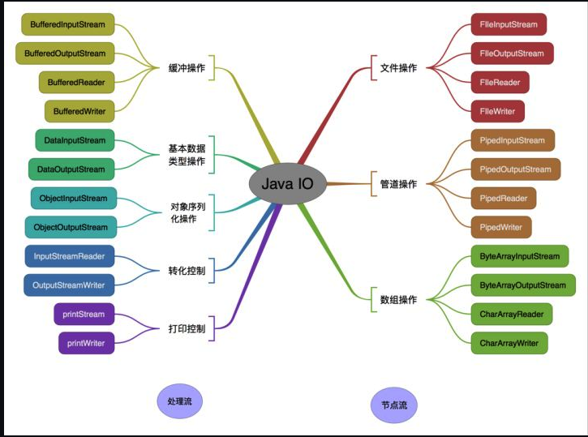
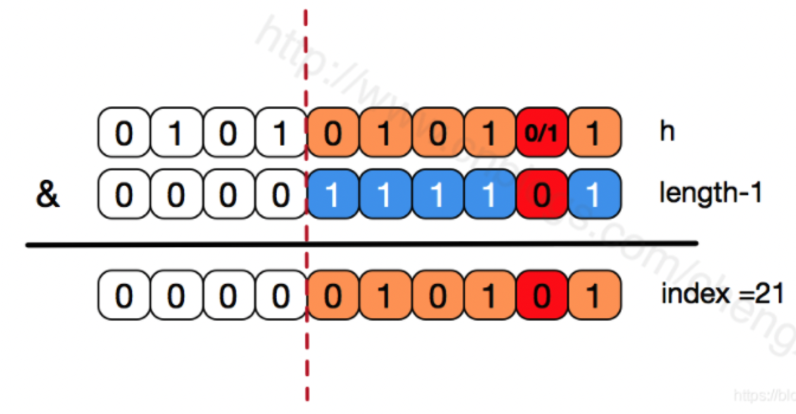
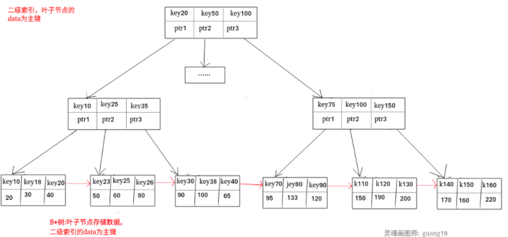
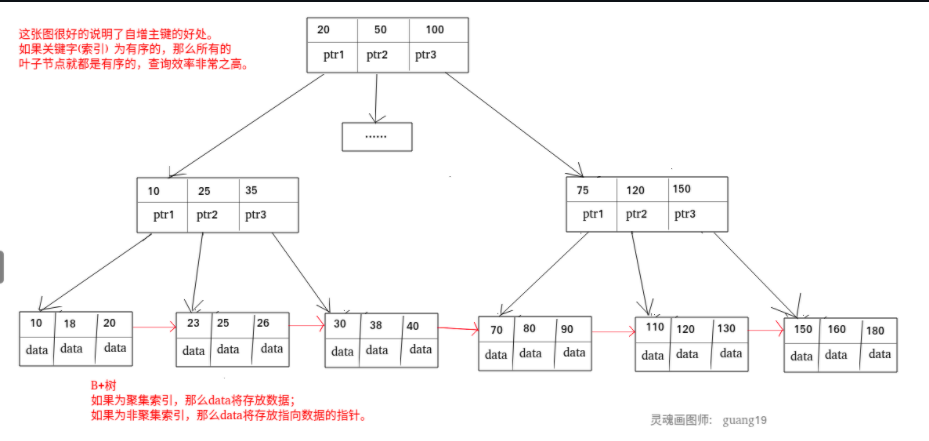
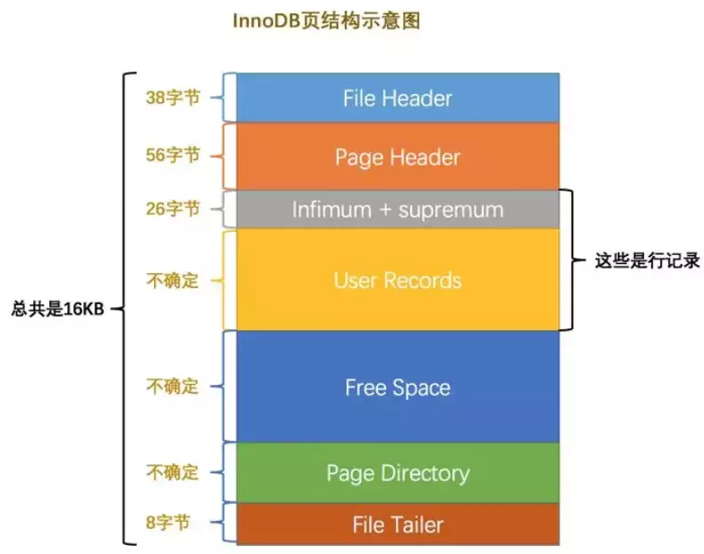
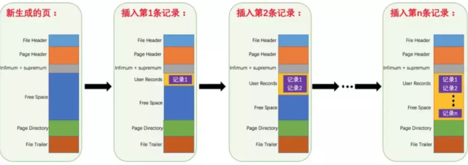
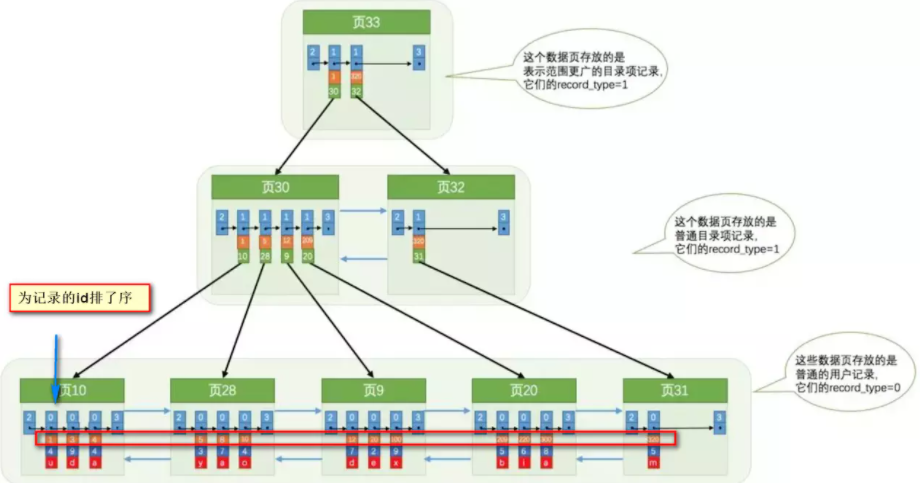
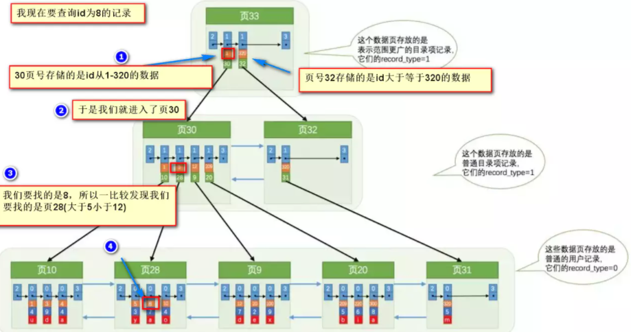
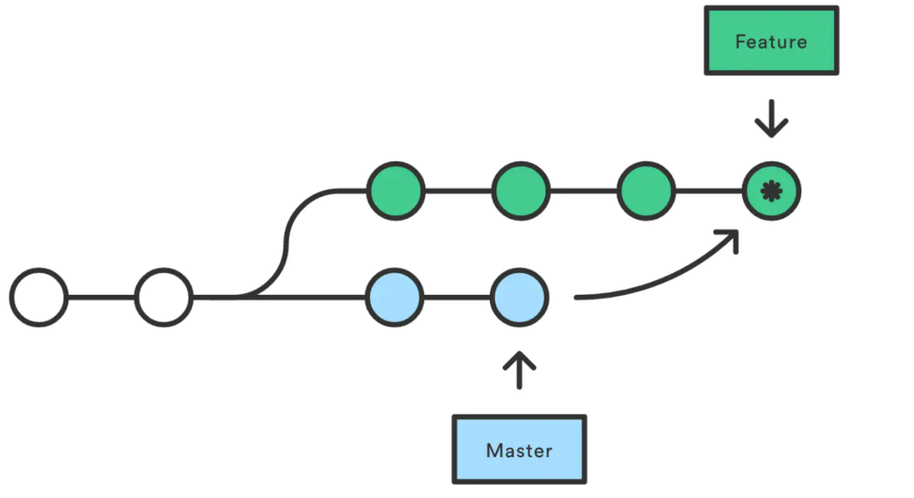

# Java源码

## Java基础

### ~~1、Java语言特点~~

1. ~~简单易学；~~
2. ~~面向对象（封装，继承，多态）；~~
3. ~~平台无关性（ Java 虚拟机实现平台无关性）；~~
4. ~~可靠性；~~
5. ~~安全性；~~
6. ~~支持多线程（ C++ 语言没有内置的多线程机制，因此必须调用操作系统的多线程功能来进行多线程程序设计，而 Java 语言却提供了多线程支持。注：C++11引入了多线程库）；~~
7. ~~支持网络编程并且很方便（ Java 语言诞生本身就是为简化网络编程设计的，因此 Java 语言不仅支持网络编程而且很方便）；~~
8. 编译与解释并存；


### 2、JVM、JDK和JRE

#### JVM

~~Java 虚拟机（JVM）是运行 Java 字节码的虚拟机。JVM 有针对不同系统的特定实现，目的是使用相同的字节码，它们都会给出相同的结果。字节码和不同系统的 JVM 实现是 Java 语言“一次编译，随处可以运行”的关键所在。~~

#### 补充：什么是字节码?采用字节码的好处是什么?

在 Java 中，JVM 可以理解的代码就叫做`字节码`（即扩展名为 `.class` 的文件），它不面向任何特定的处理器，只面向虚拟机。Java 语言通过字节码的方式，在一定程度上解决了传统解释型语言执行效率低的问题，同时又保留了解释型语言可移植的特点。所以 Java 程序运行时比较高效，而且，由于字节码并不针对一种特定的机器，因此，Java 程序无须重新编译便可在多种不同操作系统的计算机上运行。

**Java 程序从源代码到运行一般有下面 3 步：**



我们需要格外注意的是 .class->机器码 这一步。在这一步 JVM 类加载器首先加载字节码文件，然后**通过解释器逐行解释执行**，这种方式的执行速度会相对比较慢。而且，有些方法和代码块是经常需要被调用的(也就是所谓的**热点代码**)，所以后面引进了 JIT 编译器，而 **JIT 属于运行时编译**。当 JIT 编译器完成第一次编译后，其会将字节码对应的机器码保存下来，下次可以直接使用。而我们知道，机器码的运行效率肯定是高于 Java 解释器的。这也解释了我们为什么经常会说 Java 是**编译与解释共存**的语言。

~~HotSpot 采用了惰性评估(Lazy Evaluation)的做法，根据二八定律，消耗大部分系统资源的只有那一小部分的代码（热点代码），而这也就是 JIT 所需要编译的部分。JVM 会根据代码每次被执行的情况收集信息并相应地做出一些优化，因此执行的次数越多，它的速度就越快。JDK 9 引入了一种新的编译模式 AOT(Ahead of Time Compilation)，它是直接将字节码编译成机器码，这样就避免了 JIT 预热等各方面的开销。JDK 支持分层编译和 AOT 协作使用。但是 ，AOT 编译器的编译质量是肯定比不上 JIT 编译器的。~~

#### JDK

JDK 是 Java Development Kit 缩写，它是功能齐全的 Java SDK。它拥有 JRE 所拥有的一切，还有编译器（javac）和工具（如 javadoc 和 jdb）。它能够创建和编译程序。

#### JRE

JRE （Java Runtime Environment）是 Java 运行时环境。它是运行已编译 Java 程序所需的所有内容的集合，包括 Java 虚拟机（JVM），Java 类库，java 命令和其他的一些基础构件。但是，它不能用于创建新程序。


### 3、~~Oracle JDK和OpenJDK的对比~~

对于 Java 7，没什么关键的地方。OpenJDK 项目主要基于 Sun 捐赠的 HotSpot 源代码。此外，OpenJDK 被选为 Java 7 的参考实现，由 Oracle 工程师维护。

问：OpenJDK 存储库中的源代码与用于构建 Oracle JDK 的代码之间有什么区别？

非常接近 - 我们的 Oracle JDK 版本构建过程基于 OpenJDK 7 构建，只添加了几个部分，例如部署代码，~~其中包括 Oracle 的 Java 插件和 Java WebStart 的实现，以及一些封闭的源代码派对组件，如图形光栅化器，一些开源的第三方组件，如 Rhino，以及一些零碎的东西，如附加文档或第三方字体。展望未来，我们的目的是开源 Oracle JDK 的所有部分，除了我们考虑商业功能的部分。~~

1. OpenJDK 是一个参考模型并且是完全开源的，而 Oracle JDK 是 OpenJDK 的一个实现，并不是完全开源的；
2. Oracle JDK 比 OpenJDK 更稳定。OpenJDK 和 Oracle JDK 的代码几乎相同，但 Oracle JDK 有更多的类和一些错误修复。因此，如果想开发企业/商业软件，建议选择 Oracle JDK，因为它经过了彻底的测试且稳定。某些情况下，有些人提到在使用 OpenJDK 可能会遇到了许多应用程序崩溃的问题，但是，只需切换到 Oracle JDK 就可以解决问题；
3. 在响应性和 JVM 性能方面，Oracle JDK 与 OpenJDK 相比提供了更好的性能；
4. Oracle JDK 不会为即将发布的版本提供长期支持，用户每次都必须通过更新到最新版本获得支持；
5. Oracle JDK 根据二进制代码许可协议获得许可，而 OpenJDK 根据 GPL v2 许可获得许可。


### 4、~~Java和C++的区别？~~

* 都是面向对象的语言，都支持封装、继承和多态
* Java 不提供指针来直接访问内存，程序内存更加安全
* Java 的类是单继承的，C++ 支持多重继承；虽然 Java 的类不可以多继承，但是可以实现多个接口。
* Java 有自动内存管理垃圾回收机制(GC)，不需要程序员手动释放无用内存


### 5、~~import java 和 import javax有什么区别？~~

~~刚开始的时候 JavaAPI 所必需的包是 java 开头的包，javax 当时只是扩展 API 包来使用。然而随着时间的推移，javax 逐渐地扩展成为 Java API 的组成部分。但是，将扩展从 javax 包移动到 java 包确实太麻烦了，最终会破坏一堆现有的代码。因此，最终决定 javax 包将成为标准 API 的一部分。~~

~~所以，实际上 java 和 javax 没有区别。这都是一个名字。~~


### 6、为什么说 Java 语言“编译与解释并存”？

高级编程语言按照程序的执行方式分为**编译型**和**解释型**两种。简单来说，编译型语言是指编译器针对特定的操作系统将源代码一次性翻译成可被该平台执行的机器码；解释型语言是指解释器对源程序逐行解释成特定平台的机器码并立即执行。

Java 语言既具有编译型语言的特征，也具有解释型语言的特征，因为 Java 程序要经过先编译，后解释两个步骤，由 Java 编写的程序需要先经过编译步骤，生成字节码（*.class 文件），这种字节码必须由 Java 解释器来解释执行。因此，我们可以认为 Java 语言编译与解释并存。


### 7、字符型常量和字符串常量的区别？


## 文件与I/O流

### 1、Java中IO流分为几种？

*   按照**流的方向**划分，分为**输入流**和**输出流**
*   按照**操作单元**划分，分为**字节流**和**字符流**
*   按照**流的角色**划分，分为**节点流**和**处理流**

Java IO 流共涉及 40 多个类，这些类看上去很杂乱，但实际上很有规则，而且彼此之间存在非常紧密的联系， Java I0 流的 40 多个类都是从4 个抽象类基类中派生出来的。这4个抽象类基类是：

*   InputStream/Reader: 所有的输入流的基类，前者是字节输入流，后者是字符输入流。
*   OutputStream/Writer: 所有输出流的基类，前者是字节输出流，后者是字符输出流。

按操作方式分类结构图：


按操作对象分类结构图：




#### 补充：既然有了字节流，为什么还要有字符流

问题本质：**不管是文件读写还是网络发送接收，信息的最小存储单元都是字节，那为什么 I/O 流操作要分为字节流操作和字符流操作呢？**

字符流是由 Java 虚拟机将字节转换得到的，问题就出在这个过程还算是非常**耗时**，并且，如果我们不知道编码类型就很容易出现**乱码**问题。所以， I/O 流就干脆提供了一个直接操作字符的接口，方便我们平时对字符进行流操作。如果音频文件、图片等媒体文件用字节流比较好，如果涉及到字符的话使用字符流比较好。


### 2、同步和异步的区别

*   同步：发送一个请求，等待返回，再发送下一个请求，同步可以避免出现死锁，脏读的发生。
*   异步：发送一个请求，不等待返回，随时可以再发送下一个请求，可以提高效率，保证并发。


### 3、 阻塞和非阻塞

*   阻塞：传统的IO流都是阻塞式的。也就是说，当一个线程调用read()或者write()方法时，该线程将被阻塞，直到有一些数据读取或者被写入，在此期间，该线程不能执行其他任何任务。在网络通信进行IO操作时，由于线程会阻塞，所以服务器端必须为每个客户端都提供一个独立的线程进行处理，当服务器端需要处理大量的客户端时，性能急剧下降。
*   非阻塞：当线程从某通道进行读写数据时，若没有数据可用时，该线程会去执行其他任务。线程通常将非阻塞IO的空闲时间用在其他通道上执行IO操作，所以单独的线程可以管理多个输入和输出通道。Java NIO是非阻塞式的，因此NIO可以让服务器端使用一个或有限几个线程来同时处理连接到服务器端的所有客户端。


### 4、IO和NIO的区别

首先说下核心区别：NIO是以**块**的方式处理数据，但是IO是以最基础的**字节流**的形式写入和读出的。所以在效率上的话，肯定是NIO效率比IO效率会高出很多。

其次就是说，NIO不再是和IO一样用OutputStream和InputStream输入输出流的形式来处理数据的，而是采用了**通道**和**缓冲区**的形式来进行数据处理的。

还有一点是NIO的通道是可以双向的，但是IO中的流只能是单向的。

~~NIO的缓冲区（其实就是一个**字节数组**），还可以进行**分片**，可以建立只读缓冲区、直接缓冲区和间接缓冲区，只读缓冲区很明显就是字面意思，直接缓冲区是为了加快I/O的速度，而以一种特殊的方式分配其内存的缓冲区。~~

补充一点：NIO比传统的BIO核心区别就是，**NIO采用的是多路复用的IO模型，普通的IO用的是阻塞的IO模型**，两个之间的效率肯定是多路复用效率更高


#### 补充：通道和缓冲区的概念

*   通道（Channel）：通道就是对原I/O包中的流的模拟。到任何目的地（或来自任何地方）的所有数据都必须通过一个Channel对象，也就是通道。发送给一个通道的所有对象都必须首先放到缓冲区中；同样的，从通道中读取的任何数据都要读到缓冲区中。通道和流的不同之处在于**通道是双向的**，流只是在一个方向移动，而且**通道可以用于读、写或者同时读写**。所有数据都通过Buffer对象来处理。也就是说，我永远不会将字节直接写入通道中，而是将数据写入包含一个或者多个字节的缓冲区。同样，我也不会直接从通道中读取字节，而是将数据从通道读取缓冲区，再从缓冲区获取这个字节。
    *   通道的类型：FileChannel（是从文件中读取数据）、DatagramChannel（从UDP网络中读取或者写入数据）、SocketChannel（从TCP网络中读取或者写入数据）、ServerSocketChannel（允许你监听来自TCP的连接，就像服务器一样。每一个连接都会有一个SocketChannel产生）
*   缓冲区（Buffer）：Buffer 是一个对象， 它包含一些要写入或者刚读出的数据。在面向流的 I/O 中，我将数据直接写入或者将数据直接读到 Stream 对象中。而在 NIO 库中，所有数据都是由缓冲区处理的。在读取数据时，它是直接读到缓冲区中的。在写入数据时，它是写入到缓冲区中的。任何时候访问 NIO 中的数据，我都是将它放到缓冲区中。缓冲区实质上是一个数组。通常它是一个**字节数组**，但是也可以使用其他种类的数组。**但是一个缓冲区不仅仅是一个数组。缓冲区提供了对数据的结构化访问，而且还可以跟踪系统的读/写进程**。
    *   缓冲区的类型：ByteBuffer、CharBuffer、ShortBuffer、IntBuffer、LongBuffer、FloatBuffer、DoubleBuffer


#### 补充：多路复用器Selector


### 5、BIO、NIO、AIO有什么区别

*   **BIO (Blocking I/O)**：**同步阻塞 I/O 模式**，数据的读取写入必须阻塞在一个线程内等待其完成。在活动连接数不是特别高（小于单机 1000）的情况下，这种模型是比较不错的，可以让每一个连接专注于自己的 I/O 并且编程模型简单，也不用过多考虑系统的过载、限流等问题。线程池本身就是一个天然的漏斗，可以缓冲一些系统处理不了的连接或请求。但是，当面对十万甚至百万级连接的时候，传统的 BIO 模型是无能为力的。因此，我们需要一种更高效的 I/O 处理模型来应对更高的并发量。（BIO方式适用于连接数目比较小且固定的框架，这种方式对服务器资源要求比较高，并发局限于应用中。）
*   **NIO (Non-blocking)**：NIO 是一种**同步非阻塞**的 I/O 模型，在 Java 1.4 中引入了 NIO 框架，对应 java.nio 包，提供了 Channel , Selector，Buffer 等抽象。它支持**面向缓冲的，基于通道**的 I/O 操作方法。 ~~NIO 提供了与传统 BIO 模型中的 `Socket` 和 `ServerSocket` 相对应的 `SocketChannel` 和 `ServerSocketChannel` 两种不同的套接字通道实现，两种通道都支持阻塞和非阻塞两种模式。~~阻塞模式使用就像传统中的支持一样，比较简单，但是性能和可靠性都不好；非阻塞模式正好与之相反。对于低负载、低并发的应用程序，可以使用同步阻塞 I/O 来提升开发速率和更好的维护性；对于高负载、高并发的（网络）应用，应使用 NIO 的非阻塞模式来开发。（NIO方式适用于连接数目多且连接比较短（轻操作）的架构，比如聊天服务器，并发局限于应用中，编程比较复杂。）
*   **AIO (Asynchronous I/O)**：~~AIO 也就是 NIO 2。在 Java 7 中引入了 NIO 的改进版 NIO 2，~~它是**异步非阻塞的 IO 模型**。异步 IO 是**基于事件和回调机制**实现的，也就是应用操作之后会直接返回，不会堵塞在那里，当后台处理完成，操作系统会通知相应的线程进行后续的操作。虽然 NIO 在网络操作中，提供了非阻塞的方法，但是 **NIO 的 IO 行为还是同步的**。对于 NIO 来说，我们的业务线程是在 IO 操作准备好时，得到通知，接着就由这个线程自行进行 IO 操作，IO 操作本身是同步的。（AIO方式适用于连接数目多且连接比较长（重操作）的架构，比如相册服务器，充分调用OS参与并发操作，编程比较复杂。）


#### 补充：异步非阻塞与同步非阻塞的区别在哪里？

异步非阻塞无需一个线程去轮询所有IO操作的状态改变，在相应的状态改变后，系统会通知对应的线程来处理。


## Hash

### 1、HashMap


#### 为何负载因子默认为0.75？

通过源码里的javadoc注释看到，元素在哈希表中分布的桶频率服从参数为0.5的泊松分布。默认负载因子（0.75）在时间和空间成本之间提供了一个很好的折衷方案。较高的值会减少空间开销，但会增加查找成本（在HashMap类的大多数操作中都得到体现，包括get和put）。设置其初始容量时，应考虑映射中的预期条目数及其负载因子，以最大程度地减少重新哈希操作的次数。如果初始容量大于最大条目数除以负载因子，则将不会进行任何重新哈希操作。


#### 为何数组容量必须是2的n次幂？/在寻找元素索引的时候，为什么要将length - 1再与h与（&）呢（h & (length - 1)）？

1.  使元素分布的更加均匀
2.  在扩容的时候，能保证新数组的索引和老数组的索引一致，减少时间消耗。

因为数组的长度时2的n次方，用它减1操作才能得到二进制全为1的值（低位全为1），这样用它和hashcode值进行按位与（&）运算能够快速得到桶的下标，并且还是分布均匀的。否则如果出现0的话，任何值和0按位与都是0，这样有些桶将会永远是空着的。

比如16的二进制表示为 10000，那么length-1就是15，二进制为01111，同理扩容后的数组长度为32，二进制表示为100000，length-1为31，二进制表示为011111。这样会保证低位全为1，而扩容后只有一位差异，也就是多出了最左位的1，这样在通过 h&(length-1)的时候，只要h对应的最左边的那一个差异位为0，就能保证得到的新的数组索引和老数组索引一致(大大减少了之前已经散列良好的老数组的数据位置重新调换)。


还有，数组长度保持2的次幂，length-1的低位都为1，会使得获得的数组索引index更加均匀


我们看到，上面的&运算，高位是不会对结果产生影响的（hash函数采用各种位运算可能也是为了使得低位更加散列），我们只关注低位bit，如果低位全部为1，那么对于h低位部分来说，任何一位的变化都会对结果产生影响，也就是说，要得到index=21这个存储位置，h的低位只有这一种组合。这也是数组长度设计为必须为2的次幂的原因。



如果不是2的次幂，也就是低位不是全为1此时，要使得index=21，h的低位部分不再具有唯一性了，哈希冲突的几率会变的更大，同时，index对应的这个bit位无论如何不会等于1了，而对应的那些数组位置也就被白白浪费了。


#### 为什么对hashcode还要做一次hash操作呢？

因为如果不做hash操作的话，只有低位的值参与了hash的运算，而高位的值没有参加运算。hash方法是让高位的数字也参加hash运算。

假如：数组的长度是16 我们会发现hashcode为5和53的散列到同一个位置. 

hashcode: 53 00000000 00000000 00000000 00110101 

hashcode: 5  00000000 00000000 00000000 00000101

length-1: 15   00000000 00000000 00000000 00001111 

只要hashcode值的最后4位是一样的，那么他们就会散列到同一个位置。 

hash方法是通过一些位运算符，让高位的数值也尽可能的参加到运算中，让它尽可能的散列到table数组上，减少hash冲突。


#### 重写equals方法需同时重写hashCode方法

尽管我们在进行get和put操作的时候，使用的key从逻辑上讲是等值的（通过equals比较是相等的），但由于没有重写hashCode方法，所以put操作时，key(hashcode1)–>hash–>indexFor–>最终索引位置 ，而通过key取出value的时候 key(hashcode2)–>hash–>indexFor–>最终索引位置，由于hashcode1不等于hashcode2，导致没有定位到同一个数组位置而返回逻辑上错误的值null（也有可能碰巧定位到一个数组位置，但是也会判断其entry的hash值是否相等，上面get方法中有提到。）

所以，在重写equals的方法的时候，必须注意重写hashCode方法，同时还要保证通过equals判断相等的两个对象，调用hashCode方法要返回同样的整数值。而如果equals判断不相等的两个对象，其hashCode可以相同（只不过会发生哈希冲突，应尽量避免）。


#### JDK1.8中HashMap的性能优化

**假如一个数组槽位上链上数据过多（即拉链过长的情况）导致性能下降该怎么办？**

JDK1.8在JDK1.7的基础上针对增加了红黑树来进行优化。即当链表超过8时，链表就转换为红黑树，利用红黑树快速增删改查的特点提高HashMap的性能，其中会用到红黑树的插入、删除、查找等算法。

**注意：**

*   HashMap在jdk1.7中采用**表头插入法**，在扩容时会**改变**链表中元素原本的顺序，以至于在并发场景下导致链表成环的问题。
*   在jdk1.8中采用的是**尾部插入法**，在扩容时会保持链表元素原本的顺序，就不会出现链表成环的问题了。


### 2、HashMap和CurrentHashMap 哪个是线程安全的，详细展开

HashMap不是线程安全的，CurrentHashMap是线程安全的。

*   HashMap

    *   **哈希碰撞会导致hashmap的线程不安全**。现在假设A线程和B线程同时对同一个数组位置（即相同哈希码位置）调用addEntry，且该位置还没有其他的数据。假设一种情况，线程A通过if判断，该位置没有哈希冲突，进入了if语句，还没有进行数据插入，这时候CPU就把资源让给了线程B，线程A停在了if语句里面，线程B判断该位置也没有哈希冲突（线程A的数据还没有插入），也进入了if语句，线程B执行完后，轮到线程A执行，现在线程A直接在该位置插入而不用再判断。这时候，就会发现线程A把线程B插入的数据给覆盖了。发生了线程不安全的情况。本来在HashMap中，发生哈希冲突时可以用链表法或者红黑树来解决的，但是在多线程中，可能就直接给覆盖了。
    *   还有两处可能不安全：**在扩容的时候插入数据，有可能会把新插入的覆盖住；在扩容的时候删除数据，会删除不了**。如果我在扩容的时候，在数据从旧数组复制到新数组过程中，这时候某个线程插入一条数据，这时候是插入到新数组中，但是在数据复制过程中，HashMap是不会检查新数组上的位置是否为空的，所以新插入的数据会被后面从旧数组中复制过来的数据覆盖住。还有如果在数组刚新建完后，某个线程就立刻想删除以前插入的某个元素，你就会发现删除不了，因为table指向了新数组，而这时候新数组还没有数据。

    （解决方案：加同步锁。要注意用读写锁，即：多个线程可以同时读，但只有一个线程可同时写。不然数据量大的时候也会影响性能。）

*   CurrentHashMap

    *   在说ConcurrentHashMap之前，要先提到一个HashTable的数据结构。之前也说了，HashMap是一个非线程安全的数据结构，而HashTable则解决了这个问题，它是一个线程安全的数据结构，它采用和HashMap相同的存储机制，只不过内部的方法都是经过**synchronized**的修饰。但是因为同步和哈希的原因，HashTable的性能远不及HashMap。所以为了进一步的改进，就弄了一个ConcurrentHashMap的数据结构。ConcurrentHashMap也是线程安全的。**在HashTable中，synchronized关键字其实是对整个对象进行加锁**，当HashTable的大小增加到一定时，性能会急剧下降。而ConcurrentHashMap引入了**分割（Segment）**，然后在每一个分段上都用**lock锁**进行保护，相对HashTable的synchronized同步锁锁住整个对象而言，ConcurrentHashMap的锁的粒度更精细些，并发性能更好，实现了**锁分离技术**和**锁分段技术**。
    *   还有一个就是说HashMap的键值对允许有null，但是ConcurrentHashMap都不允许。
    *   ConcurrentHashMap通过把整个Map分为N个Segment，可以保证线程安全。**读操作不加锁，由于HashEntry的value变量是volatile的，也能保证读取到最新的值**。
    *   但是有些地方需要跨段，比如size()和containsValue()，它们可能需要锁定整个表而不仅仅是某个段，这需要**按顺序**锁定所有段，操作完毕后，又按顺序释放所有段的锁。
    *   ConcurrentHashMap的扩容：**段内扩容**（段内元素超过该段对应的Entry数组长度的75%触发扩容，不会对整个Map进行扩容），插入前检测需不需要扩容，有效避免无效扩容。


#### 补充：HashMap和HashTable的对比

HashTable和HashMap采用相同的存储机制，二者的实现基本一致，不同的是：

1.  HashMap是非线程安全的，HashTable是线程安全的，内部的方法基本都经过synchronized的修饰。
2.  因为同步、哈希性能等原因，性能肯定是HashMap更佳。
3.  HashMap允许有null值的存在，而HashTable的键值对不允许有null值。
4.  HashMap默认初始化数组的大小为16，HashTable为11。前者扩容时乘2，使用位运算取得哈希，效率高于取模。而后者为乘2加1，都是素数和奇数，这样取模哈希结果更均匀。

两者的hash算法比较：

```java
//HashMap的散列函数，这里传入参数为键值对的key
static final int hash(Object key) {
    int h;
    return (key == null) ? 0 : (h = key.hashCode()) ^ (h >>> 16);
}
//返回hash值的索引，h & (length-1)操作等价于 hash % length操作， 但&操作性能更优
static int indexFor(int h, int length) {
    // length must be a non-zero power of 2
    return h & (length-1);
}

//HashTable的散列函数直接在put方法里实现了
int hash = key.hashCode();
int index = (hash & 0x7FFFFFFF) % tab.length;
```


#### 补充：HashTable和ConcurrentHashMap的对比

CurrentHashMap也是线程安全的。HashTable里面使用的是synchronized关键字，其实是对整个对象加锁，当HashTable的大小增加到一定的时候，性能会急剧下降。ConcurrentHashMap算得上是对上述问题的优化。

ConcurrentHashMap引入了分割（Segment），把一个大的Map拆分成N个小的HashTable，在put方法中，会根据hash(paramK.hashCode())来决定具体存放进哪个Segment，如果查看Segment的put操作，我们会发现内部使用的同步机制是基于lock操作的，这样就可以对Map的一部分（Segment）进行上锁，这样影响的只是将要放入同一个Segment的元素的put操作，保证同步的时候，锁住的不是整个Map（HashTable就是这么做的），相对于HashTable提高了多线程环境下的性能。

**ConcurrentHashMap的put和get** ：

```java
1. int hash = hash(key.hashCode());  
2. return segmentFor(hash).get(key, hash);
```

可以发现ConcurrentHashMap通过一次hash，两次定位来找到具体的值的。 先通过segmentFor方法定位到具体的Segment，再在Segment内部定位到具体的HashEntry，而第二次在Segment内部定位的时候是加锁的。 

ConcurrentHashMap的hash算法比HashMap的hash算法更复杂，应该是想让他能够更好的散列到数组上，减少hash冲突。


#### HashMap和Segment里modCount的区别

modCount都是记录table结构被修改的次数，但是对这个次数的处理上，HashMap和Segment是不一样的。 

HashMap在遍历数据的时候，会判断modCount是否被修改了，如果被修改的话会抛出ConcurrentModificationException异常。 

Segment的modCount在ConcurrentHashMap的containsValue、isEmpty、size方法中用到，ConcurrentHashMap先在不加锁的情况下去做这些计算，如果发现有Segment的modCount被修改了，会再重新获取锁计算。


### 3、HashMap和TreeMap的区别

1.  先看HashMap的定义：`public class HashMap<K,V> extends AbstractMap<K,V> implements Map<K,V>, Cloneable, Serializable`

    再看TreeMap的定义：`public class TreeMap<K,V> extends AbstractMap<K,V> implements NavigableMap<K,V>, Cloneable, java.io.Serializable`

    从类的定义来看，HashMap和TreeMap都继承自AbstractMap，不同的是HashMap实现的是Map接口，而TreeMap实现的是NavigableMap接口。**NavigableMap是SortedMap的一种，实现了对Map中key的排序**。即TreeMap是排序的而HashMap不是。

2.  HashMap的底层结构是Node的数组： `transient Node<K,V>[] table`

    TreeMap和HashMap不同的是，TreeMap的底层是一个Entry： `private transient Entry<K,V> root`。它的实现是一个红黑树，方便用来遍历和搜索。

    TreeMap的构造函数可以传入一个Comparator，实现自定义的比较方法。`public TreeMap(Comparator<? super K> comparator) { this.comparator = comparator; }`

    如果不提供自定义的比较方法，则使用的是key的natural order，即自然顺序。

*   排序区别：TreeMap输出的结果是排好序的，而HashMap的输出结果是不定的。
*   NULL值的区别：HashMap可以允许一个null key和多个null value。而TreeMap不允许null key，但是可以允许多个null value。
*   性能区别：HashMap的底层是Array，所以HashMap在添加，查找，删除等方法上面速度会非常快。而**TreeMap的底层是一个Tree结构**，所以速度会比较慢。另外HashMap因为要保存一个Array，所以会造成空间的浪费，而TreeMap只保存要保持的节点，所以占用的空间比较小。HashMap如果出现hash冲突的话，效率会变差，不过在java 8进行TreeNode转换之后，效率有很大的提升。TreeMap在添加和删除节点的时候会进行重排序，会对性能有所影响。
*   两者都不允许duplicate key，两者都不是线程安全的


## 并发

### 1、并发与并行

1.  并发就是在一段时间内，以**交替**的方式去完成多个任务，而并行就是**以齐头并进的方式**去完成多个任务。
2.  如果一个任务的处理，可以由串行改为并发（或并行），那么就称这个任务可并发化。
3.  并发的极致是并行。


### 2、可重入性

可重入性是指**一条线程能够反复进入被它自己持有锁的同步块**的特性，即锁关联的计数器，如果持有锁的线程再次获得它，则将计数器的值加一，每次释放锁时计数器的值减一，当计数器的值为零时，才能真正释放锁。


### CAS与原子变量

1.  是对一种处理器指令的称呼
2.  ~~CAS能够将read-modify-write和check-then-act之类的操作转换为原子操作~~。
3.  CAS只是保证了共享变量更新这个操作的原子性，它并不保证可见性。


### 轻量级同步机制：volatile关键字

volatile字面是“易挥发”，引伸开来就是“不稳定”的意思。

-   用于**修饰共享可变变量**，即没有使用final关键字修饰的实例变量或静态变量。
-   volatile变量的不稳定性，意味着这种变量的读和写操作都必须从**主内存**中读取，以读取变量的**相对新值**。因此变量不会被分配到寄存器进行存储。
-   此关键字常被称为轻量级锁
    -   其作用与锁的作用有相同的地方：保障可见性和有序性。不同的地方：在原子性方面，仅保障写volatile变量操作的原子性，但没有锁的排他性。
    -   volatile关键字的使用，不会引起上下文的切换（这是volatile被冠以“轻量级”锁的原因）


### volatile的作用

1.  保障可见性、保障有序性、保障long/double型变量读写操作的原子性

2.  volatile仅仅保障对其修饰的变量的写操作以及读操作的原子性，而这并不表示对volatile变量的赋值操作一定具有原子性。如：count = count + 1;

3.  对volatile变量赋值，其右边表达式中只要涉及共享变量（包括被赋值的volatile变量本身），那么这个赋值操作也不是原子操作。

4.  volatile关键字在原子性方面，仅保障对被修饰的变量的读操作、写操作本身的原子性。如果要保障对volatile变量赋值操作的原子性，那么这个赋值操作不能涉及任何共享变量（包括自身）。

5.  对volatile变量的写操作：

    *   Java虚拟机会在该操作之前插入一个**释放屏障**，并在该操作之后，插入一个**存储屏障**。

    -   释放屏障禁止了对volatile写操作与该操作之前对任何读、写操作进行重排序。保证了volatile写操作之前的任何读、写操作会先于volatile写操作被提交，即之前的写操作对之后的读写线程可见。
    -   存储屏障具有冲刷处理器缓存的作用，因此变量写操作之后插入一个存储屏障，就使得该存储屏障前所有操作的结果（包括写操作和之前的任何操作），对其他处理器来说是可同步的。

6.  对volatile变量的读操作：

    *   JVM会在该操作之前，插入一个**加载屏障**，并在该操作之后，插入一个**获得屏障**。

    -   加载屏障：通过冲刷处理器缓存，使其执行线程（读线程）所在的处理器将其他处理器对共享变量（可能是多个变量）所做的更新同步到该处理器的高速缓存中。
    -   读线程执行的加载屏障和写线程执行的存储屏障，配合在一起使得写线程对volatile变量的写操作以及之前所执行的其他内存操作的结果对读线程可见。即保障了可见性。

7.  volatile禁止了如下重排序：

    *   写volatile变量操作与该操作之前的任何读，写操作不会被重排序

    -   读volatile变量操作与该操作之后的任何读，写操作不会被重排序
    -   作用体现在对其所修饰的变量的读、写操作上。
    -   如果修饰的变量是个数组，volatile只能够对数组引用本身的操作（读数组引用和更新数组引用）起作用，而无法对数组元素的操作起作用。
    -   对于引用型volatile变量，volatile关键字只是保证读线程能够读取到一个指向对象的相对新的内存地址，而这个内存地址指向的对象的实例/静态变量值是否是相对新的，则没有保障。


### 原子类操作：原子变量类

1.  原子变量类，是基于CAS实现的，并能够保障对共享变量进行read-modify-write更新操作的原子性和可见性的一组工具类。
2.  变量内部实现通常借助一个volatile变量并保障对该变量read-modify-write更新操作的原子性，因此可看作增强型的volatile变量。
3.  CAS实现原子操作背后一个假设：共享变量的当前值与当前线程所提供的旧值相同，我们就认为这个变量没有被其他线程修改过。实际上这个假设并不总是成立。
4.  ABA问题，共享变量经历了A-B-A的更新。规避ABA问题也不难，为共享变量的更新加入一个（版本号）也叫时间戳。AtomicStampedReference类就是基于这种思想产生的。


### 乐观锁和悲观锁

乐观锁和悲观锁是两种思想，用于解决并发场景下的数据竞争问题。

*   乐观锁：乐观锁在操作数据时非常乐观，认为别人不会同时修改数据。因此乐观锁不会上锁，只是在执行更新的时候判断一下在此期间别人是否修改了数据：如果别人修改了数据则放弃操作，否则执行操作。
*   悲观锁：悲观锁在操作数据时比较悲观，认为别人会同时修改数据。因此操作数据时直接把数据锁住，直到操作完成后才会释放锁；上锁期间其他人不能修改数据。

乐观锁和悲观锁是两种思想，它们的使用是非常广泛的，不局限于某种编程语言或数据库。

悲观锁的实现方式是加锁，加锁既可以是对代码块加锁（如Java的synchronized关键字），也可以是对数据加锁（如MySQL中的排它锁）。

乐观锁的实现方式主要有两种：CAS机制和版本号机制。

1.  CAS（Compare And Swap）

    CAS操作包括了3个操作数：

    *   需要读写的内存位置（V）
    *   进行比较的预期值（A）
    *   拟写入的新值（B）

    CAS操作逻辑如下：如果内存位置V的值等于预期的A值，则将该位置更新为新值B，否则不进行任何操作。许多CAS的操作是自旋的：如果操作不成功，会一直重试，知道操作成功为止。

    这里引出一个新的问题，既然CAS包含了Compare和Swap两个操作，它又如何保证原子性呢？答案是：**CAS是由CPU支持的原子操作，其原子性是在硬件层面进行保证的**。

2.  版本号机制

    除了CAS，版本号机制也可以用来实现乐观锁。版本号机制的基本思路是在数据中增加一个字段version，表示该数据的版本号，每当数据被修改，版本号加1。当某个线程查询数据时，将该数据的版本号一起查出来；当该线程更新数据时，判断当前版本号与之前读取的版本号是否一致，如果一致才进行操作。

    需要注意的是，这里使用了版本号作为判断数据变化的标记，实际上可以根据实际情况选用其他能够标记数据版本的字段，如时间戳等。

优缺点和适用场景：

乐观锁和悲观锁并没有优劣之分，它们有各自适合的场景；下面从两个方面进行说明。

1.  功能限制

    与悲观锁相比，乐观锁适用的场景受到了更多的限制，无论是CAS还是版本号机制。

    例如，CAS只能保证单个变量操作的原子性，当涉及到多个变量时，CAS是无能为力的，而synchronized则可以通过对整个代码块加锁来处理。再比如版本号机制，如果query的时候是针对表1，而update的时候是针对表2，也很难通过简单的版本号来实现乐观锁。

2.  竞争激烈程度

    如果悲观锁和乐观锁都可以使用，那么选择就要考虑竞争的激烈程度：

    *   当竞争不激烈（出现并发冲突的概率小）时，乐观锁更有优势，因为悲观锁会锁住代码块或数据，其他线程无法同时访问，影响并发，而且加锁和释放锁都需要消耗额外的资源。
    *   当竞争激烈（出现并发冲突的概率大）时，悲观锁更有优势，因为乐观锁在执行更新时频繁失败，需要不断重试，浪费CPU资源。


#### 乐观锁加锁吗？

1.  乐观锁本身是不加锁的，只是在更新时判断一下数据是否被其他线程更新了；AtomicInteger便是一个例子
2.  有时乐观锁可能与加锁操作合作，（例如，在前述updateCoins()的例子中，MySQL在执行update时会加排它锁）。但这只是乐观锁与加锁操作合作的例子，不能改变“乐观锁本身不加锁”这一事实


#### CAS有哪些缺点？

1.  ABA问题

    假设有两个线程--线程1和线程2，两个线程按照顺序进行以下操作：

    1.  线程1读取内存中数据为A；
    2.  线程2将该数据修改为B；
    3.  线程2将该数据修改为A；
    4.  线程1对数据进行CAS操作

    在第4步中，由于内存中数据仍然为A，因此CAS操作成功，但实际上该数据已经被线程2修改过了。这就是ABA问题。

    在AtomicInteger的例子中，ABA似乎没有什么危害。但是在某些场景下，ABA却会带来隐患，例如栈顶问题：一个栈的栈顶经过两次（或多次）变化又恢复了原值，但是栈可能已经发生了变化。

    对于ABA问题，比较有效的方案时引入版本号，内存中的值每发生一次变化，版本号都+1；在进行CAS操作时，不仅比较内存中的值，也会比较版本号，只有当二者都没有变化时，CAS才能执行成功。Java中AtomicStampedReference类便是使用版本号来解决ABA问题的。

2.  高竞争下的开销问题

    在并发冲突概率大的竞争环境下，如果CAS一直失败，会一直重试，CPU开销较大。针对这一问题的一个思路时引入退出机制，如重试次数超过一定阈值后失败退出。当然，更重要的是避免在高竞争环境下使用乐观锁。

3.  功能限制

    CAS的功能是比较受限的，例如CAS只能保证**单个变量**（或者说单个内存值）操作的**原子性**，这意味着：（1）原子性**不一定能保证线程安全**，例如在Java中需要与volatile配合来保证线程安全；（2）当涉及到多个变量（内存值）时，CAS也无能为力。

    除此之外，CAS的实现需要**硬件层面处理器**的支持，在Java中普通用户无法直接使用，只能**借助atomic包下的原子类**使用，灵活性受到限制。


### 有多少种实现线程的方法？

方法一：实现Runnable接口   方法二：继承Thread类

但是看原理（源码），这两种实现方式的本质是一样的。Thread类里面有一个Runnable的成员类target，如果新建一个Thread对象的时候传入一个Runnable实例，就会初始化这个target，而Thread类里面的run()方法源码如下：

```java
public void run() {
    if (this.target != null) {
        this.target.run();
    }
}
```

总结：方法一和方法二，也就是“实现Runnable接口并传入Thread类”和“继承Thread类然后重写run()方法”在实现多线程的本质上并没有区别，都是最终调用了start()方法来新建线程。这两个方法主要的区别在于run()方法的内容来源：方法一：最终调用target.run()；方法二：run()整个被重写。

（除了以上两种方法，还有其他许多种方法，比如线程池、计时器、匿名内部类、lambda表达式等，但是细看源码之后发现，它们都没有逃脱出以上的本质）

总结：也就是说实现线程的方法其实只有一个，即通过Thread类来实现，只不过我们把它区分为两种方式，一种是实现Runnable接口，另一种就是继承Thread类。


### 实现Runnable接口和继承Thread类哪种方式更好？

实现Runnable接口更好。

1.  从代码架构角度

    首先一个就是具体的任务，也就是run()方法里面的内容， 还有一个就是线程的生命周期相关的东西，比如线程的创建、运行、销毁等，这些都应该是Thread类去做的事情，也就说这两个东西的目的不一样，站在代码架构的角度看的话应该要**解耦**。所以要使用Runnable接口方法。

2.  新建线程的损耗

    如果使用继承Thread类的方法，通常我们想新建任务的时候只能去new一个对象，这样做的损耗比较大，需要新建一个线程，执行完之后还要销毁。而如果我们使用实现Runnable接口的方式，传入实现Runnable接口的实例，我们就可以反复利用这同一个线程，比如线程池就是这么做的，这样一来，我们用于线程生命周期的损耗就减少了。

3.  Java不支持多重继承

    对于扩展性而言，java类在继承了Thread类之后就不能再继承其他的类了，这就大大限制了我们的扩展性。


### 一个线程两次调用start()方法会出现什么情况？为什么？

两次调用start()会抛出异常。从源码可以看出，start方法会先检查线程状态，只有new状态下的线程才能继续执行，否则会抛出IllegalThreadStateException的异常。

解析：

start()的源码：

```java
public synchronized void start() {
    if (threadStatus != 0) 
        throw new IllegalThreadStateException();
    group.add(this);

    boolean started = false;
    try {
        start0();
        started = true;
    } finally {
        try {
            if (!started) {
                group.threadStartFailed(this);
            }
        } catch (Throwable ignore) {
        }
    }
}

private native void start0();
```

从源码中我们可以看出，start方法首先会检查线程的状态，只有new状态下的线程才能继续执行，否则会抛出IllegalThreadStateException的异常，这表明在运行中或者已结束的线程，都不能再次启动。**启动之后，线程被加入线程组，然后再调用start0()方法启动线程**。

**注意**：start方法是被synchronized修饰的方法，可以保证线程安全。由JVM创建的main方法线程和system组线程，并不会通过start来启动。


### 引申问题：既然Thread.start()只能调用一次。那么线程池是如何实现线程复用的呢？

线程复用的核心是，**线程池对Thread做了包装，不重复调用thread.start()，而是自己有一个Runnable.run()，run方法里面循环在跑，跑的过程中不断检查我们是否有新加入的子Runnable对象，有新的Runnable进来的话就调一下我们的run()，其实就一个大的run()把其他小的run()#1, run()#2, ...给串联了起来**。**同一个Thread可以执行不同的Runnable，主要原因是线程池把线程和Runnable通过BlockingQueue给解耦了，线程可以从BlockingQueue中不断获取新任务**。


### 既然start()方法会调用run()方法，为什么我们选择调用start()方法，而不是直接调用run()方法呢？

start()方法才是真正的启动一个线程，而如果直接调用run()，那么run只是一个**普通的方法**而已，和线程的**生命周期**没有任何关系。


# 数据结构/算法

## 1、基本排序

    


### 1.1 冒泡排序

时间复杂度O(n^2)，平均O(n^2)，稳定

**基本冒泡**

```java
public static void bubbleSort(int[] a) {
    int temp;
  	for (int i = 1; i < a.length; ++i) {
      	for (int j = 0; j < a.length - i; ++j) {
          	if (a[j] > a[j + 1]) {
              	temp = a[j];
              	a[j] = a[j + 1];
              	a[j + 1] = temp;
            }
        }
    }
}
```


## 2、二叉查找树

二叉查找树（BST）具备以下特性：

1.  **左**子树上所有结点的值均**小于或等于**它的根结点的值
2.  **右**子树上所有结点的值均**大于或等于**它的根结点的值
3.  左、右子树也分别是二叉排序树

查找的时候也是二分查找的思想，**查找所需要的最大次数等同于二叉查找树的高度**。在插入节点的时候也是利用类似的方法，通过一层一层比较大小，找到新节点适合插入的位置。

二叉查找树提供便利的同时，本身也存在着缺陷，这个缺陷体现在插入新节点的时候，退化成了了链表结构，查找的性能却大幅度降低，几乎变成了线性查找。


为了解决二叉查找树多次插入新节点而导致的数的不平衡问题，**[红黑树]**应运而生。

**注：**这也是Java8中在HashMap中增加了红黑树进行优化的原因。JDK的集合类TreeMap和TreeSet底层也是用红黑树实现的。


## 3、红黑树

红黑树（Red Black Tree）是一种**自平衡的二叉查找树**。除了符合二叉查找树的基本特性外，它还具有下列的附加特性：

1.  节点是红色或黑色
2.  根节点是黑色
3.  每个叶子节点都是黑色的空节点（NIL节点）
4.  每个红色节点的两个子节点都是黑色（从每个叶子到根的所有路径上不能有两个连续的红色节点）
5.  从任一节点到其每个叶子的所有简单路径都包含相同数目的黑色节点

这些规则，保证了红黑树的自平衡。**红黑树从根到叶子的最长路径不会超过最短路径的两倍**。

当我们插入或者删除节点的时候，红黑树的规则有可能会被打破，这时候就需要做出一些调整，来继续维持规则。


#### 红黑树调整策略

调整方法有两种：[变色] 和 [旋转]。而旋转又分为两种形式：[左旋转] 和 [右旋转]

**变色**

为了重新符合红色树的规则，尝试把红色节点变为黑色，或者把黑色节点变为红色。

**左旋转**

**逆时针**旋转红黑树的两个节点，使得父节点被自己的右孩子取代，而自己成为自己右孩子的左孩子，过程如下：


上图中，身为右孩子的Y取代了X的位置，而X变成了Y的左孩子。此为左旋转。

**右旋转**

**顺时针**旋转红黑树的两个节点，使得父节点被自己的左孩子取代，而自己成为自己左孩子的右孩子，过程如下：


上图中，身为左孩子的Y取代了X的位置，而X变成了Y的左孩子。此为右旋转。

**插入删除节点**

在红黑树上进行插入和删除操作会导致原树不再符合红黑树的性质。恢复红黑树（自平衡）的性质需要少量O(logn)的颜色变更（实际是非常快速的）和不超过三次树旋转（对于插入操作是两次）。虽然插入和删除很复杂，但操作时间仍可以保持为O(logn)次。

**插入**

**为什么要着成红色？**-------如果设置为黑色，就会导致根到叶子节点的路径上，多一个额外的黑色节点，这个将会很难调整。但是设置为红色节点后，可能会导致出现两个连续红色节点冲突，那么可以通过调整颜色和树旋转来进行调整。

调整过程详细描述如下：

1.  **第一步：将红黑树当做一颗二叉查找树，将节点插入。**

    红黑树本身就是一颗二叉查找树，将节点插入后，该树仍是一颗二叉查找树。也就意味着，树的键值仍然是有序的。此外，无论是左旋还是右旋，若旋转之前这棵树是二叉查找树，旋转之后它一定还是二叉查找树。这也就意味着，任何旋转和着色操作，并不会改变它仍然是一颗二叉查找树的事实。

2.  **将插入的节点着色为“红色”**

    在上面我们已经讲过，如果将插入的节点着成黑色，将违背红色树的特性（5）--（从任一节点到其每个叶子的所有简单路径都包含相同数目的黑色节点），这将会很难调整，而着成红色的话，就不会违背该特性，我们处理的情况也会减少，所以应将其着成红色。

3.  **通过一系列的旋转或着色等操作，使之重新成为一颗红黑树。**

    在第二步的操作，不会违背特性（5），也不会违背特性（1-3）。而特性（4）--（每个红色节点的两个子节点都是黑色（从每个叶子到根的所有路径上不能有两个连续的红色节点）是有可能违背的。

**删除**

1.  **将红黑树当作一颗二叉查找树，将节点删除。**

    这和删除常规二叉查找树中的节点的方法是一样的，分3钟情况：

    1.  被删除节点没有儿子，即为叶节点。那么，直接将节点删除就行。
    2.  被删除节点只有一个儿子。那么，直接删除该节点，并用该节点的唯一子节点顶替它的位置。
    3.  被删除节点有两个儿子。那么，先找出它的后继节点；然后把“它的后继节点的内容”复制给“该节点的内容”；之后，删除“它的后继节点”。在这里，后继节点相当于替身，在将后继节点的内容复制给“被删除节点”之后，再将后继节点删除。这样就巧妙的将问题转换为“删除后继节点“的情况，下面就考虑后继节点。在”被删除节点“有两个非空子节点的情况下，它的后继节点不可能是双子非空。既然”被删节点的后继节点“不可能双子都非空，就意味着”该节点的后继节点“要么没有儿子，要么只有一个儿子。若没有儿子，则按情况1处理；若只有一个儿子，则按情况2处理。

2.  **通过“旋转和重新着色”等一系列操作来修正该树，使之重新成为一颗红黑树。**

    因为第一步中删除节点之后，可能会违背红黑树的特性，所以需要修正操作。


## 位运算

| &    | 与   | 两个位都为1时，结果才为1                                     |
| ---- | ---- | ------------------------------------------------------------ |
| \|   | 或   | 两个位都为0时，结果才为0                                     |
| ^    | 异或 | 两个位相同为0，相异为1                                       |
| ~    | 取反 | 0变1，1变0                                                   |
| <<   | 左移 | 各二进位全部左移若干位，高位丢弃，低位补0                    |
| >>   | 右移 | 各二进位全部右移若干位，对无符号数，高位补0，有符号数，各编译器处理方法不一样，有的补符号位（算术右移），有的补0（逻辑右移） |

### 按位与运算符（&）

两位同时为1，结果才为1，否则结果为0。

例如：3&5 即 0000 0011& 0000 0101 = 0000 0001，因此 3&5 的值得1。

注意：负数按补码形式参加按位与运算。

用途：

* 清零：如果想将一个单元清零，即使其全部二进制位为0，只要与一个各位都为零的数值相与，结果为零。
* 取一个数的指定位：比如取数 X=1010 1110 的低4位，只需要另找一个数Y，令Y的低4位为1，其余位为0，即Y=0000 1111，然后将X与Y进行按位与运算（X&Y=0000 1110）即可得到X的指定位。
* 判断奇偶：只要根据最未位是0还是1来决定，为0就是偶数，为1就是奇数。因此可以用if ((a & 1) == 0)代替if (a % 2 == 0)来判断a是不是偶数。

### 按位或运算符（|）

参加运算的两个对象只要有一个为1，其值为1。

例如：3|5即 0000 0011| 0000 0101 = 0000 0111，因此，3|5的值得7。　

注意：负数按补码形式参加按位或运算。

用途：

* 常用来对一个数据的某些位设置为1：比如将数 X=1010 1110 的低4位设置为1，只需要另找一个数Y，令Y的低4位为1，其余位为0，即Y=0000 1111，然后将X与Y进行按位或运算（X|Y=1010 1111）即可得到。

### 异或运算符（^）

参加运算的两个对象，如果两个相应位相同为0，相异为1。

性质：

1. 交换律
2. 结合律 (a^b)^c == a^(b^c)
3. 对于任何数x，都有x^x=0，x^0=x
4. 自反性：a^b^b=a^0=a;

用途：

* 翻转指定位： 比如将数 X=1010 1110 的低4位进行翻转，只需要另找一个数Y，令Y的低4位为1，其余位为0，即Y=0000 1111，然后将X与Y进行异或运算（X^Y=1010 0001）即可得到。

* 与0相异或值不变：例如：1010 1110 ^ 0000 0000 = 1010 1110

* 交换两个数

  ```c
  void Swap(int &a, int &b){
      if (a != b){
          a ^= b;
          b ^= a;
          a ^= b;
      }
  }
  ```

### 取反运算符（~）

对一个二进制数按位取反，即将0变1，1变0。

用途：

* 使一个数的最低位为零：使a的最低位为0，可以表示为：a & ~1。~1的值为 1111 1111 1111 1110，再按"与"运算，最低位一定为0。因为" ~"运算符的优先级比算术运算符、关系运算符、逻辑运算符和其他运算符都高。

### 左移运算符（<<）

将一个运算对象的各二进制位全部左移若干位（左边的二进制位丢弃，右边补0）。

设 a=1010 1110，a = a<< 2 将a的二进制位左移2位、右补0，即得a=1011 1000。

若左移时舍弃的高位不包含1，则每左移一位，相当于该数乘以2。

### 右移运算符（>>）

将一个数的各二进制位全部右移若干位，正数左补0，负数左补1，右边丢弃。

例如：a=a>>2 将a的二进制位右移2位，左补0 或者 左补1得看被移数是正还是负。

操作数每右移一位，相当于该数除以2。


**注**：不同长度的数据进行位运算：如果两个不同长度的数据进行位运算时，系统会将二者按右端对齐，然后进行位运算。

# Mysql

## 1、什么是Mysql

MySQL 是一种关系型数据库，在Java企业级开发中非常常用，因为 MySQL 是开源免费的，并且方便扩展，同时稳定性也非常可靠。MySQL是开放源代码的，因此任何人都可以在 GPL(General Public License) 的许可下下载并根据个性化的需要对其进行修改。


## 2、存储引擎

**MyISAM和InnoDB区别**：

MyISAM是MySQL的默认数据库引擎（5.5版之前）。虽然性能极佳，而且提供了大量的特性，包括全文索引、压缩、空间函数等，但**MyISAM不支持事务和行级锁，而且最大的缺陷就是崩溃后无法安全恢复**。不过，5.5版本之后，MySQL引入了**InnoDB（事务性数据库引擎）**，MySQL 5.5版本后默认的存储引擎为InnoDB。

~~大多数时候我们使用的都是 InnoDB 存储引擎，但是在某些情况下使用 MyISAM 也是合适的比如读密集的情况下。（如果你不介意 MyISAM 崩溃恢复问题的话）。~~

两者的对比：

1. **是否支持行级锁** : MyISAM 只有表级锁(table-level locking)，而InnoDB 支持行级锁(row-level locking)和表级锁,默认为行级锁。
2. **是否支持事务和崩溃后的安全恢复： MyISAM** 强调的是性能，每次查询具有原子性，其执行速度比InnoDB类型更快，但是**不提供事务支持**。但是**InnoDB** 提供**事务支持**，外部键等高级数据库功能。 具有事务(commit)、回滚(rollback)和崩溃修复能力(crash recovery capabilities)的事务安全(transaction-safe (ACID compliant))型表。
3. **是否支持外键：** MyISAM不支持，而InnoDB支持。
4. **是否支持MVCC** ：Multiversion concurrency control 。仅 InnoDB 支持。应对高并发事务, MVCC比单纯的加锁更高效；MVCC只在 `READ COMMITTED` 和 `REPEATABLE READ` 两个隔离级别下工作；MVCC可以使用 乐观(optimistic)锁 和 悲观(pessimistic)锁来实现；各数据库中MVCC实现并不统一。


### 补充：[MVCC](https://segmentfault.com/a/1190000012650596)

Multiversion concurrency control 。多版本控制指的是一种高并发的技术。最早的数据库系统，只有读读之间可以并发，读写，写读，写写都要阻塞。引入多版本之后，只有写写之间相互阻塞，其他三种操作都可以并行，这样大幅度提高了InnoDB的并发度。可以认为**MVCC是行级锁的一个变种**, 但是它在很多情况下避免了加锁操作, 因此开销更低。虽然实现机制有所不同, 但大都实现了非阻塞的读操作，写操作也只锁定必要的行。

* MVCC是被Mysql中 `事务型存储引擎InnoDB` 所支持的;
* **应对高并发事务, MVCC比`单纯的加锁`更高效**；
* MVCC只在 `READ COMMITTED` 和 `REPEATABLE READ` 两个隔离级别下工作;
* MVCC可以使用 `乐观(optimistic)锁` 和 `悲观(pessimistic)锁`来实现;
* 各数据库中MVCC实现并不统一
* InnoDB存储引擎在数据库每行数据的后面添加了**三个字段（隐藏列）**，来实现MVCC


## 3、字符集及校对规则

**字符集指的是一种从二进制编码到某类字符符号的映射**。校对规则则是指某种字符集下的排序规则。MySQL中每一种字符集都会对应一系列的校对规则。

MySQL采用的是类似继承的方式指定字符集的默认值，每个数据库以及每张数据表都有自己的默认值，他们逐层继承。比如：某个库中所有表的默认字符集将是该数据库所指定的字符集（这些表在没有指定字符集的情况下，才会采用默认字符集）


## 4、索引

**索引是一种用于快速查询和检索数据的数据结构**。MySQL索引使用的数据结构主要有**BTree索引** 和 **哈希索引** 。对于哈希索引来说，底层的数据结构就是哈希表，因此在绝大多数需求为单条记录查询的时候，可以选择哈希索引，查询性能最快；其余大部分场景，建议选择BTree索引。

MySQL的BTree索引使用的是B树中的B+Tree，但对于主要的两种存储引擎的实现方式是不同的。

* **MyISAM:** B+Tree叶节点的data域存放的是**数据记录的地址**。在索引检索的时候，首先按照B+Tree搜索算法搜索索引，如果指定的Key存在，则取出其 data 域的值，然后以 data 域的值为地址读取相应的数据记录。这被称为**“非聚簇索引”**。
* **InnoDB:**  **其数据文件本身就是索引文件**。相比MyISAM，索引文件和数据文件是分离的，其表数据文件本身就是按B+Tree组织的一个索引结构，树的叶节点data域保存了**完整的数据记录（其实B+树data域存的是页，B+ 树在查找对应的记录时，并不会直接从树中找出对应的行记录，它只能获取记录所在的页，将整个页加载到内存中，再通过 Page Directory 中存储的稀疏索引和 n_owned、 next_record属性取出对应的记录，不过因为这一操作是在内存中进行的，所以通常会忽略这部分查找的耗时）**。这个索引的key是数据表的主键，因此InnoDB表数据文件本身就是主索引。这被称为**“聚簇索引（或聚集索引）”**。而其余的索引都作为辅助索引，辅助索引的data域存储相应记录主键的值而不是地址，这也是和MyISAM不同的地方。**在根据主索引搜索时，直接找到key所在的节点即可取出数据；在根据辅助索引查找时，则需要先取出主键的值，再走一遍主索引。** **因此，在设计表的时候，不建议使用过长的字段作为主键，也不建议使用非单调的字段作为主键，这样会造成主索引频繁分裂。**


### 补充：为什么要用索引？索引的优缺点分析

**索引的优点**：**可以大大加快数据的检索速度（大大减少的检索的数据量）, 这也是创建索引的最主要的原因。毕竟大部分系统的读请求总是大于写请求的。** 另外，通过创建唯一性索引，可以保证数据库表中每一行数据的唯一性。帮助服务器避免排序和临时表。将随机IO变为顺序IO。可以加速表与表之间的连接，特别是在实现数据的参考完整性方面特别有意义。

**索引的缺点**：1、**创建索引和维护索引需要耗费许多时间**：当对表中的数据进行增删改的时候，如果数据有索引，那么索引也需要动态的修改，会降低 SQL 执行效率。2、**占用物理存储空间** ：索引需要使用物理文件存储，也会耗费一定空间，如果要建立聚簇索引，那么需要的空间就会更大。


### 补充：B树和B+树的区别

* B 树的所有节点既存放键(key) 也存放数据(data)--（data是真正的数据）；而 B+树只有叶子节点存放 key 和 data--（data其实是页），其他内节点只存放 key。
* B 树的叶子节点都是独立的；B+树的叶子节点有一条引用链指向与它相邻的叶子节点。
* B 树的检索的过程相当于对范围内的每个节点的关键字做二分查找，可能还没有到达叶子节点，检索就结束了。而 B+树的检索效率就很稳定了，任何查找都是从根节点到叶子节点的过程，叶子节点的顺序检索很明显。


### 补充：Hash索引和B+树索引优劣分析

**Hash 索引定位快**

Hash 索引指的就是 Hash 表，最大的优点就是能够在很短的时间内，根据 Hash 函数定位到数据所在的位置，这是 B+树所不能比的。

**Hash 冲突问题**

**Hash 索引不支持顺序和范围查询是它最大的缺点。**

试想一种情况：`SELECT * FROM tb1 WHERE id < 500;`

B+树是有序的，在这种范围查询中，优势非常大，直接遍历比 500 小的叶子节点就够了。而 Hash 索引是根据 hash 算法来定位的，难不成还要把 1 - 499 的数据，每个都进行一次 hash 计算来定位吗?这就是 Hash 最大的缺点了。


### 补充：索引类型

**主键索引（Primary Key）**

**数据表的主键列使用的就是主键索引。一张数据表有只能有一个主键，并且主键不能为 null，不能重复。**

**在 mysql 的 InnoDB 的表中，当没有显示的指定表的主键时，InnoDB 会自动先检查表中是否有唯一索引的字段，如果有，则选择该字段为默认的主键，否则 InnoDB 将会自动创建一个 6Byte 的自增主键。**

**二级索引（辅助索引）**

**二级索引又称为辅助索引，是因为二级索引的叶子节点存储的数据是主键。也就是说，通过二级索引，可以定位主键的位置。**

唯一索引，普通索引，前缀索引等索引属于二级索引。

* **唯一索引(Unique Key)** ：唯一索引也是一种约束。**唯一索引的属性列不能出现重复的数据，但是允许数据为 NULL，一张表允许创建多个唯一索引。** 建立唯一索引的目的大部分时候都是为了该属性列的数据的唯一性，而不是为了查询效率。
* **普通索引(Index)** ：**普通索引的唯一作用就是为了快速查询数据，一张表允许创建多个普通索引，并允许数据重复和 NULL。**
* **前缀索引(Prefix)** ：前缀索引只适用于字符串类型的数据。前缀索引是对文本的前几个字符创建索引，相比普通索引建立的数据更小， 因为只取前几个字符。
* **全文索引(Full Text)** ：全文索引主要是为了检索大文本数据中的关键字的信息，是目前搜索引擎数据库使用的一种技术。Mysql5.6 之前只有 MYISAM 引擎支持全文索引，5.6 之后 InnoDB 也支持了全文索引。



**聚集索引与非聚集索引**

**聚集索引**

**聚集索引即索引结构和数据一起存放的索引。主键索引属于聚集索引。**

在 Mysql 中，InnoDB 引擎的表的 `.ibd`文件就包含了该表的索引和数据，对于 InnoDB 引擎表来说，该表的索引(B+树)的每个非叶子节点存储索引，叶子节点存储索引和索引对应的数据。

**聚集索引的优点**：聚集索引的查询速度非常的快，因为整个 B+树本身就是一颗多叉平衡树，叶子节点也都是有序的，定位到索引的节点，就相当于定位到了数据。

**聚集索引的缺点**：1、**依赖于有序的数据** ：因为 B+树是多路平衡树，如果索引的数据不是有序的，那么就需要在插入时排序，如果数据是整型还好，否则类似于字符串或 UUID 这种又长又难比较的数据，插入或查找的速度肯定比较慢。2、**更新代价大** ： 如果对索引列的数据被修改时，那么对应的索引也将会被修改， 而且况聚集索引的叶子节点还存放着数据，修改代价肯定是较大的， 所以对于主键索引来说，主键一般都是不可被修改的。

***

**非聚集索引**

**非聚集索引即索引结构和数据分开存放的索引。**

**二级索引属于非聚集索引。**

MYISAM 引擎的表的.MYI 文件包含了表的索引， 该表的索引(B+树)的每个叶子非叶子节点存储索引， 叶子节点存储索引和索引对应数据的指针，指向.MYD 文件的数据。

**非聚集索引的叶子节点并不一定存放数据的指针， 因为二级索引的叶子节点就存放的是主键，根据主键再回表查数据。**

**非聚集索引的优点**：**更新代价比聚集索引要小** 。非聚集索引的更新代价就没有聚集索引那么大了，非聚集索引的叶子节点是不存放数据的

**非聚集索引的缺点**：1、跟聚集索引一样，非聚集索引也依赖于有序的数据。2、**可能会二次查询(回表)** :这应该是非聚集索引最大的缺点了。 当查到索引对应的指针或主键后，可能还需要根据指针或主键再到数据文件或表中查询。




### 补充：非聚集索引一定回表查询吗（覆盖索引）？

**非聚集索引不一定回表查询。**

试想一种情况，用户准备使用 SQL 查询用户名，而用户名字段正好建立了索引。` SELECT name FROM table WHERE name='guang19';`

那么这个索引的 key 本身就是 name，查到对应的 name 直接返回就行了，无需回表查询。

**即使是 MYISAM 也是这样，虽然 MYISAM 的主键索引确实需要回表， 因为它的主键索引的叶子节点存放的是指针。但是如果 SQL 查的就是主键呢?**

`SELECT id FROM table WHERE id=1;`

主键索引本身的 key 就是主键，查到返回就行了。这种情况就称之为覆盖索引了。


### 补充：覆盖索引

如果一个索引包含（或者说覆盖）所有需要查询的字段的值，我们就称之为“覆盖索引”。我们知道在 InnoDB 存储引擎中，如果不是主键索引，叶子节点存储的是主键+列值。最终还是要“回表”，也就是要通过主键再查找一次。这样就会比较慢，覆盖索引就是要查询出的列和索引是对应的，不做回表操作！

**覆盖索引即需要查询的字段正好是索引的字段，那么直接根据该索引，就可以查到数据了， 而无需回表查询。**

如主键索引，如果一条 SQL 需要查询主键，那么正好根据主键索引就可以查到主键。

再如普通索引，如果一条 SQL 需要查询 name，name 字段正好有索引， 那么直接根据这个索引就可以查到数据，也无需回表。如现在我创建了索引(username,age)，我们执行下面的 sql 语句`select username , age from user where username = 'Java' and age = 22`。在查询数据的时候：要查询出的列在叶子节点都存在！所以，就不用回表。


### 补充：索引创建原则

**单列索引**：单列索引即由一列属性组成的索引。

**联合索引（多列索引）**：联合索引即由多列属性组成索引。

**最左前缀原则**：假设创建的联合索引由三个字段组成：`ALTER TABLE table ADD INDEX index_name (num,name,age)`

那么当查询的条件有为:num / (num AND name) / (num AND name AND age)时，索引才生效。所以在创建联合索引时，尽量把查询最频繁的那个字段作为最左(第一个)字段。查询的时候也尽量以这个字段为第一条件。


### 补充：索引创建注意点

**最左前缀原则**

**选择合适的字段**：

1. **不为 NULL 的字段**

   索引字段的数据应该尽量不为 NULL，因为对于数据为 NULL 的字段，数据库较难优化。如果字段频繁被查询，但又避免不了为 NULL，建议使用 0,1,true,false 这样语义较为清晰的短值或短字符作为替代。（将某一列设置为default null，where是可以走索引的，另外索引列是否设置null是不影响性能的。但是还是不建议列上允许为空，最好限制not null，因为null需要更多的存储空间并且null值无法参与某些运算。）

2. **被频繁查询的字段**

   我们创建索引的字段应该是查询操作非常频繁的字段。

3. **被作为条件查询的字段**

   被作为 WHERE 条件查询的字段，应该被考虑建立索引，加快条件的判断速度。

4. **被经常频繁用于连接的字段**

   经常用于连接的字段可能是一些外键列，对于外键列并不一定要建立外键，只是说该列涉及到表与表的关系。对于频繁被连接查询的字段，可以考虑建立索引，提高多表连接查询的效率。
   
5. **在经常需要排序的列上创建索引**

   因为索引已经排序，这样查询可以利用索引的排序，加快排序查询的时间

**不适合创建索引的字段**

1. **被频繁更新的字段应该慎重建立索引**

   虽然索引能带来查询上的效率，但是维护索引的成本也是不小的。 如果一个字段不被经常查询，反而被经常修改，那么就更不应该在这种字段上建立索引了。

2. **不被经常查询的字段没有必要建立索引**

3. **尽可能的考虑建立联合索引而不是单列索引**

   因为索引是需要占用磁盘空间的，可以简单理解为每个索引都对应着一棵 B+树。如果一个表的字段过多，索引过多，那么当这个表的数据达到一个体量后，索引占用的空间也是很多的，且修改索引时，耗费的时间也是较多的。如果是联合索引，多个字段在一个索引上，那么将会节约很大磁盘空间，且修改数据的操作效率也会提升。

4. **注意避免冗余索引**

   冗余索引指的是索引的功能相同，能够命中索引(a, b)就肯定能命中索引(a) ，那么索引(a)就是冗余索引。如（name,city ）和（name ）这两个索引就是冗余索引，能够命中前者的查询肯定是能够命中后者的，在大多数情况下，都应该尽量扩展已有的索引而不是创建新索引。

5. **考虑在字符串类型的字段上使用前缀索引代替普通索引**

   前缀索引仅限于字符串类型，较普通索引会占用更小的空间，所以可以考虑使用前缀索引带替普通索引。


### 补充：选择索引和编写利用这些索引的查询的3个原则

1. 单行访问是很慢的。特别是在机械硬盘存储中(SSD的随机I/O要快很多，不过这一点仍然成立）。如果服务器从存储中读取一个数据块只是为了获取其中一行，那么就浪费了很多工作。最好读取的块中能包含尽可能多所需要的行。使用索引可以创建位置引，用以提升效率。
2. 按顺序访问范围数据是很快的，这有两个原因。第一，**顺序 I/O 不需要多次磁盘寻道**，所以比随机I/O要快很多（特别是对机械硬盘）。第二，**如果服务器能够按需要顺序读取数据，那么就不再需要额外的排序操作**，并且GROUPBY查询也无须再做排序和将行按组进行聚合计算了。
3. 索引覆盖查询是很快的。如果一个索引包含了查询需要的所有列，那么存储引擎就不需要再回表查找行。这避免了大量的单行访问，而上面的第1点已经写明单行访 问是很慢的。


### 补充：使用索引一定能提高查询性能吗？

大多数情况下，索引查询都是比全表扫描要快的。但是如果数据库的数据量不大，那么使用索引也不一定能够带来很大提升。


### 补充：索引深度探究/各概念详解

#### MySQL的基本存储结构

MySQL的基本存储结构是**页**(记录都存在页里边)：





* **各个数据页**可以组成一个**双向链表**
* **每个数据页的记录**又可以组成一个**单向链表**
  * 每个数据页都会为存储在它里边的记录生成一个**页目录**，在通过**主键**查找某条记录的时候可以在页目录中使用**二分法快速定位**到对应的槽，然后再遍历该槽对应分组中的记录即可快速找到指定的记录
  * 以**其他列**(非主键)作为搜索条件：只能从最小记录开始**依次遍历单链表中的每条记录**。

所以说，如果我们写select * from user where indexname = 'xxx'这样没有进行任何优化的sql语句，默认会这样做：

1. **定位到记录所在的页：需要遍历双向链表，找到所在的页**
2. **从所在的页内中查找相应的记录：由于不是根据主键查询，只能遍历所在页的单链表了**

很明显，在数据量很大的情况下这样查找会很慢！这样的时间复杂度为O（n）。

#### 使用索引之后（提高检索速度）

索引做了些什么可以让我们查询加快速度呢？其实就是**将无序的数据变成有序(相对)**：



要找到id为8的记录简要步骤：



很明显的是：**没有用索引**我们是需要**遍历双向链表**来定位对应的页，现在通过 **“目录”** 就可以很快地定位到对应的页上了！（二分查找，时间复杂度近似为O(logn)）。其实底层结构就是B+树，B+树作为树的一种实现，能够让我们很快地查找出对应的记录。

#### 索引降低增删改的速度

B+树是**平衡树**的一种，平衡树：它是一棵空树或它的左右两个子树的高度差的绝对值不超过1，并且左右两个子树都是一棵平衡二叉树。如果一棵普通的树在**极端**的情况下，是能**退化成链表**的(树的优点就不复存在了)

B+树是平衡树的一种，**是不会退化成链表的**，树的高度都是相对比较低的【这样一来我们检索的时间复杂度就是O(logn)】！从上一节的图我们也可以看见，建立索引实际上就是建立一棵B+树。

* B+树是一颗平衡树，如果我们对这颗树增删改的话，那肯定会**破坏它的原有结构**
* **要维持平衡树，就必须做额外的工作**。正因为这些额外的工作**开销**，导致索引会降低增删改的速度

#### 哈希索引

除了B+树之外，还有一种常见的是哈希索引。哈希索引就是采用一定的**哈希算法**，把键值换算成新的哈希值，检索时不需要类似B+树那样从根节点到叶子节点逐级查找，只需一次哈希算法即可**立刻定位到相应的位置，速度非常快**。

* 本质上就是**把键值换算成新的哈希值**，根据这个**哈希值来定位**。
* 哈希索引也没办法利用索引完成**排序**
* 不支持**最左匹配原则**
* 在有大量重复键值情况下，哈希索引的效率也是极低的---->**哈希碰撞**问题。
* **不支持范围查询**

#### 聚集和非聚集索引

* 聚集索引就是以**主键**创建的索引
* 非聚集索引就是以**非主键**创建的索引，**非聚集索引也叫做二级索引**

区别：

* 聚集索引在叶子节点存储的是**表中的数据**
* 非聚集索引在叶子节点存储的是**主键和索引列**
* 使用非聚集索引查询出数据时，**拿到叶子上的主键再去查到想要查找的数据**。(拿到主键再查找这个过程叫做**回表**)

非聚集索引在建立的时候也**未必是单列**的，可以多个列来创建索引。此时就涉及到了哪个列会走索引，哪个列不走索引的问题了(最左匹配原则)。**创建多个单列(非聚集)索引的时候，会生成多个索引树**(所以过多创建索引会占用磁盘空间)

在创建多列索引中也涉及到了一种特殊的索引-->**覆盖索引**

* 我们前面知道了，如果不是聚集索引，叶子节点存储的是主键+列值
* 最终还是要“回表”，也就是要通过主键**再**查找一次。这样就会比较慢

- 覆盖索引就是把要**查询出的列和索引是对应的**，不做回表操作！

比如说：

* 现在我创建了索引`(username,age)`，在查询数据的时候：`select username , age from user where username = 'Java3y' and age = 20`。
* 很明显地知道，我们上边的查询是走索引的，并且，**要查询出的列在叶子节点都存在**！所以，就不用回表了

#### 索引最左匹配原则

* 索引可以简单如一个列`(a)`，也可以复杂如多个列`(a, b, c, d)`，即**联合索引**。
* 如果是联合索引，那么key也由多个列组成，同时，索引只能用于查找key是否**存在（相等）**，遇到范围查询`(>、<、between、like`左匹配)等就**不能进一步匹配**了，后续退化为线性查找。
* 因此，**列的排列顺序决定了可命中索引的列数**。

例如：如有索引`(a, b, c, d)`，查询条件`a = 1 and b = 2 and c > 3 and d = 4`，则会在每个节点依次命中a、b、c，无法命中d。(很简单：索引命中只能是**相等**的情况，不能是范围匹配)

#### =、in自动优化顺序

**不需要考虑=、in等的顺序**，mysql会自动优化这些条件的顺序，以匹配尽可能多的索引列。

例如：如有索引`(a, b, c, d)`，查询条件`c > 3 and b = 2 and a = 1 and d < 4`与`a = 1 and c > 3 and b = 2 and d < 4`等顺序都是可以的，MySQL会自动优化为`a = 1 and b = 2 and c > 3 and d < 4`，依次命中a、b、c。

#### 总结

* **最左前缀匹配原则**。这是非常重要的原则，MySQL会一直向右匹配直到遇到范围查询`（>,<,BETWEEN,LIKE）`就停止匹配。
* 尽量选择**区分度高的列作为索引**，~~区分度的公式是 `COUNT(DISTINCT col) / COUNT(*)`。表示字段不重复的比率，比率越大我们扫描的记录数就越少。~~
* **索引列不能参与计算，尽量保持列“干净”**。比如，`FROM_UNIXTIME(create_time) = '2016-06-06'` 就不能使用索引，原因很简单，**B+树中存储的都是数据表中的字段值**，但是进行检索时，需要把所有元素都应用函数才能比较，显然这样的代价太大。所以语句要写成 ：`create_time = UNIX_TIMESTAMP('2016-06-06')`。
* 尽可能的**扩展索引**，不要新建立索引。比如表中已经有了a的索引，现在要加（a,b）的索引，那么只需要修改原来的索引即可。
* 单个多列组合索引和多个单列索引的检索查询效果不同，因为在执行SQL时，**MySQL只能使用一个索引**，会从多个单列索引中选择一个限制最为严格的索引。


### 补充：最左前缀原则（很重要）

MySQL中的索引可以以一定顺序引用多列，这种索引叫作联合索引。如User表的name和city加联合索引就是(name,city)，而最左前缀原则指的是，如果查询的时候查询条件精确匹配索引的左边连续一列或几列，则此列就可以被用到。如下：

```sql
select * from user where name=xx and city=xx ; ／／可以命中索引
select * from user where name=xx ; // 可以命中索引
select * from user where city=xx ; // 无法命中索引
```

这里需要注意的是，查询的时候如果两个条件都用上了，但是顺序不同，如 `city= xx and name ＝xx`，那么现在的查询引擎会自动优化为匹配联合索引的顺序，这样是能够命中索引的。

由于最左前缀原则，在创建联合索引时，索引字段的顺序需要考虑字段值去重之后的个数，较多的放前面。ORDER BY子句也遵循此规则。


### 补充：Mysql如何为表字段添加索引？

1. 添加PRIMARY KEY（主键索引）：ALTER TABLE `table_name` ADD PRIMARY KEY ( `column` ) 
2. 添加UNIQUE(唯一索引)：ALTER TABLE `table_name` ADD UNIQUE ( `column` ) 
3. 添加INDEX(普通索引)：ALTER TABLE `table_name` ADD INDEX index_name ( `column` )
4. 添加FULLTEXT(全文索引)：ALTER TABLE `table_name` ADD FULLTEXT ( `column`) 
5. 添加多列索引：ALTER TABLE `table_name` ADD INDEX index_name ( `column1`, `column2`, `column3` )


## 5、什么是事务

事务是一个**不可分割**的数据库操作序列，也是数据库并发控制的基本单位，其执行的结果必须使数据库从一种一致性状态变到另一种一致性状态。**事务是逻辑上的一组操作，要么都执行，要么都不执行**。


### 补充：事务的四大特性（ACID）

1.  原子性：事务是最小的执行单位，不允许分割。事务的原子性确保动作要么全部完成，要么完全不起作用；
2.  一致性：执行事务前后，数据保持一致，多个事务对同一个数据读取的结果是相同的；
3.  隔离性：并发访问数据库时，一个用户的事务不被其他事务所干扰，各并发事务之间数据库是独立的；
4.  持久性：一个事务被提交之后。它对数据库中数据的改变是持久的，即使数据库发生故障也不应该对其有任何影响。


## 6、事务的隔离级别


## 7、并发事务带来的问题

*   脏读：某个事务已更新一份数据，另一个事务在此时读取了同一份数据，由于某些原因，前一个RollBack了操作，则后一个事务所读取的数据就会是不正确的。
*   不可重复读：在一个事务的两次查询之中数据不一致，这可能是两次查询过程中间插入了一个事务更新了原有的数据。
*   幻读：在一个事务的两次查询中数据总量不一致，例如有一个事务查询了几列(Row)数据，而另一个事务却在此时插入了新的几列数据，先前的事务在接下来的查询中，就会发现有几列数据是它先前所没有的。


# 设计模式

## 1、什么是设计模式

设计模式，是一套被反复使用、经过分类编目的、**代码设计经验的总结**。使用设计模式是为了**可重用代码、让代码更容易被他人理解、保证代码可靠性、程序的重用性**。

设计模式是为了更好的**代码重用性，可读性，可靠性，可维护性**。


## 2、设计模式分类

* 创建型模式：工厂方法模式、抽象工厂模式、单例模式、建造者模式、原型模式
* 结构性模式：适配器模式、装饰器模式、代理模式、外观模式、桥接模式、组合模式、享元模式
* 行为型模式：策略模式、模板方法模式、观察者模式、迭代子模式、责任链模式、命令模式、备忘录模式、状态模式、访问者模式、中介者模式、解释器模式


## 3、设计模式六大原则

### 1、开放封闭原则

尽量通过扩展软件实体来解决需求变化，而不是通过修改已有的代码来完成变化

一个软件产品在生命周期内，都会发生变化，既然变化是一个既定的事实，我们就应该在设计的时候尽量适应这些变化，以提高项目的稳定性和灵活性。

单一原则告诉我们，每个类都有自己负责的职责，里氏替换原则不能破坏继承关系的体系。

### 2、里氏替换原则

基类可以在任何地方使用继承的子类，完美的替换基类。

子类可以扩展父类的功能，但不能改变父类原有的功能。子类可以实现父类的抽象方法，但不能覆盖父类的非抽象方法，子类中可以增加自己特有的方法。

增加程序的健壮性，即使增加了子类，原有的子类还可以继续运行，互不影响。

### 3、依赖倒转原则

依赖倒置原则的核心思想是面向接口编程。

依赖倒转原则要求我们在程序代码中传递参数时或在关联关系中，尽量引用层次高的抽象层类。

这个是开放封闭原则的基础，具体内容是：对接口编程，依赖于抽象而不依赖于具体。

### 4、接口隔离原则

使用多个隔离的接口，比使用单个接口要好，并能降低类之间的耦合度

例如：支付类的接口和订单类的接口，需要把这俩个类别的接口变成俩个隔离的接口

### 5、迪米特法则（最少知道原则）

一个对象应当对其他对象尽可能少地了解，简称类间解耦。

大概意思就是一个类尽量减少自己对其他对象的依赖，原则是低耦合，高内聚，只有使各个模块之间的耦合尽量的低，才能提高代码的复用率。

优点：低耦合，高内聚。

### 6、单一职责原则

一个方法只负责一件事情。

单一职责原则很简单，一个方法 一个类只负责一个职责，各个职责的程序改动，不影响其它程序。 这是常识，几乎所有程序员都会遵循这个原则。

优点：降低类和类的耦合，提高可读性，增加可维护性和可拓展性，降低可变性的风险。


## 4、单例模式

在整个系统上共享一些创建时较耗资源的对象。整个应用中只维护一个特定类实例，它被所有组件共同使用。

单例模式具备典型的3个特点：1、只有一个实例。 2、自我实例化。 3、提供全局访问点。

`Java.lang.Runtime`是单例模式的经典例子。

### 补充：哪些地方用到了单例模式

1. 网站的计数器，一般也是采用单例模式实现，否则难以同步。
2. 应用程序的日志应用，一般都是单例模式实现，只有一个实例去操作才好，否则内容不好追加显示。
3. 多线程的线程池的设计一般也是采用单例模式，因为线程池要方便对池中的线程进行控制
4. Windows的（任务管理器）就是很典型的单例模式，他不能打开俩个
5. windows的（回收站）也是典型的单例应用。在整个系统运行过程中，回收站只维护一个实例。

### 补充：优缺点

**优点**

1. 在单例模式中，活动的单例只有一个实例，对单例类的所有实例化得到的都是相同的一个实例。这样就防止其它对象对自己的实例化，确保所有的对象都访问一个实例。提供了对唯一实例的受控访问。
2. 单例模式具有一定的伸缩性，类自己来控制实例化进程，类就在改变实例化进程上有相应的伸缩性。且允许可变数目的实例。
3. 由于在系统内存中只存在一个对象，因此可以节约系统资源，当需要频繁创建和销毁的对象时单例模式无疑可以提高系统的性能。避免对共享资源的多重占用。

**缺点**

1. 不适用于变化的对象，如果同一类型的对象总是要在不同的用例场景发生变化，单例就会引起数据的错误，不能保存彼此的状态。
2. 由于单利模式中没有抽象层，因此单例类的扩展有很大的困难。
3. 如果单例类的职责过重，在一定程度上违背了“单一职责原则”。
4. 滥用单例将带来一些负面问题，如为了节省资源将数据库连接池对象设计为的单例类，可能会导致共享连接池对象的程序过多而出现连接池溢出；如果实例化的对象长时间不被利用，系统会认为是垃圾而被回收，这将导致对象状态的丢失。


### 补充：单例模式使用注意事项

1. 使用时不能用反射模式创建单例，否则会实例化一个新的对象
2. 使用懒单例模式时注意线程安全问题
3. 饿单例模式和懒单例模式构造方法都是私有的，因而是不能被继承的，有些单例模式可以被继承（如登记式模式）


### 补充：单例防止反射漏洞攻击

```java
private static boolean flag = false;

private Singleton() {

	if (flag == false) {
	    flag = !flag;
	} else {
	    throw new RuntimeException("单例模式被侵犯！");
	}
}

public static void main(String[] args) {

}
```


### 补充：如何选择单例创建方式

如果**不需要延迟加载**单例，可以使用枚举或者饿汉式，相对来说枚举性好于饿汉式。

如果**需要延迟加载**，可以使用静态内部类或者懒汉式，相对来说静态内部类好于懒汉式。


### 补充：单例创建方式

**（主要使用）**

1. 饿汉式：类初始化时,会立即加载该对象，线程天生安全,调用效率高。
2. 懒汉式：类初始化时,不会初始化该对象,真正需要使用的时候才会创建该对象,具备懒加载功能。
3. 静态内部方式：结合了懒汉式和饿汉式各自的优点，真正需要对象的时候才会加载，加载类是线程安全的。
4. 枚举单例: 使用枚举实现单例模式。优点：实现简单、调用效率高，枚举本身就是单例，由jvm从根本上提供保障！避免通过反射和反序列化的漏洞， 缺点没有延迟加载。
5. 双重检测锁方式： (因为JVM本质重排序的原因，可能会初始化多次，不推荐使用)

**1.饿汉式**：类初始化时,会立即加载该对象，线程天生安全,调用效率高。

```java
package com.xxx;

//饿汉式
public class Demo1 {

    // 类初始化时,会立即加载该对象，线程安全,调用效率高
    private static Demo1 demo1 = new Demo1();

    private Demo1() {
        System.out.println("私有Demo1构造参数初始化");
    }

    public static Demo1 getInstance() {
        return demo1;
    }

    public static void main(String[] args) {
        Demo1 s1 = Demo1.getInstance();
        Demo1 s2 = Demo1.getInstance();
        System.out.println(s1 == s2);
    }
}
```

**2.懒汉式**：类初始化时,不会初始化该对象,真正需要使用的时候才会创建该对象,具备懒加载功能。

```java
package com.xxx;

//懒汉式
public class Demo2 {

    //类初始化时，不会初始化该对象，真正需要使用的时候才会创建该对象。
    private static Demo2 demo2;

    private Demo2() {
        System.out.println("私有Demo2构造参数初始化");
    }

    public synchronized static Demo2 getInstance() {
        if (demo2 == null) {
            demo2 = new Demo2();
        }
        return demo2;
    }

    public static void main(String[] args) {
        Demo2 s1 = Demo2.getInstance();
        Demo2 s2 = Demo2.getInstance();
        System.out.println(s1 == s2);
    }
}
```

**3.静态内部类**：结合了懒汉式和饿汉式各自的优点，真正需要对象的时候才会加载，加载类是线程安全的。

```java
package com.xxx;

// 静态内部类方式
public class Demo3 {

    private Demo3() {
        System.out.println("私有Demo3构造参数初始化");
    }

    public static class SingletonClassInstance {
        private static final Demo3 DEMO_3 = new Demo3();
    }

    // 方法没有同步
    public static Demo3 getInstance() {
        return SingletonClassInstance.DEMO_3;
    }

    public static void main(String[] args) {
        Demo3 s1 = Demo3.getInstance();
        Demo3 s2 = Demo3.getInstance();
        System.out.println(s1 == s2);
    }
}
```

**4.枚举单例式**：使用枚举实现单例模式。优点：实现简单、调用效率高，枚举本身就是单例，由jvm从根本上提供保障！避免通过反射和反序列化的漏洞， 缺点没有延迟加载。

```java
package com.xxx;

//使用枚举实现单例模式 优点:实现简单、枚举本身就是单例，由jvm从根本上提供保障!避免通过反射和反序列化的漏洞 缺点没有延迟加载
public class Demo4 {

    public static Demo4 getInstance() {
        return Demo.INSTANCE.getInstance();
    }

    public static void main(String[] args) {
        Demo4 s1 = Demo4.getInstance();
        Demo4 s2 = Demo4.getInstance();
        System.out.println(s1 == s2);
    }

    //定义枚举
	private static enum Demo {
		INSTANCE;
		// 枚举元素为单例
		private Demo4 demo4;

		private Demo() {
			System.out.println("枚举Demo私有构造参数");
			demo4 = new Demo4();
		}

		public Demo4 getInstance() {
			return demo4;
		}
	}
}
```

**5.双重检测锁方式**：(因为JVM本质重排序的原因，可能会初始化多次，不推荐使用)

```java
package com.xxx;

//双重检测锁方式
public class Demo5 {

	private static Demo5 demo5;

	private Demo5() {
		System.out.println("私有Demo4构造参数初始化");
	}

	public static Demo5 getInstance() {
		if (demo5 == null) {
			synchronized (Demo5.class) {
				if (demo5 == null) {
					demo5 = new Demo5();
				}
			}
		}
		return demo5;
	}

	public static void main(String[] args) {
		Demo5 s1 = Demo5.getInstance();
		Demo5 s2 = Demo5.getInstance();
		System.out.println(s1 == s2);
	}
}
```


### 补充：双重检测锁方式，JVM重排序说明

**JVM重排序问题说明**：双重检测锁方式是一个不完备的优化，在线程执行`if (demo5 == null)`，读取到instance不为null时（第一个if），instance引用的对象有可能还没有完成初始化。

问题的根源是，创建对象的语句`demo5 = new Demo5();` 上，在java中创建一个对象并非是一个原子操作，可以被分解成三行伪代码：

```java
//1：分配对象的内存空间
memory = allocate();
//2：初始化对象
ctorInstance(memory);  
//3：设置instance指向刚分配的内存地址
instance = memory;     
```

上面三行伪代码中的2和3之间，可能会被重排序（在一些JIT编译器中）,即编译器或处理器为提高性能改变代码执行顺序，这一部分的内容稍后会详细解释，重排序之后的伪代码是这样的：

```java
//1：分配对象的内存空间
memory = allocate(); 
//3：设置instance指向刚分配的内存地址
instance = memory;
//2：初始化对象
ctorInstance(memory);
```

在单线程程序下，重排序不会对最终结果产生影响，但是并发的情况下，可能会导致某些线程访问到未初始化的变量。

模拟一个2个线程创建单例的场景，如下表：


按照这样的顺序执行，线程B将会获得一个未初始化的对象，并且自始至终，线程B无需获取锁！

**指令重排序**

前面我们已经分析到，导致问题的原因在于“指令重排序”，那么什么是“指令重排序”，它为什么在并发时会影响到程序处理结果？ 首先我们看一下“顺序一致性内存模型”概念。

**顺序一致性理论内存模型**

顺序一致性内存模型是一个被计算机科学家理想化了的理论参考模型，它为程序员提供了极强的内存可见性保证。顺序一致性内存模型有两大特性：

1.  一个线程中的所有操作必须按照程序的顺序来执行。
2.  （不管程序是否同步）所有线程都只能看到一个单一的操作执行顺序。在顺序一致性内存模型中，每个操作都必须原子执行且立刻对所有线程可见。

**实际JMM模型**

但是，顺序一致性模型只是一个理想化了的模型，在实际的JMM实现中，为了尽量提高程序运行效率，和理想的顺序一致性内存模型有以下差异：

*   在顺序一致性模型中，所有操作完全按程序的顺序串行执行。在JMM中不保证单线程操作会按程序顺序执行（即`指令重排序`）。
*   顺序一致性模型保证所有线程只能看到一致的操作执行顺序，而JMM不保证所有线程能看到一致的操作执行顺序。
*   顺序一致性模型保证对所有的内存写操作都具有原子性，而JMM不保证对64位的long型和double型变量的读/写操作具有原子性（分为2个32位写操作进行）

**指令重排序**

指令重排序是指编译器或处理器为了优化性能而采取的一种手段，在不存在数据依赖性情况下（如写后读，读后写，写后写），调整代码执行顺序。

举个例子

```java
//A
double pi  = 3.14;
//B
double r   = 1.0;
 //C
double area = pi * r * r;
```

这段代码C依赖于A,B，但A，B没有依赖关系，所以代码可能有2种执行顺序：

1.  A->B->C
2.  B->A->C

但无论哪种最终结果都一致，这种满足单线程内无论如何重排序不改变最终结果的语义，被称作`as-if-serial语义`，遵守as-if-serial语义的编译器，runtime 和处理器共同为编写单线程程序的程序员创建了一个幻觉：单线程程序是按程序的顺序来执行的。

**双重检查锁问题解决方案**

回来看下我们出问题的双重检查锁程序，它是满足`as-if-serial语义`的吗？是的，单线程下它没有任何问题，但是在多线程下，会因为重排序出现问题。

解决方案就是大名鼎鼎的volatile关键字，对于volatile我们最深的印象是它保证了”可见性“，它的”可见性“是通过它的内存语义实现的:

*   写volatile修饰的变量时，JMM会把本地内存中值刷新到主内存
*   读volatile修饰的变量时，JMM会设置本地内存无效

重点：为了实现可见性内存语义，编译器在生成字节码时，会在指令序列中插入内存屏障来防止重排序！

对之前代码加入volatile关键字，即可实现线程安全的单例模式。

```java
 /**
 * 单例模式三：DCL(double checked locking)双重校验锁 JVM P448
 */
public class Singleton {
    private volatile static Singleton instance;
    
    public static Singleton getInstance() {
        if (instance == null) {
            synchronized (Singleton.class) {
                if (instance == null) {
                    instance = new Singleton();
                }
            }
        }
        return instance;
    }
    
    public static void main(String[] args) {
        Singleton.getInstance();
    }
}
```


## 5、工厂模式

工厂模式提供了一种创建对象的最佳方式。在工厂模式中，我们在创建对象时不会对客户端暴露创建逻辑，并且是通过使用一个共同的接口来指向新创建的对象。**实现了创建者和调用者分离**，工厂模式分为**简单工厂**、**工厂方法**、**抽象工厂模式**

**好处**：

* 工厂模式是我们最常用的实例化对象模式，是用工厂方法代替new操作的一种模式。
* 利用工厂模式可以降低程序的耦合性，为后期的维护修改提供了很大的便利。
* 将选择实现类、创建对象统一管理和控制。从而将调用者跟我们的实现类解耦。


### 补充：Spring开发中的工厂设计模式

1. **Spring IOC**
   * 在Spring IOC容器创建bean的过程是使用了工厂设计模式
   * Spring中无论是通过xml配置还是通过配置类还是注解进行创建bean，大部分都是通过简单工厂来进行创建的。
   * 当容器拿到了beanName和class类型后，动态的通过反射创建具体的某个对象，最后将创建的对象放到Map中。
2. **为什么Spring IOC要使用工厂设计模式创建Bean呢**
   * 在实际开发中，如果我们A对象调用B，B调用C，C调用D的话我们程序的耦合性就会变高。（耦合大致分为类与类之间的依赖，方法与方法之间的依赖。）
   * 在之前的三层架构编程时，都是控制层调用业务层，业务层调用数据访问层时，都是直接new对象，耦合性大大提升，代码重复量很高
   * 为了避免这种情况，Spring使用工厂模式编程，写一个工厂，由工厂创建Bean，以后我们如果要对象就直接管工厂要就可以，剩下的事情不归我们管了。Spring IOC容器的工厂中有个**静态的Map集合，是为了让工厂符合单例设计模式**，即每个对象只生产一次，生产出对象后就存入到Map集合中，保证了实例不会重复影响程序效率。


### 补充：工厂模式分类（简单工厂、工厂方法、抽象工厂模式）

```
简单工厂 ：用来生产同一等级结构中的任意产品。（不支持拓展增加产品）
工厂方法 ：用来生产同一等级结构中的固定产品。（支持拓展增加产品）
抽象工厂 ：用来生产不同产品族的全部产品。（不支持拓展增加产品；支持增加产品族）
```

#### 简单工厂

简单工厂模式相当于是一个工厂中有各种产品，创建在一个类中，客户无需知道具体产品的名称，只需要知道产品类所对应的参数即可。但是工厂的职责过重，而且当类型过多时不利于系统的扩展维护。

* 创建工厂

  ```java
  package com.xxx;
  
  public interface Car {
  	public void run();
  }
  ```

* 创建工厂的产品

  ```java
  package com.xxx;
  
  public class Bmw implements Car {
  	public void run() {
  		System.out.println("我是宝马汽车...");
  	}
  }
  ```

* 创建工厂另外一种产品

  ```java
  package com.xxx;
  
  public class AoDi implements Car {
  	public void run() {
  		System.out.println("我是奥迪汽车..");
  	}
  }
  ```

* 创建核心工厂类，由它决定具体调用哪个产品

  ```java
  package com.xxx;
  
  public class CarFactory {
  
  	 public static Car createCar(String name) {
  		if ("".equals(name)) {
               return null;
  		}
  		if(name.equals("奥迪")){
  			return new AoDi();
  		}
  		if(name.equals("宝马")){
  			return new Bmw();
  		}
  		return null;
  	}
  }
  ```

* 演示创建工厂的具体实例

  ```java
  package com.lijie;
  
  public class Client01 {
  
  	public static void main(String[] args) {
  		Car aodi  =CarFactory.createCar("奥迪");
  		Car bmw  =CarFactory.createCar("宝马");
  		aodi.run();
  		bmw.run();
  	}
  }
  ```

单工厂的优点/缺点

* 优点：简单工厂模式能够根据外界给定的信息，决定究竟应该创建哪个具体类的对象。明确区分了各自的职责和权力，有利于整个软件体系结构的优化。
* 缺点：很明显工厂类集中了所有实例的创建逻辑，容易违反高内聚的责任分配原则

#### 工厂方法模式

工厂方法模式Factory Method，又称**多态性工厂模式**。在工厂方法模式中，核心的工厂类不再负责所有的产品的创建，而是**将具体创建的工作交给子类去做**。该核心类成为一个抽象工厂角色，仅负责给出具体工厂子类必须实现的接口，而不接触哪一个产品类应当被实例化这种细节

* 创建工厂

  ```java
  package com.xxx;
  
  public interface Car {
  	public void run();
  }
  ```

* 创建工厂方法调用接口（所有的产品需要new出来必须继承他来实现方法）

  ```java
  package com.xxx;
  
  public interface CarFactory {
  	Car createCar();
  }
  ```

* 创建工厂的产品

  ```java
  package com.xxx;
  
  public class AoDi implements Car {
  	public void run() {
  		System.out.println("我是奥迪汽车..");
  	}
  }
  ```

* 创建工厂另外一种产品

  ```java
  package com.xxx;
  
  public class Bmw implements Car {
  	public void run() {
  		System.out.println("我是宝马汽车...");
  	}
  }
  ```

* 创建工厂方法调用接口的实例

  ```java
  package com.xxx;
  
  public class BmwFactory implements CarFactory {
  	public Car createCar() {
  		return new Bmw();
  	}
  }
  ```

* 演示创建工厂的具体实例

  ```java
  package com.xxx;
  
  public class Client {
  	public static void main(String[] args) {
  		Car aodi = new AoDiFactory().createCar();
  		Car jili = new BmwFactory().createCar();
  		aodi.run();
  		jili.run();
  	}
  }
  ```

#### 抽象工厂模式

抽象工厂简单地说是工厂的工厂，抽象工厂可以创建具体工厂，由具体工厂来产生具体产品。

* 创建第一个子工厂，及实现类

  ```java
  package com.xxx;
  
  //汽车
  public interface Car {
  	   void run();
  }
  
   class CarA implements Car{
  
  	public void run() {
  		System.out.println("宝马");
  	}
  	
  }
   class CarB implements Car{
  
  	public void run() {
  		System.out.println("摩拜");
  	}
  	
  }
  ```

* 创建第二个子工厂，及实现类

  ```java
  package com.xxx;
  
  //发动机
  public interface Engine {
  
      void run();
  
  }
  
  class EngineA implements Engine {
  
      public void run() {
          System.out.println("转的快!");
      }
  
  }
  
  class EngineB implements Engine {
  
      public void run() {
          System.out.println("转的慢!");
      }
  
  }
  
  ```

* 创建一个总工厂，及实现类（由总工厂的实现类决定调用那个工厂的那个实例）

  ```java
  package com.xxx;
  
  public interface TotalFactory {
  	// 创建汽车
  	Car createChair();
  	// 创建发动机
  	Engine createEngine();
  }
  
  //总工厂实现类，由他决定调用哪个工厂的那个实例
  class TotalFactoryReally implements TotalFactory {
  
  	public Engine createEngine() {
  
  		return new EngineA();
  	}
  
  	public Car createChair() {
  
  		return new CarA();
  	}
  }
  ```

* 演示

  ```java
  package com.lijie;
  
  public class Test {
  
      public static void main(String[] args) {
          TotalFactory totalFactory2 = new TotalFactoryReally();
          Car car = totalFactory2.createChair();
          car.run();
  
          TotalFactory totalFactory = new TotalFactoryReally();
          Engine engine = totalFactory.createEngine();
          engine.run();
      }
  }
  ```


## 6、代理模式

通过代理控制对象的访问，可以**在这个对象调用方法之前、调用方法之后去处理/添加新的功能**。~~(也就是AOP微实现)~~

代理在原有代码乃至原业务流程都不修改的情况下，直接在业务流程中切入新代码，增加新功能。~~这也和Spring的（面向切面编程）很相似~~

应用场景：Spring AOP、日志打印、异常处理、事务控制、权限控制等

代理分类：

* 静态代理（静态定义代理类）：简单代理模式，是动态代理的理论基础。
* 动态代理（动态生成代理类，也称为JDK动态代理）：使用反射完成代理。需要有顶层接口才能使用，常见是mybatis的mapper文件是代理。
* CGLIB动态代理：也是使用反射完成代理，可以直接代理类（jdk动态代理不行），使用字节码技术，不能对 final类进行继承。（需要导入jar包）


### 补充：三种代理（静态代理、动态代理、CGLIB动态代理）

#### 静态代理

由程序员创建或工具生成代理类的源码，再编译代理类。所谓静态也就是在程序运行前就已经存在代理类的字节码文件，代理类和委托类的关系在运行前就确定了。

* 如何能在不修改UserDao接口类的情况下开事务和关闭事务

  ```java
  package com.xxx;
  
  //接口类
  public class UserDao{
  	public void save() {
  		System.out.println("保存数据方法");
  	}
  }
  ```

  ```java
  package com.xxx;
  
  //运行测试类
  public  class Test{
  	public static void main(String[] args) {
  		UserDao userDao = new UserDao();
  		userDao.save();
  	}
  }
  ```

* 修改代码，添加代理类

  ```java
  package com.xxx;
  
  //代理类
  public class UserDaoProxy extends UserDao {
  	private UserDao userDao;
  
  	public UserDaoProxy(UserDao userDao) {
  		this.userDao = userDao;
  	}
  
  	public void save() {
  		System.out.println("开启事物...");
  		userDao.save();
  		System.out.println("关闭事物...");
  	}
  
  }
  ```

  ```java
  //添加完静态代理的测试类
  public class Test{
  	public static void main(String[] args) {
  		UserDao userDao = new UserDao();
  		UserDaoProxy userDaoProxy = new UserDaoProxy(userDao);
  		userDaoProxy.save();
  	}
  }
  ```

缺点：每个需要代理的对象都需要自己重复编写代理

优点：但是可以面向实际对象或者接口的方式实现代理

#### 动态代理

动态代理，也叫做JDK代理、接口代理

动态代理的对象，是利用JDK的API，动态的在内存中构建代理对象（是根据被代理的接口来动态生成代理类的class文件，并加载运行的过程），这就叫动态代理

```java
package com.xxx;

//接口
public interface UserDao {
    void save();
}
```

```java
package com.xxx;

//接口实现类
public class UserDaoImpl implements UserDao {
	public void save() {
		System.out.println("保存数据方法");
	}
}
```

下面是代理类，可重复使用，不像静态代理那样要自己重复编写代理

```java
package com.xxx;

import java.lang.reflect.InvocationHandler;
import java.lang.reflect.Method;

// 每次生成动态代理类对象时,实现了InvocationHandler接口的调用处理器对象
public class InvocationHandlerImpl implements InvocationHandler {

	// 这其实是业务实现类对象，用来调用具体的业务方法
    private Object target;

    // 通过构造函数传入目标对象
    public InvocationHandlerImpl(Object target) {
        this.target = target;
    }

    //动态代理实际运行的代理方法
    public Object invoke(Object proxy, Method method, Object[] args) throws Throwable {
        System.out.println("调用开始处理");
        //下面invoke()方法是以反射的方式来创建对象，第一个参数是要创建的对象，第二个是构成方法的参数，由第二个参数来决定创建对象使用哪个构造方法
		Object result = method.invoke(target, args);
        System.out.println("调用结束处理");
        return result;
    }
}
```

利用动态代理使用代理方法

```java
package com.xxx;

import java.lang.reflect.Proxy;

public class Test {
    public static void main(String[] args) {
        // 被代理对象
        UserDao userDaoImpl = new UserDaoImpl();
        InvocationHandlerImpl invocationHandlerImpl = new InvocationHandlerImpl(userDaoImpl);

        //类加载器
        ClassLoader loader = userDaoImpl.getClass().getClassLoader();
        Class<?>[] interfaces = userDaoImpl.getClass().getInterfaces();

        // 主要装载器、一组接口及调用处理动态代理实例
        UserDao newProxyInstance = (UserDao) Proxy.newProxyInstance(loader, interfaces, invocationHandlerImpl);
        newProxyInstance.save();
    }
}
```

- 缺点：必须是面向接口，目标业务类必须实现接口
- 优点：不用关心代理类，只需要在运行阶段才指定代理哪一个对象


#### CGLIB动态代理

利用asm字节码操作和分析框架的开源包，对代理对象类的class文件加载进来，通过修改其字节码生成子类来处理。~~ASM它可以用于修改现有类或直接以二进制形式动态生成类。 ASM提供了一些常见的字节码转换和分析算法，可以从中构建自定义复杂转换和代码分析工具。~~

CGLIB动态代理和jdk代理一样，使用**反射**完成代理，不同的是他可以直接代理类（jdk动态代理不行，他代理目标业务类必须实现接口），CGLIB动态代理底层使用字节码技术，CGLIB动态代理不能对 final类进行继承。（CGLIB动态代理需要导入jar包）

```java
package com.xxx;

//接口
public interface UserDao {
    void save();
}
```

```java
package com.xxx;

//接口实现类
public class UserDaoImpl implements UserDao {
	public void save() {
		System.out.println("保存数据方法");
	}
}
```

```java
package com.xxx;

import org.springframework.cglib.proxy.Enhancer;
import org.springframework.cglib.proxy.MethodInterceptor;
import org.springframework.cglib.proxy.MethodProxy;
import java.lang.reflect.Method;

//代理主要类
public class CglibProxy implements MethodInterceptor {
	private Object targetObject;
	// 这里的目标类型为Object，则可以接受任意一种参数作为被代理类，实现了动态代理
	public Object getInstance(Object target) {
		// 设置需要创建子类的类
		this.targetObject = target;
		Enhancer enhancer = new Enhancer();
		enhancer.setSuperclass(target.getClass());
		enhancer.setCallback(this);
		return enhancer.create();
	}

	//代理实际方法
	public Object intercept(Object obj, Method method, Object[] args, MethodProxy proxy) throws Throwable {
		System.out.println("开启事物");
		Object result = proxy.invoke(targetObject, args);
		System.out.println("关闭事物");
		// 返回代理对象
		return result;
	}
}
```

```java
package com.xxx;

//测试CGLIB动态代理
public class Test {
    public static void main(String[] args) {
        CglibProxy cglibProxy = new CglibProxy();
        UserDao userDao = (UserDao) cglibProxy.getInstance(new UserDaoImpl());
        userDao.save();
    }
}
```


## 7、建造者模式

建造者模式：是**将一个复杂的对象的构建与它的表示分离**，使得同样的构建过程可以通过不同的方式进行创建。

工厂类模式是提供的是创建单个类的产品，而建造者模式则是将各种产品集中起来进行管理，用来创建具有不同的属性的产品

**创建者模式通常包括下面几个角色**

1. uilder：给出一个抽象接口，以规范产品对象的各个组成成分的建造。这个接口规定要实现复杂对象的哪些部分的创建，并不涉及具体的对象部件的创建。
2. ConcreteBuilder：实现Builder接口，针对不同的商业逻辑，具体化复杂对象的各部分的创建。 在建造过程完成后，提供产品的实例。
3. Director：调用具体建造者来创建复杂对象的各个部分，在Director中不涉及具体产品的信息，只负责保证对象各部分完整创建或按某种顺序创建。
4. Product：要创建的复杂对象。

**建造者模式的使用场景**

1. 需要生成的对象具有复杂的内部结构。
2. 需要生成的对象内部属性本身相互依赖。

* 与工厂模式的区别是：建造者模式更加关注与零件装配的顺序。
* JAVA 中的 StringBuilder就是建造者模式创建的，他把一个单个字符的char数组组合起来
* String不是建造者模式，它提供的操作应该是对于字符串本身的一些操作，而不是创建或改变一个字符串。

代码案例

建立一个装备对象Arms

```java
package com.xxx;

//装备类
public class Arms {
	//头盔
	private String helmet;
	//铠甲
	private String armor;
	//武器
	private String weapon;
	
	//省略Git和Set方法...........
}
```

创建Builder接口（给出一个抽象接口，以规范产品对象的各个组成成分的建造，这个接口只是规范）

```java
package com.xxx;

public interface PersonBuilder {

	void builderHelmetMurder();

	void builderArmorMurder();

	void builderWeaponMurder();

	void builderHelmetYanLong();

	void builderArmorYanLong();

	void builderWeaponYanLong();

	Arms BuilderArms(); //组装
}
```

创建Builder实现类（这个类主要实现复杂对象创建的哪些部分需要什么属性）

```java
package com.xxx;

public class ArmsBuilder implements PersonBuilder {
    private Arms arms;

    //创建一个Arms实例,用于调用set方法
    public ArmsBuilder() {
        arms = new Arms();
    }

    public void builderHelmetMurder() {
        arms.setHelmet("夺命头盔");
    }

    public void builderArmorMurder() {
        arms.setArmor("夺命铠甲");
    }

    public void builderWeaponMurder() {
        arms.setWeapon("夺命宝刀");
    }

    public void builderHelmetYanLong() {
        arms.setHelmet("炎龙头盔");
    }

    public void builderArmorYanLong() {
        arms.setArmor("炎龙铠甲");
    }

    public void builderWeaponYanLong() {
        arms.setWeapon("炎龙宝刀");
    }

    public Arms BuilderArms() {
        return arms;
    }
}
```

Director（调用具体建造者来创建复杂对象的各个部分，在Director中不涉及具体产品的信息，只负责保证对象各部分完整创建或按某种顺序创建）

```java
package com.xxx;

public class PersonDirector {
	
	//组装
	public Arms constructPerson(PersonBuilder pb) {
		pb.builderHelmetYanLong();
		pb.builderArmorMurder();
		pb.builderWeaponMurder();
		return pb.BuilderArms();
	}

	//这里进行测试
	public static void main(String[] args) {
		PersonDirector pb = new PersonDirector();
		Arms arms = pb.constructPerson(new ArmsBuilder());
		System.out.println(arms.getHelmet());
		System.out.println(arms.getArmor());
		System.out.println(arms.getWeapon());
	}
}
```


## 8、模板方法模式

模板方法模式：定义一个操作中的算法骨架（父类），而将一些步骤延迟到子类中。
模板方法使得子类可以不改变一个算法的结构来重定义该算法

**什么时候使用模版方法模式**

实现一些操作时，整体步骤很固定，但是其中一小部分需要改变，这时候可以使用模板方法模式，将容易变的部分抽象出来，供子类实现。

**实际开发中应用场景哪里用到了模板方法**

数据库访问的封装、Junit单元测试、servlet中关于doGet/doPost方法的调用等等

**现实生活中的模版方法**

去餐厅吃饭，餐厅给我们提供了一个模板就是：看菜单，点菜，吃饭，付款，走人（这里 “**点菜和付款**” 是不确定的由子类来完成的，其他的则是一个模板。）

1.  先定义一个模板。把模板中的点菜和付款，让子类来实现。

    ```java
    package com.xxx;
    
    //模板方法
    public abstract class RestaurantTemplate {
    
    	// 1.看菜单
    	public void menu() {
    		System.out.println("看菜单");
    	}
    
    	// 2.点菜业务
    	abstract void spotMenu();
    
    	// 3.吃饭业务
    	public void havingDinner(){ System.out.println("吃饭"); }
    
    	// 3.付款业务
    	abstract void payment();
    
    	// 3.走人
    	public void GoR() { System.out.println("走人"); }
    
    	//模板通用结构
    	public void process(){
    		menu();
    		spotMenu();
    		havingDinner();
    		payment();
    		GoR();
    	}
    }
    ```

2.  具体的模板方法子类 1

    ```java
    package com.xxx;
    
    public class RestaurantGinsengImpl extends RestaurantTemplate {
    
        void spotMenu() {
            System.out.println("人参");
        }
    
        void payment() {
            System.out.println("5快");
        }
    }
    ```

3.  具体的模板方法子类 2

    ```java
    package com.xxx;
    
    public class RestaurantLobsterImpl  extends RestaurantTemplate  {
    
        void spotMenu() {
            System.out.println("龙虾");
        }
    
        void payment() {
            System.out.println("50块");
        }
    }
    ```

4.  客户端测试

    ```java
    package com.xxx;
    
    public class Client {
    
        public static void main(String[] args) {
            //调用第一个模板实例
            RestaurantTemplate restaurantTemplate = new RestaurantGinsengImpl();
            restaurantTemplate.process();
        }
    }
    ```


## 9、外观模式

外观模式：也叫门面模式，隐藏系统的复杂性，并向客户端提供了一个客户端可以访问系统的接口。它向现有的系统添加一个接口，用这一个接口来隐藏实际的系统的复杂性。使用外观模式，他外部看起来就是一个接口，其实他的内部有很多复杂的接口已经被实现

**外观模式的例子**：用户注册完之后，需要调用阿里短信接口、邮件接口、微信推送接口。

1.  创建阿里短信接口

    ```java
    package com.xxx;
    
    //阿里短信消息
    public interface AliSmsService {
    	void sendSms();
    }
    ```

    ```java
    package com.xxx;
    
    public class AliSmsServiceImpl implements AliSmsService {
    
        public void sendSms() {
            System.out.println("阿里短信消息");
        }
    
    }
    ```

2.  创建邮件接口

    ```java
    package com.xxx;
    
    //发送邮件消息
    public interface EamilSmsService {
    	void sendSms();
    }
    ```

    ```java
    package com.xxx;
    
    public class EamilSmsServiceImpl implements EamilSmsService{
    	public void sendSms() {
    		System.out.println("发送邮件消息");
    	}
    }
    ```

3.  创建微信推送接口

    ```java
    package com.xxx;
    
    //微信消息推送
    public interface WeiXinSmsService {
       void sendSms();
    }
    ```

    ```java
    package com.xxx;
    
    public class WeiXinSmsServiceImpl implements  WeiXinSmsService {
        public void sendSms() {
            System.out.println("发送微信消息推送");
        }
    }
    ```

4.  创建门面（门面看起来很简单使用，复杂的东西以及被门面给封装好了）

    ```java
    package com.xxx;
    
    public class Computer {
    	AliSmsService aliSmsService;
    	EamilSmsService eamilSmsService;
    	WeiXinSmsService weiXinSmsService;
    
    	public Computer() {
    		aliSmsService = new AliSmsServiceImpl();
    		eamilSmsService = new EamilSmsServiceImpl();
    		weiXinSmsService = new WeiXinSmsServiceImpl();
    	}
    
    	//只需要调用它
    	public void sendMsg() {
    		aliSmsService.sendSms();
    		eamilSmsService.sendSms();
    		weiXinSmsService.sendSms();
    	}
    }
    ```

5.  测试

    ```java
    package com.xxx;
    
    public class Client {
    
        public static void main(String[] args) {
            //普通模式需要这样
            AliSmsService aliSmsService = new AliSmsServiceImpl();
            EamilSmsService eamilSmsService = new EamilSmsServiceImpl();
            WeiXinSmsService weiXinSmsService = new WeiXinSmsServiceImpl();
            aliSmsService.sendSms();
            eamilSmsService.sendSms();
            weiXinSmsService.sendSms();
    
            //利用外观模式简化方法
            new Computer().sendMsg();
        }
    }
    ```


## 10、原型模式

原型设计模式简单来说就是克隆。原型表明了有一个样板实例，这个原型是可定制的。原型模式多用于创建复杂的或者构造耗时的实例，因为这种情况下，复制一个已经存在的实例可使程序运行更高效。

**原型模式的应用场景**

1.  类初始化需要消耗非常多的资源，这个资源包括数据、硬件资源等。这时我们就可以通过原型拷贝避免这些消耗。
2.  通过new产生的一个对象需要非常繁琐的数据准备或者权限，这时可以使用原型模式。
3.  一个对象需要提供给其他对象访问，而且各个调用者可能都需要修改其值时，可以考虑使用原型模式拷贝多个对象供调用者使用，即保护性拷贝。

~~Spring框架中的多例就是使用原型。~~

**原型模式的使用方式**

1.  实现Cloneable接口。在java语言有一个Cloneable接口，它的作用只有一个，就是在运行时通知虚拟机可以安全地在实现了此接口的类上使用clone方法。在java虚拟机中，只有实现了这个接口的类才可以被拷贝，否则在运行时会抛出CloneNotSupportedException异常。
2.  重写Object类中的clone方法。Java中，所有类的父类都是Object类，Object类中有一个clone方法，作用是返回对象的一个拷贝，但是其作用域是protected类型的，一般的类无法调用，因此protected类需要将clone方法的作用域修改为public类型。

**原型模式分为浅复制和深复制**

（浅复制）只是拷贝了基本类型的数据，而引用类型数据，只是拷贝了一份引用地址。

（深复制）在计算机中开辟了一块新的内存地址用于存放复制的对象。

1.  创建User类

    ```java
    package com.xxx;
    
    import java.util.ArrayList;
    
    public class User implements Cloneable {
        private String name;
        private String password;
        private ArrayList<String> phones;
    
        protected User clone() {
            try {
                User user = (User) super.clone();
                //重点，如果要连带引用类型一起复制，需要添加底下一条代码，如果不加就对于是复制了引用地址
                user.phones = (ArrayList<String>) this.phones.clone();//设置深复制
                return user;
            } catch (CloneNotSupportedException e) {
                e.printStackTrace();
            }
            return null;
        }
    	
    	//省略所有属性Git Set方法......
    }
    ```

2.  测试复制

    ```java
    package com.xxx;
    
    import java.util.ArrayList;
    
    public class Client {
        public static void main(String[] args) {
            //创建User原型对象
            User user = new User();
            user.setName("李三");
            user.setPassword("123456");
            ArrayList<String> phones = new ArrayList<>();
            phones.add("17674553302");
            user.setPhones(phones);
    
            //copy一个user对象,并且对象的属性
            User user2 = user.clone();
            user2.setPassword("654321");
    
            //查看俩个对象是否是一个
            System.out.println(user == user2);
    
            //查看属性内容
            System.out.println(user.getName() + " | " + user2.getName());
            System.out.println(user.getPassword() + " | " + user2.getPassword());
            //查看对于引用类型拷贝
            System.out.println(user.getPhones() == user2.getPhones());
        }
    }
    ```

3.  如果不需要深复制，需要删除User 中的

    ```java
    //默认引用类型为浅复制，这是设置了深复制
    user.phones = (ArrayList<String>) this.phones.clone();
    ```


## 11、策略模式

定义了一系列的算法 或 逻辑 或 相同意义的操作，并将每一个算法、逻辑、操作封装起来，而且使它们还可以相互替换。（其实策略模式Java中用的非常非常广泛）

**策略模式应用场景**

策略模式的用意是针对一组算法或逻辑，将每一个算法或逻辑封装到具有共同接口的独立的类中，从而使得它们之间可以相互替换。

例如：我要做一个不同会员打折力度不同的三种策略，初级会员，中级会员，高级会员（三种不同的计算）。

例如：我要一个支付模块，我要有微信支付、支付宝支付、银联支付等

**策略模式的优点和缺点**

优点： 1、算法可以自由切换。 2、避免使用多重条件判断。 3、扩展性非常良好。

缺点： 1、策略类会增多。 2、所有策略类都需要对外暴露。

1.  定义抽象的公共方法

    ```java
    package com.xxx;
    
    //策略模式 定义抽象方法 所有支持公共接口
    abstract class PayStrategy {
    
    	// 支付逻辑方法
    	abstract void algorithmInterface();
    
    }
    ```

2.  定义实现微信支付

    ```java
    package com.xxx;
    
    class PayStrategyA extends PayStrategy {
    
    	void algorithmInterface() {
    		System.out.println("微信支付");
    	}
    }
    ```

3.  定义实现支付宝支付

    ```java
    package com.xxx;
    
    class PayStrategyB extends PayStrategy {
    
    	void algorithmInterface() {
    		System.out.println("支付宝支付");
    	}
    }
    ```

4.  定义实现银联支付

    ```java
    package com.xxx;
    
    class PayStrategyC extends PayStrategy {
    
    	void algorithmInterface() {
    		System.out.println("银联支付");
    	}
    }
    ```

5.  定义下文维护算法策略

    ```java
    package com.xxx;// 使用上下文维护算法策略
    
    class Context {
    
    	PayStrategy strategy;
    
    	public Context(PayStrategy strategy) {
    		this.strategy = strategy;
    	}
    
    	public void algorithmInterface() {
    		strategy.algorithmInterface();
    	}
    
    }
    ```

6.  运行测试

    ```java
    package com.xxx;
    
    class ClientTestStrategy {
    	public static void main(String[] args) {
    		Context context;
    		//使用支付逻辑A
    		context = new Context(new PayStrategyA());
    		context.algorithmInterface();
    		//使用支付逻辑B
    		context = new Context(new PayStrategyB());
    		context.algorithmInterface();
    		//使用支付逻辑C
    		context = new Context(new PayStrategyC());
    		context.algorithmInterface();
    	}
    }
    ```


## 12、观察者模式

先讲什么是行为性模型，行为型模式关注的是系统中对象之间的相互交互，解决系统在运行时对象之间的相互通信和协作，进一步明确对象的职责

观察者模式，是一种行为性模型，又叫发布-订阅模式，他定义对象之间**一种一对多的依赖关系**，使得当一个对象改变状态，则所有依赖于它的对象都会得到通知并自动更新。观察者模式主要用于1对N的通知。当一个对象的状态变化时，他需要及时告知一系列对象，令他们做出相应。

**实现有两种方式**

推：每次都会把通知以广播的方式发送给所有观察者，所有的观察者只能被动接收。

拉：观察者只要知道有情况即可，至于什么时候获取内容，获取什么内容，都可以自主决定。

**观察者模式应用场景**

1.  关联行为场景，需要注意的是，关联行为是可拆分的，而不是“组合”关系。事件多级触发场景。
2.  跨系统的消息交换场景，如消息队列、事件总线的处理机制。

代码实现

1.  定义抽象观察者，每一个实现该接口的实现类都是具体观察者。

    ```java
    package com.xxx;
    
    //观察者的接口，用来存放观察者共有方法
    public interface Observer {
        // 观察者方法
        void update(int state);
    }
    ```

2.  定义具体观察者

    ```java
    package com.xxx;
    
    // 具体观察者
    public class ObserverImpl implements Observer {
    
        // 具体观察者的属性
        private int myState;
    
        public void update(int state) {
            myState=state;
            System.out.println("收到消息,myState值改为："+state);
        }
    
        public int getMyState() {
            return myState;
        }
    }
    ```

3.  定义主题。主题定义观察者数组，并实现增、删及通知操作。

    ```java
    package com.xxx;
    
    import java.util.Vector;
    
    //定义主题，以及定义观察者数组，并实现增、删及通知操作。
    public class Subjecct {
    	//观察者的存储集合，不推荐ArrayList，线程不安全，
    	private Vector<Observer> list = new Vector<>();
    
    	// 注册观察者方法
    	public void registerObserver(Observer obs) {
    		list.add(obs);
    	}
        // 删除观察者方法
    	public void removeObserver(Observer obs) {
    		list.remove(obs);
    	}
    
    	// 通知所有的观察者更新
    	public void notifyAllObserver(int state) {
    		for (Observer observer : list) {
    			observer.update(state);
    		}
    	}
    }
    ```

4.  定义具体的被观察者，继承Subject类，在这里实现具体业务，在具体项目中，该类会有很多。

    ```java
    package com.xxx;
    
    //具体主题
    public class RealObserver extends Subjecct {
        //被观察对象的属性
    	 private int state;
    	 public int getState(){
    		 return state;
    	 }
    	 public void  setState(int state){
    		 this.state=state;
    		 //主题对象(目标对象)值发生改变
    		 this.notifyAllObserver(state);
    	 }
    }
    ```

5.  测试

    ```java
    package com.xxx;
    
    public class Client {
    
    	public static void main(String[] args) {
    		// 目标对象
    		RealObserver subject = new RealObserver();
    		// 创建多个观察者
    		ObserverImpl obs1 = new ObserverImpl();
    		ObserverImpl obs2 = new ObserverImpl();
    		ObserverImpl obs3 = new ObserverImpl();
    		// 注册到观察队列中
    		subject.registerObserver(obs1);
    		subject.registerObserver(obs2);
    		subject.registerObserver(obs3);
    		// 改变State状态
    		subject.setState(300);
    		System.out.println("obs1观察者的MyState状态值为："+obs1.getMyState());
    		System.out.println("obs2观察者的MyState状态值为："+obs2.getMyState());
    		System.out.println("obs3观察者的MyState状态值为："+obs3.getMyState());
    		// 改变State状态
    		subject.setState(400);
    		System.out.println("obs1观察者的MyState状态值为："+obs1.getMyState());
    		System.out.println("obs2观察者的MyState状态值为："+obs2.getMyState());
    		System.out.println("obs3观察者的MyState状态值为："+obs3.getMyState());
    	}
    }
    ```


# 分布式

## 1、RPC（Remote Procedure Call）

RPC是指远程过程调用


# LMDB

## 1、简介

LMDB 全称为 Lightning Memory-Mapped Database，官方称之为快如闪电的数据库，其实就是一个基于内存映射的非关系型数据库。

lmdb的基本做法是使用mmap文件映射，不管这个文件存储实在内存上还是在持久存储上。lmdb的所有读取操作都是通过mmap**将要访问的文件只读的映射到虚拟内存中，直接访问相应的地址**。因为使用了read-only的mmap，同样避免了程序错误将存储结构写坏的风险。并且IO的调度由操作系统的**页调度机制**完成。而写操作，则是通过**write系统调用**进行的，这主要是为了利用操作系统的文件系统一致性，避免在被访问的地址上进行同步。

lmdb把整个虚拟存储组织成**B+Tree存储**，索引和值都存储在B+Tree的页面上。对外提供了关于B+Tree的操作方式，利用cursor游标进行。可以进行增删改查。

## 2、MMAP

Memory Map：一种内存映射文件的方法。mmap将一个文件或者其他对象映射进内存。 文件被映射到多个页上，如果文件的大小不是所有页的大小之和，最后一个页不被使用的空间将会清零。mmap在用户空间映射调用系统中作用很大。

映射在这里主要是指**硬盘上文件的位置**与**进程逻辑地址空间**中一块大小相同的区域之间的一一对应，如图1中过程1所示。这种对应关系纯属是**逻辑上的概念**，物理上是不存在的，原因是进程的逻辑地址空间本身就是不存在的。在内存映射的过程中，并**没有实际的数据拷贝**，**文件没有被载入内存**，只是**逻辑上被放入了内存**，具体到代码，就是建立并初始化了相关的数据结构（struct address_space），这个过程由系统调用mmap()实现，所以建立内存映射的效率很高。


### 内存映射原理：

既然建立内存映射没有进行实际的数据拷贝，那么进程又怎么能最终直接通过内存操作访问到硬盘上的文件呢？那就要看内存映射之后的几个相关的过程了。

*   mmap()会返回一个指针ptr，它**指向进程逻辑地址空间中的一个地址**，这样以后，进程无需再调用read或write对文件进行读写，而**只需要通过ptr就能够操作文件**。但是ptr所指向的是一个逻辑地址，要操作其中的数据，必须**通过MMU将逻辑地址转换成物理地址**，如图1中过程2所示。
*   这时，MMU（Memory Management Unit，内存管理单元）在地址映射表中是无法找到与ptr相对应的物理地址的，也就是MMU失败，将产生一个**缺页中断**，缺页中断的中断响应函数会**在swap中寻找相对应的页面**，如果找不到（也就是该文件从来没有被读入内存的情况），则会通过mmap()建立的映射关系，**从硬盘上将文件读取到物理内存中**，如图1中过程3所示。
*   如果在拷贝数据时，发现物理内存不够用，则会通过虚拟内存机制（swap）将暂时不用的物理页面交换到硬盘上，如图1中过程4所示。

### 效率对比

从代码层面上看，从硬盘上将文件读入内存，都要经过文件系统进行数据拷贝，并且数据拷贝操作是由文件系统和硬件驱动实现的，理论上来说，拷贝数据的效率是一样的。但是通过内存映射的方法访问硬盘上的文件，效率要比read和write系统调用高，这是为什么呢？

（1）**read()是系统调用**，其中进行了数据拷贝，它**首先将文件内容从硬盘拷贝到内核空间的一个缓冲区**，如图2中过程1，然后**再将这些数据拷贝到用户空间**，如图中过程2，在这个过程中，实际上完成了**两次数据拷贝**；

（2）**mmap()也是系统调用**，如前所述，mmap()中没有进行数据拷贝，**真正的数据拷贝是在缺页中断处理时进行的**，由于mmap()**将文件直接映射到用户空间**，所以中断处理函数根据这个映射关系，**直接将文件从硬盘拷贝到用户空间**，只进行了**一次数据拷贝**。因此，内存映射的效率要比read/write效率高。


### 补充：缓存机制

在Linux系统中，为了提高文件系统性能，内核**利用一部分物理内存分配出缓冲区**，用于**缓存系统操作和数据文件**，当内核收到读写的请求时，内核先去缓存区找是否有请求的数据，有就直接返回，如果没有则通过驱动程序直接操作磁盘。

缓存机制优点：减少系统调用次数，降低CPU上下文切换和磁盘访问频率。

简单来讲，cached 是给读取数据时加速的，buffers 是给写入数据加速的。cached 是指把读取出来的数据保存在内存中，当再次读取时，不用读取硬盘而直接从内存中读取，加速了数据的读取过程；buffers 是指在写入数据时，先把分散的写入操作保存到内存中，当达到一定程度后再集中写入硬盘，减少了磁盘碎片和硬盘的反复寻道，加速了数据的写入过程。

注：cache是高速缓存，用于CPU和内存之间的缓冲；buffer是I/O缓存，用于内存和硬盘的缓冲；

### 补充：Swap分区/虚拟内存

swap 分区通常被称为交换分区，这是一块特殊的硬盘空间，即当实际内存不够用的时候，操作系统会从内存中取出一部分暂时不用的数据，放在交换分区中，从而为当前运行的程序腾出足够的内存空间。

也就是说，当内存不够用时，我们使用 swap 分区来临时顶替。这种“拆东墙，补西墙”的方式应用于几乎所有的操作系统中。

使用 swap 交换分区，显著的优点是，通过操作系统的调度，应用程序实际可以使用的内存空间将远远超过系统的物理内存。由于硬盘空间的价格远比 RAM 要低，因此这种方式无疑是经济实惠的。当然，频繁地读写硬盘，会显著降低操作系统的运行速率，这也是使用 swap 交换分区最大的限制。

> 相比较而言，Windows 不会为 swap 单独划分一个分区，而是使用分页文件实现相同的功能，在概念上，Windows 称其为虚拟内存，从某种意义上将，这个叫法更容易理解。因此，初学者将 swap 交换分区理解为虚拟内存是没有任何问题的

虚拟内存和swap分区的关系：

首先，这两个概念分别对应windows和linux，即：windows：虚拟内存     linux：swap分区

windows即使物理内存没有用完也会去用到虚拟内存，而Linux不一样 Linux只有当物理内存用完的时候才会去动用虚拟内存（即swap分区）

# Git

## 1、Merge和Rebase区别


Merge会自动根据两个分支的共同祖先和两个分支的最新提交进行一个三方合并，然后将合并中修改的内容生成一个新的commit，即merge合并两个分支并生成一个新的提交，并且仍然保存原来分支的commit记录。



Rebase会从两个分支的共同祖先开始提取当前分支上的修改，然后将当前分支上的所有修改合并到目标分支的最新提交后面，如果提取的修改有多个，那git将依次应用到最新的提交后面。Rebase后只剩下一个分支的commit记录。


